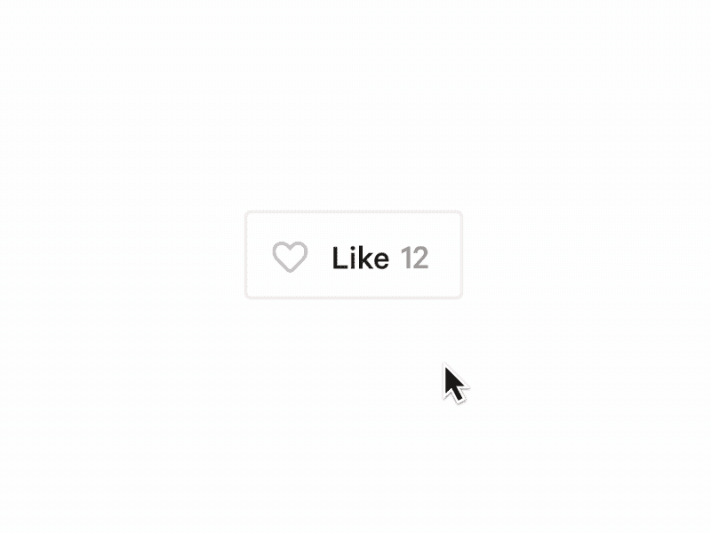
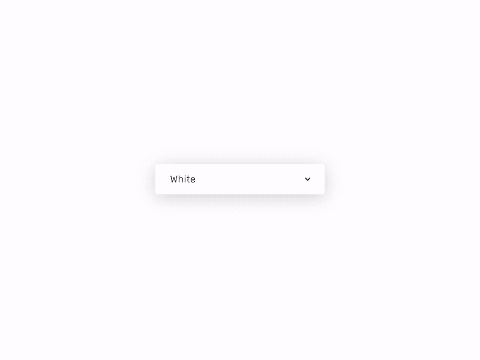

# JavaScript 课程结束后要构建什么？

> 原文：<https://dev.to/mrfrontend/what-to-build-after-a-javascript-course-1ing>

我偶尔会看到那些在课程平台上学习课程的代码新手，他们在完成课程时会想，好吧，现在呢？🤷‍♀️🤷‍♂️

老实说，我能体会那种感觉。你正在学习所有这些伟大的概念，但是应用它们，甚至用它们来建造一些东西，似乎非常困难。

## 上完一门 JavaScript 课程要做什么？

为了学习构建应用程序的技巧，你需要构建多个应用程序，希望你猜对了。

Web 开发人员不需要只学一门课就什么都懂，不需要！我们需要构建应用程序来训练我们解决问题的技能。

## 构建小型应用程序或组件

为了帮助你，我找到了一些很棒的设计来帮助你获得建造迷你项目的灵感。

因为要学习 JavaScript，你必须练习更多的 JavaScript。

挑战自己使用纯 JavaScript (vanilla JavaScript)，没有库也没有框架。是的，这会快很多，但是我们在这里练习你的 JavaScript 技能😅

## JavaScript 挑战

有了 JavaScript 挑战列表，你将训练和发展你的技能。

这可能非常适合你的 100 天代码挑战。所以让我们开始吧。

但在此之前，如果你已经参与了一项挑战，如果你向其他开发者或我寻求反馈，你会学到更多😉我很乐意这么做。

为了让某人给出反馈，确保你已经在 Codepen.io(或其他 web 编辑器)上构建了一些东西，或者已经在你的 Github 上发布了它。此外，向对方描述你做了什么，为什么要做。

> 在挑战中，我不会告诉你应该使用什么 JavaScript，我想触发你的探索和谷歌技能👍

### 1。喜欢按钮

> *设计者:戴维·哈- [爪子状按钮](https://dribbble.com/shots/5307333-Paw-Like-Button)*

构建这个 like 按钮组件很容易开始。用 HTML & CSS 创建带有赞数的按钮。

#### 指导方针

*   点击后更新分数
*   10 个赞后设为 0
*   用淡入淡出动画更改数字

#### 通过这次挑战，你将练习

*   练习点击事件
*   DOM 操作

### 2。将一个`<select>`变成一个自定义的下拉元素

> *设计者:Mate stoji-[每日 UI 挑战#027 -下拉](https://dribbble.com/shots/6167042-Daily-UI-Challenge-027-Dropdown)T3】*

下拉元素(选择框)在样式方面非常有限。要创建样式化的 dropdown 元素，您必须自己构建 HTML。

#### 指导方针

*   通过单击打开选项
*   制作显示/隐藏动画效果
*   当输入被聚焦时，给边框添加颜色
*   通过 ClassList API 添加样式

#### 通过这次挑战，你将练习

*   练习点击事件
*   DOM 操作

### 3。音乐播放器

> *设计者:Charles Patterson - [用 Vision Studio 制作——音乐播放器](https://dribbble.com/shots/4240318-Made-with-InVision-Studio-Music-Player)*

你知道 Spotify 是在浏览器中运行的吧？这是用 JavaScript 构建的。让我们建立一个简单的版本。

#### 指导方针

*   加载一个音频文件([我在网上找到了这个简短的 mp3 文件](https://ia902508.us.archive.org/5/items/testmp3testfile/mpthreetest.mp3)
*   让这出戏停下来
*   让时间线发挥作用

#### 通过这次挑战，你将练习

*   练习点击事件
*   DOM 操作
*   JavaScript 音频 API
*   Ajax 请求

## 如何在你的 JavaScript 技能中成长？

学习和练习 JavaScript 并不难。是的，你会经历很多挑战和错误，但这些将确保你学习和成长。

不要害怕失败！拥抱它吧！因为没有失败就没有成长！

> 如果你喜欢这句话？在 [Mr Frontend 商店](https://shop.mrfrontend.org/product/no-growth-without-failure-short-sleeve-t-shirt/)订购，男女都可以穿在一件很酷的 t 恤上😊

如果你确实需要帮助，请在 Twitter 上给我发一条 Tweet 或 DM，告诉我如何通过你的代码所在的链接来帮助你👍

如果你完成了其中一项挑战呢？请分享它们，这样我可以和世界各地的代码新手社区进一步分享。

## 分享到 Twitter 社区

**发这条微博:**
[和我一起参加@frontendmr 在](https://twitter.com/intent/tweet?text=Join+me+while+working+on+3+practical+%23javascript+challenges+by+%40frontendmr+on+https%3A%2F%2Fmrfrontend.org%2F2019%2F07%2Fwhat-to-build-after-a-javascript-course+%23mrfrontend+%23codenewbie+%23100daysofcode) [上的 3 个实用#javascript 挑战 https://Mr frontend . org/2019/07/what-to-build-after-a-JavaScript-course](https://mrfrontend.org/2019/07/what-to-build-after-a-javascript-course)# Mr frontend # code new bie # 100 daysofcode