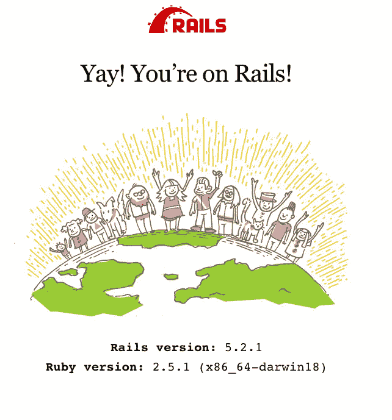

# 鲁比和 RVM 入门

> 原文：<https://dev.to/coreyjs/getting-started-with-ruby-and-rvm-ig7>

在撰写本文时，我们将使用 ruby 2.5.1。我将带你了解如何使用 RVM 建立我们的基本 ruby 环境，以及如何在不同的 ruby 安装之间轻松切换。

## 安装 RVM

RVM 是一名 ruby 环境经理。这是开始 ruby 开发的可选步骤，但是强烈推荐。这将允许我们为我们的每个项目拥有一个干净的 ruby 环境，不管版本/依赖等等。

运行下面的 cURL 命令将使用最新的稳定的 RVM 版本更新我们的系统。

`$> \curl -sSL https://get.rvm.io | bash -s stable --ruby`

RVM 可以向我们展示可以安装在我们系统上的所有可用的 ruby 版本，从测试版到稳定版到过时版。这是一种轻松处理不同环境切换的惊人方式。在这篇文章中，ruby 的安装版本是 2.5.1，所以这就是我们将要使用的版本。

现在我们想运行 rvm helper 脚本，这将调整我们的 rvm 安装和路径。这允许我们在命令行运行 rvm。

`> source /Users/corey/.rvm/scripts/rvm`

`> ruby -v
ruby 2.5.1.p57`

这将告诉我们当前的 ruby 版本，在这个例子中，它位于`ruby 2.5.1p57`

现在让我们创建一个 gemset，这是一个独特的环境，将容纳我们所有的依赖和宝石。

`> rvm gemset create rails-test-api
ruby-2.5.1 - #gemset created /Users/coreyschaf/.rvm/gems/ruby-2.5.1@rails-test-api
ruby-2.5.1 - #generating rails-test-api wrappers.......`

现在让我们切换到我们新创建的宝石

`> rvm gemset use rails-test-api
Using ruby-2.5.1 with gemset rails-test-api`
T1】

我们现在使用新创建的 ruby 环境。我们将安装一些我们未来需要的基本依赖项。

`> gem install bundler
fetching: bundler-1.16.5.gem (100%)
Successfully installed bundler-1.16.5
Parsing documentation for bundler-1.16.5
Installing ri documentation for bundler-1.16.5`

这将安装 bundler，我们将在下一个教程的 rails 安装中使用它。

`> gem install rails
....
...`
T1】

我们已经成功地安装了我们的开发环境，并安装了最新的 Ruby on Rails 框架。让我们创建一个快速的虚拟 Rails 应用程序来测试我们的安装。

`> rails new demo-test
Installing ....`
T1】

现在，如果我们转到浏览器，导航到 localhost:3000，我们应该会看到:

