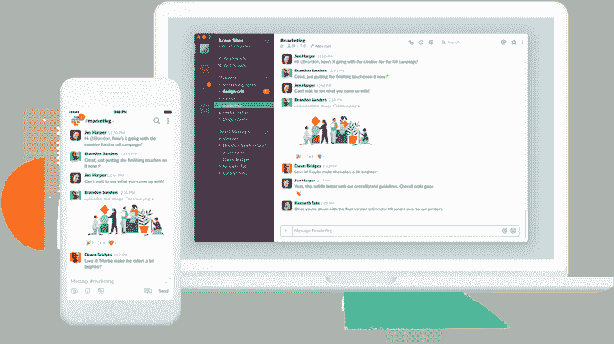
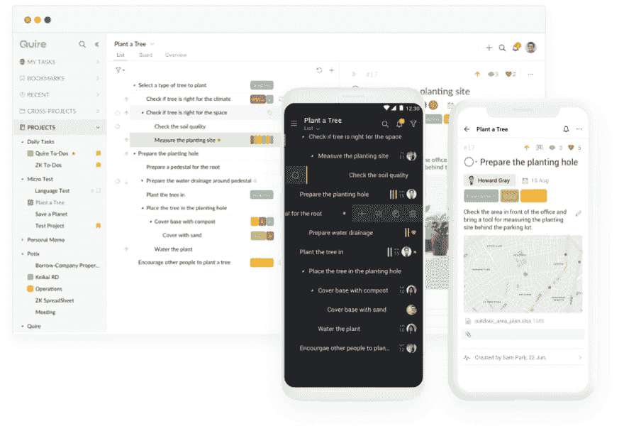
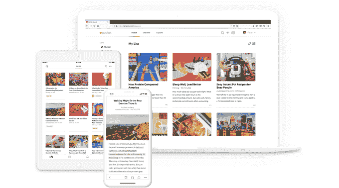

# 2019 年企业最佳生产力应用前三名(利弊)

> 原文：<https://dev.to/zoebourque/top-3-best-productivity-apps-for-your-business-in-2019-pros-cons-4nnj>

成功企业的关键是在更短的时间内完成更多的工作。许多企业家错误地认为每天加班可以提高公司的生产率。然而，超负荷的工作已经被证明会导致精神崩溃和工作倦怠。

如果你正在阅读这篇文章，很可能你一直在寻找改变，并试图找出是否有办法提高工作效率。好消息是，有数以千计的强大应用程序可以帮助您在更短的时间内完成更多工作，我们已经为您精心挑选了一些我们最喜欢的生产力应用程序。

## [2019 年 3 大最佳商务生产力应用](https://quire.io/compare/best-productivity-apps)

生产力应用程序的主要功能将集中在团队协作、通信、项目管理上，并帮助您简化工作流程。如果您正在寻找特定的[项目管理软件](https://quire.io/compare/best-project-management-software-reviews-comparisons)，我们也有一些顶级的工具供您选择。

### 1。松弛的

当谈到一个用于团队交流的流畅而高效的工具时，Slack 是最受欢迎的工具之一。Slack 拥有超过 800 万的每日活跃用户，是许多项目经理所推崇的最佳生产力应用程序，用于集中他们组织中的通信。

您可以为不同的团队设置不同的聊天和视频通话频道，甚至在需要时共享屏幕。此外，Slack 可以与大多数项目管理软件集成，这允许您直接在 Slack 频道上标记和分配各自的团队成员。

**优点**
截然不同的沟通渠道
音频和视频通话
文件上传
第三方应用集成

**缺点**
复杂的用户界面
巨大的学习曲线

**定价**
6.67 美元/用户/月起

### 2。一刀

直观简单的用户界面对于任何接触到新项目管理工具的人来说都是一个障碍。Quire 开发团队已经花费了数年的努力来争取简单性和强大功能之间的微妙平衡。优雅直观的界面是 Quire 用户最欣赏的方面之一。

您可以让您的团队加入 Quire，为每个成员设置不同的角色和权限。Quire 允许你创建和管理你所有的任务，这些任务被分成不同的项目。有了层级结构，所有复杂的项目都可以组织得井井有条，并且很容易与其他团队成员协作。

一个好的项目跟踪和计划软件必须有最简单、最直接的工作流程，让团队成员无缝协作。您的团队将始终与 Quire 实时协作功能保持同步。您可以随时使用手机和网络浏览器访问您的项目。没有多少任务管理解决方案可以让您的数据实时更新！

**优点**
可互换的无限嵌套任务列表和看板板
全面的协作特性包括多个受托人和调度。
用户友好的极简界面。
跨平台操作:iOS、Android 移动应用
智能搜索功能，定位每一条信息。
与 Slack、Google Drive、iCal、Google Calendar 等的集成。

**缺点**
缺少各种主题选项
没有内置聊天功能(可以用基于任务的评论实时更新代替)

**定价**
免费！

### 3。口袋

如果您一直粘在设备上查看和浏览许多有趣的文章、链接、视频、照片等。但由于时间有限，Pocket 是您需要的生产力应用程序。

Pocket 可以让你存储所有的链接、文章、视频等等，以便以后探索。你不必记住网址链接或任何东西，口袋会为你保存所有的数据。由于其酷炫的功能，这款生产力应用成为忙碌的企业家最喜爱的软件之一。

**优点**
保存包括网络浏览器和应用程序在内的多种资源
搜索功能:标题、URL、作者、全文等。
自动与多台设备同步
备份功能

**缺点**
缺乏与第三方应用的整合

**定价**
起价 4.99 美元/月