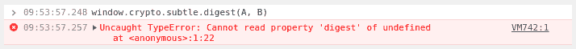

# 无法读取未定义的属性“摘要”

> 原文：<https://dev.to/hoffmann/cannot-read-property-digest-of-undefined-51np>

我刚刚在试图从`SHA265(Date())`生成一个简单的唯一标识符时遇到了最奇怪的错误。

# 问题

[](https://res.cloudinary.com/practicaldev/image/fetch/s--C27YwOMb--/c_limit%2Cf_auto%2Cfl_progressive%2Cq_auto%2Cw_880/https://thepracticaldev.s3.amazonaws.com/i/01r6ku1wwjgatxvm21du.png)

我的代码看起来是这样的，并且在我的[自发 HTTP 服务器](https://dev.to/hoffmann/code-share-my-spontaneous-http-server-3l8k) :
上顺利开发

```
async function genSessionId () {
  const msgBuffer = new TextEncoder('utf-8').encode(Date.now())
  const hashBuffer = await window.crypto.subtle.digest('SHA-256', msgBuffer)
  const hashArray = Array.from(new Uint8Array(hashBuffer))
  return hashArray.map(b => ('00' + b.toString(16)).slice(-2)).join('')
} 
```

(来源: [MDN](https://developer.mozilla.org/en-US/docs/Web/API/SubtleCrypto/digest#Converting_a_digest_to_a_hex_string) )

# 搜索

多亏了这个完全没有意义的错误信息，我惊呆了，不得不努力寻找原因(我没有在[开发文档](https://devdocs.io/dom/subtlecrypto/digest)、[或 MDN 网络文档](https://developer.mozilla.org/en-US/docs/Web/API/SubtleCrypto)上找到任何东西)。多亏了[网上的某个家伙](https://community.auth0.com/t/angular-sample-project-with-chrome/27497/4)，我被指引到了正确的方向，终于可以在[右角](https://www.chromium.org/blink/webcrypto)搜索了。隐藏第一段，第二次缩进你找到解决办法。

# 原因

> 对 WebCrypto API 的访问仅限于[安全源](http://www.chromium.org/Home/chromium-security/security-faq#TOC-Which-origins-are-secure-)(也就是说 https:// pages)。

(来源:[铬](https://www.chromium.org/blink/webcrypto))

# 呼叫

网络安全在不断改进，尤其是 Chrome 不仅以惊人的速度实现了重要的网络技术，还极大地加强了安全性。例如，让 HTTPS 成为默认选择肯定是正确的。

酪

但是我们仍然需要能够在我们自己的环境中发展，而不被人光顾。这是第二次经历，已经花费了我一些时间，而且会花费更多，因为我现在必须找到一种方法来解决这个问题。整个 CORS 规则也非常妨碍，我希望我能有一个开关来暂时把它们关掉。只是为了发展。要明确的是，不是对整个浏览器，我仍然需要它来浏览，只是为了我的开发服务器。

# 更新

谷歌网络倡导者 DasSurma [回复我的电话](https://twitter.com/DasSurma/status/1164107593041756161):你可以[通过 chrome 标志添加你自己的“安全起源”](https://dev.tochrome://flags/#unsafely-treat-insecure-origin-as-secure)。❤️