# Internet Explorer (IE)和 Edge 上的 Selenium 自动化测试

> 原文：<https://dev.to/himanshusheth004/selenium-automation-testing-on-internet-explorer-ie-edge-4g7c>

设计和可用性是构建消费者网络产品/网络应用的两个重要因素。为了解决不同的可用性问题，你可能需要站在客户的立场上。然而，考虑到并非所有的客户都使用和你一样的浏览器，你可能需要做很多工作。[跨浏览器测试](https://www.lambdatest.com/?utm_source=dev&utm_medium=Blog&utm_campaign=Himanshu-20082019&utm_term=Himanshu)成为每个测试周期的关键部分。作为测试人员或开发人员，您可能会使用 macOS 进行产品开发，但是您需要考虑客户使用不推荐的浏览器(如 Internet Explorer)的情况。

自从 Chrome、Safari、Mozilla Firefox 等现代浏览器出现以来，IE 一直是 web 开发的一大难题。响应速度慢，功能缺乏导致大多数 IE 用户转向其他浏览器。因此，如果你已经在 Chrome 上开发了一个网站，那么，在 IE 上进行测试将是一个主要问题。只要你是 windows 用户，这似乎是可行的，但是 macOS 用户会怎么做呢？

开发人员和测试人员经常思考的一个问题是如何在 macOS 上测试 IE？即使你找到了在 mac 上测试 IE 的方法，有没有一种方法可以将自动化测试融入到在 mac 上测试 IE 的过程中？

这篇文章是我试图帮助你用 Selenium 在 macOS 上测试 IE 时执行自动化测试，我们也将研究 Edge 浏览器。但是在开始自动化测试之前，我们先了解一下是否真的需要测试 IE？因为我们中的许多人认为在 IE 上测试是浪费时间，因为人们很少使用它，而我们中的一些人却不这么认为。当我们经历的时候，我们将会清除那个困境。

## 是否应该考虑微软 IE(IE)进行跨浏览器测试？

从网页开发和设计的角度来看，IE 可能不是最受欢迎的浏览器，但是仍然有很大比例的用户使用 IE。根据[全球桌面浏览器市场份额](http://gs.statcounter.com/browser-market-share/desktop/worldwide/#monthly-201806-201906)，截至 2019 年 7 月，IE 在网络浏览器市场拥有 5%的市场份额，考虑到全球互联网用户的整体数量，这是一个不错的数字。

[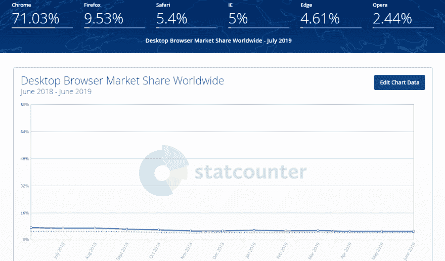](https://res.cloudinary.com/practicaldev/image/fetch/s--aw4hjZJH--/c_limit%2Cf_auto%2Cfl_progressive%2Cq_auto%2Cw_880/https://cdn.lambdatest.com/blog/wp-content/uploads/2019/08/pasted-image-0-1.png)

有大量的最终用户和企业使用微软的 Internet Explorer 在网上浏览和执行其他任务。事实上，有许多企业推动他们的测试人员[只在 Internet Explorer(IE)上执行跨浏览器测试](https://www.lambdatest.com/blog/performing-cross-browser-testing-with-lambdatest/?utm_source=dev&utm_medium=Blog&utm_campaign=Himanshu-20082019&utm_term=Himanshu)以完成内部任务。因此，你可能会遇到这样的情况:你的 Mac 电脑上安装了多个“兼容”的浏览器，但你需要用 Internet Explorer 或 Microsoft Edge 测试你的产品。浏览器兼容性测试是测试任何 web 产品/web 应用程序功能的核心部分。忽视这一点会在客户面前导致严重的可用性问题。

你可能会争论为什么要考虑像 IE 这样过时的浏览器来进行跨浏览器测试。在某种程度上，这种说法是正确的，因为官方在 2015 年停止了对 IE 的支持。从那时起就没有官方更新或支持 IE 了。尽管微软安全主管克里斯·杰克逊早在三年前就敦促用户停止使用 IE，但仍有大量用户仍将 IE 作为默认浏览器。在一篇名为[使用 Internet Explorer 作为默认浏览器的危险](https://techcommunity.microsoft.com/t5/Windows-IT-Pro-Blog/The-perils-of-using-Internet-Explorer-as-your-default-browser/ba-p/331732)的博客中，Chris Jackson 写道

> Internet Explorer 是一种兼容性解决方案。我们并不支持新的网络标准，虽然许多网站运行良好，但开发者基本上并没有对 Internet Explorer 进行测试。他们正在现代浏览器上进行测试。因此，如果我们继续我们以前的方法，你将会在一个场景中结束，通过优化你已经拥有的东西，你最终不能使用新的应用程序，因为他们已经出来了。随着新的应用程序越来越频繁地出现，我们想帮助你做的是避免错过越来越大的网络部分！

* *那么应该考虑 IE 进行浏览器兼容性测试吗？

是的，你应该。尽管 IE 正在慢慢变得多余，但它仍然占据了桌面浏览器市场 5%的份额。即使你使用的是 macOS，你也应该确保在 mac 上测试 IE，这样用户访问你的网站/网络应用程序时就不会出现问题。想知道如何在 mac 上测试 IE 吗？

## 在 macOS 设备上用 IE 进行跨浏览器测试

Mac 不支持 Internet Explorer。然而，如果你是一个使用 Mac 的开发者，这个借口可能不适合你的终端客户。这也适用于您的 Selenium 自动化测试。您还必须找到一种在 Internet Explorer 浏览器上运行测试脚本的方法。有几种方法可以在 macOS 系统上测试 IE:

### 1。 [VM 虚拟盒](https://www.virtualbox.org/)

如果您是一名开发人员，那么您很有可能会使用 Oracle VM Virtual Box。它允许您在虚拟环境中安装各种操作系统。为了在 Mac 上测试 IE，你需要在你的设备上安装 VM Virtual Box。安装后，扩展包和安装。dmg 图像可以帮助你在 Mac 上使用 IE 进行跨浏览器测试。

关于 Oracle VM Virtual Box 的安装和其他相关信息，我们建议您查看此链接。你可能想看看可以和 IE 一起使用的相关 VM 命令。

### 2。[跨浏览器测试云](https://www.lambdatest.com/)

这是实现[浏览器兼容性测试](https://www.lambdatest.com/feature?utm_source=dev&utm_medium=Blog&utm_campaign=Himanshu-20082019&utm_term=Himanshu)任务的理想方式之一；不仅仅是在 IE 上，还有很多其他浏览器，比如 Chrome，Firefox，Safari，Opera 等等。有像 LambdaTest 这样的跨浏览器测试平台，在那里你可以在各种操作系统&设备上对 2000 多种浏览器测试你的网站/网络应用的本质。你可以在 LambdaTest 平台上找到完整的[浏览器列表](https://www.lambdatest.com/list-of-browsers?utm_source=dev&utm_medium=Blog&utm_campaign=Himanshu-20082019&utm_term=Himanshu)。

将利用本地 Selenium 网格的现有 Selenium 自动化测试实现移植到托管在 LambdaTest 云服务器上的远程 Selenium 网格是一项简单的任务。你可以在 IE 上测试，即使你是没有任何本地安装的 macOS 用户。您需要做的只是选择需要测试的配置，在您想要的功能中声明它们，并让它们在 LambdaTest 云服务器上托管的 VM(虚拟机)上执行。这不需要您进行任何设置或停机，您可以将维护工作交给我们。因此，您专注于做您最擅长的事情，想出令人敬畏的测试用例，而我们负责根据您的测试脚本为您提供您需要的所有测试环境。

使用 LambdaTest Selenium Grid 的另一个好处是，您可以使用 Python、C#、Java 等各种编程语言执行 Selenium 自动化测试。通过绑定提供与 Selenium 的兼容性。

### 3。[装瓶商](http://winebottler.kronenberg.org/)

WineBottler for Mac 与 Wine on Linux 非常相似，因为它们都用于相同的任务，即在 Mac/Linux 等主机操作系统上运行 Windows。WineBottler 1.8.6(稳定版)目前适用于 macOS:

*   高塞拉
*   锯齿山脊
*   埃尔卡皮坦
*   优胜美地
*   独来独往的人
*   山狮
*   狮子
*   雪豹

您需要在 Mac 电脑/设备上下载并安装 WineBottler 应用程序。一旦安装完毕，您就可以开始使用默认安装的 IE 了。这种方法的唯一缺点是，您需要再次在虚拟 Windows OS 上安装整个软件开发环境，以便使用 Selenium automation testing framework 进行自动化的跨浏览器测试。

### 4。在 Mac 上安装 Windows

如果你渴望在你的 Mac 电脑上有一个双重引导的设置；你应该选择在 Mac 上安装 Windows 操作系统。

在使用这个选项之前，检查您正在使用的 macOS 版本是否支持 Windows 是很重要的。如果有支持，你需要按照必要的步骤[在 Mac 上安装 Windows](https://support.apple.com/en-al/HT201468)。安装完成后，您需要重启机器，之后系统会提示您选择首选操作系统(Mac/Windows)来引导系统/设备。尽管这是一个本地 Windows 安装，但是您仍然需要完成所有必要的步骤，以便使用 Python 或任何其他编程语言执行 Selenium 自动化测试。

### 5。Safari 浏览器上的用户代理

虽然 Safari 是 macOS 上的默认浏览器；您可以利用 Safari 上的用户代理选项在 Mac 上测试 IE，而无需任何安装/虚拟化。您所需要做的就是通过点击一个 Internet Explorer 选项，将用户代理更改为 Internet Explorer。用户代理选项在**开发- >用户代理**菜单项中可用。

如果你计划在 IE/Safari 之外的浏览器上执行跨浏览器测试，你还可以选择**Google Chrome–Windows 或 Firefox–Windows**。

### 6。虚拟化

通过虚拟化，你可以在 Mac 电脑上运行 Windows。可以有多个虚拟机(VM)以及 Windows VM，以便您可以同时在不同的操作系统上测试您的网站/web 应用程序。你需要一台强大的机器来完成这项任务。

macOS 上虚拟化的不同选项有 Parallels Desktop、VMWare Fusion、VirtualBox、Apple Boot Camp 等。

阅读更多内容:如何使用虚拟机进行 Web 应用程序的跨浏览器测试？

### 7。远程 IE

远程 IE 是微软推出的工具。使用远程 IE，你可以用 IE 测试你的产品，IE 安装在微软 Azure 云上运行的 Windows 服务器上。因为您将使用安装了 IE 的虚拟机，所以不需要任何本地安装就可以在 Mac 上测试 IE。它就像任何其他本地应用程序一样运行。

整个连接云端，访问 IE 的过程很简单。微软已经为 macOS X 开发了微软远程桌面应用，可以从这里的 Mac 应用商店下载。

这些是在 macOS 上测试 IE 的不同方法。现在，让我们行动起来，用 Selenium for internet explorer 执行自动化的跨浏览器测试。我们还将研究在 IE 上进行 Selenium 自动化测试时可能面临的不同挑战。

## 使用带有 IE 浏览器的 Selenium 进行跨浏览器测试

重要的是要理解，许多先进的功能可能对工业工程不起作用。与其他最新的网络浏览器相比，IE 速度相对较慢，这也可能会影响加载到 IE 上的网页的整体性能。当您使用 64 位版本的 JavaScript 测试套件时，可能会遇到许多 NoSuchElementFound 异常和同步问题。除了这些问题，您还可能遇到鼠标事件、悬停事件、键盘事件、CSS 选择器等问题。我要去谈谈

### 使用 Selenium 进行自动化测试的挑战& Internet Explorer (IE)

**1。用于处理同步问题的 WebDriverWait】**

可以通过确保在对 web 元素执行操作之前给它们足够的时间来加载来处理同步问题。您可以利用隐式等待或显式等待来实现同步。在隐式等待中，即使加载了元素，webdriver 也会等待，以避免抛出 No this Element 异常。这可能会影响测试用例的性能。

如果您希望申请等待特定的 web 元素，那么显式等待将有助于您这样做。您等待一个特定的条件，一旦该条件得到满足，它就从循环中退出。

**2。CSS 选择器**

按照 Caniuse 的说法，IE7 和 IE8 只部分支持 CSS3 定位器。这些版本支持的 CSS3 定位器是通用同级定位器(元素 1 ~元素 2)和属性选择器([attr^=val]、[属性$=val]和[属性*=val])。然而，所有的 CSS3 选择器都支持更流行的 IE 版本，即 IE9~ IE11 ( [Source](https://caniuse.com/#feat=css-sel3) )

**3。本机事件、鼠标事件等的处理。**

IE WebDriver 利用本地 Windows 事件来执行 HID 操作，即使用键盘、鼠标或其他 HID 设备的操作。开发人员在 IE 上使用 HID 设备进行 Selenium 自动化测试时面临着许多问题。唯一的解决方法是使用 JavaScript 重新测试。

**4。发送键的性能问题**

Selenium 框架利用 Selenium WebDriver 与 web 页面上的 web 元素进行交互。根据您机器的架构(32 位、64 位)，您需要下载 IEDriverServer.exe，它将从 Selenium 脚本中获取命令并与浏览器交互。32 位架构和 64 位架构的 IEDriverServer.exe 可以分别从[这里](https://goo.gl/9Cqa4q)这里&这里下载。

开发者报告了一些性能问题，比如在 IE 的文本栏中输入速度很慢。为了克服这个问题，您需要将 Selenium WebDriver 用于 32 位 IE，即使您的机器架构是 64 位的。一旦做到这一点，IE 上的 SendKeys()性能将与 Chrome、Firefox 等流行浏览器上的性能不相上下。

### 用 Selenium 自动化测试& Internet Explorer

到目前为止，我们已经了解了在浏览器兼容性测试中考虑 IE 的重要性，以及在 IE 上测试时会面临的挑战。我们还研究了如何在 Mac 上测试 IE 的选项。

现在，让我们看看如何使用 Selenium & IE 执行自动化测试。为了进行演示，我们使用了一台预装了 Internet Explorer 浏览器的 Windows 10 机器。为了开始，您应该在您的机器上安装 Python & Selenium framework。你可以从[这里](https://www.python.org/downloads/windows/)下载用于 Windows 的 Python 安装文件。要安装 Selenium，您应该在终端上执行 pip install selenium。为了实现，我们使用 PyCharm IDE(社区版)，可以从[这里](https://www.jetbrains.com/pycharm/download/)下载。

随着 Selenium 自动化测试的基本设置就绪，下一步是在您的开发机器上下载 IE WebDriver，即 IEDriverServer 可执行文件。下载位置如下:

[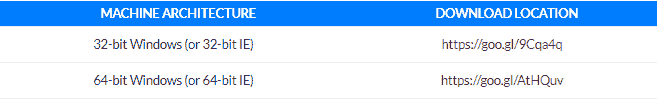](https://res.cloudinary.com/practicaldev/image/fetch/s--RrqvD8Z0--/c_limit%2Cf_auto%2Cfl_progressive%2Cq_auto%2Cw_880/https://ucarecdn.com/74bfe8be-3e01-42ec-b538-c1dd3fd7a4b7/)

如果您在开发和测试过程中遇到任何 64 位 IE 的问题，请将 WebDriver 64 位 IE 替换为 32 位 IE 的 WebDriver，如前所述。使用 set path=%PATH%将路径(IEDriverServer.exe 所在的位置)添加到环境变量 PATH 中。。

让我们看一个简单的例子，它演示了用 IE 进行 Selenium 自动化测试，任务是在 Duckduckgo 上执行搜索。

文件名–test _ 1 _ duck duck go _ search . py

```
import unittest
from selenium import webdriver
import time
from time import sleep

from selenium.webdriver.support.ui import WebDriverWait
from selenium.webdriver.support import expected_conditions as EC
from selenium.webdriver.common.by import By

class SeachTest(unittest.TestCase):
    def setUp(self):
        # Creation of IE WebDriver instance
        self.driver = webdriver.Ie(executable_path=r'location_of_IEDriverServer.exe')

    def test_Search(self):
        driver = self.driver
        driver.maximize_window()
        driver.get("https://duckduckgo.com/")
        elem = WebDriverWait(driver, 20).until(EC.element_to_be_clickable((By.NAME, "q")))
        elem.send_keys("Lambdatest")
        elem.submit()

        sleep(10)

    def tearDown(self):
        # Close the browser.
        self.driver.close()

if __name__ == '__main__':
    unittest.main() 
```

<svg width="20px" height="20px" viewBox="0 0 24 24" class="highlight-action crayons-icon highlight-action--fullscreen-on"><title>Enter fullscreen mode</title></svg> <svg width="20px" height="20px" viewBox="0 0 24 24" class="highlight-action crayons-icon highlight-action--fullscreen-off"><title>Exit fullscreen mode</title></svg>

该示例利用了 Python 中的 unittest 框架。如果您不了解 unittest，我们推荐您阅读我们关于使用 unittest 的 Selenium & Python 的[并行测试的博客。](https://www.lambdatest.com/blog/parallel-testing-in-selenium-webdriver-with-python-using-unittest/?utm_source=dev&utm_medium=Blog&utm_campaign=Himanshu-20082019&utm_term=Himanshu)

初始化和设置的先决步骤在 setup()方法中完成，清理步骤在 tearDown()方法中完成。本地 web 驱动程序用于调用 IE 的一个实例。

```
def setUp(self):
        # Creation of IE WebDriver instance
        self.driver = webdriver.Ie(executable_path=r'location_of_IEDriverServer.exe') 
```

<svg width="20px" height="20px" viewBox="0 0 24 24" class="highlight-action crayons-icon highlight-action--fullscreen-on"><title>Enter fullscreen mode</title></svg> <svg width="20px" height="20px" viewBox="0 0 24 24" class="highlight-action crayons-icon highlight-action--fullscreen-off"><title>Exit fullscreen mode</title></svg>

20 秒的 WebDriverWait()用于确保 Duckduckgo 上搜索框的加载完成。执行是通过从终端调用 python <file_name.py>来完成的。下面显示了在配置 IE 浏览器进行 Selenium 自动化测试时可以设置的一些选项。</file_name.py>

[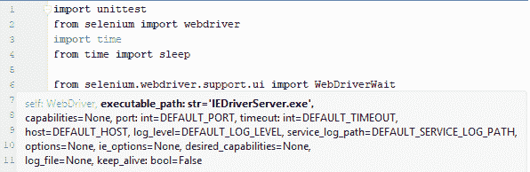](https://res.cloudinary.com/practicaldev/image/fetch/s--eRGiUGl8--/c_limit%2Cf_auto%2Cfl_progressive%2Cq_auto%2Cw_880/https://cdn.lambdatest.com/blog/wp-content/uploads/2019/08/image1.png)

由于这是 Selenium & IE 的第一次跨浏览器测试，我们在测试过程中遇到了一些问题:

**NoSuchWindowException–**由于 IE 中的保护模式设置不正确，引发了异常。根据 InternetExplorer 驱动程序的[官方文档，每个区域的保护模式设置应该相同，即高/中/中高。](https://github.com/SeleniumHQ/selenium/wiki/InternetExplorerDriver)

[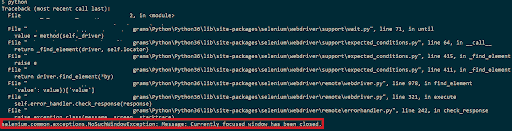](https://res.cloudinary.com/practicaldev/image/fetch/s--jXmmJ3pB--/c_limit%2Cf_auto%2Cfl_progressive%2Cq_auto%2Cw_880/https://cdn.lambdatest.com/blog/wp-content/uploads/2019/08/unnamed.png)

要更改设置，请转到 IE 浏览器上的工具->互联网选项->安全选项。为每个区域设置相同的保护模式设置，即 Internet、本地 Intranet、可信站点和受限站点。

[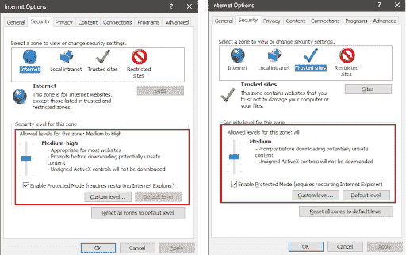](https://res.cloudinary.com/practicaldev/image/fetch/s--wLXdA2fO--/c_limit%2Cf_auto%2Cfl_progressive%2Cq_auto%2Cw_880/https://cdn.lambdatest.com/blog/wp-content/uploads/2019/08/unnamed-1.png)

此外，禁用每个区域的增强保护模式。重新启动 IE 来应用设置，现在你不会遇到这个问题。

**事件处理滞后—**在测试过程中，web 驱动程序(即 IEDriverServer.exe)和被测浏览器(即 IE)之间的连接可能会丢失。当您等待页面上加载动态 web 元素时，可能会发生这种情况。您需要执行下面提到的两个重要的设置更改

*   **在注册表中创建 iexplore.exe 键(仅适用于 IE 11)–**如果您正在使用 IE 11，您应该在注册表中创建一个新条目。

[](https://res.cloudinary.com/practicaldev/image/fetch/s--PrxXDB58--/c_limit%2Cf_auto%2Cfl_progressive%2Cq_auto%2Cw_880/https://ucarecdn.com/24036f1d-c776-4cec-8db7-eb7141d42bcf/)

子项 FEATURE_BFCACHE 可能存在，也可能不存在。如果它不存在，您应该首先创建子项；创建一个名为 iexplore.exe 的 DWORD 类型的新条目，并为其赋值 0。

[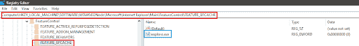](https://res.cloudinary.com/practicaldev/image/fetch/s--YOmTE-hc--/c_limit%2Cf_auto%2Cfl_progressive%2Cq_auto%2Cw_880/https://www.lambdatest.com/blog/wp-content/uploads/2019/08/unnamed-2.png)

*   **浏览器缩放级别–**如果您更改了浏览器缩放级别，请将其设置为 100%,以便本地鼠标事件可以设置到正确的坐标。
*   **64 位机器上的 32 位 IEDriverServer.exe—**我们之前提到过 64 位 IE WebDriver 的性能问题，当他们在 Duckduckgo 上搜索 LambdaTest 时，我们可以看到延迟。我们用 32 位 IEDriverServer.exe 替换了 64 位 IEDriverServer.exe，性能非常好！

我们看另一个例子，其中与 web 定位器的交互是为了执行相关的动作。您可以使用 IE 上的 Inspect 元素或安装在您机器上的任何其他浏览器来获取有关 web 定位器的详细信息，即 XPath、CSS 选择器、名称、链接文本、ID 等。我们使用了名称和 XPath 定位器来对这些 web 元素执行操作。

```
from selenium import webdriver
from time import sleep
from selenium.webdriver.support import expected_conditions as EC
from selenium.webdriver.common.by import By
from selenium.common.exceptions import TimeoutException
from selenium.webdriver.support.ui import WebDriverWait

# Internet Explorer
driver = webdriver.Ie(executable_path=r'location_of_IEDriverServer.exe')
driver.maximize_window()
driver.get("https://www.lambdatest.com")

try:
    myElem_1 = WebDriverWait(driver, 10).until(EC.presence_of_element_located((By.CLASS_NAME, 'home-btn')))
    print("Home Button click under progress")
    myElem_1.click()

    myElem_2 = WebDriverWait(driver, 10).until(EC.element_to_be_clickable((By.XPATH, "/html/body/div[1]/section/div/div[2]/div/form/div[3]/p/a")))
    print("Login button click under progress")
    myElem_2.click()
    sleep(10)
except TimeoutException:
    print("No element found")

sleep(10)

driver.close() 
```

<svg width="20px" height="20px" viewBox="0 0 24 24" class="highlight-action crayons-icon highlight-action--fullscreen-on"><title>Enter fullscreen mode</title></svg> <svg width="20px" height="20px" viewBox="0 0 24 24" class="highlight-action crayons-icon highlight-action--fullscreen-off"><title>Exit fullscreen mode</title></svg>

如上例所示，如果找不到元素，在引发 TimeOutException 之前，会对每个 web 元素执行 10 秒钟的等待。

现在，我们知道如何在 macOS 上测试 IE，并在 IE 上整合 Selenium 自动化测试。自然要沉湎于微软 Edge 浏览器！考虑到 2019 年 IE 的状态，我们该如何看待微软 Edge？微软 Edge 浏览器应该成为你的跨浏览器测试脚本的一部分吗？让我们找出答案。

### 我是否应该将微软 Edge 纳入我的浏览器兼容性测试？

微软 Edge 是 Windows 10 中的默认浏览器。这种说法本身就足以证明，web 开发人员&测试人员在规划浏览器兼容性测试时，不应该忽视微软 Edge 浏览器。Windows 10 拥有接近 50%的市场份额，这意味着微软 Edge 默认安装在这些机器上([来源](https://www.computerworld.com/article/3199373/windows-by-the-numbers-upgraders-press-pause.html))。

尽管用户可能会安装其他流行的浏览器，如 Chrome、Firefox 等。用于浏览或其他与网络相关的工作；就浏览器兼容性测试而言，不能排除微软 Edge 的相关性。正如桌面浏览器全球市场份额图所示，微软 Edge 浏览器在美国的市场份额约为 4.61%，随着 Windows 10 的进一步渗透，这一比例将会缓慢上升。

[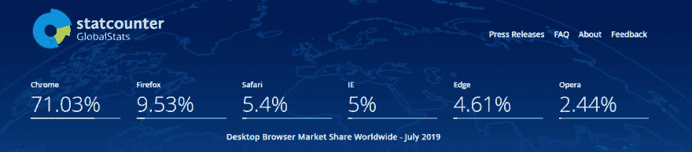](https://res.cloudinary.com/practicaldev/image/fetch/s--ld5KQwwU--/c_limit%2Cf_auto%2Cfl_progressive%2Cq_auto%2Cw_880/https://www.lambdatest.com/blog/wp-content/uploads/2019/08/stackcounter.png)

所以，微软 Edge 对你测试浏览器兼容性和 IE 一样重要。未来几年，微软 Edge 浏览器的市场份额有望上升。那么，微软 Edge 应该成为你的浏览器兼容性测试脚本的一部分吗？

是的，绝对的。但是一个在 macOS 上操作的用户如何在 Edge 浏览器上测试呢？让我们找出答案。

## 如何在 macOS 上测试微软 Edge？

微软 Edge 已经正式向 macOS 用户开放。这不是最终版本，但仍处于测试阶段。微软于 2019 年 5 月 21 日在他们的 [Windows 博客](https://blogs.windows.com/msedgedev/2019/05/20/microsoft-edge-macos-canary-preview/)中更新了同样的内容:

> Microsoft Edge for macOS 将提供与我们在 Windows 上预览的相同的新浏览体验，并对用户体验进行优化，使其在 Mac 上有宾至如归的感觉。我们正在调整整体的外观和感觉，以符合 macOS 用户对这个平台上的应用程序的期望。

您可以从 [Microsoft Edge Insider 渠道](https://www.microsoftedgeinsider.com/en-us/download?platform=macos)下载用于 macOS 的 Microsoft Edge 预览版。

[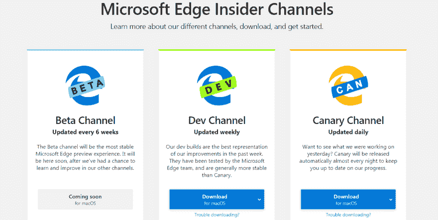](https://res.cloudinary.com/practicaldev/image/fetch/s--mVA906T3--/c_limit%2Cf_auto%2Cfl_progressive%2Cq_auto%2Cw_880/https://cdn.lambdatest.com/blog/wp-content/uploads/2019/08/microsoft-edge-insider.png)

除此之外，如果你拥有一台 macOS 设备，并希望通过 Edge 浏览器在 Windows 操作系统上查看你的网站，那么你可以随时转向基于云的跨浏览器测试工具，如 LambdaTest。

LambdaTest 为您提供了通过云上的 Windows 操作系统在各种 Microsoft Edge 版本上测试网站的便利。您可以在 Edge 版本 15、16、17、18 和 Edge Insider 上进行测试。

## 自动化测试用硒&微软 Edge

要开始使用 Microsoft Edge 进行 Selenium 自动化测试，您需要从[这里](https://developer.microsoft.com/en-us/microsoft-edge/tools/webdriver/)安装 Selenium WebDriver for Edge。您应该选择合适的 web 驱动程序，因为有针对 Microsoft Edge (Chromium)和 Microsoft Edge (EdgeHTML)的选项。微软 Edge (Chromium)或者微软 Edge (Dev 版)可以从[这里](https://www.microsoftedgeinsider.com/en-us/)下载。由于我们使用 Windows 10 机器进行开发&测试，我们已经在其中预装了微软 Edge。在我们的例子中，我们需要选择 Selenium web driver for Microsoft Edge(Edge html)。

在下载 Edge 的 web 驱动程序之前，您应该从系统设置中检查操作系统版本。在我们的例子中，操作系统内部版本是 17134.885。因此，我们下载了微软 Edge 17134 版本的网络驱动程序。

[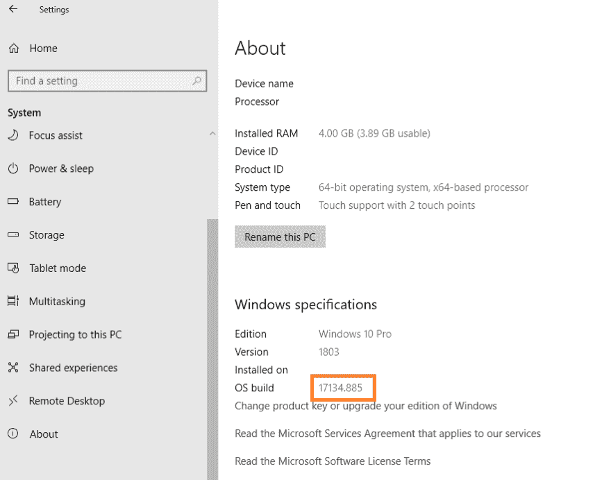](https://res.cloudinary.com/practicaldev/image/fetch/s--3VZUuUSM--/c_limit%2Cf_auto%2Cfl_progressive%2Cq_auto%2Cw_880/https://www.lambdatest.com/blog/wp-content/uploads/2019/08/image8.png)

您需要将下载的 web 驱动程序(即 MicrosoftWebDriver.exe)复制到机器中的特定位置，并通过执行命令 set PATH=%PATH%将路径附加到$PATH 环境变量中。。

前面演示的 Duckduckgo 搜索示例只需几行修改就可以移植到 Microsoft Edge WebDriver 上。只需将 IE WebDriver 命令替换为调用 Microsoft Edge WebDriver 的命令，就可以了。

```
import unittest
from selenium import webdriver
import time
from time import sleep

from selenium.webdriver.support.ui import WebDriverWait
from selenium.webdriver.support import expected_conditions as EC
from selenium.webdriver.common.by import By

class SeachTest(unittest.TestCase):
    def setUp(self):
        # Creation of Edge WebDriver instance
        self.driver = webdriver.Edge(executable_path=r'location_of_MicrosoftWebDriver.exe')

    def test_Search(self):
        driver = self.driver
        driver.maximize_window()
        driver.get("https://duckduckgo.com/")
        elem = WebDriverWait(driver, 20).until(EC.element_to_be_clickable((By.NAME, "q")))
        elem.send_keys("Lambdatest")
        elem.submit()

        sleep(10)

    def tearDown(self):
        # Close the browser.
        self.driver.close()

if __name__ == '__main__':
    unittest.main() 
```

<svg width="20px" height="20px" viewBox="0 0 24 24" class="highlight-action crayons-icon highlight-action--fullscreen-on"><title>Enter fullscreen mode</title></svg> <svg width="20px" height="20px" viewBox="0 0 24 24" class="highlight-action crayons-icon highlight-action--fullscreen-off"><title>Exit fullscreen mode</title></svg>

我们看一下 Selenium 自动化测试的另一个例子，其中使用的测试框架是 Pytest。可以通过在终端上执行命令 pip install pytest 来安装框架。如果您计划利用并行执行，可以使用命令 pip install pytest-xdist 安装 pytest-xdist 插件。我们使用@pytest.fixture decorator 作为一个类来传递 IE 和 Edge 浏览器作为参数。由于测试中使用了两个浏览器，我们使用命令 pytest -n=2，以便 IE 和 Microsoft Edge 浏览器的执行可以并行进行。

```
import pytest
from selenium import webdriver
from selenium.webdriver.common.keys import Keys
from time import sleep

@pytest.fixture(params=["ie", "edge"],scope="class")

def driver_init(request):
    if request.param == "ie":
        # Local webdriver implementation with Internet Explorer (IE)
        web_driver = webdriver.Ie(executable_path=r'location_of_IEDriverServer.exe')
    if request.param == "edge":
        # Local webdriver implementation with Microsoft Edge browser (Edge)
        web_driver = webdriver.Edge(executable_path=r'location_of_MicrosoftWebDriver.exe')
    request.cls.driver = web_driver
    yield
    web_driver.close()

@pytest.mark.usefixtures("driver_init")
class BasicTest:
    pass
class Test_URL(BasicTest):
        def test_open_url(self):
            self.driver.get("https://www.lambdatest.com/")
            print(self.driver.title)

            sleep(5) 
```

<svg width="20px" height="20px" viewBox="0 0 24 24" class="highlight-action crayons-icon highlight-action--fullscreen-on"><title>Enter fullscreen mode</title></svg> <svg width="20px" height="20px" viewBox="0 0 24 24" class="highlight-action crayons-icon highlight-action--fullscreen-off"><title>Exit fullscreen mode</title></svg>

下图是测试执行的快照，我们可以看到 IE 和微软 Edge 浏览器的实例是并行启动的。

[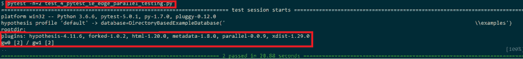](https://res.cloudinary.com/practicaldev/image/fetch/s--v0RrxjOu--/c_limit%2Cf_auto%2Cfl_progressive%2Cq_auto%2Cw_880/https://www.lambdatest.com/blog/wp-content/uploads/2019/08/snapshot.png)

正如您从示例中看到的，在本地基础设施上执行的跨浏览器测试总是有局限性，因为您无法在不同版本的浏览器上执行测试，例如在 IE 版本 8、9、10 等上执行测试。在同一台机器上可以是一个大任务(如果不是不可能的)。此外，Mac 上的 IE 测试在安装和测试效率方面有很多开销，因为它们是在虚拟环境中执行的。虽然您可以拥有一个远程 Selenium 网格来容纳不同的浏览器、操作系统和设备组合；这可能是一种可扩展且经济的方法。当产品质量和特性有所改进时，你肯定会遇到障碍，你可能需要一个更好更快的设置来提高测试过程的效率。

### 硒云上的自动化测试

不管你是否使用 IE、微软 Edge 在 Windows、macOS、Linux 等平台上进行跨浏览器测试。；更可行的方法是转移到基于云的跨浏览器测试平台，如 LambdaTest。使用 LambdaTest，你可以在 2000 多个浏览器和操作系统上测试你的网络产品。通过使用 Selenium Grid on-cloud 的并行测试，您可以以更快的速度执行测试，从而减少测试中涉及的总体周转。

以下是如何利用 LambdaTest 云基础设施来增强网站/web 应用程序的测试。首先，您需要在 LambdaTest 上创建一个帐户。一旦创建了您的帐户，您应该记下您的用户名和来自[https://accounts.lambdatest.com/profile](https://accounts.lambdatest.com/profile)的访问令牌，因为该组合将用于访问 LambdaTest 上的远程 Selenium 网格。

您可以将使用本地 Selenium WebDriver 的现有实现移植到 LambaTest 上的远程 Selenium WebDriver，只需对代码进行最小的更改。到目前为止，我们研究的 Selenium 自动化测试的例子使用了本地 Selenium WebDriver。一旦您登录到您的 LambdaTest 帐户，您就可以在[自动化选项卡](https://automation.lambdatest.com/?utm_source=dev&utm_medium=Blog&utm_campaign=Himanshu-20082019&utm_term=Himanshu)中查看由您触发的自动化测试。每个测试都有一个与之相关联的唯一测试 id，以便于识别。在我们的例子中，我们可以有两个可以并行执行的并发会话。这加快了整个测试过程&缩短了周转时间，加快了上市速度。

为了进行演示，我们移植了前面使用 pytest 框架在 LambdaTest 上远程运行 Selenium 网格的例子。我们在 Windows 7 上使用 IE 8.0，在 Windows 10 上使用微软 Edge 15.0 进行测试。这些能力可以使用 LambdaTest 的[期望能力生成器](https://www.lambdatest.com/capabilities-generator/)来生成。选择合适的浏览器& OS 版本，生成 Python 编程语言的能力。

[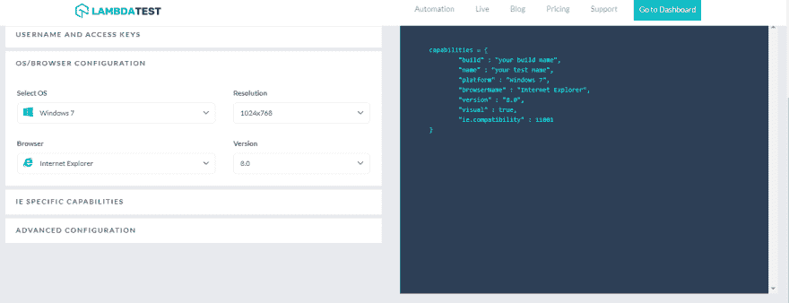](https://res.cloudinary.com/practicaldev/image/fetch/s--fMn7uYst--/c_limit%2Cf_auto%2Cfl_progressive%2Cq_auto%2Cw_880/https://www.lambdatest.com/blog/wp-content/uploads/2019/08/Selenium-Automation-Testing.png)

现在已经生成了功能，我们进行相关的修改以适应生成的功能，并使用用户名和访问键组合访问 LambdaTest 上的远程 Selenium 网格。

```
import pytest
from selenium import webdriver
from selenium.webdriver.common.keys import Keys
from time import sleep
import urllib3

############# Changes for porting local Selenium WebDriver implementation to LambdaTest #############
#Set capabilities for testing on IE and Microsoft Edge
edge_capabilities = {
    "build" : "Build for testing on Microsoft Edge",
    "name" : "Microsoft Edge Testing",
    "platform" : "Windows 10",
    "browserName" : "MicrosoftEdge",
    "version" : "15.0",
    "visual" : True
}

ie_capabilities = {
    "build" : "Build for testing on Internet Explorer",
    "name" : "Internet Explorer Testing",
    "platform" : "Windows 7",
    "browserName" : "Internet Explorer",
    "version" : "8.0",
    "visual" : True,
    "ie.compatibility" : 11001
}

# Obtain the credentials from https://accounts.lambdatest.com/profile
user_name = "user-name"
app_key = "access-key"

@pytest.fixture(params=["ie", "edge"],scope="class")

def driver_init(request):
    urllib3.disable_warnings(urllib3.exceptions.InsecureRequestWarning)
    remote_url = "https://" + user_name + ":" + app_key + "@hub.lambdatest.com/wd/hub"
    if request.param == "ie":
        # Remote webdriver implementation with Internet Explorer (IE)
        web_driver = webdriver.Remote(command_executor=remote_url, desired_capabilities=ie_capabilities)
    if request.param == "edge":
        # Remote webdriver implementation with Microsoft Edge browser (Edge)
        web_driver = webdriver.Remote(command_executor=remote_url, desired_capabilities=edge_capabilities)
    request.cls.driver = web_driver
    yield
    web_driver.close()

@pytest.mark.usefixtures("driver_init")
class BasicTest:
    pass
class Test_URL(BasicTest):
        def test_open_url(self):
            self.driver.get("https://www.lambdatest.com/")
            print(self.driver.title) 
```

<svg width="20px" height="20px" viewBox="0 0 24 24" class="highlight-action crayons-icon highlight-action--fullscreen-on"><title>Enter fullscreen mode</title></svg> <svg width="20px" height="20px" viewBox="0 0 24 24" class="highlight-action crayons-icon highlight-action--fullscreen-off"><title>Exit fullscreen mode</title></svg>

从源代码中可以看出，我们增加了 IE 和微软 Edge 浏览器的功能。我们使用用户名和访问密钥登录到 LambdaTest 云平台。然后，用于访问 LambdaTest 平台和功能的远程 URL 作为参数传递给 webdriver。Remote() API。下面是执行的快照，您也可以检查 LambdaTest 上的 Automation 选项卡，以获得关于测试状态的更多信息。

[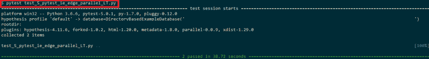](https://res.cloudinary.com/practicaldev/image/fetch/s--yCrbtn6i--/c_limit%2Cf_auto%2Cfl_progressive%2Cq_auto%2Cw_880/https://www.lambdatest.com/blog/wp-content/uploads/2019/08/automation-testing.png)

## 你对微软的 Edge & IE 有什么看法？

尽管 Internet Explorer (IE)已被弃用，但你不能忽视 IE 上的跨浏览器测试。另一方面，微软 Edge 的市场份额正在稳步增长。不管你是在 macOS 上做开发/测试，都应该优先考虑在 Mac 上测试 IE。我们已经讨论了在 mac 上测试 IE 的多种方法，最省力和最大吞吐量的方法是使用基于云的[跨浏览器测试工具](https://www.lambdatest.com/?utm_source=dev&utm_medium=Blog&utm_campaign=Himanshu-20082019&utm_term=Himanshu)，比如 LambdaTest。使用 LambdaTest，您可以执行 Selenium 自动化测试，以验证您的 web 应用程序在 2000 多个真实浏览器&上的渲染，这些浏览器版本运行在不同的操作系统上。这有助于加快网站/web 应用跨浏览器测试的每一步，因为您已经配置好了所有测试环境&，可以随时运行您的自动化脚本。

我很想知道你对 IE & Edge 现状的看法。你把它们包含在你的测试周期中了吗？在使用 IE 和 Edge 执行 Selenium 自动化测试时，您遇到了哪些具体的挑战？请在评论区告诉我。测试愉快！🙂

[](https://www.lambdatest.com?utm_source=dev&utm_medium=Blog&utm_campaign=Himanshu-20082019&utm_term=Himanshu)