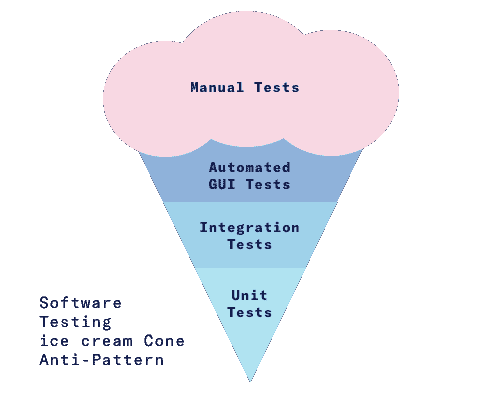
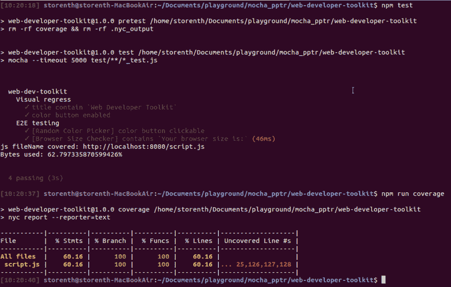
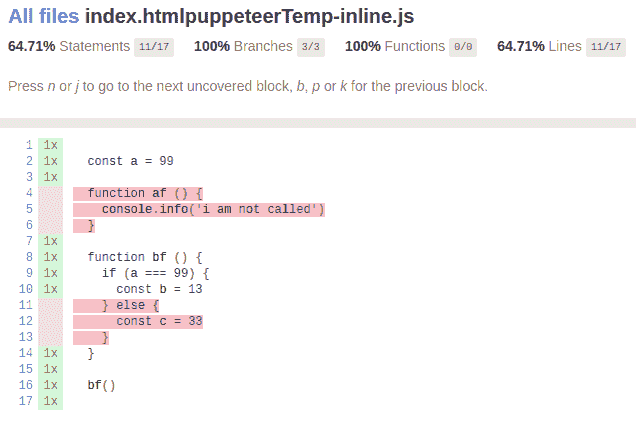

# 用覆盖率升级你的实现代码。

> 原文：<https://dev.to/storenth/puppeteer-mocha-upgrade-your-implementation-code-with-coverage-22>

### 测试金字塔

自从[木偶师](https://developers.google.com/web/tools/puppeteer/)发布以来，端到端测试成为一种快速可靠的功能测试方式。您可以在浏览器中手动完成的大多数事情都可以使用 Puppeteer 来完成。更重要的是，headless Chrome 降低了性能开销，对 DevTools 协议的本机访问使 Puppeteer 变得非常棒。想象一下，每次我们开发前端时，我们只是在浏览器中检查最终视图，没有 TDD 我们就面临测试金字塔冰淇淋反模式 [](https://res.cloudinary.com/practicaldev/image/fetch/s--qvv4zy8T--/c_limit%2Cf_auto%2Cfl_progressive%2Cq_auto%2Cw_880/https://images.contentful.com/3cttzl4i3k1h/6Qc0lWQ4IE4KeisAgyeUAC/365239996e6c8e83afc5fd8fbce69831/automation-pyramid-2.png) 但是我们喜欢冰淇淋，所以为什么我们需要权衡呢？我向您展示了如何通过测试来升级您的源代码，无论您使用什么引擎，您都可以确信您的应用程序会按预期工作，因为木偶师将代替您检查功能。

### 设置

我有完整的分步说明 [README.md](https://github.com/storenth/web-developer-toolkit#feature-testing) 基于一个简单的[项目](https://github.com/hex25/web-developer-toolkit)，我已经提供了功能丰富的测试升级来炫耀。所以，如果你有另外一个，请:
1)在你的根
`npm i puppeteer mocha puppeteer-to-istanbul nyc -D`
中安装依赖项 2)在端点上公开你的实例(我的轻量级解决方案为`*.html`[http-server](https://www.npmjs.com/package/http-server))
3)创建`test`目录并用下一个合适的模板填充`{yourFeature}_test.js`(注意 ***在*** 之前， ***在*** 钩子之后)，尝试用你的项目特定的选择器和行为来扩展它:

```
const puppeteer = require('puppeteer');
const pti = require('puppeteer-to-istanbul');
const assert = require('assert');

/**
 * ./test/script_test.js
 * @name Feature testing
 * @desc Create Chrome instance and interact with page.
 */

let browser;
let page;

describe('Feature one...', () => {
    before(async () => {
        // Create browser instance
        browser = await puppeteer.launch()
        page = await browser.newPage()
        await page.setViewport({ width: 1280, height: 800 });
        // Enable both JavaScript and CSS coverage
        await Promise.all([
            page.coverage.startJSCoverage(),
            page.coverage.startCSSCoverage()
          ]);
        // Endpoint to emulate feature-isolated environment
        await page.goto('http://localhost:8080', { waitUntil: 'networkidle2' });
    });
    // First Test-suit
    describe('Visual regress', () => {
        it('title contain `Some Title`', async () => {
            // Setup
            let expected = 'Some Title';
            // Execute
            let title = await page.title();
            // Verify
            assert.equal(title, expected);
        }).timeout(50000);

    });
    // Second Test-suit
    describe('E2E testing', () => {
        it('Some button clickable', async () => {
            // Setup
            let expected = true;
            let expectedCssLocator = '#someIdSelector';
            let actual;
            // Execute
            let actualPromise = await page.waitForSelector(expectedCssLocator);
            if (actualPromise != null) {
                await page.click(expectedCssLocator);
                actual = true;
            }
            else
                actual = false;
            // Verify
            assert.equal(actual, expected);
        }).timeout(50000);
    // Save coverage and close browser context
    after(async () => {
        // Disable both JavaScript and CSS coverage
        const jsCoverage = await page.coverage.stopJSCoverage();
        await page.coverage.stopCSSCoverage();

        let totalBytes = 0;
        let usedBytes = 0;
        const coverage = [...jsCoverage];
        for (const entry of coverage) {
            totalBytes += entry.text.length;
            console.log(`js fileName covered: ${entry.url}`);
            for (const range of entry.ranges)
                usedBytes += range.end - range.start - 1;
        }
        // log original byte-based coverage
        console.log(`Bytes used: ${usedBytes / totalBytes * 100}%`);
        pti.write(jsCoverage);
        // Close browser instance
        await browser.close();
    });
}); 
```

<svg width="20px" height="20px" viewBox="0 0 24 24" class="highlight-action crayons-icon highlight-action--fullscreen-on"><title>Enter fullscreen mode</title></svg> <svg width="20px" height="20px" viewBox="0 0 24 24" class="highlight-action crayons-icon highlight-action--fullscreen-off"><title>Exit fullscreen mode</title></svg>

### 执行

1.  使用`mocha`命令对端点上的脚本运行上述测试
2.  使用`nyc report`进行测试运行时收集覆盖率。
3.  我建议你用接下来的脚本装备你的`package.json`,让运行像`npm test`或`npm run coverage`这样的任务变得超级容易

```
 "scripts": {
    "pretest": "rm -rf coverage && rm -rf .nyc_output",
    "test": "mocha --timeout 5000 test/**/*_test.js",
    "server": "http-server ./public",
    "coverage": "nyc report --reporter=html"
  }, 
```

<svg width="20px" height="20px" viewBox="0 0 24 24" class="highlight-action crayons-icon highlight-action--fullscreen-on"><title>Enter fullscreen mode</title></svg> <svg width="20px" height="20px" viewBox="0 0 24 24" class="highlight-action crayons-icon highlight-action--fullscreen-off"><title>Exit fullscreen mode</title></svg>

### 覆盖范围

在**我的[项目](https://github.com/storenth/web-developer-toolkit)** 中，我已经覆盖了大约 62% [](https://res.cloudinary.com/practicaldev/image/fetch/s--UFXCAZVn--/c_limit%2Cf_auto%2Cfl_progressive%2Cq_auto%2Cw_880/https://github.com/storenth/web-developer-toolkit/blob/master/output/code_coverage_2.png%3Fraw%3Dtrue) 
我们可以将其报告为`html`，仔细观察 [](https://res.cloudinary.com/practicaldev/image/fetch/s--ajf3EMcO--/c_limit%2Cf_auto%2Cfl_progressive%2Cq_auto%2Cw_880/https://github.com/storenth/web-developer-toolkit/blob/master/output/html_coverage_report.png%3Fraw%3Dtrue) 
您可以看到 ***分支*** 和 ***功能*** 都被 100%覆盖。当我测试木偶师覆盖特性时(比如[覆盖开发工具](https://developers.google.com/web/updates/2017/04/devtools-release-notes#coverage))，我提交了那个 bug

# [【Bug】不正确的分支点击覆盖率统计 #22](https://github.com/istanbuljs/puppeteer-to-istanbul/issues/22) 

[](https://github.com/storenth) **[storenth](https://github.com/storenth)** posted on [<time datetime="2018-12-27T09:35:27Z">Dec 27, 2018</time>](https://github.com/istanbuljs/puppeteer-to-istanbul/issues/22)

做完后，我试着看看。/coverage/index.html，发现分支覆盖率数字有很大缺陷，它总是 100%。为了验证这个问题，我建议克隆这个简单的[回购](https://github.com/storenth/puppeteer-to-istanbul-example)用于本地复制。 [](https://user-images.githubusercontent.com/18244131/50474925-5f2e0600-09f5-11e9-8720-055f87161747.png)

[View on GitHub](https://github.com/istanbuljs/puppeteer-to-istanbul/issues/22)

### 单位 vs E2E 测试战

我告诉那些对研究有足够热情而不会感到无聊的人，我们需要更多关注单元测试框架，比如用于编写从*单元*到*验收*的测试的 [Mocha](https://mochajs.org) ，而不是单元或结束测试本身。不管你写什么测试，如果你的代码库覆盖了。时代变了。现在，有了可用的覆盖特性，其他工具，如*跟踪矩阵*作为质量度量看起来很难看，因为涉众仍然需要相信测试人员的话。但是请注意来自 Google 的代码覆盖领域的第四个最佳实践，以实用地使用覆盖信息。

### 投稿

我强烈建议在你被卡住之前，花点时间回顾一下我的 github 工作草案项目 T2 T3。
我将感谢任何合作和反馈。有任何问题，请随时联系我。