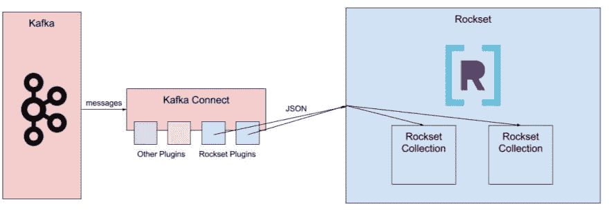
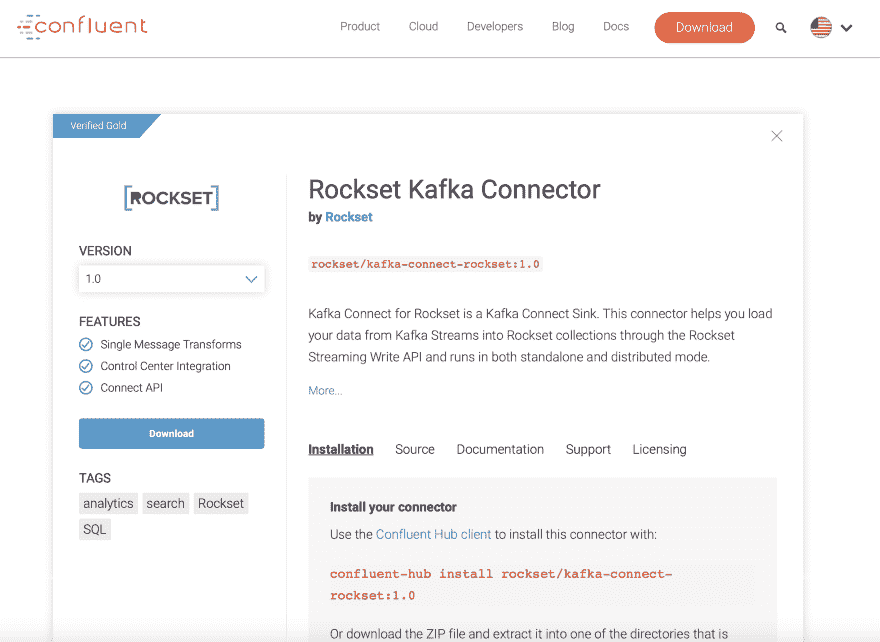

# 用于 rocket 的 kafka connect 插件及其工作原理

> 原文：<https://dev.to/rocksetcloud/the-kafka-connect-plugin-for-rockset-and-how-it-works-455f>

*作者为[雅各布·克莱加](https://www.linkedin.com/in/jacob-klegar/)T3】*

Rockset 不断地从 Kafka 获取数据流，不需要固定的模式，并对这些数据提供快速的 SQL 查询。我们为 Rockset 创建了 Kafka Connect 插件，用于从 Kafka 导出数据，并将其发送到 Rockset 中的文档集合。然后，用户可以在 Rockset 中的数据之上构建实时仪表板或数据 API。这篇博客介绍了我们是如何实现这个插件的。

## 实现一个工作插件

### 什么是卡夫卡连接与合流枢纽？

Kafka Connect 是在 Kafka 和另一个数据存储引擎(如 S3、Elasticsearch 或通过 Kafka Connect JDBC 的关系数据库)之间传输数据的主要方式，几乎不需要设置。它通过支持许多插件来实现这一点，这些插件将数据移入或移出 Kafka 到各种其他数据引擎——前者称为 Kafka Connect Source 插件，后者称为 Sink 插件。许多数据栈包括一组 Kafka 代理——用作缓冲日志、事件流或一些其他用例 Kafka Connect 插件使向 Kafka 流添加源或接收器变得非常容易。

将 Apache Kafka 商业化的公司, [Confluent](https://www.confluent.io/) 在 [Confluent Hub](https://www.confluent.io/hub/) 中列出了非常可靠的 Kafka Connect 插件，并将这些插件集成到其 Confluent Platform 中，该产品使设置、维护和监控 Kafka 代理及其相关实例变得容易。在 Rockset，我们构建了我们的 [Kafka Connect Sink 插件](https://github.com/rockset/kafka-connect-rockset)，以使 Kafka 中有数据的客户可以轻松地进行实时分析，我们将其列在 [Confluent Hub](https://www.confluent.io/hub/rockset/kafka-connect-rockset) 中，以帮助 Confluent 的现有用户群以快速、简单的设置方式从他们的数据中获得可操作的见解。

### Kafka Connect 将调用我们实现的插件中的方法

Kafka Connect 在与 Kafka brokers 不同的实例中运行，每个 Kafka Connect 插件必须实现 Kafka Connect 调用的一组方法。对于接收器插件，它将使用一组消息调用 put 方法，该方法的主要功能通常是对数据进行一些处理，然后将其发送到接收器数据存储引擎的输入通道。在我们的例子中，我们有一个 [Write API](https://docs.rockset.com/write-api/) ，所以我们将事件转换为原始 JSON，并将它们发送到我们的 API 端点。Kafka Connect 插件的核心功能就是——Kafka Connect 平台负责剩下的工作，包括为用户列出的主题中的每个事件调用方法，以及序列化或反序列化 Kafka 流中的数据。

### 配置文件的作用——一个配置用于 Kafka Connect，一个配置用于每个插件

任何设置 Kafka Connect 的用户都必须修改至少两个配置文件。第一个是通用的 Kafka Connect 配置文件——这是您设置 Kafka 代理的位置、插件的 jar 文件的路径、序列化器和反序列化器以及一些其他设置的地方。Kafka Connect 平台附带了序列化器和反序列化器，对于 sink 插件，它们将在将事件发送到插件之前反序列化 Kafka 流中的数据，这使得在插件中完成的数据处理更加简单。

连接到 Kafka Connect 实例的每个插件都有一个配置文件。每个插件的配置文件都必须包括用于识别目的的名称和类的设置、性能调优的最大任务以及要遵循的主题列表。Rockset 还包括 Rockset API 服务器的 url、您的 Rockset API 键、数据应该流入的工作空间和 Rockset 中的集合、数据的格式以及用于性能调整的线程。您可以在 Kafka Connect 平台上运行多个 Rockset sink 插件，以将 Kafka 流中不同主题的数据发送到不同的 Rockset 集合。

### 该插件将文档从 Kafka 发送到我们的 Write API

一旦 Rockset Kafka Connect sink 插件将原始 JSON 文档发送到我们的 Write API，代码路径将与普通 REST API 编写和服务器端架构的路径合并，我们在[以前的](https://rockset.com/blog/aggregator-leaf-tailer-an-architecture-for-live-analytics-on-event-streams/) [博客](https://rockset.com/blog/converged-indexing-the-secret-sauce-behind-rocksets-fast-queries/) [帖子](https://rockset.com/Rockset_Concepts_Design_Architecture.pdf)中已经讨论过，快速索引文档并使其可供查询。

## 将其列入合流枢纽

在 Confluent Hub 中列出 Kafka Connect 插件时，除了基本功能之外，还有一些必要的要求。接下来的几个部分显示了如何列出您自己的 Kafka Connect 插件的粗略指南，并说明了 Rockset 索引引擎中的设计决策，这些决策使满足这些要求成为一个简单的过程。

### 用模式注册表支持 Avro

Kafka 对数据序列化格式 [Avro](https://www.confluent.io/blog/avro-kafka-data/) 给予了特别的偏爱，这种格式通过实施一套模式来解决上游模式变化影响下游动作的问题。这个模式保存在[模式注册中心](https://docs.confluent.io/current/schema-registry/index.html)中，这是一个独立的实例。任何模式更改都必须有目的地以向后或向前兼容的方式进行，这取决于模式注册表中设置的兼容性选项。由于它的 set 模式，Avro 还受益于没有字段名的序列化，使消息序列化更有效。Confluent 对 Avro 序列化有很强的支持，包括一个随 Confluent 平台提供的模式注册表，Avro 支持对于在 Confluent Hub 中列出我们的 Kafka Connect 插件是必要的。

支持 Avro 并不太困难，因为 Kafka Connect 平台已经附带了 Avro 序列化程序和反序列化程序，可以使用配置文件将它们插入 Kafka Connect 平台。在序列化器和反序列化器做了艰苦的工作之后，将消息转换成 JSON 就相对简单了，我们能够在开源的 Kafka Connect 插件中找到例子。我们自己的实现是[这里](https://github.com/rockset/kafka-connect-rockset/blob/3f6ddded957752e034f4523e113f98b2c1e9b1da/src/main/java/rockset/RocksetSinkTask.java#L69)。最困难的部分是理解 Avro 是如何工作的，并正确地设置配置文件和模式注册表。使用合流平台在这里帮助很大，但你仍然需要确保你没有错过配置文件的变化-如果你试图用 JSON 反序列化 Avro 数据，什么都不会工作。

### 抵销管理

Kafka Connect 插件的另一个要求是支持恰好一次语义——也就是说，从 Kafka 流发送的任何消息必须在目标 Rockset 集合中恰好出现一次。这里的困难在于处理网络中的错误——如果 Kafka Connect 插件没有听到来自我们的 Write API 的响应，它将重新发送文档，我们可能会在我们的管道中结束重复的文档。通常解决这一问题的方法——也是我们解决这一问题的方法——是使用我们的唯一标识符字段 [_id](https://docs.rockset.com/special-fields/#id) ,以确保任何重复的内容都会用相同的信息覆盖原始文档。如果可以的话，我们将消息的键映射到 our _id 字段，否则默认使用唯一标识的组合 topic+partition+offset。

Confluent Hub 还需要 Kafka Connect sink 插件来尊重数据的正确排序。这实际上不需要任何修改——每个 Rockset 文档都有一个 [_event_time 字段](https://docs.rockset.com/special-fields/#eventtime),通过在创建集合时为 _event_time 指定一个[字段映射](https://docs.rockset.com/field-mappings/),任何 Rockset 用户都可以确保数据按照他们的规范排序。

### 配置验证

Confluent 还要求 Kafka Connect 插件验证用户设置的配置文件，以便捕捉用户输入错误和其他错误。Rockset sink 配置文件包含我们的 API 服务器的 url(写 API 请求被发送到该服务器)和 Kafka 流中的消息格式。如果用户给出的值不在这两个可用选项中，Kafka Connect 插件将出错。我们发现正确设置配置文件是我们 Kafka 集成设置过程中最困难的部分之一，这个过程和配置验证的更多改进正在进行中。

### 更小的事情——版本控制/打包、日志、文档、测试、优雅的错误处理

在合流枢纽中列出的其他需求——版本控制、打包、日志、文档、测试和优雅的错误处理——属于通用代码质量和可用性的总称。Confluent 需要为其列出的所有 Kafka Connect 插件提供特定的标准化打包结构，这些插件可以使用简单的 maven 插件构建。这些需求的其余部分确保代码是正确的，设置过程是清晰的，并且任何错误都可以被快速而容易地诊断出来。