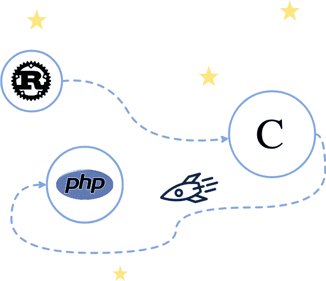

# From Rust to more than just Rust: the field of PHP language

> 原文：<https://dev.to/suhanyujie/rust-rust-php-2j1i>

> 从生锈到超越:PHP 银河译文
> 
> *   原文地址:[https://mnt . io/2018/10/29/from-rust-to-beyond-the-PHP-galaxy/](https://mnt.io/2018/10/29/from-rust-to-beyond-the-php-galaxy/)
> *   原文仓库:[https://github . com/hy wan/Gutenberg-parser-RS/tree/master/bindings/](https://github.com/Hywan/gutenberg-parser-rs/tree/master/bindings/)
> *   原文作者伊万·恩德林
> *   译文出自:[https://github.com/suhanyujie/article-transfer-rs](https://github.com/suhanyujie/article-transfer-rs)
> *   本文永久链接:[https://github . com/suhan yujie/article-transfer-RS/blob/master/src/2019/From-Rust-to-beyond-The-PHP-galaxy . MD](https://github.com/suhanyujie/article-transfer-rs/blob/master/src/2019/From-Rust-to-beyond-The-PHP-galaxy.md)
> *   译者： [suhanyujie](https://github.com/suhanyujie)
> *   Please point out any improper translation, thank you!
> *   Tags: develop extensions for PHP with Rust; Help PHP with Rust

This blog post is one of the series "How to spread Rust to other languages". Rust completion progress:

*   [Preface](https://mnt.io/2018/08/21/from-rust-to-beyond-prelude/) ,
*   [WebAssembly 领域](https://mnt.io/2018/08/22/from-rust-to-beyond-the-webassembly-galaxy/)，
*   ASM.js 领域，
*   [field c](https://mnt.io/2018/09/11/from-rust-to-beyond-the-c-galaxy/) ,
*   PHP domain (current chapter), and
*   NodeJS 领域

The field we are exploring today is the field of PHP. This article explains what PHP is and how to compile Rust program into C and then convert it into PHP native extension.

## What is PHP? Why is it?

[PHP](https://secure.php.net/) 是：

> Popular general scripting language, especially in the field of web development. From personal blogs to the most popular websites in the world, PHP provides fast, flexible and practical functions.

Unfortunately, PHP has a bad reputation in recent years, but the latest release (from PHP 7.0) has introduced many concise language features, which are very popular. PHP is also a fast scripting language and very flexible. PHP now has types, characteristics, variable parameters, closures (with explicit scope), generators and powerful backward compatibility features. The development of PHP is led by [T0】 RFCs 【T1], and the whole process is open and democratic. Gutenberg Project is the new editor of WordPress. WordPress is written in PHP. Naturally, we need a local extension of PHP to parse Gutenberg's article format. PHP is a language with [specification](https://github.com/php/php-langspec) . Its most popular virtual machine is [T4】 Zend Engine 【T5], and there are some other virtual machines, such as [T6】 HHVM 【T7] (but HHVM has recently abandoned its support for PHP, in favor of their team's own PHP branch, also known as Hack), [T8】 Peachpie 【T9] or [T10】 Tagua VM 【T11] (T11) In this article, we will create an extension for Zend Engine. This virtual machine is written in C language. It coincides with the previous article [Series C](https://mnt.io/2018/09/11/from-rust-to-beyond-the-c-galaxy/) .

## 生锈🚀C🚀服务器端编程语言（Professional Hypertext Preprocessor 的缩写）

[](https://res.cloudinary.com/practicaldev/image/fetch/s--OMsAUF0R--/c_limit%2Cf_auto%2Cfl_progressive%2Cq_auto%2Cw_880/https://github.com/suhanyujie/article-transfer-rs/raw/master/src/2019/images08/rust-to-php.png)

To port Rust parser to PHP, we first need to port it to C. This has been achieved in the last article. There are two files from this end to C: `libgutenberg_post_parser.a` and `gutenberg_post_parser.h`, which are static libraries and header files respectively.

### Use scaffolding to guide

The PHP source code comes with a [scaffold/template](http://php.net/manual/en/internals2.buildsys.skeleton.php) for creating extensions, which is [`ext_skel.php`](https://github.com/php/php-src/blob/master/ext/ext_skel.php) . This script can be found in the source code Z of Zend Engine virtual machine. You can use it like this:

```
$ cd php-src/ext/
$ ./ext_skel.php \
      --ext gutenberg_post_parser \
      --author 'Ivan Enderlin' \
      --dir /path/to/extension \
      --onlyunix
$ cd /path/to/extension
$ ls gutenberg_post_parser
tests/
.gitignore
CREDITS
config.m4
gutenberg_post_parser.c
php_gutenberg_post_parser.h 
```

The `ext_skel.php` script is suggested to be used in the following steps:
-rebuild PHP source configuration (run `./buildconf` in the `php-src` root directory),
-reconfigure the build system to enable extensions, such as `./configure --enable-gutenberg_post_parser`,
-use `make` to build
-finish.

But our extension is likely to be located in a directory other than `php-src`. So we use `phpize`. `phpize` is an executable file similar to `php`, `php-cgi`, `phpdbg` and `php-config`. Let's compile the extension according to the compiled `php` binary file, which is very consistent with our example. We use it as follows:

```
$ cd /path/to/extension/gutenberg_post_parser

$ # Get the bin directory for PHP utilities.
$ PHP_PREFIX_BIN=$(php-config --prefix)/bin

$ # Clean (except if it is the first run).
$ $PHP_PREFIX_BIN/phpize --clean

$ # “phpize” the extension.
$ $PHP_PREFIX_BIN/phpize

$ # Configure the extension for a particular PHP version.
$ ./configure --with-php-config=$PHP_PREFIX_BIN/php-config

$ # Compile.
$ make install 
```

In this article, we will no longer show the relevant code modifications, but focus on extending the binding. All relevant source codes of can be found here . Simply put, this is the configuration of `config.m4` file:

```
PHP_ARG_ENABLE(gutenberg_post_parser, whether to enable gutenberg_post_parser support,
[  --with-gutenberg_post_parser          Include gutenberg_post_parser support], no)

if  test "$PHP_GUTENBERG_POST_PARSER" != "no"; then
  PHP_SUBST(GUTENBERG_POST_PARSER_SHARED_LIBADD)

  PHP_ADD_LIBRARY_WITH_PATH(gutenberg_post_parser, ., GUTENBERG_POST_PARSER_SHARED_LIBADD)

  PHP_NEW_EXTENSION(gutenberg_post_parser, gutenberg_post_parser.c, $ext_shared)
fi 
```

Its functions are as follows:
-register `--with-gutenberg_post_parser` option in the build system, and
-declare the static library to be compiled and the extended source code.

I have to add files `libgutenberg_post_parser.a` and `gutenberg_post_parser.h` in the same level directory (link symbols are available), and then I can get the following directory structure:

```
$ ls gutenberg_post_parser
tests/                       # from ext_skel
.gitignore                   # from ext_skel
CREDITS                      # from ext_skel
config.m4                    # from ext_skel (edited)
gutenberg_post_parser.c      # from ext_skel (will be edited)
gutenberg_post_parser.h      # from Rust
libgutenberg_post_parser.a   # from Rust
php_gutenberg_post_parser.h  # from ext_skel 
```

The core of the extension is `gutenberg_post_parser.c` file. This file is responsible for creating modules and binding Rust code to PHP.

### module is expanded.

As mentioned earlier, we will implement our logic in `gutenberg_post_parser.c`. First, introduce the required files:

```
#include "php.h"
#include "ext/standard/info.h"
#include "php_gutenberg_post_parser.h"
#include "gutenberg_post_parser.h" 
```

The `gutenberg_post_parser.h` file introduced in the last line was generated by Rust (to be exact, `cbindgen`. If you don't remember, [read the previous article](https://mnt.io/2018/09/11/from-rust-to-beyond-the-c-galaxy/) ). Next, we have to decide the API to expose to PHP. The definition of AST generated by Rust parser is as follows:

```
pub enum Node<'a> {
    Block {
        name: (Input<'a>, Input<'a>),
        attributes: Option<Input<'a>>,
        children: Vec<Node<'a>>
    },
    Phrase(Input<'a>)
} 
```

The C variant of AST is similar to the above version (with many structures, but almost the same ideas). So in PHP, choose the following structure:

```
class Gutenberg_Parser_Block {
    public string $namespace;
    public string $name;
    public string $attributes;
    public array $children;
}

class Gutenberg_Parser_Phrase {
    public string $content;
}

function gutenberg_post_parse(string $gutenberg_post): array; 
```

The `gutenberg_post_parse` function outputs an array of objects whose type is `gutenberg_post_parse` or `Gutenberg_Parser_Phrase`, which is our AST. We need to declare these classes.

### Declaration of class

*Note: the last four code blocks are not the core of this article, they are just the code that needs to be written. If you don't plan to write a PHP extension, you can skip it*

```
zend_class_entry *gutenberg_parser_block_class_entry;
zend_class_entry *gutenberg_parser_phrase_class_entry;
zend_object_handlers gutenberg_parser_node_class_entry_handlers;

typedef struct _gutenberg_parser_node {
    zend_object zobj;
} gutenberg_parser_node; 
```

A class entry represents a specific type. And there will be a corresponding handler associated with the class entry. The logic is somewhat complicated. If you want to know more, I suggest you read [T0】 PHP Internals Book 【T1]. Next, we create a function to instantiate these objects:

```
static zend_object *create_parser_node_object(zend_class_entry *class_entry)
{
    gutenberg_parser_node *gutenberg_parser_node_object;

    gutenberg_parser_node_object = ecalloc(1, sizeof(*gutenberg_parser_node_object) + zend_object_properties_size(class_entry));

    zend_object_std_init(&gutenberg_parser_node_object->zobj, class_entry);
    object_properties_init(&gutenberg_parser_node_object->zobj, class_entry);

    gutenberg_parser_node_object->zobj.handlers = &gutenberg_parser_node_class_entry_handlers;

    return &gutenberg_parser_node_object->zobj;
} 
```

Then, we create a function to release these objects. Its work has two steps: calling the destructor of the object (in user mode) to destruct the object, and then releasing it (in virtual machine):

```
static void destroy_parser_node_object(zend_object *gutenberg_parser_node_object)
{
    zend_objects_destroy_object(gutenberg_parser_node_object);
}

static void free_parser_node_object(zend_object *gutenberg_parser_node_object)
{
    zend_object_std_dtor(gutenberg_parser_node_object);
} 
```

Then, we initialize this "module", that is, the extension. During the initialization process, we will create a class in user space and declare its properties, etc.

```
PHP_MINIT_FUNCTION(gutenberg_post_parser)
{
    zend_class_entry class_entry;

    // 声明 Gutenberg_Parser_Block.
    INIT_CLASS_ENTRY(class_entry, "Gutenberg_Parser_Block", NULL);
    gutenberg_parser_block_class_entry = zend_register_internal_class(&class_entry TSRMLS_CC);

    // 声明 create handler.
    gutenberg_parser_block_class_entry->create_object = create_parser_node_object;

    // 类是 final 的（不能被继承）
    gutenberg_parser_block_class_entry->ce_flags |= ZEND_ACC_FINAL;

    // 使用空字符串作为默认值声明 `namespace` 公共属性,
    zend_declare_property_string(gutenberg_parser_block_class_entry, "namespace", sizeof("namespace") - 1, "", ZEND_ACC_PUBLIC);

    // 使用空字符串作为默认值声明 `name` 公共属性
    zend_declare_property_string(gutenberg_parser_block_class_entry, "name", sizeof("name") - 1, "", ZEND_ACC_PUBLIC);

    // 使用 `NULL` 作为默认值声明 `attributes` 公共属性
    zend_declare_property_null(gutenberg_parser_block_class_entry, "attributes", sizeof("attributes") - 1, ZEND_ACC_PUBLIC);

    // 使用 `NULL` 作为默认值，声明 `children` 公共属性
    zend_declare_property_null(gutenberg_parser_block_class_entry, "children", sizeof("children") - 1, ZEND_ACC_PUBLIC);

    // 声明 Gutenberg_Parser_Block.

    … 略 …

    // 声明 Gutenberg 解析器节点对象 handler

    memcpy(&gutenberg_parser_node_class_entry_handlers, zend_get_std_object_handlers(), sizeof(gutenberg_parser_node_class_entry_handlers));

    gutenberg_parser_node_class_entry_handlers.offset = XtOffsetOf(gutenberg_parser_node, zobj);
    gutenberg_parser_node_class_entry_handlers.dtor_obj = destroy_parser_node_object;
    gutenberg_parser_node_class_entry_handlers.free_obj = free_parser_node_object;

    return SUCCESS;
} 
```

If you are still reading, first of all, I would like to express my gratitude, and secondly, congratulations! Then, there are `PHP_RINIT_FUNCTION` and `PHP_MINFO_FUNCTION` functions in the code, which are generated by `ext_skel.php` script. The module entry information and module configuration are also generated in this way.

### `gutenberg_post_parse` function

Now we will focus on the `gutenberg_post_parse` function. This function takes a string as a parameter, and returns `false` if parsing fails, otherwise it returns an array of objects of type `Gutenberg_Parser_Block` or `Gutenberg_Parser_Phrase`. Let's start writing it! Note that it is declared by [`PHP_FUNCTION` macro](https://github.com/php/php-src/blob/52d91260df54995a680f420884338dfd9d5a0d49/main/php.h#L400) .

```
PHP_FUNCTION(gutenberg_post_parse)
{
    char *input;
    size_t input_len;

    // 将 input 作为字符串读入
    if (zend_parse_parameters(ZEND_NUM_ARGS() TSRMLS_CC, "s", &input, &input_len) == FAILURE) {
        return;
    } 
```

In this step, the parameter has been declared and introduced as a string (`"s"`). The value of the string is in `input`, and the length of the string is stored in `input_len`. The next step is to parse `input`. (Actually, the string length is not required). This is where we will call the Rust code! We can do this:

```
 // 解析 input
    Result parser_result = parse(input);

    // 如果解析失败，则返回 false.
    if (parser_result.tag == Err) {
        RETURN_FALSE;
    }

    // 否则将 Rust 的 AST 映射到 PHP 的数组中
    const Vector_Node nodes = parse_result.ok._0; 
```

The `Result` type and `parse` function are from Rust. If you don't remember these types, you can read the previous [article](https://mnt.io/2018/09/11/from-rust-to-beyond-the-c-galaxy/) about field C. ZenEngine has a `RETURN_FALSE` macro, which is used to return `false`! Very convenient, isn't it? Finally, if it goes well, we will get a node set of type `Vector_Node`. The next step is to map them into PHP types, such as arrays of Gutenberg type. Let's get started:

```
 // 注意：return_value 是一个"魔术"变量，它用于存放返回值
    //
    // 分配一个数组空间
    array_init_size(return_value, nodes.length);

    // 映射 Rust AST
    into_php_objects(return_value, &nodes);
} 
```

Done! Oh, wait ... and implement the `into_php_objects` function!

### `into_php_objects` function

This function is not complicated: it's just that it's implemented through Zend Engine's API. We will explain to diligent readers how to map `Block` to `Gutenberg_Parser_Block` and `Phrase` to `Gutenberg_Parser_Phrase`. Let's begin:

```
void into_php_objects(zval *php_array, const Vector_Node *nodes)
{
    const uintptr_t number_of_nodes = nodes->length;

    if (number_of_nodes == 0) {
        return;
    }

    // 遍历所有节点
    for (uintptr_t nth = 0; nth < number_of_nodes; ++nth) {
        const Node node = nodes->buffer[nth];

        if (node.tag == Block) {
            // 将 Block 映射为 Gutenberg_Parser_Block
        } else if (node.tag == Phrase) {
            // 将 Phrase 映射为 Gutenberg_Parser_Phrase
        }
    }
} 
```

Now, we begin to map a memory block (hereinafter referred to as block). The main process is as follows:

1.  Assign PHP strings to block namespaces and block names,
2.  Allocate objects,
3.  Set the block namespace and block name as their own exclusive attributes.
4.  Assign a php string to the fast property.
5.  Set the block attribute to the corresponding object attribute.
6.  If there are child nodes, initialize an array and call `into_php_objects` with the child nodes and the new array.
7.  Set the child nodes to the corresponding object attributes.
8.  Finally, add a block object to the returned array.

```
const Block_Body block = node.block;
zval php_block, php_block_namespace, php_block_name;

// 1\. 准备 PHP 字符串
ZVAL_STRINGL(&php_block_namespace, block.namespace.pointer, block.namespace.length);
ZVAL_STRINGL(&php_block_name, block.name.pointer, block.name.length); 
```

Do you remember that the type of namespace, name and other similar data is `Slice_c_char`? It is a structure with a pointer and a length. The pointer points to the original input string, so there is no copy (which is actually the definition of slice). Ok, there is a macro named [`ZVAL_STRINGL`](https://github.com/php/php-src/blob/52d91260df54995a680f420884338dfd9d5a0d49/Zend/zend_API.h#L563-L565) in Zend Engine. Its function is to create strings by "pointer" and "length". Great! Unfortunately, Zend Engine [made a copy at the bottom layer](https://github.com/php/php-src/blob/52d91260df54995a680f420884338dfd9d5a0d49/Zend/zend_string.h#L152-L159) ... There is no way to keep only the pointer and length, but it guarantees a small number of copies. I think it is necessary for garbage collection in order to obtain full ownership of the data.

```
// 2\. 创建 Gutenberg_Parser_Block 对象
object_init_ex(&php_block, gutenberg_parser_block_class_entry); 
```

Instantiate the object using the class represented by `gutenberg_parser_block_class_entry`.

```
// 3\. 设定命名空间和名称
add_property_zval(&php_block, "namespace", &php_block_namespace);
add_property_zval(&php_block, "name", &php_block_name);

zval_ptr_dtor(&php_block_namespace);
zval_ptr_dtor(&php_block_name); 
```

The function of `zval_ptr_dtor` is to add 1 to the reference count. Facilitate garbage recycling.

```
// 4\. 处理一些内存块属性
if (block.attributes.tag == Some) {
    Slice_c_char attributes = block.attributes.some._0;
    zval php_block_attributes;

    ZVAL_STRINGL(&php_block_attributes, attributes.pointer, attributes.length);

    // 5\. 设置属性
    add_property_zval(&php_block, "attributes", &php_block_attributes);

    zval_ptr_dtor(&php_block_attributes);
} 
```

It is similar to what `namespace` and `name` do. Now let's continue to discuss children.

```
// 6\. 处理子节点
const Vector_Node *children = (const Vector_Node*) (block.children);

if (children->length > 0) {
    zval php_children_array;

    array_init_size(&php_children_array, children->length);

    // 递归
    into_php_objects(&php_children_array, children);

    // 7\. 设置 children
    add_property_zval(&php_block, "children", &php_children_array);

    Z_DELREF(php_children_array);
}

free((void*) children); 
```

Finally, add the block instance to the returned array:

```
// 8\. 在集合中加入对象
add_next_index_zval(php_array, &php_block); 
```

[Click here to view](https://github.com/Hywan/gutenberg-parser-rs/blob/master/bindings/php/extension/gutenberg_post_parser/gutenberg_post_parser.c) for complete code.

## PHP extends PHP user mode

Now that the extension is written, we must compile it. You can directly repeat the aforementioned command set displayed by `phpize`, etc. Once the extension is compiled, the `generated gutenberg_post_parser.so` file will be generated in the local extension storage directory. Use the following command to find the directory:

```
$ php-config --extension-dir 
```

For example, in my computer, the extended directory is `/usr/local/Cellar/php/7.2.11/pecl/20170718`. Then, to use the extension, you need to enable it first. You have to do this:

```
$ php -d extension=gutenberg_post_parser -m | \
      grep gutenberg_post_parser 
```

Or, to enable the extension for all scripts, you need to use the command `php --ini` to locate the `php.ini` file, edit it, and add the following contents to it:

```
extension=gutenberg_post_parser 
```

Done! Now, we use some reflection to check whether the extension is loaded and processed correctly by PHP:

```
$ php --re gutenberg_post_parser
Extension [ <persistent> extension #64 gutenberg_post_parser version 0.1.0 ] {

  - Functions {
    Function [ <internal:gutenberg_post_parser> function gutenberg_post_parse ] {

      - Parameters [1] {
        Parameter #0 [ <required> $gutenberg_post_as_string ]
      }
    }
  }

  - Classes [2] {
    Class [ <internal:gutenberg_post_parser> final class Gutenberg_Parser_Block ] {

      - Constants [0] {
      }

      - Static properties [0] {
      }

      - Static methods [0] {
      }

      - Properties [4] {
        Property [ <default> public $namespace ]
        Property [ <default> public $name ]
        Property [ <default> public $attributes ]
        Property [ <default> public $children ]
      }

      - Methods [0] {
      }
    }

    Class [ <internal:gutenberg_post_parser> final class Gutenberg_Parser_Phrase ] {

      - Constants [0] {
      }

      - Static properties [0] {
      }

      - Static methods [0] {
      }

      - Properties [1] {
        Property [ <default> public $content ]
      }

      - Methods [0] {
      }
    }
  }
} 
```

There seems to be no problem: there is a function and two predefined classes. Now, let's write the PHP code of this article!

```
<?php

var_dump(
    gutenberg_post_parse(
        '<!-- wp:foo /-->bar<!-- wp:baz -->qux<!-- /wp:baz -->'
    )
);

/**
 * Will output:
 *     array(3) {
 *       [0]=>
 *       object(Gutenberg_Parser_Block)#1 (4) {
 *         ["namespace"]=>
 *         string(4) "core"
 *         ["name"]=>
 *         string(3) "foo"
 *         ["attributes"]=>
 *         NULL
 *         ["children"]=>
 *         NULL
 *       }
 *       [1]=>
 *       object(Gutenberg_Parser_Phrase)#2 (1) {
 *         ["content"]=>
 *         string(3) "bar"
 *       }
 *       [2]=>
 *       object(Gutenberg_Parser_Block)#3 (4) {
 *         ["namespace"]=>
 *         string(4) "core"
 *         ["name"]=>
 *         string(3) "baz"
 *         ["attributes"]=>
 *         NULL
 *         ["children"]=>
 *         array(1) {
 *           [0]=>
 *           object(Gutenberg_Parser_Phrase)#4 (1) {
 *             ["content"]=>
 *             string(3) "qux"
 *           }
 *         }
 *       }
 *     }
 */ 
```

It was executed correctly!

## Conclusion

Main process:

*   Get PHP string
*   In Zend Engine, memory is allocated for Gutenberg extension,
*   Passed to Rust through FFI (static library+header),
*   Return data to Zend Engine through Gutenberg extension
*   Generate PHP objects,
*   PHP reads the object.

Rust is suitable for many places! We have seen that in actual programming, people have realized how to implement the parser with Rust, how to bind it to C language and generate static libraries except C header files, how to create a PHP extension and expose a function interface and two objects, how to integrate "C binding" into PHP, and how to use the extension in PHP. As a reminder, "C binding" has about 150 lines of code. PHP extensions have about 300 lines of code, but minus the automatically generated "code decoration" (some template files for declaring and managing extensions), PHP extensions will be reduced to about 200 lines of code. Similarly, considering that the parser is still written in Rust, modifying the parser won't affect the binding (unless there is a big update in AST), I found that the whole implementation process is only a small part of the code. PHP is a language with garbage collection. This explains why all strings need to be copied so that the data can be owned by PHP. However, the fact that no data is copied in Rust shows that memory allocation and release can be reduced, which happens to be the biggest time cost in most cases. Rust also provides security. Considering the number of bindings we have to make, this feature may be questioned: Rust to C to PHP, does this security still exist? From Rust's point of view, the answer is yes, but all operations that occur in C or PHP are considered unsafe. All cases must be handled with special care in C binding. Is this still fast? All right, let's do a benchmark test. I want to remind you that the primary goal of this experiment is to solve the performance problem of the original PEG.js parser. On the basis of JavaScript, WASM and ASM.js solutions have been proved to be much faster (see [T1】 WebAssembly domain and [T3】 ASM.js domain ). For PHP, [uses `phpegjs`](https://github.com/nylen/phpegjs) : it reads the syntax written for PEG.js and compiles it into PHP. Let's compare:

| filename | PEG PHP 解析器(ms) | Rust parser 作为 PHP 扩展(ms) | Lifting multiple |
| --- | --- | --- | --- |
| [T2`demo-post.html`](https://raw.githubusercontent.com/dmsnell/gutenberg-document-library/master/library/demo-post.html) | Thirty point four zero nine | 0.0012 | × 25341 |
| [T2`shortcode-shortcomings.html`](https://raw.githubusercontent.com/dmsnell/gutenberg-document-library/master/library/shortcode-shortcomings.html) | Seventy-six point three nine | Zero point zero nine six | × 796 |
| [T2`redesigning-chrome-desktop.html`](https://raw.githubusercontent.com/dmsnell/gutenberg-document-library/master/library/redesigning-chrome-desktop.html) | Two hundred and twenty-five point eight two four | Zero point three nine nine | × 566 |
| [T2`web-at-maximum-fps.html`](https://raw.githubusercontent.com/dmsnell/gutenberg-document-library/master/library/web-at-maximum-fps.html) | One hundred and seventy-three point four nine five | Zero point two seven five | × 631 |
| [T2`early-adopting-the-future.html`](https://raw.githubusercontent.com/dmsnell/gutenberg-document-library/master/library/early-adopting-the-future.html) | Two hundred and eighty point four three three | Zero point two nine eight | × 941 |
| [T2`pygmalian-raw-html.html`](https://raw.githubusercontent.com/dmsnell/gutenberg-document-library/master/library/pygmalian-raw-html.html) | Three hundred and seventy-seven point three nine two | Zero point zero five two | × 7258 |
| [T2`moby-dick-parsed.html`](https://raw.githubusercontent.com/dmsnell/gutenberg-document-library/master/library/moby-dick-parsed.html) | Five thousand four hundred and thirty-seven point six three | Five point zero three seven | × 1080 |

The PHP extension of Rust parser is 5230 times faster than the actual PEG PHP implementation on average. The median number of lifting multiples is 941\. Another problem is that PEG parser can't handle too many Gutenberg documents due to memory limitation. Of course, increasing the size of memory may solve this problem, but it is not the best solution. When Rust parser is used as PHP extension, the memory consumption remains basically the same, and it is close to the size of the parsed document. I think we can further optimize this extension by iterator instead of array. This is what I want to explore and analyze the impact on performance. PHP kernel books have an iterator chapter . We will see in the next section of this series that Rust can help many fields, and the more it spreads, the more interesting it will be. Thank you for reading!