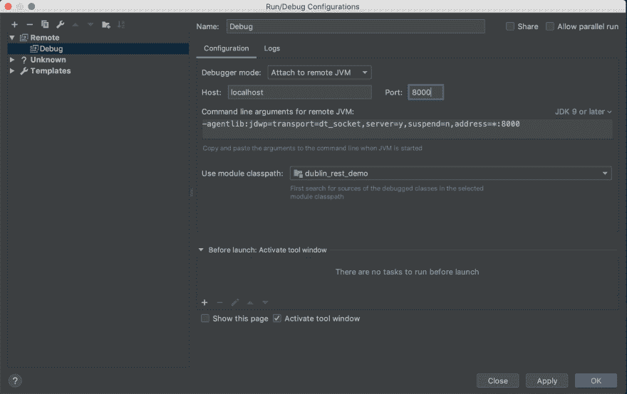
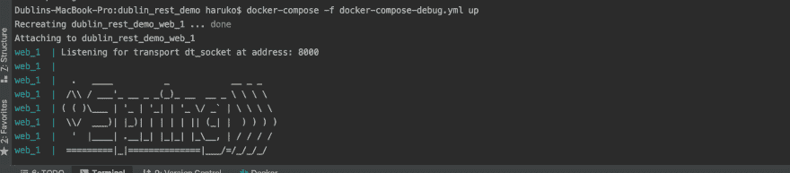
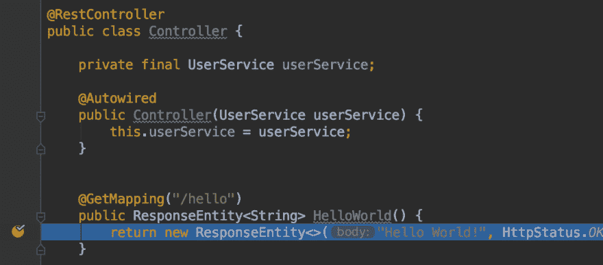

# 在 Docker 中调试 Spring Boot 应用程序

> 原文：<https://dev.to/danondso/debugging-a-spring-boot-app-in-docker-kgd>

随着应用程序容器化的趋势，设置您的本地环境比以往任何时候都容易。设置时间可以从几小时减少到几分钟。节省开发人员的时间和挫折。

在设置我的一个应用程序与 Docker 一起运行时。我意识到，在通过 docker 运行带调试功能的应用程序时，没有任何指南符合我的喜好。

在这篇文章中，我将回顾我是如何使用 docker-compose 调试我的应用程序的。你可以点击查看完整示例[。](https://github.com/Danondso/dublin_rest_demo)

首先我创建了 Dockerfile:

```
FROM openjdk:9-jre # Specifying the base image, I'm using Java 9
ADD target/dublin_rest_demo.jar . # Copies the compiled jar file to the root of the container -- DOUBLE CHECK THIS. 
EXPOSE 8080 8000 # Sets up ports the container listens on: 8080 (spring boots default) and 8000 (debugger port)
CMD java -jar dublin_rest_demo.jar # Specifies the command that will start up the application. 
```

<svg width="20px" height="20px" viewBox="0 0 24 24" class="highlight-action crayons-icon highlight-action--fullscreen-on"><title>Enter fullscreen mode</title></svg> <svg width="20px" height="20px" viewBox="0 0 24 24" class="highlight-action crayons-icon highlight-action--fullscreen-off"><title>Exit fullscreen mode</title></svg>

一旦我设置好了，我就运行它以确保一切正常。

```
mvn clean install && docker build -t rest_demo:latest . && docker run -p 8080:8080 -p 8000:8000 
```

<svg width="20px" height="20px" viewBox="0 0 24 24" class="highlight-action crayons-icon highlight-action--fullscreen-on"><title>Enter fullscreen mode</title></svg> <svg width="20px" height="20px" viewBox="0 0 24 24" class="highlight-action crayons-icon highlight-action--fullscreen-off"><title>Exit fullscreen mode</title></svg>

然后我设置了我的坞站-合成 yml 文件:

```
version: '3.7'
services:
  web:
    build: .
    ports:
      - "8080:8080" # Mapping the internal container ports to the external ones.
      - "8000:8000" 
```

<svg width="20px" height="20px" viewBox="0 0 24 24" class="highlight-action crayons-icon highlight-action--fullscreen-on"><title>Enter fullscreen mode</title></svg> <svg width="20px" height="20px" viewBox="0 0 24 24" class="highlight-action crayons-icon highlight-action--fullscreen-off"><title>Exit fullscreen mode</title></svg>

然后我运行它以确保一切正常。

```
docker-compose up 
```

<svg width="20px" height="20px" viewBox="0 0 24 24" class="highlight-action crayons-icon highlight-action--fullscreen-on"><title>Enter fullscreen mode</title></svg> <svg width="20px" height="20px" viewBox="0 0 24 24" class="highlight-action crayons-icon highlight-action--fullscreen-off"><title>Exit fullscreen mode</title></svg>

然后，我开始尝试让它在启用调试的情况下运行。我最终得到的是向 docker-compose 文件添加一个命令，该命令启动了启用调试的应用程序。

```
version: '3.7'
services:
  web:
    build: .
    ports:
      - "8080:8080"
      - "8000:8000"
    command: java -agentlib:jdwp=transport=dt_socket,server=y,suspend=n,address=*:8000 -jar dublin_rest_demo.jar 
```

<svg width="20px" height="20px" viewBox="0 0 24 24" class="highlight-action crayons-icon highlight-action--fullscreen-on"><title>Enter fullscreen mode</title></svg> <svg width="20px" height="20px" viewBox="0 0 24 24" class="highlight-action crayons-icon highlight-action--fullscreen-off"><title>Exit fullscreen mode</title></svg>

因为我并不总是在调试中运行我的应用程序。我通常会创建第二个文件，并将其命名为 docker-compose-debug.yml。然后使用'-f '标志运行该合成文件:

```
docker-compose -f docker-compose-debug.yml up 
```

<svg width="20px" height="20px" viewBox="0 0 24 24" class="highlight-action crayons-icon highlight-action--fullscreen-on"><title>Enter fullscreen mode</title></svg> <svg width="20px" height="20px" viewBox="0 0 24 24" class="highlight-action crayons-icon highlight-action--fullscreen-off"><title>Exit fullscreen mode</title></svg>

就这样，我正在调试我的应用程序！

来确认它是否设置正确。我在 IntelliJ 中设置了一个远程配置:

[](https://res.cloudinary.com/practicaldev/image/fetch/s--zM4vDL9X--/c_limit%2Cf_auto%2Cfl_progressive%2Cq_auto%2Cw_880/https://i.imgur.com/ioswzfP.png)

然后我运行了 docker-compose-debug 文件:

[](https://res.cloudinary.com/practicaldev/image/fetch/s--m04gkest--/c_limit%2Cf_auto%2Cfl_progressive%2Cq_auto%2Cw_880/https://i.imgur.com/a2NMTlK.png)

最后，我设置了一个断点并命中它:

[](https://res.cloudinary.com/practicaldev/image/fetch/s--KqTYMTsb--/c_limit%2Cf_auto%2Cfl_progressive%2Cq_auto%2Cw_880/https://i.imgur.com/HLlbVlk.png)

就这样，我们通过启用调试的 docker-compose 运行我们的应用程序。