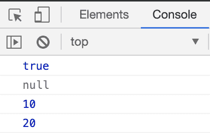
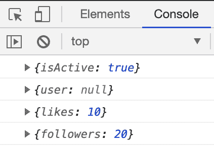

# 在控制台中调试的两个简单提示

> 原文：<https://dev.to/collardeau/two-simple-tips-for-debugging-in-the-console-f87>

在我的第一篇文章中，我想分享我在控制台中调试 Javascript 时使用的两个简单技巧。你很可能已经知道这些了！

## 君临控制台

不一定说它是理想的，但是如果你正在进行大规模的调试，你可能会遇到这样的情况:大量的`console.log`散布在你漂亮的代码中，就像这样:

```
console.log(isLoggedIn);
// sometime later:
console.log(user);
// in another file:
console.log(likes);
// more logs all over the place...
console.log(followers); 
```

控制台中杂乱无章的日志会很快成为混乱的负担。假设我们甚至不知道数据在代码流中的运行顺序，那么什么数据属于什么值呢？

[](https://res.cloudinary.com/practicaldev/image/fetch/s--1uyKZe4o--/c_limit%2Cf_auto%2Cfl_progressive%2Cq_auto%2Cw_880/https://thepracticaldev.s3.amazonaws.com/i/bzk8fz51jnmftxaznsly.png)

一个解决方案是我们可以`console.log('data: ', data)`，但是我们也可以用更少的字符完成同样的事情。相反，我们可以将我们的值包装在一个对象中:`console.log({ data })`，控制台将在数据前打印出变量的名称:

[](https://res.cloudinary.com/practicaldev/image/fetch/s--j6ppBhgx--/c_limit%2Cf_auto%2Cfl_progressive%2Cq_auto%2Cw_880/https://thepracticaldev.s3.amazonaws.com/i/pw2um6hg6k9t1mk14hyo.png)

我们基本上使用 ES6 速记语法来注销我们动态创建的对象。

## 重构功能

谈谈 ES6，另一种情况是你可能使用更多的简写语法来编写你的函数，像这样:
`const exclaim = txt => text + "!"`
但是过了一段时间，你想记录`txt`，所以你必须重构代码，像这样:

```
 const exclaim = txt => txt + "!"

// needs to become:

const exclaim = txt => {
  console.log(txt)
  return text + "!"
} 
```

几乎让你想跳过整个任务。好吧，你也可以做下面的事情并且仍然记录参数:

```
 const exclaim = txt => console.log(txt) || txt + "!"; 
```

这里发生的情况是，`console.log`正常运行，并且计算结果为 false，所以解析器计算 OR 子句`txt + "!"`的第二个表达式，并返回它，因为它们不再是要检查的表达式。我们一路上偷偷把那根木头放进去，然后把它扔掉。因此，我们可以将函数保留为一行程序，并且仍然可以检查它们，而不用在编辑器中跳来跳去。

### 下次见！

期待成为这个社区的一员，和大家一起学习！