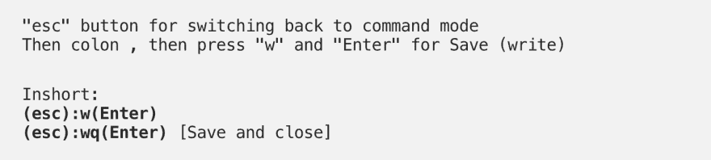
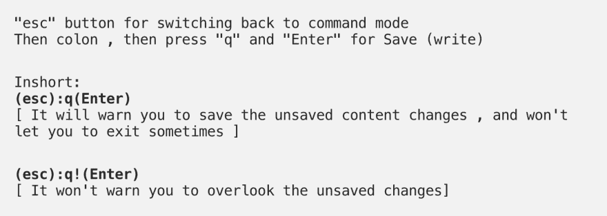
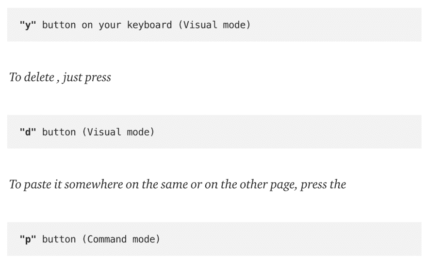
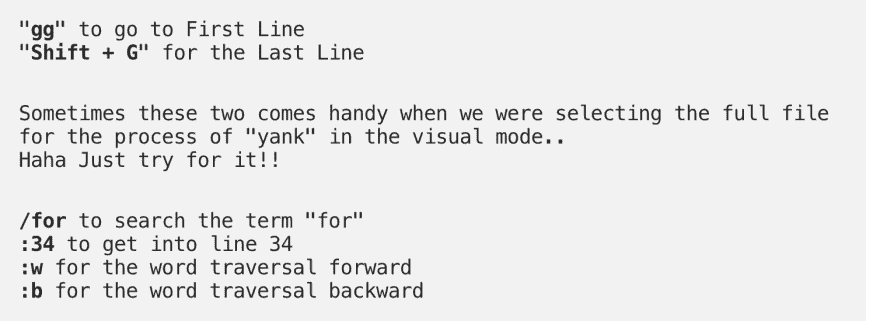
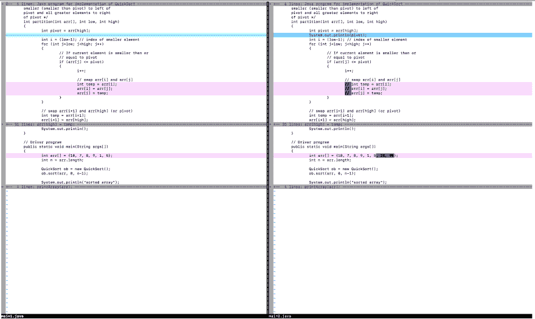
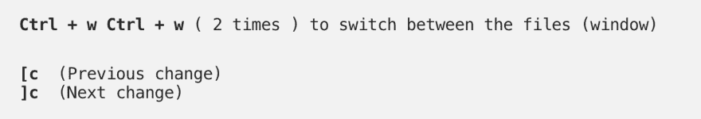
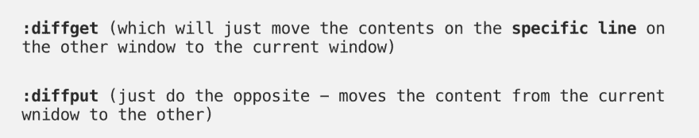
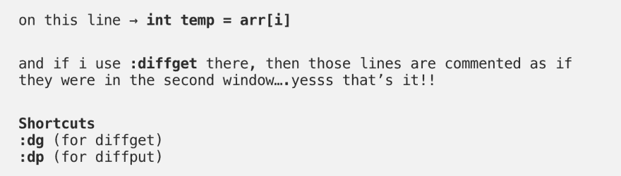

# 面向初学者的 Vim/Vi 教程

> 原文：<https://dev.to/dharanr/vim-vi-tutorials-for-beginners-2neh>

大多数人厌倦了使用 Vim，我也面临同样的问题。但是，在实际情况下，这没什么大不了的。问题是，我们应该了解使用它的基本知识。

首先，启动你的同伴终端，

打开您想要编辑的任何文件。在我的例子中，我使用下面的命令打开 main1.java

要编辑文件或在文件中插入任何字符，我们需要通过按

现在，编辑你需要的任何东西，通过使用箭头键前后移动光标，使用退格键删除内容

现在，是保存内容的时候了…不，不要用 ctrl+s——那个家伙不会在这里工作..这里是关于我们处于什么模式，现在，我们处于插入模式，所以，我们必须进入命令模式，使我们的命令工作，为此，按

现在是时候退出了，对吧？然后按

要复制和粘贴终端中的内容，我们使用不同的术语，即“拉”和粘贴。

请注意,“yank”会将内容复制到终端自己的剪贴板——它不允许您复制到外部(要将内容复制到系统的剪贴板，请阅读关于+clipboard)

对于猛拉，通过按

所以，我们应该注意到终端在它的底部显示了“视觉模式”这个术语。现在只需简单地拖动鼠标或使用向下箭头来选择多行，以做一些操作。现在，按下

一些捷径会让这个过程变得很酷。他们是

现在让我们转到 vimdiff，使用下面的命令比较我们经常使用它来解决合并冲突的文件。

从上面的图片，我们可以很容易地发现文件之间的差异，粉红色的点是修改过的区域，蓝色的是遗漏的行(删除或添加)

访问此窗口的快捷方式

现在，要解决变更冲突——只需将光标移动到您想要变更和使用的地方

即。，
例如，如果光标位于第一个窗口上描绘粉色高亮的行上，

为了您的方便，最好使用简单的“拉”和粘贴，就像我之前告诉你的那样。最后，不要忘记保存并关闭

vim 中仍然有许多可用的功能，但我现在所说的已经足够管理 vim 中的文件了…
祝您愉快！！

还拍我我的介质页面:
[https://Medium . com/@ rdharan/vim-basic-cheat sheet-for-初学者-297190fc8331](https://medium.com/@rdharan/vim-basic-cheatsheet-for-beginners-297190fc8331)