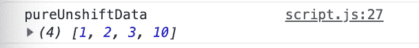
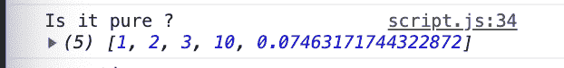

# Javascript 纯函数是什么？

> 原文：<https://dev.to/pardeepkashyap5/what-is-the-javascript-pure-function-4kg6>

1.纯函数是这样的函数，它接受输入并返回一个值，而不修改其范围之外的数据

1.  每次都用相同的参数生成相同的输出

```
var a=[1,2,3];

function impureJSFunction(array,value){
    array.unshift(value);
}

impureJSFunction(a,10)

console.log(a); 
```

<svg width="20px" height="20px" viewBox="0 0 24 24" class="highlight-action crayons-icon highlight-action--fullscreen-on"><title>Enter fullscreen mode</title></svg> <svg width="20px" height="20px" viewBox="0 0 24 24" class="highlight-action crayons-icon highlight-action--fullscreen-off"><title>Exit fullscreen mode</title></svg>

[](https://res.cloudinary.com/practicaldev/image/fetch/s--JEB0FfyP--/c_limit%2Cf_auto%2Cfl_progressive%2Cq_auto%2Cw_880/https://thepracticaldev.s3.amazonaws.com/i/l7li7amumh55bit00qom.png)

这不是一个纯 JS 函数，因为它影响外部数组 a[]；

如何 javascript 一个纯 Javascript 函数？

```
var a=[1,2,3];

function pureJSFunction(array,value){
     return [...array,value] ;
}

console.log("pureUnshiftData",pureJSFunction(a,10)) 
```

<svg width="20px" height="20px" viewBox="0 0 24 24" class="highlight-action crayons-icon highlight-action--fullscreen-on"><title>Enter fullscreen mode</title></svg> <svg width="20px" height="20px" viewBox="0 0 24 24" class="highlight-action crayons-icon highlight-action--fullscreen-off"><title>Exit fullscreen mode</title></svg>

[](https://res.cloudinary.com/practicaldev/image/fetch/s--gZQ4JrXo--/c_limit%2Cf_auto%2Cfl_progressive%2Cq_auto%2Cw_880/https://thepracticaldev.s3.amazonaws.com/i/g3w0r3hfir0jiho7o783.png)

这是纯 JS 函数吗？

```
function myFunc(array,value){
    return [...array,value,Math.random()] ;
}

console.log("Is it pure ?",myFunc(a,10)); 
```

<svg width="20px" height="20px" viewBox="0 0 24 24" class="highlight-action crayons-icon highlight-action--fullscreen-on"><title>Enter fullscreen mode</title></svg> <svg width="20px" height="20px" viewBox="0 0 24 24" class="highlight-action crayons-icon highlight-action--fullscreen-off"><title>Exit fullscreen mode</title></svg>

[](https://res.cloudinary.com/practicaldev/image/fetch/s--AxqsZaMs--/c_limit%2Cf_auto%2Cfl_progressive%2Cq_auto%2Cw_880/https://thepracticaldev.s3.amazonaws.com/i/99chuw9khyann9myox0s.png)

//答案是否定的，因为它不满足第二点，因为它不是每次都用相同的参数返回相同的值

//答案是否定的，因为它不满足第二点，因为它不是每次都用相同的参数返回相同的值

学习来源-[https://www.youtube.com/watch?v=fYbhD_KMCOg&t = 311s](https://www.youtube.com/watch?v=fYbhD_KMCOg&t=311s)