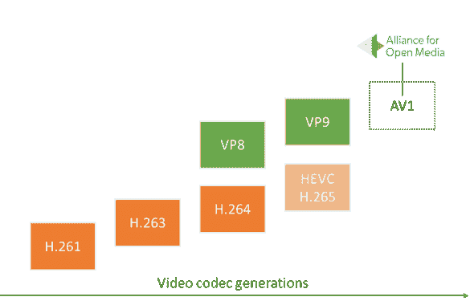
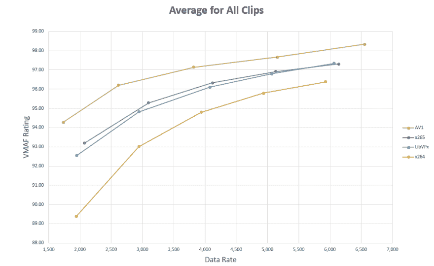

# AV1 编解码器带来更好的网络视频

> 原文：<https://dev.to/evilmartians/better-web-video-with-av1-codec-52kd>

了解如何通过采用 Chrome 和 Firefox 已经支持的新 AV1 视频格式，立即改善用户的在线观看体验。这个简短的指南还将展示如何使用 AV1 或 H.264 将你的 GIF 文件替换成视频，使你的文件缩小 20 到 40 倍。

赌注已经下了。YouTube 和网飞都将 AV1 命名为未来的视频编解码器:谷歌的视频服务已经将其用于 T2 的试管 T3(YouTube 的新实验功能)。网飞称 AV1 [“我们主要的下一代编解码器”](http://www.csimagazine.com/csi/Netflix-AV1-is-our-primary-next-gen-codec.php)已经有一段时间了。在邪恶火星人，我们已经在[我们的登陆页面](https://evilmartians.com/)和 [Amplifr](https://amplifr.com/en/) 的登陆页面试用了 AV1。在本文中，我们将分享我们使用新视频格式的经验，并给出最佳编码策略的逐步说明。

## 编解码器和容器

对于静态图像，你不必三思:选择所有浏览器都支持的 [JPEG](https://en.wikipedia.org/wiki/JPEG) 或 [PNG](https://en.wikipedia.org/wiki/Portable_Network_Graphics) ，或者为[更新的浏览器](https://caniuse.com/#search=webp)试验一个更紧凑的谷歌开发的 [WebP](https://en.wikipedia.org/wiki/WebP) 。你几乎总是可以(除非有一些肮脏的黑客伎俩，像 [imgproxy](https://github.com/DarthSim/imgproxy) 这样的工具可以保护你[免受](https://evilmartians.com/chronicles/introducing-imgproxy)的攻击)确保扩展名为`.png`的图像文件确实是 PNG。

对于视频文件来说，这就有点复杂了。文件扩展名(`.mp4`、`.wmv`、`.webm`或`.mov`)几乎不代表容器，多达三种不同的格式用于制作视频文件:

1.  **视频编解码器:**决定视频的压缩策略，这是在质量和数量之间进行权衡的地方。在网络上，一些流行的视频编解码器是 H.264、HEVC、VP9 和现在的 AV1。
2.  **音频编解码器:**对音频做同样的事情。如果你的视频没有声音，你可以没有它。否则，流行的选择是 MP3、Opus 和 AAC。
3.  **容器**存储视频(由一些视频编解码器压缩)和音频流(由一些音频编解码器压缩)，还可以添加额外的细节，如字幕和元信息。流行的容器有 MP4，MOV，WebM。

所以，当你看到`.mp4`扩展名时，你唯一可以确定的是 MP4 容器曾经被用来打包一个文件。编解码器的选择完全取决于创作者:它可以是 H.264/AAC，或者 AV1/Opus，或者其他什么。

## 迎接 AV1

AV1 是一个视频*编解码器*，在差不多一年前首次发布:2018 年 3 月。它旨在与 HEVC/VP9 和 H.264/VP8 等前几代编解码器竞争。

<figure>

[](https://res.cloudinary.com/practicaldev/image/fetch/s--BQRwPEuS--/c_limit%2Cf_auto%2Cfl_progressive%2Cq_auto%2Cw_880/https://thepracticaldev.s3.amazonaws.com/i/b6ztu3frsea4o994k1g0.png)

<figcaption>Video codecs generations diagram by Tsahi Levent-Levi ([source](https://webrtcglossary.com/av1/))</figcaption>

</figure>

要熟悉新一代视频编码中使用的技术，请随意阅读[“AV1 简介”](https://people.xiph.org/~xiphmont/demo/av1/demo1.shtml)和[“AV1:下一代视频”](https://hacks.mozilla.org/2018/06/av1-next-generation-video-the-constrained-directional-enhancement-filter/)。

由于涉及到所有的底层欺骗，AV1 能够生成比 H.264/VP8 小 30-50%的文件，比 HEVC 小 30%的文件，尽管由于大部分仍然是实验性的，它有一些问题(在撰写本文时):

*   编码器尚未优化。结果，编码速度*非常*慢(Rust 编写的[即将推出的编码器](https://github.com/xiph/rav1e)试图解决这个问题)。这种格式还不能用于直播。然而，它非常适合 web，因为您的普通登录页面通常会有一个很少更改的嵌入式视频短片。
*   虽然 Chrome 和 Firefox 支持 AV1，但 AV1 缺乏 Safari 和 Edge 的实现(尽管微软在早期测试版中已经支持 AV1)。所以你需要有至少两个版本的视频:AV1 用于 Chrome/Firefox，H.264 用于其他所有东西。理想情况下，你应该有第三个 HEVC 版本，供桌面和移动设备上的 Safari 用户使用，我们将展示如何准备这三个文件。

AV1 的核心承诺是即使在低比特率下也能保持高图像质量，从而允许较小的文件而没有明显的压缩伪像。

<figure>

[](https://res.cloudinary.com/practicaldev/image/fetch/s--bboDMIej--/c_limit%2Cf_auto%2Cfl_progressive%2Cq_auto%2Cw_880/https://thepracticaldev.s3.amazonaws.com/i/s5cj5mjh736rsv7f9z2n.png)

<figcaption>A [chart](https://www.streamingmedia.com/Articles/Editorial/Featured-Articles/AV1-A-First-Look-127133.aspx) by Jan Ozer plots data rate against the VMAF quality metric. AV1 is a clear winner.</figcaption>

</figure>

## 现在如何使用 AV1

现在，我们将展示使用 AV1 为网络制作高质量视频内容所需的一系列步骤。首先，你需要选择一个容器:理论上，这并不重要，但 MP4 是值得推荐的，而且似乎是目前最受欢迎的。对于音频编解码器，我们将使用 Opus 与 AV1 作为一个[高效的](http://opus-codec.org/comparison/)和免费的替代品。

为了确保最佳的跨浏览器兼容性，我们将生成三个文件，而不是一个:

1.  对于桌面 Chrome 和 Firefox ( [31%的用户](https://caniuse.com/#search=av1)截至 2019 年 8 月):MP4 容器，带 AV1 视频编解码器和 Opus 音频编解码器。
2.  对于 Safari 和 Edge ( [16%的用户](https://caniuse.com/#feat=hevc)):带 HEVC 和 AAC 的 MP4。
3.  对于其他浏览器:MP4 容器中的较大文件，视频为 H.264，音频为 AAC。

您也可以只使用选项 1 和 3，您仍然可以确保所有用户都能看到视频。

转换的话，我推荐在终端中使用 [FFmpeg](https://www.ffmpeg.org/) 。有许多用于视频压缩的 GUI 工具，但是 CLI 允许容易再现的步骤，并且可以通过脚本自动执行。请确保您使用的是最新版本的 FFmpeg，因为低于 4.1 的版本不支持 MP4 容器中的 AV1。下面是安装它的步骤。

对于 Mac:

1.  确保你有[自制的](https://brew.sh/)。
2.  `brew install ffmpeg`

对于 Linux，我们推荐使用来自官方网站的最新版本的 FFmpeg，因为在撰写本文时，并不是所有的包管理器都包含最新的、支持 AV1 的版本:

1.  `wget https://johnvansickle.com/ffmpeg/releases/ffmpeg-release-amd64-static.tar.xz`
2.  `tar -xf ffmpeg-release-amd64-static.tar.xz`
3.  `sudo cp ffmpeg-4.1-64bit-static/ff* /usr/local/bin/`

对于 Windows，可以使用[本指南](https://www.wdiaz.org/how-to-install-ffmpeg-on-windows/)。

一旦`ffmpeg`可执行文件在您的命令行中可用，让我们生成 H.264 文件(以确保与旧浏览器的兼容性)。因为我们所有的文件都将使用 MP4 作为容器，所以我将使用`.av1.mp4`、`.hevc.mp4`和`.h264.mp4`文件扩展名。下面是您将需要使用的命令(不要担心，我们马上会带您浏览所有选项)。

```
# Replace SOURCE.mov with a path to your source video file

ffmpeg -i SOURCE.mov -map_metadata -1 -c:a libfdk_aac -c:v libx264 -crf 24 -preset veryslow -profile:v main -pix_fmt yuv420p -movflags +faststart -vf "scale=trunc(iw/2)*2:trunc(ih/2)*2" video.h264.mp4 
```

Enter fullscreen mode Exit fullscreen mode

现在打开生成的`video.h264.mp4`文件并检查质量。如果您对结果满意，但文件大小似乎仍然太大，请尝试调整`-crf`选项(尝试`-crf 26`或`-crf 28`):这将减小文件大小，但也会降低质量，因此请尝试找到一个可接受的折衷方案。坦白地说，这个过程更像是艺术而不是科学。

> 如果没有单独的未压缩源，您可以将 H.264 转换为 AV1。

现在是生成 AV1 文件的时候了。下面的命令将比 H.264 的命令花费更长的时间，但这是意料之中的:目前，AV1 编解码器没有使用 CPU 的全部能力。这是一个诅咒，但也是一个祝福:如果你要同时编码几个文件，这样做是安全的，因为多线程目前在默认情况下不被支持。

```
ffmpeg -i SOURCE.mov -map_metadata -1 -c:a libopus -c:v libaom-av1 -crf 34 -b:v 0 -pix_fmt yuv420p -movflags +faststart -vf "scale=trunc(iw/2)*2:trunc(ih/2)*2" -strict experimental video.av1.mp4 
```

Enter fullscreen mode Exit fullscreen mode

调整`-crf`设置以获得最佳尺寸/质量平衡。

现在 HEVC 也一样:

```
ffmpeg -i SOURCE.mov -map_metadata -1 -c:a libfdk_aac -c:v libx265 -crf 24 -preset veryslow -pix_fmt yuv420p -movflags +faststart -tag:v hvc1 -vf "scale=trunc(iw/2)*2:trunc(ih/2)*2" video.hevc.mp4 
```

Enter fullscreen mode Exit fullscreen mode

然后将所有三个结果文件(`video.h264.mp4`、`video.hevc.mp4`和`video.av1.mp4`)复制到 web 项目的根目录下。

### 了解压缩选项

现在，上面的命令看起来像黑色的魔法咒语，但所有这些键都是有目的的。他们是这样做的:

*   `-i SOURCE.mov`设置输入的源视频文件。FFmpeg 将从这个文件中提取视频和音频流，转换它们，并打包到一个新的容器中。

*   `-map_metadata -1`将删除视频元数据(如最初用于创建视频的工具的名称)。有时元数据是有用的，但是对于 web 开发来说，情况很少如此。

*   `-c:a libopus`或`-c:a libfdk_aac`选择一个*音频*编解码器。

*   `-c:v libaom-av1`选择一个*视频*编解码器，一个将图像压缩成视频流的库。

*   `-crf 34`代表恒定比率系数，设定您的尺寸/质量平衡。你可以把它想象成 JPEG 的质量滑块，但是它是反方向的(`0`代表最好的质量和更大的尺寸)。对于 H.264 和 AV1，CRF 标度是不同的:H.264 从 0 到 51，AV1 从 0 到 61。因此，AV1 和 H.264 的 CRF 比率会不同。根据脸书的[指南](https://code.fb.com/video-engineering/av1-beats-x264-and-libvpx-vp9-in-practical-use-case/)，H.264 和 AV1 CRF 值之间的最佳映射如下:19 → 27，23 → 33，27 → 39，31 → 45，35 → 51，39 → 57。

*   `-preset veryslow`强制 H.264 和 HEVC 编解码器生成较小的视频文件，即使它会长得多。

*   我们在 H.264 命令中使用的选择视频编解码器[配置文件](https://superuser.com/questions/489087/what-are-the-differences-between-h-264-profiles)。我们只能使用“主”，否则我们的视频将无法在 Safari 中播放。

*   `-b:v 0` a 设置最小比特率，以强制 AV1 中的恒定质量模式。

*   `-pix_fmt yuv420p`(像素格式)是一种缩小视频大小的技巧。基本上，它对亮度使用全分辨率，对颜色使用较小的分辨率。这是一种欺骗人眼的方法，如果这个论点在您的情况下不起作用，您可以安全地删除它。

*   `-movflags +faststart`将重要信息移到文件的开头。它允许浏览器在下载过程中开始播放视频。

*   `-tag:v hvc1`在苹果操作系统上启用原生 HEVC 视频支持。

*   `-vf "scale=trunc(iw/2)*2:trunc(ih/2)*2"`是一种确保生成的视频始终具有*甚至*大小的方法(一些编解码器仅适用于像`300x200`和`302x200`这样的大小，而不适用于`301x200`)。此选项告诉 FFmpeg 缩放源以获得接近偶数的分辨率。如果你的视频尺寸甚至在第一位，它不会做任何事情。

*   `-strict experimental`AV1 需要使用选项，因为 AV1 编码器仍处于试验阶段。

*   `video.av1.mp4`设置输出文件的名称。

### 玩好浏览器

现在，您需要确保浏览器将根据是否支持显示正确的文件。幸运的是，我们可以在一个[源元素](https://developer.mozilla.org/en-US/docs/Web/HTML/Element/source)上设置一个`type`属性，只播放支持的文件。更多`<video>`标签选项，请看[这里](https://developer.mozilla.org/en-US/docs/Web/HTML/Element/video)。

```
<video controls width="600" height="400">
  <source
    src="video.hevc.mp4"
    type="video/mp4; codecs=hevc,mp4a.40.2"
  />
  <source
    src="video.av1.mp4"
    type="video/mp4; codecs=av01.0.05M.08,opus"
  />
  <source
    src="video.h264.mp4"
    type="video/mp4; codecs=avc1.4D401E,mp4a.40.2"
  />
</video> 
```

Enter fullscreen mode Exit fullscreen mode

源标签的工作方式类似于`if...else`语句:浏览器将从上到下读取`<source>`标签列表，并播放支持视频类型的第一个标签。

Type 属性描述一个文件格式:应该使用哪个容器(`video/mp4`代表 MP4)、视频编解码器(`av01.0.05M.08`代表 AV1、`hevc`代表 HEVC、`avc1.4D401E`代表 H.264)、音频编解码器(`opus`代表 Opus、`mp4a.40.2`代表 AAC)。

## 加成:如何将 gif 转换成 AV1 和 H.264

在现代，对视频片段使用 GIF 是一种糟糕的做法。gif 占用的空间是 H.264 或 AV1 的 20 到 40 倍。与现代视频格式相比，它们还需要更多的 CPU 和电源，消耗更多的电池。如果你在 2019 年的网站上需要短动画序列，请始终选择视频编解码器。幸运的是，FFmpeg 支持 GIF 文件作为输入源。

下面是如何把你的 GIF 转换成 H.264:

```
ffmpeg -i IMAGE.gif -map_metadata -1 -an -c:v libx264 -crf 24 -preset veryslow -profile:v main -pix_fmt yuv420p -movflags +faststart -vf "scale=trunc(iw/2)*2:trunc(ih/2)*2" animation.h264.mp4 
```

Enter fullscreen mode Exit fullscreen mode

下面是如何进一步将它转换成 AV1:

```
ffmpeg -i IMAGE.gif -map_metadata -1 -an opus -c:v libaom-av1 -crf 50 -b:v 0 -pix_fmt yuv420p -movflags +faststart -vf "scale=trunc(iw/2)*2:trunc(ih/2)*2" -strict experimental animation.av1.mp4 
```

Enter fullscreen mode Exit fullscreen mode

现在我们可以在 HTML 中使用`animation.h264.mp4`和`animation.av1.mp4`。只需更换`VIDEO_WIDTH`、`VIDEO_HEIGHT`和`PATH_TO_VIDEO` :

```
<video
  autoplay
  loop
  muted
  playsinline
  width="VIDEO_WIDTH"
  height="VIDEO_HEIGHT"
>
  <source
    src="PATH_TO_VIDEO/animation.av1.mp4"
    type="video/mp4; codecs=av01.0.05M.08"
  />
  <source
    src="PATH_TO_VIDEO/animation.h264.mp4"
    type="video/mp4"
  />
</video> 
```

Enter fullscreen mode Exit fullscreen mode

`autoplay`和`loop`属性将模拟 GIF 的预期行为:在网站加载后循环播放动画。`playsinline`将禁止 Safari 以全屏模式打开视频。

* * *

我们的实用指南到此结束！

尽管 AV1 编解码器仍被认为是实验性的，但你已经可以利用它的高质量、低比特率特性来吸引大量的网络观众(使用当前版本 Chrome 和 Firefox 的用户)。当然，您不希望让用户等待其他浏览器，但是`<video>`和`<source>`标签的属性使得实现这种逻辑变得容易，并且在纯 HTML 中，您不需要花费很长时间来用 JavaScript 检测用户代理。掌握一些 FFmpeg 命令似乎也是改善访问者视频观看体验的一种简单方法。我们已经在我们的几个项目中使用 AV1，并且没有遇到任何重大问题(除了视频压缩时间，但是，同样，我们主要处理短的静态序列)。