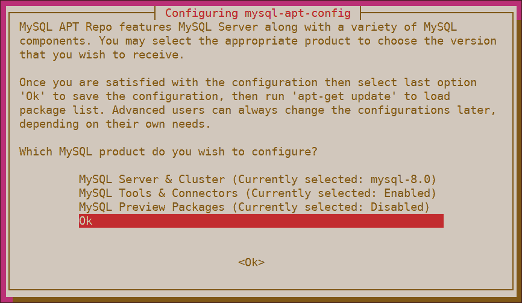
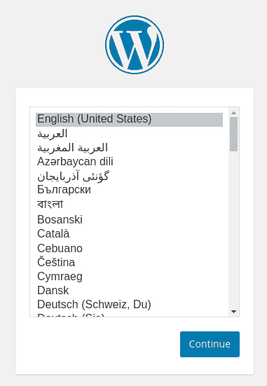
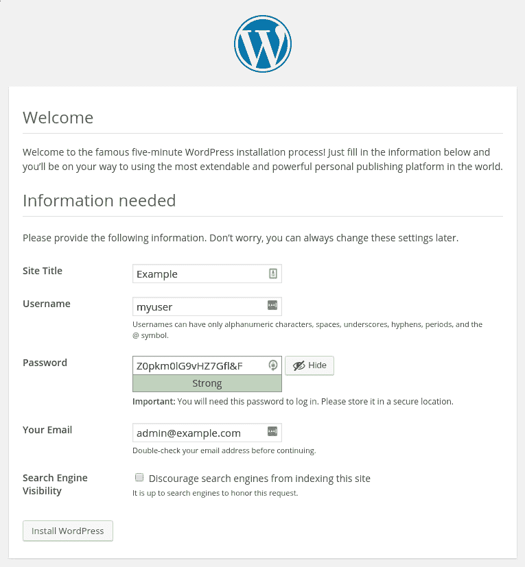
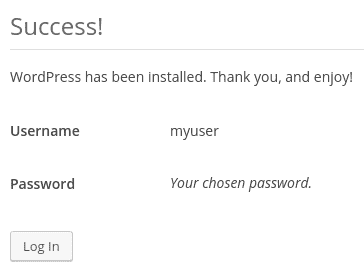
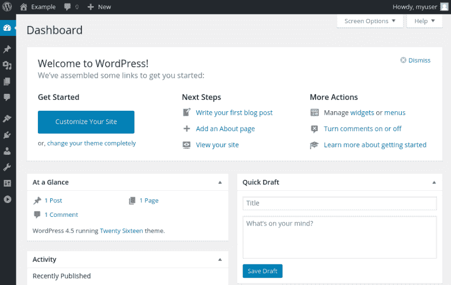

# 如何在 Ubuntu 18.04 上安装带有托管数据库的 WordPress

> 原文：<https://dev.to/digitalocean/how-to-install-wordpress-with-a-managed-database-on-ubuntu-18-04-3knc>

### 简介

WordPress 是互联网上最流行的内容管理系统。对于快速建立和运行网站来说，这是一个很好的选择，在初始设置之后，几乎所有的管理都可以通过 web 前端完成。

WordPress 被设计成从数据库后端获取内容，包括帖子、评论、用户资料和其他数据。随着网站的增长，必须满足越来越多的流量，它最终会超出最初的数据库。为了解决这个问题，可以通过将数据迁移到具有更多 RAM 或 CPU 的机器上来扩展数据库，但这是一个繁琐的过程，存在数据丢失或损坏的风险。这就是为什么一些 WordPress 开发者选择在[管理的数据库](https://www.digitalocean.com/community/tutorials/understanding-managed-databases)上建立他们的网站，这允许用户以低得多的数据丢失风险自动扩展他们的数据库。

在本指南中，我们将重点介绍如何使用托管的 [MySQL](https://www.mysql.com/) 数据库和 Ubuntu 18.04 服务器来设置一个 WordPress 实例。这需要你安装 [PHP](https://www.php.net/) 和 [Apache](https://httpd.apache.org/) 来通过网络提供内容。

## 先决条件

为了完成本教程，您需要:

*   **访问 Ubuntu 18.04 服务器**:这个服务器应该有一个非 **root** sudo 启用用户和一个配置的防火墙。你可以按照我们的 [Ubuntu 18.04 初始服务器设置指南](https://www.digitalocean.com/community/tutorials/initial-server-setup-with-ubuntu-18-04)进行设置。
*   **托管 MySQL 数据库**:要从 DigitalOcean 供应托管数据库，请参阅我们的[托管数据库产品文档](https://www.digitalocean.com/docs/databases/mysql/quickstart/#create-mysql-database-clusters)。请注意，本指南将在示例中引用 DigitalOcean 托管数据库，但此处提供的说明通常适用于其他云提供商的托管数据库。
*   **安装在你服务器上的 LAMP stack】:除了数据库，WordPress 还需要一个网络服务器和 PHP 才能正常运行。建立一个完整的 LAMP 栈(Linux、Apache、MySQL 和 PHP)可以满足所有这些需求。按照[本指南](https://www.digitalocean.com/community/tutorials/how-to-install-linux-apache-mysql-php-lamp-stack-ubuntu-18-04)安装和配置该软件。当你遵循这个指南时，确保你[设置了一个虚拟主机](https://www.digitalocean.com/community/tutorials/how-to-install-linux-apache-mysql-php-lamp-stack-ubuntu-18-04#step-4-%E2%80%94-setting-up-virtual-hosts-(recommended))指向你自己的域名。此外，请确保**跳过步骤 2** ，因为在您的机器上安装`mysql-server`会使您的托管数据库实例变得多余。**
*   **为您的站点实施 TLS/SSL 安全**:如果您有域名，保护您站点安全的最简单方法是使用 Let's Encrypt，它提供免费的可信证书。按照我们的[让我们为 Apache](https://www.digitalocean.com/community/tutorials/how-to-secure-apache-with-let-s-encrypt-on-ubuntu-18-04) 加密指南来设置它。请注意，这还需要您获得一个域名，并在您的服务器上设置 DNS 记录。遵循[数字海洋域名系统](https://www.digitalocean.com/docs/networking/dns/)的介绍，了解如何配置的细节。或者，如果你没有域名，你可以为你的网站使用自签名证书。

完成设置步骤后，以非 **root** 用户的身份登录服务器，然后继续下面的操作。

## 步骤 1–添加 MySQL 软件库并安装`mysql-client`

为了配置您的托管 MySQL 实例，您需要安装一个允许您从服务器访问数据库的客户端。这一步将引导您完成安装`mysql-client`包的过程。

在很多情况下，你可以用`apt`命令安装`mysql-client`，但是如果你使用的是默认的 Ubuntu 库，这将会安装该程序的 5.7 版本。为了访问 DigitalOcean 管理的 MySQL 数据库，您需要安装 8.0 或更高版本。为此，您必须在安装软件包之前首先添加 MySQL 软件存储库。

首先在你的网络浏览器中导航到[**MySQL APT 库**页面](https://dev.mysql.com/downloads/repo/apt/)。找到右下角的**下载**按钮，点击进入下一页。该页面将提示您登录或注册 Oracle web 帐户。你可以跳过这一步，转而寻找说**不，谢谢，开始下载**的链接。右键单击链接并选择**复制链接地址**(该选项可能有不同的措辞，取决于您的浏览器)。

现在您已经准备好下载文件了。在您的服务器上，移动到您可以写入的目录:

```
cd /tmp 
```

<svg width="20px" height="20px" viewBox="0 0 24 24" class="highlight-action crayons-icon highlight-action--fullscreen-on"><title>Enter fullscreen mode</title></svg> <svg width="20px" height="20px" viewBox="0 0 24 24" class="highlight-action crayons-icon highlight-action--fullscreen-off"><title>Exit fullscreen mode</title></svg>

使用`curl`下载文件，记住粘贴您刚刚复制的地址来代替下面命令中高亮显示的部分。您还需要向`curl`传递两个命令行标志。`-O`指示`curl`输出到文件，而不是标准输出。`L`标志使`curl`跟随 HTTP 重定向，这在这种情况下是必要的，因为在文件下载之前，您复制的地址实际上重定向到另一个位置:

```
curl -OL https://dev.mysql.com/get/mysql-apt-config_0.8.13-1_all.deb 
```

<svg width="20px" height="20px" viewBox="0 0 24 24" class="highlight-action crayons-icon highlight-action--fullscreen-on"><title>Enter fullscreen mode</title></svg> <svg width="20px" height="20px" viewBox="0 0 24 24" class="highlight-action crayons-icon highlight-action--fullscreen-off"><title>Exit fullscreen mode</title></svg>

该文件现在应该下载到您的当前目录中。列出要确认的文件:

```
ls 
```

<svg width="20px" height="20px" viewBox="0 0 24 24" class="highlight-action crayons-icon highlight-action--fullscreen-on"><title>Enter fullscreen mode</title></svg> <svg width="20px" height="20px" viewBox="0 0 24 24" class="highlight-action crayons-icon highlight-action--fullscreen-off"><title>Exit fullscreen mode</title></svg>

您将在输出中看到文件名:

```
mysql-apt-config_0.8.13-1_all.deb
. . . 
```

<svg width="20px" height="20px" viewBox="0 0 24 24" class="highlight-action crayons-icon highlight-action--fullscreen-on"><title>Enter fullscreen mode</title></svg> <svg width="20px" height="20px" viewBox="0 0 24 24" class="highlight-action crayons-icon highlight-action--fullscreen-off"><title>Exit fullscreen mode</title></svg>

现在，您可以将 MySQL APT 存储库添加到系统的存储库列表中。`dpkg`命令用于安装、移除和检查`.deb`软件包。下面的命令包含了`-i`标志，表示您想从指定的文件安装:

```
sudo dpkg -i mysql-apt-config* 
```

<svg width="20px" height="20px" viewBox="0 0 24 24" class="highlight-action crayons-icon highlight-action--fullscreen-on"><title>Enter fullscreen mode</title></svg> <svg width="20px" height="20px" viewBox="0 0 24 24" class="highlight-action crayons-icon highlight-action--fullscreen-off"><title>Exit fullscreen mode</title></svg>

在安装过程中，您将看到一个配置屏幕，您可以在其中指定您喜欢的 MySQL 版本，以及一个为其他 MySQL 相关工具安装存储库的选项。默认情况下会添加 MySQL 最新稳定版本的存储库信息，除此之外别无其他。这就是我们想要的，所以使用向下箭头导航到`Ok`菜单选项并点击`ENTER`。

[](https://res.cloudinary.com/practicaldev/image/fetch/s--vC1-eJJS--/c_limit%2Cf_auto%2Cfl_progressive%2Cq_auto%2Cw_880/https://assets.digitalocean.com/articles/pma_managed_db/dpkg_mysql_apt_config_alt2.png)

接下来，包将完成添加存储库。刷新您的`apt`包缓存以使新软件包可用:

```
sudo apt update 
```

<svg width="20px" height="20px" viewBox="0 0 24 24" class="highlight-action crayons-icon highlight-action--fullscreen-on"><title>Enter fullscreen mode</title></svg> <svg width="20px" height="20px" viewBox="0 0 24 24" class="highlight-action crayons-icon highlight-action--fullscreen-off"><title>Exit fullscreen mode</title></svg>

接下来，你可以清理一下你的系统，删除你下载的文件，因为你以后不再需要它了:

```
rm mysql-apt-config* 
```

<svg width="20px" height="20px" viewBox="0 0 24 24" class="highlight-action crayons-icon highlight-action--fullscreen-on"><title>Enter fullscreen mode</title></svg> <svg width="20px" height="20px" viewBox="0 0 24 24" class="highlight-action crayons-icon highlight-action--fullscreen-off"><title>Exit fullscreen mode</title></svg>

***注意:**如果您需要更新这些存储库的配置，只需运行以下命令来选择您的新选项:*

```
sudo dpkg-reconfigure mysql-apt-config 
```

<svg width="20px" height="20px" viewBox="0 0 24 24" class="highlight-action crayons-icon highlight-action--fullscreen-on"><title>Enter fullscreen mode</title></svg> <svg width="20px" height="20px" viewBox="0 0 24 24" class="highlight-action crayons-icon highlight-action--fullscreen-off"><title>Exit fullscreen mode</title></svg>

*选择新选项后，运行以下命令刷新包缓存:*

```
sudo apt update 
```

<svg width="20px" height="20px" viewBox="0 0 24 24" class="highlight-action crayons-icon highlight-action--fullscreen-on"><title>Enter fullscreen mode</title></svg> <svg width="20px" height="20px" viewBox="0 0 24 24" class="highlight-action crayons-icon highlight-action--fullscreen-off"><title>Exit fullscreen mode</title></svg>

现在您已经添加了 MySQL 存储库，您已经准备好安装实际的 MySQL 客户端软件了。用下面的`apt`命令来做这件事:

```
sudo apt install mysql-client 
```

<svg width="20px" height="20px" viewBox="0 0 24 24" class="highlight-action crayons-icon highlight-action--fullscreen-on"><title>Enter fullscreen mode</title></svg> <svg width="20px" height="20px" viewBox="0 0 24 24" class="highlight-action crayons-icon highlight-action--fullscreen-off"><title>Exit fullscreen mode</title></svg>

该命令完成后，检查软件版本号以确保您拥有最新版本:

```
mysql --version 
```

<svg width="20px" height="20px" viewBox="0 0 24 24" class="highlight-action crayons-icon highlight-action--fullscreen-on"><title>Enter fullscreen mode</title></svg> <svg width="20px" height="20px" viewBox="0 0 24 24" class="highlight-action crayons-icon highlight-action--fullscreen-off"><title>Exit fullscreen mode</title></svg>

```
mysql  Ver 8.0.17-cluster for Linux on x86_64 (MySQL Community Server - GPL) 
```

<svg width="20px" height="20px" viewBox="0 0 24 24" class="highlight-action crayons-icon highlight-action--fullscreen-on"><title>Enter fullscreen mode</title></svg> <svg width="20px" height="20px" viewBox="0 0 24 24" class="highlight-action crayons-icon highlight-action--fullscreen-off"><title>Exit fullscreen mode</title></svg>

现在你可以连接到你的托管数据库，并开始准备它与 WordPress 一起工作。

## 第二步——为 WordPress 创建一个 MySQL 数据库和用户

WordPress 使用 MySQL 来管理和存储网站和用户信息。假设您已经完成了所有的[必备教程](#prerequisites)，那么您就已经提供了一个托管 MySQL 实例。在这里，我们将为 WordPress 创建一个数据库和一个用户。

大多数托管数据库提供者提供一个 [*统一资源标识符*](https://en.wikipedia.org/wiki/Uniform_Resource_Identifier) (URI)用于连接数据库实例。如果您使用的是 DigitalOcean 托管数据库，您可以在云控制面板中找到相关的连接信息。

首先，点击左侧边栏菜单中的**数据库**，选择你想要用于 WordPress 安装的 MySQL 数据库。向下滚动到**连接详细信息**部分，并复制**主机**字段中的链接。然后将这个链接粘贴到下面的命令中，用您刚刚复制的信息替换`host_uri`。同样，复制**端口**字段中的端口号——在 DigitalOcean 管理的数据库中将是`25060`——并用该数字替换`port`。此外，如果这是您第一次连接到托管数据库，并且您还没有创建自己的 MySQL 管理用户，请复制**用户名**字段中的值，并将其粘贴到命令中，替换`user` :

```
mysql -u user -p -h host_uri -P port 
```

<svg width="20px" height="20px" viewBox="0 0 24 24" class="highlight-action crayons-icon highlight-action--fullscreen-on"><title>Enter fullscreen mode</title></svg> <svg width="20px" height="20px" viewBox="0 0 24 24" class="highlight-action crayons-icon highlight-action--fullscreen-off"><title>Exit fullscreen mode</title></svg>

这个命令包括`-p`标志，它将提示您输入您指定的 MySQL 用户的密码。对于数字海洋管理数据库的默认 **doadmin** 用户，您可以通过点击**连接细节**部分中的**显示**链接来显示密码。出现提示时，将其复制并粘贴到您的终端中。

***注意:**如果您没有使用数字海洋管理的数据库，您的连接选项可能会有所不同。如果是这种情况，您应该查阅提供商的文档，以获得有关将第三方应用程序连接到数据库的说明。*

在 MySQL 提示符下，创建一个 WordPress 将控制的新数据库。你可以随便叫它什么，但是为了简单起见，我们在本指南中使用名称**。通过键入:
为 WordPress 创建数据库**

```
CREATE DATABASE wordpress DEFAULT CHARACTER SET utf8 COLLATE utf8_unicode_ci; 
```

<svg width="20px" height="20px" viewBox="0 0 24 24" class="highlight-action crayons-icon highlight-action--fullscreen-on"><title>Enter fullscreen mode</title></svg> <svg width="20px" height="20px" viewBox="0 0 24 24" class="highlight-action crayons-icon highlight-action--fullscreen-off"><title>Exit fullscreen mode</title></svg>

***注意:**每条 MySQL 语句都必须以分号(`;`)结尾。如果您遇到任何问题，请检查以确保这是存在的。*

接下来，创建一个新的 MySQL 用户帐户，专门用来操作新数据库。从管理和安全的角度来看，创建单一用途的数据库和帐户是一个好主意。在本指南中，我们将使用名称 **wordpressuser** ，但如果您愿意，可以随意更改。

运行下面的命令，但是用你的 Ubuntu 服务器的 IP 地址替换`your_server_ip`。但是要注意，这将限制 **wordpressuser** 只能从你的 LAMP 服务器连接；如果你计划从本地计算机管理 WordPress，你应该输入机器的 IP 地址。此外，为您的数据库用户选择一个强密码:

```
CREATE USER 'wordpressuser'@your_server_ip IDENTIFIED WITH mysql_native_password BY 'password'; 
```

<svg width="20px" height="20px" viewBox="0 0 24 24" class="highlight-action crayons-icon highlight-action--fullscreen-on"><title>Enter fullscreen mode</title></svg> <svg width="20px" height="20px" viewBox="0 0 24 24" class="highlight-action crayons-icon highlight-action--fullscreen-off"><title>Exit fullscreen mode</title></svg>

***注意**:如果你不知道你的服务器的公共 IP 地址是什么，有很多方法可以找到它。通常，这是您用来通过 SSH 连接到服务器的地址。*

*一种方法是使用`curl`实用程序联系外部方，告诉你*它*如何看到你的服务器。例如，您可以使用`curl`来联系像 ICanHazIP:*
这样的 IP 检查工具

```
curl http://icanhazip.com 
```

<svg width="20px" height="20px" viewBox="0 0 24 24" class="highlight-action crayons-icon highlight-action--fullscreen-on"><title>Enter fullscreen mode</title></svg> <svg width="20px" height="20px" viewBox="0 0 24 24" class="highlight-action crayons-icon highlight-action--fullscreen-off"><title>Exit fullscreen mode</title></svg>

这个命令将在输出中返回你的服务器的公共 IP 地址。

然后授予该用户对刚刚创建的数据库的访问权限。通过运行以下命令来完成此操作:

```
GRANT ALL ON wordpress.* TO 'wordpressuser'@your_server_ip; 
```

<svg width="20px" height="20px" viewBox="0 0 24 24" class="highlight-action crayons-icon highlight-action--fullscreen-on"><title>Enter fullscreen mode</title></svg> <svg width="20px" height="20px" viewBox="0 0 24 24" class="highlight-action crayons-icon highlight-action--fullscreen-off"><title>Exit fullscreen mode</title></svg>

现在你有了一个数据库和用户账户，每个都是专门为 WordPress 设计的。键入:
退出 MySQL

```
exit 
```

<svg width="20px" height="20px" viewBox="0 0 24 24" class="highlight-action crayons-icon highlight-action--fullscreen-on"><title>Enter fullscreen mode</title></svg> <svg width="20px" height="20px" viewBox="0 0 24 24" class="highlight-action crayons-icon highlight-action--fullscreen-off"><title>Exit fullscreen mode</title></svg>

这将负责配置您的托管 MySQL 数据库，使其与 WordPress 一起工作。在下一步中，您将安装一些 PHP 扩展，以便从 CMS 中获得更多的功能。

## 步骤 3–安装额外的 PHP 扩展

假设您遵循了[必备 LAMP stack 教程](https://www.digitalocean.com/community/tutorials/how-to-install-linux-apache-mysql-php-lamp-stack-ubuntu-18-04)，您将已经安装了一些扩展，旨在让 PHP 正确地与 MySQL 通信。WordPress 和它的许多插件利用额外的 PHP 扩展来增加额外的功能。

要下载并安装一些更流行的 PHP 扩展来与 WordPress 一起使用，运行下面的命令:

```
sudo apt install php-curl php-gd php-mbstring php-xml php-xmlrpc php-soap php-intl php-zip 
```

<svg width="20px" height="20px" viewBox="0 0 24 24" class="highlight-action crayons-icon highlight-action--fullscreen-on"><title>Enter fullscreen mode</title></svg> <svg width="20px" height="20px" viewBox="0 0 24 24" class="highlight-action crayons-icon highlight-action--fullscreen-off"><title>Exit fullscreen mode</title></svg>

***注意:**每个 WordPress 插件都有自己的一套需求。有些可能需要你安装额外的 PHP 包。检查你的插件文档，看看它需要哪些扩展。如果它们可用，可以用`apt`安装，如上所示。*

在下一节中，您将重启 Apache 来加载这些新的扩展。但是，如果您要回到这里安装额外的插件，您现在可以通过键入:
来重新启动 Apache

```
sudo systemctl restart apache2 
```

<svg width="20px" height="20px" viewBox="0 0 24 24" class="highlight-action crayons-icon highlight-action--fullscreen-on"><title>Enter fullscreen mode</title></svg> <svg width="20px" height="20px" viewBox="0 0 24 24" class="highlight-action crayons-icon highlight-action--fullscreen-off"><title>Exit fullscreen mode</title></svg>

否则，继续执行步骤 4。

## 步骤 4–调整 Apache 的配置，以考虑到。htaccess 覆盖和重写

为了让 Apache 能够正确地服务于你的 WordPress 安装，你必须对你的 Apache 配置做一些小的调整。

如果您遵循了先决条件教程，那么您应该已经在`/etc/apache2/sites-available/`目录中有了站点的配置文件。这里我们将使用`/etc/apache2/sites-available/your_domain.conf`、**作为例子，但是您应该在适当的地方替换配置文件的路径**。

此外，在这个 WordPress 安装示例中，我们将使用`/var/www/your_domain`作为根目录。**您应该使用您自己的配置中指定的 web 根目录**。

***注意:**你可能正在使用`000-default.conf`默认配置(用`/var/www/html`作为你的 web 根)。如果你只打算在这个服务器上托管一个网站，这是很好的选择。如果没有，最好将必要的配置分成逻辑块，每个站点一个文件。*

目前，禁止使用`.htaccess`文件。WordPress 和许多 WordPress 插件广泛使用这些文件在目录内调整 web 服务器的行为。

打开您网站的 Apache 配置文件:

```
sudo nano /etc/apache2/sites-available/your_domain.conf 
```

<svg width="20px" height="20px" viewBox="0 0 24 24" class="highlight-action crayons-icon highlight-action--fullscreen-on"><title>Enter fullscreen mode</title></svg> <svg width="20px" height="20px" viewBox="0 0 24 24" class="highlight-action crayons-icon highlight-action--fullscreen-off"><title>Exit fullscreen mode</title></svg>

要允许`.htaccess`文件，您需要在指向您的文档根的`Directory`块中设置`AllowOverride`指令。在配置文件的`VirtualHost`块中添加以下文本块，确保使用正确的 web 根目录:

```
<Directory /var/www/your_domain>
    AllowOverride All
</Directory> 
```

<svg width="20px" height="20px" viewBox="0 0 24 24" class="highlight-action crayons-icon highlight-action--fullscreen-on"><title>Enter fullscreen mode</title></svg> <svg width="20px" height="20px" viewBox="0 0 24 24" class="highlight-action crayons-icon highlight-action--fullscreen-off"><title>Exit fullscreen mode</title></svg>

完成后，保存并关闭文件。

接下来，启用`mod_rewrite`，这样你就可以使用 WordPress permalink 特性:

```
sudo a2enmod rewrite 
```

<svg width="20px" height="20px" viewBox="0 0 24 24" class="highlight-action crayons-icon highlight-action--fullscreen-on"><title>Enter fullscreen mode</title></svg> <svg width="20px" height="20px" viewBox="0 0 24 24" class="highlight-action crayons-icon highlight-action--fullscreen-off"><title>Exit fullscreen mode</title></svg>

在实现您刚才所做的更改之前，检查以确保您的配置文件中没有任何语法错误:

```
sudo apache2ctl configtest 
```

<svg width="20px" height="20px" viewBox="0 0 24 24" class="highlight-action crayons-icon highlight-action--fullscreen-on"><title>Enter fullscreen mode</title></svg> <svg width="20px" height="20px" viewBox="0 0 24 24" class="highlight-action crayons-icon highlight-action--fullscreen-off"><title>Exit fullscreen mode</title></svg>

输出可能会有类似这样的消息:

```
AH00558: apache2: Could not reliably determine the server's fully qualified domain name, using 127.0.1.1\. Set the 'ServerName' directive globally to suppress this message
Syntax OK 
```

<svg width="20px" height="20px" viewBox="0 0 24 24" class="highlight-action crayons-icon highlight-action--fullscreen-on"><title>Enter fullscreen mode</title></svg> <svg width="20px" height="20px" viewBox="0 0 24 24" class="highlight-action crayons-icon highlight-action--fullscreen-off"><title>Exit fullscreen mode</title></svg>

如果您希望取消第一行，只需在主(全局)Apache 配置文件的`/etc/apache2/apache2.conf`处添加一个`ServerName`指令。`ServerName`可以是你的服务器的域名或 IP 地址。然而，这只是一个信息；这不会影响你网站的功能，只要输出包含`Syntax OK`，你就可以继续了。

重启 Apache 以实现更改:

```
sudo systemctl restart apache2 
```

<svg width="20px" height="20px" viewBox="0 0 24 24" class="highlight-action crayons-icon highlight-action--fullscreen-on"><title>Enter fullscreen mode</title></svg> <svg width="20px" height="20px" viewBox="0 0 24 24" class="highlight-action crayons-icon highlight-action--fullscreen-off"><title>Exit fullscreen mode</title></svg>

这样，你就可以下载并设置 WordPress 本身了。

## 第五步——下载 WordPress

现在你的服务器软件已经配置好了，你可以安装和配置 WordPress 了。出于安全原因，总是建议从他们的网站获取 WordPress 的最新版本。

首先，导航到一个可写目录。`/tmp`将用于本步骤:

```
cd /tmp 
```

<svg width="20px" height="20px" viewBox="0 0 24 24" class="highlight-action crayons-icon highlight-action--fullscreen-on"><title>Enter fullscreen mode</title></svg> <svg width="20px" height="20px" viewBox="0 0 24 24" class="highlight-action crayons-icon highlight-action--fullscreen-off"><title>Exit fullscreen mode</title></svg>

然后通过键入:
下载压缩版本

```
curl -O https://wordpress.org/latest.tar.gz 
```

<svg width="20px" height="20px" viewBox="0 0 24 24" class="highlight-action crayons-icon highlight-action--fullscreen-on"><title>Enter fullscreen mode</title></svg> <svg width="20px" height="20px" viewBox="0 0 24 24" class="highlight-action crayons-icon highlight-action--fullscreen-off"><title>Exit fullscreen mode</title></svg>

解压压缩文件，创建 WordPress 目录结构:

```
tar xzvf latest.tar.gz 
```

<svg width="20px" height="20px" viewBox="0 0 24 24" class="highlight-action crayons-icon highlight-action--fullscreen-on"><title>Enter fullscreen mode</title></svg> <svg width="20px" height="20px" viewBox="0 0 24 24" class="highlight-action crayons-icon highlight-action--fullscreen-off"><title>Exit fullscreen mode</title></svg>

您将暂时将这些文件移动到您的文档根目录中。在这样做之前，添加一个虚拟的`.htaccess`文件，以便 WordPress 以后可以使用。

通过键入
创建文件

```
touch /tmp/wordpress/.htaccess 
```

<svg width="20px" height="20px" viewBox="0 0 24 24" class="highlight-action crayons-icon highlight-action--fullscreen-on"><title>Enter fullscreen mode</title></svg> <svg width="20px" height="20px" viewBox="0 0 24 24" class="highlight-action crayons-icon highlight-action--fullscreen-off"><title>Exit fullscreen mode</title></svg>

同样，将示例配置文件复制到 WordPress 实际读取的文件名:

```
cp /tmp/wordpress/wp-config-sample.php /tmp/wordpress/wp-config.php 
```

<svg width="20px" height="20px" viewBox="0 0 24 24" class="highlight-action crayons-icon highlight-action--fullscreen-on"><title>Enter fullscreen mode</title></svg> <svg width="20px" height="20px" viewBox="0 0 24 24" class="highlight-action crayons-icon highlight-action--fullscreen-off"><title>Exit fullscreen mode</title></svg>

创建一个`upgrade`目录，这样 WordPress 就不会在软件更新后尝试自己做这件事时遇到权限问题:

```
mkdir /tmp/wordpress/wp-content/upgrade 
```

<svg width="20px" height="20px" viewBox="0 0 24 24" class="highlight-action crayons-icon highlight-action--fullscreen-on"><title>Enter fullscreen mode</title></svg> <svg width="20px" height="20px" viewBox="0 0 24 24" class="highlight-action crayons-icon highlight-action--fullscreen-off"><title>Exit fullscreen mode</title></svg>

然后将目录的全部内容复制到您的文档根目录中。下面的命令在源目录的末尾使用一个句点来表示目录中的所有内容都应该被复制，包括隐藏文件(就像您刚刚创建的`.htaccess`文件):

```
sudo cp -a /tmp/wordpress/. /var/www/your_domain 
```

<svg width="20px" height="20px" viewBox="0 0 24 24" class="highlight-action crayons-icon highlight-action--fullscreen-on"><title>Enter fullscreen mode</title></svg> <svg width="20px" height="20px" viewBox="0 0 24 24" class="highlight-action crayons-icon highlight-action--fullscreen-off"><title>Exit fullscreen mode</title></svg>

它负责将 WordPress 下载到你的服务器上。尽管如此，在这一点上，你仍然不能在你的浏览器中访问 WordPress 设置界面。要解决这个问题，你需要对你的服务器的 WordPress 配置做一些改变。

## 步骤 6–配置 WordPress 目录

在进行基于网络的 WordPress 设置之前，你需要调整你的 WordPress 目录中的一些项目。一个重要的配置更改涉及设置合理的文件权限和所有权。

首先将所有文件的所有权交给 **www-data** 用户和组。这是 Apache web 服务器在 Debian 和 Ubuntu 系统上运行的用户，Apache 需要能够读写 WordPress 文件，以便为网站提供服务并执行自动更新。

用`chown` :
更新你的网络根目录的所有权

```
sudo chown -R www-data:www-data /var/www/your_domain 
```

<svg width="20px" height="20px" viewBox="0 0 24 24" class="highlight-action crayons-icon highlight-action--fullscreen-on"><title>Enter fullscreen mode</title></svg> <svg width="20px" height="20px" viewBox="0 0 24 24" class="highlight-action crayons-icon highlight-action--fullscreen-off"><title>Exit fullscreen mode</title></svg>

接下来运行下面两个`find`命令来设置 WordPress 目录和文件的正确权限:

```
sudo find /var/www/your_domain/ -type d -exec chmod 750 {} \;
sudo find /var/www/your_domain/ -type f -exec chmod 640 {} \; 
```

<svg width="20px" height="20px" viewBox="0 0 24 24" class="highlight-action crayons-icon highlight-action--fullscreen-on"><title>Enter fullscreen mode</title></svg> <svg width="20px" height="20px" viewBox="0 0 24 24" class="highlight-action crayons-icon highlight-action--fullscreen-off"><title>Exit fullscreen mode</title></svg>

这些应该是一个合理的权限集。但是要注意，一些插件和程序可能需要额外的更新。

现在，您需要对主要的 WordPress 配置文件进行一些修改。

当您打开该文件时，首先要做的是替换一些密钥，为您的安装提供安全性。WordPress 为这些值提供了一个安全的生成器，这样你就不必自己想出好的值。这些只在内部使用，所以在这里使用复杂、安全的值不会损害可用性。

要从 WordPress 秘密密钥生成器获取安全值，运行下面的命令:

```
curl -s https://api.wordpress.org/secret-key/1.1/salt/ 
```

<svg width="20px" height="20px" viewBox="0 0 24 24" class="highlight-action crayons-icon highlight-action--fullscreen-on"><title>Enter fullscreen mode</title></svg> <svg width="20px" height="20px" viewBox="0 0 24 24" class="highlight-action crayons-icon highlight-action--fullscreen-off"><title>Exit fullscreen mode</title></svg>

您将得到如下所示的唯一值:

***警告！**每次都要求唯一的值，这很重要。不要**而不是**复制这里显示的值！*

```
define('AUTH_KEY',         '1jl/vqfs<XhdXoAPz9 DO NOT COPY THESE VALUES c_j{iwqD^<+c9.k<J@4H');
define('SECURE_AUTH_KEY',  'E2N-h2]Dcvp+aS/p7X DO NOT COPY THESE VALUES {Ka(f;rv?Pxf})CgLi-3');
define('LOGGED_IN_KEY',    'W(50,{W^,OPB%PB<JF DO NOT COPY THESE VALUES 2;y&,2m%3]R6DUth[;88');
define('NONCE_KEY',        'll,4UC)7ua+8<!4VM+ DO NOT COPY THESE VALUES #`DXF+[$atzM7 o^-C7g');
define('AUTH_SALT',        'koMrurzOA+|L_lG}kf DO NOT COPY THESE VALUES  07VC*Lj*lD&?3w!BT#-');
define('SECURE_AUTH_SALT', 'p32*p,]z%LZ+pAu:VY DO NOT COPY THESE VALUES C-?y+K0DK_+F|0h{!_xY');
define('LOGGED_IN_SALT',   'i^/G2W7!-1H2OQ+t$3 DO NOT COPY THESE VALUES t6**bRVFSD[Hi])-qS`|');
define('NONCE_SALT',       'Q6]U:K?j4L%Z]}h^q7 DO NOT COPY THESE VALUES 1% ^qUswWgn+6&xqHN&%'); 
```

<svg width="20px" height="20px" viewBox="0 0 24 24" class="highlight-action crayons-icon highlight-action--fullscreen-on"><title>Enter fullscreen mode</title></svg> <svg width="20px" height="20px" viewBox="0 0 24 24" class="highlight-action crayons-icon highlight-action--fullscreen-off"><title>Exit fullscreen mode</title></svg>

这些配置行可以直接粘贴到配置文件中来设置安全密钥。复制您现在收到的输出。

然后，打开 WordPress 配置文件:

```
sudo nano /var/www/your_domain/wp-config.php 
```

<svg width="20px" height="20px" viewBox="0 0 24 24" class="highlight-action crayons-icon highlight-action--fullscreen-on"><title>Enter fullscreen mode</title></svg> <svg width="20px" height="20px" viewBox="0 0 24 24" class="highlight-action crayons-icon highlight-action--fullscreen-off"><title>Exit fullscreen mode</title></svg>

找到包含这些设置的虚拟值的部分。它看起来会像这样:

```
. . .

define('AUTH_KEY',         'put your unique phrase here');
define('SECURE_AUTH_KEY',  'put your unique phrase here');
define('LOGGED_IN_KEY',    'put your unique phrase here');
define('NONCE_KEY',        'put your unique phrase here');
define('AUTH_SALT',        'put your unique phrase here');
define('SECURE_AUTH_SALT', 'put your unique phrase here');
define('LOGGED_IN_SALT',   'put your unique phrase here');
define('NONCE_SALT',       'put your unique phrase here');

. . . 
```

<svg width="20px" height="20px" viewBox="0 0 24 24" class="highlight-action crayons-icon highlight-action--fullscreen-on"><title>Enter fullscreen mode</title></svg> <svg width="20px" height="20px" viewBox="0 0 24 24" class="highlight-action crayons-icon highlight-action--fullscreen-off"><title>Exit fullscreen mode</title></svg>

删除这些行并粘贴从命令行复制的值:

```
. . .

define('AUTH_KEY',         'VALUES COPIED FROM THE COMMAND LINE');
define('SECURE_AUTH_KEY',  'VALUES COPIED FROM THE COMMAND LINE');
define('LOGGED_IN_KEY',    'VALUES COPIED FROM THE COMMAND LINE');
define('NONCE_KEY',        'VALUES COPIED FROM THE COMMAND LINE');
define('AUTH_SALT',        'VALUES COPIED FROM THE COMMAND LINE');
define('SECURE_AUTH_SALT', 'VALUES COPIED FROM THE COMMAND LINE');
define('LOGGED_IN_SALT',   'VALUES COPIED FROM THE COMMAND LINE');
define('NONCE_SALT',       'VALUES COPIED FROM THE COMMAND LINE');

. . . 
```

<svg width="20px" height="20px" viewBox="0 0 24 24" class="highlight-action crayons-icon highlight-action--fullscreen-on"><title>Enter fullscreen mode</title></svg> <svg width="20px" height="20px" viewBox="0 0 24 24" class="highlight-action crayons-icon highlight-action--fullscreen-off"><title>Exit fullscreen mode</title></svg>

接下来，您需要修改文件开头的一些数据库连接设置。首先，更新`'DB_NAME'`、`'DB_USER'`和`'DB_PASSWORD'`字段，指向您在 MySQL:
中配置的数据库名称、数据库用户和相关密码

```
. . .
/** The name of the database for WordPress */
define('DB_NAME', 'wordpress');

/** MySQL database username */
define('DB_USER', 'wordpressuser');

/** MySQL database password */
define('DB_PASSWORD', 'password');

. . . 
```

<svg width="20px" height="20px" viewBox="0 0 24 24" class="highlight-action crayons-icon highlight-action--fullscreen-on"><title>Enter fullscreen mode</title></svg> <svg width="20px" height="20px" viewBox="0 0 24 24" class="highlight-action crayons-icon highlight-action--fullscreen-off"><title>Exit fullscreen mode</title></svg>

您还需要用托管数据库的主机替换`'DB_HOST'`字段中的`localhost`。此外，将冒号(`:`)和数据库的端口号附加到主机:

```
. . .

/** MySQL hostname */
define( 'DB_HOST', 'managed_database_host:managed_database_port' );

. . . 
```

<svg width="20px" height="20px" viewBox="0 0 24 24" class="highlight-action crayons-icon highlight-action--fullscreen-on"><title>Enter fullscreen mode</title></svg> <svg width="20px" height="20px" viewBox="0 0 24 24" class="highlight-action crayons-icon highlight-action--fullscreen-off"><title>Exit fullscreen mode</title></svg>

您需要做的最后一个更改是设置 WordPress 将用来写入文件系统的方法。因为您已经给了 web 服务器在需要的地方写的权限，所以您可以显式地将文件系统方法设置为`direct` port。如果没有用你当前的设置来设置它，当你执行某些操作时，会导致 WordPress 提示 FTP 证书。

该设置可以添加到数据库连接设置的下面，或者文件中的任何地方:

```
. . .

define('FS_METHOD', 'direct');
. . . 
```

<svg width="20px" height="20px" viewBox="0 0 24 24" class="highlight-action crayons-icon highlight-action--fullscreen-on"><title>Enter fullscreen mode</title></svg> <svg width="20px" height="20px" viewBox="0 0 24 24" class="highlight-action crayons-icon highlight-action--fullscreen-off"><title>Exit fullscreen mode</title></svg>

完成后，保存并关闭文件。

完成这些修改后，你就可以完成在浏览器中安装 WordPress 的过程了。但是，我们建议您完成另外一个步骤，为您的配置增加一层额外的安全性。

## 步骤 7—(推荐)配置 WordPress 通过 TLS/SSL 与 MySQL 通信

此时，您的 WordPress 安装正在与您的托管 MySQL 数据库通信。然而，不能保证两台机器之间的数据传输是安全的。在这一步，我们将配置 WordPress 通过 TLS/SSL 连接与您的 MySQL 实例通信，以确保两台机器之间的安全通信。

为此，您需要托管数据库的 CA 证书。对于 DigitalOcean 管理的数据库，您可以通过再次导航到您的**控制面板**中的**数据库**选项卡来找到它。点击你的数据库，找到**连接详情**部分。会有一个按钮显示**下载 CA 证书**。单击此按钮将证书下载到您的本地计算机。

然后把这个文件传输到你的 WordPress 服务器上。如果你的本地机器运行的是 Linux 或者 macOS，你可以使用类似`scp` :
这样的工具

```
scp /path/to/file/ca-certificate.crt sammy@your_server_ip:/tmp 
```

<svg width="20px" height="20px" viewBox="0 0 24 24" class="highlight-action crayons-icon highlight-action--fullscreen-on"><title>Enter fullscreen mode</title></svg> <svg width="20px" height="20px" viewBox="0 0 24 24" class="highlight-action crayons-icon highlight-action--fullscreen-off"><title>Exit fullscreen mode</title></svg>

如果您的本地机器运行的是 Windows，您可以使用类似于 [WinSCP](https://winscp.net/eng/index.php) 的替代工具。

一旦 CA 证书在你的服务器上，把它移到`/user/local/share/ca-certificates/`目录，Ubuntu 的可信证书库:

```
sudo mv /tmp/ca-certificate.crt /usr/local/share/ca-certificates/ 
```

<svg width="20px" height="20px" viewBox="0 0 24 24" class="highlight-action crayons-icon highlight-action--fullscreen-on"><title>Enter fullscreen mode</title></svg> <svg width="20px" height="20px" viewBox="0 0 24 24" class="highlight-action crayons-icon highlight-action--fullscreen-off"><title>Exit fullscreen mode</title></svg>

接下来，运行`update-ca-certificates`命令。这个程序在`/usr/local/share/ca-certificates`中寻找证书，将任何新的证书添加到`/etc/ssl/certs/`目录中，并根据其内容生成可信 SSL 证书列表:

```
sudo update-ca-certificates 
```

<svg width="20px" height="20px" viewBox="0 0 24 24" class="highlight-action crayons-icon highlight-action--fullscreen-on"><title>Enter fullscreen mode</title></svg> <svg width="20px" height="20px" viewBox="0 0 24 24" class="highlight-action crayons-icon highlight-action--fullscreen-off"><title>Exit fullscreen mode</title></svg>

然后，重新打开您的`wp-config.php`文件:

```
nano /var/www/your_domain/wp-config.php 
```

<svg width="20px" height="20px" viewBox="0 0 24 24" class="highlight-action crayons-icon highlight-action--fullscreen-on"><title>Enter fullscreen mode</title></svg> <svg width="20px" height="20px" viewBox="0 0 24 24" class="highlight-action crayons-icon highlight-action--fullscreen-off"><title>Exit fullscreen mode</title></svg>

在文件的某个地方，添加下面一行:

```
. . .
define('MYSQL_CLIENT_FLAGS', MYSQLI_CLIENT_SSL);
. . . 
```

<svg width="20px" height="20px" viewBox="0 0 24 24" class="highlight-action crayons-icon highlight-action--fullscreen-on"><title>Enter fullscreen mode</title></svg> <svg width="20px" height="20px" viewBox="0 0 24 24" class="highlight-action crayons-icon highlight-action--fullscreen-off"><title>Exit fullscreen mode</title></svg>

保存并关闭文件。

接下来，WordPress 将安全地与你管理的 MySQL 数据库通信。

## 步骤 8–通过 Web 界面完成安装

现在服务器配置已经完成，您可以通过 WordPress web 界面完成安装。

在 web 浏览器中，导航到服务器的域名或公共 IP 地址:

```
https://server_domain_or_IP 
```

<svg width="20px" height="20px" viewBox="0 0 24 24" class="highlight-action crayons-icon highlight-action--fullscreen-on"><title>Enter fullscreen mode</title></svg> <svg width="20px" height="20px" viewBox="0 0 24 24" class="highlight-action crayons-icon highlight-action--fullscreen-off"><title>Exit fullscreen mode</title></svg>

假设你的 WordPress 或 Apache 配置没有任何错误，你会看到 WordPress 语言选择页面。选择您想使用的语言:

[](https://res.cloudinary.com/practicaldev/image/fetch/s--sKtl2-t4--/c_limit%2Cf_auto%2Cfl_progressive%2Cq_auto%2Cw_880/https://assets.digitalocean.com/articles/wordpress_lamp_1604/language_selection.png)

选择您的语言后，您将看到主设置页面。

为你的 WordPress 站点选择一个名字，并选择一个用户名(出于安全考虑，建议不要选择像“admin”这样的名字)。强密码是自动生成的。保存此密码或输入一个替代的强密码。

输入您的电子邮件地址，并选择您是否希望阻止搜索引擎索引您的网站:

[](https://res.cloudinary.com/practicaldev/image/fetch/s--iqgjofbm--/c_limit%2Cf_auto%2Cfl_progressive%2Cq_auto%2Cw_880/https://assets.digitalocean.com/articles/wordpress_lamp_1604/setup_installation.png)

当您单击“前进”时，将转到提示您登录的页面:

[](https://res.cloudinary.com/practicaldev/image/fetch/s--CS149pAR--/c_limit%2Cf_auto%2Cfl_progressive%2Cq_auto%2Cw_880/https://assets.digitalocean.com/articles/wordpress_lamp_1604/login_prompt.png)

一旦你登录，你将被带到 WordPress 管理仪表板:

[](https://res.cloudinary.com/practicaldev/image/fetch/s--f5GmRZrA--/c_limit%2Cf_auto%2Cfl_progressive%2Cq_auto%2Cw_880/https://assets.digitalocean.com/articles/wordpress_lamp_1604/admin_screen.png)

从这里，你可以开始定制你的新 WordPress 站点并开始发布内容。如果这是你第一次使用 WordPress，我们鼓励你探索一下界面来熟悉你的新 CMS。

***警告:**根据您的托管数据库提供商，您可能需要调整数据库正在使用的 *SQL 模式*。SQL 模式定义了 MySQL 如何验证数据及其支持的语法，某些 SQL 模式会对 WordPress 的性能产生负面影响。例如，DigitalOcean 管理的 MySQL 数据库上的默认 SQL 模式启用了 MySQL 的 [*严格模式*](https://dev.mysql.com/doc/refman/8.0/en/sql-mode.html#sql-mode-strict) ，这可能导致 WordPress 数据库中的错误。*

有许多 SQL 模式会影响 WordPress 的性能，也有许多方法可以禁用严格模式，所以你应该查看主题为的官方 MySQL 文档来决定哪些设置最适合你的需要。如果您使用的是 DigitalOcean 托管数据库，请参见我们的[托管 MySQL 产品文档](https://www.digitalocean.com/docs/databases/mysql/how-to/set-sql-mode)，了解如何更改默认 SQL 模式设置的详细信息。

## 结论

通过完成本指南，您将已经安装了 WordPress，并且可以在您的服务器上使用。此外，你的 WordPress 安装动态地从你管理的 MySQL 数据库中提取文章、页面和其他内容。

一些常见的后续步骤是为你的文章选择永久链接设置。这个设置可以在**设置** > **永久链接**下找到。您也可以在**外观** > **主题**中选择一个新主题。一旦你开始加载一些内容到你的站点，你也可以[配置一个 CDN 来加速你站点的资产交付](https://www.digitalocean.com/community/tutorials/how-to-speed-up-wordpress-asset-delivery-using-digitalocean-spaces-cdn)。