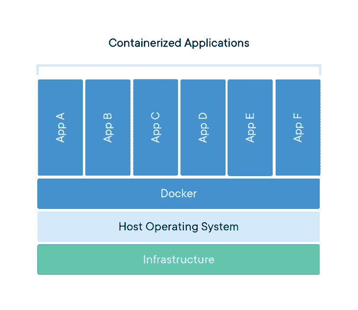
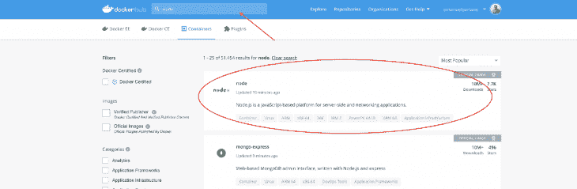

# 面向前端开发者的 Docker

> 原文：<https://dev.to/bnevilleoneill/docker-for-front-end-developers-ldi>

**作者:[伊曼纽尔·苏里诺](https://blog.logrocket.com/author/emanuelsuriano/)** ✏️

自从 Docker 在 2013 年发布以来，容器的使用一直在增加，现在它已经成为大多数科技公司的一部分。可悲的是，说到前端开发，这个概念很少被触及。

所以前端开发者要和容器化交互的时候，往往会纠结很多。这正是几周前发生在我身上的事情，当时我不得不与公司中一些我通常不处理的服务进行交互。

这项任务本身很容易，但由于缺乏集装箱化工作的知识，完成这项任务几乎花了整整两天的时间。经过这次经历，我现在在处理容器和 CI 管道时感到更加安全，但整个过程相当痛苦和漫长。

这篇文章的目标是教你 Docker 的核心概念以及如何操作容器，这样你就可以专注于你喜欢的任务！

[](https://logrocket.com/signup/)

## 码头工人的什么和为什么[🤔](https://s.w.oimg/core/emoji/12.0.0-1/72x72/1f914.png)

让我们从用简单易懂的语言定义 Docker 开始(在 Docker 课程的帮助下):

> Docker 是一个允许开发者、系统管理员等。轻松地将他们的应用程序部署在沙箱(称为容器)中，以便在主机操作系统上运行。

使用容器的主要好处是，它们打包了代码及其所有依赖项，因此应用程序可以快速可靠地运行，而不管计算环境如何。

这种解耦允许基于容器的应用程序被容易且一致地部署，而不管应用程序将被部署在哪里:云服务器、内部公司服务器或您的个人计算机。

[](https://res.cloudinary.com/practicaldev/image/fetch/s--fwmPAyFf--/c_limit%2Cf_auto%2Cfl_progressive%2Cq_auto%2Cw_880/https://i1.wp.com/blog.logrocket.com/wp-content/uploads/2019/08/containerized-apps-visual.png%3Fresize%3D730%252C632%26ssl%3D1)

## 术语[📖](https://s.w.oimg/core/emoji/12.0.0-1/72x72/1f4d6.png)

在 Docker 生态系统中，你需要知道几个关键定义，才能理解他们到底在谈论什么:

*   应用程序的蓝图，它构成了容器的基础。它是一个轻量级、独立、可执行的软件包，包括运行应用程序所需的一切，即代码、运行时、系统工具、系统库和设置。
*   `Containers`:这些由启动容器时提供的映像和任何附加配置选项定义，包括但不限于网络连接和存储选项。
*   `Docker daemon`:运行在主机上的后台服务，管理 Docker 容器的构建、运行和分发。守护进程是在操作系统中运行的进程，客户端与之对话。
*   `Docker client`:允许用户与 Docker 守护进程交互的 CLI。它也可以是其他形式的客户端，比如提供 UI 界面的客户端。
*   `Docker Hub`:图像注册表。您可以将注册表视为所有可用 Docker 图像的目录。如果需要，您可以托管自己的 Docker 注册表，并从那里提取映像。

## ‘您好，世界！’演示[🌎](https://s.w.oimg/core/emoji/12.0.0-1/72x72/1f30e.png)

为了充分理解上述术语，让我们设置 Docker 并运行一个示例。

第一步是在你的机器上安装 Docker。为此，进入官方 [Docker 页面](https://docs.docker.com/ee/desktop/)，选择你当前的操作系统，并开始下载。你可能需要创建一个账户，但是不要担心，他们不会在这些步骤中向你收费。

安装 Docker 后，打开你的终端，执行`docker run hello-world`。您应该会看到以下消息:

```
➜ ~ docker run hello-world
Unable to find image 'hello-world:latest' locally
latest: Pulling from library/hello-world
1b930d010525: Pull complete
Digest: sha256:6540fc08ee6e6b7b63468dc3317e3303aae178cb8a45ed3123180328bcc1d20f
Status: Downloaded newer image for hello-world:latest

Hello from Docker!
This message shows that your installation appears to be working correctly. 
```

<svg width="20px" height="20px" viewBox="0 0 24 24" class="highlight-action crayons-icon highlight-action--fullscreen-on"><title>Enter fullscreen mode</title></svg> <svg width="20px" height="20px" viewBox="0 0 24 24" class="highlight-action crayons-icon highlight-action--fullscreen-off"><title>Exit fullscreen mode</title></svg>

让我们看看幕后到底发生了什么:

1.  `docker`是使您能够与 Docker 客户端通信的命令。
2.  当您运行`docker run [name-of-image]`时，Docker 守护进程将首先检查您的计算机上是否有该映像的本地副本。否则，它将从 Docker Hub 中提取图像。在这种情况下，图像的名称是`hello-world`。
3.  一旦您有了图像的本地副本，Docker 守护程序将从它创建一个容器，这将产生消息`Hello from Docker!`
4.  Docker 守护进程然后将输出流式传输到 Docker 客户端，并将其发送到您的终端。

## Node.js 演示

“你好，世界！”Docker 演示既快速又简单，但事实是我们没有使用 Docker 的所有功能。让我们做一些更有趣的事情。让我们使用 Node.js 运行一个 Docker 容器。

所以，正如你可能猜到的，我们需要在 Docker 中建立一个节点环境。幸运的是，Docker 团队已经创建了一个惊人的市场，你可以在他们的公共 Docker Hub 中搜索 Docker 图片。要查找 Node.js 图片，你只需要在搜索栏中键入“Node”，你很可能会[找到这个](https://hub.docker.com/_/node)。

[](https://res.cloudinary.com/practicaldev/image/fetch/s--8MJ3dPSs--/c_limit%2Cf_auto%2Cfl_progressive%2Cq_auto%2Cw_880/https://i0.wp.com/blog.logrocket.com/wp-content/uploads/2019/08/docker-hub.png%3Fresize%3D730%252C239%26ssl%3D1)

所以第一步是从 Docker Hub 中拉出图像，如下所示:

```
➜ ~ docker pull node 
```

<svg width="20px" height="20px" viewBox="0 0 24 24" class="highlight-action crayons-icon highlight-action--fullscreen-on"><title>Enter fullscreen mode</title></svg> <svg width="20px" height="20px" viewBox="0 0 24 24" class="highlight-action crayons-icon highlight-action--fullscreen-off"><title>Exit fullscreen mode</title></svg>

然后你需要设置一个基本的节点 app。创建一个名为`node-test.js`的文件，让我们使用 [JSON 占位符](https://jsonplaceholder.typicode.com/)做一个简单的 HTTP 请求。下面的代码片段将获取一个 Todo 并打印标题:

```
const https = require('https');

https
  .get('https://jsonplaceholder.typicode.com/todos/1', response => {
    let todo = '';

    response.on('data', chunk => {
      todo += chunk;
    });

    response.on('end', () => {
      console.log(`The title is "${JSON.parse(todo).title}"`);
    });
  })
  .on('error', error => {
    console.error('Error: ' + error.message);
  }); 
```

<svg width="20px" height="20px" viewBox="0 0 24 24" class="highlight-action crayons-icon highlight-action--fullscreen-on"><title>Enter fullscreen mode</title></svg> <svg width="20px" height="20px" viewBox="0 0 24 24" class="highlight-action crayons-icon highlight-action--fullscreen-off"><title>Exit fullscreen mode</title></svg>

我想避免使用像`node-fetch`或`axios`这样的外部依赖关系，以便将示例的焦点放在节点上，而不是依赖关系管理器中。

让我们看看如何使用节点映像运行单个文件，并解释一下`docker run`标志:

```
➜ ~ docker run -it --rm --name my-running-script -v "$PWD":/usr/src/app -w /usr/src/app node node node-test.js 
```

<svg width="20px" height="20px" viewBox="0 0 24 24" class="highlight-action crayons-icon highlight-action--fullscreen-on"><title>Enter fullscreen mode</title></svg> <svg width="20px" height="20px" viewBox="0 0 24 24" class="highlight-action crayons-icon highlight-action--fullscreen-off"><title>Exit fullscreen mode</title></svg>

*   `-it`在`interactive`模式下运行容器，在这里你可以在容器内执行几个命令。
*   `--rm`执行完成后自动移除容器。
*   `--name [name]`为 Docker 守护进程中运行的进程提供一个名称。
*   在 Docker 中挂载一个本地目录，允许交换信息或访问当前系统的文件系统。*这是 Docker 我最喜欢的功能之一！*
*   `-w [docker-path]`设置工作目录(开始路线)。默认情况下，这是`/`。
*   `node`是要运行的图像的名称。它总是出现在所有的`docker run`标志之后。
*   `node node-test.js`是容器的说明。这些总是在图像名称之后。

运行前面命令的输出应该是:`The title is "delectus aut autem"`。

## React.js 演示 [⚛](https://s.w.oimg/core/emoji/12.0.0-1/72x72/269b.png)

既然这篇帖子关注的是前端开发者，那我们就在 Docker 中运行一个 React 应用吧！

让我们从一个基础项目开始。为此，我推荐使用`create-react-app` CLI，但是您可以使用手头的任何项目；过程是一样的。

```
➜ ~ npx create-react-app react-test
➜ ~ cd react-test
➜ ~ yarn start 
```

<svg width="20px" height="20px" viewBox="0 0 24 24" class="highlight-action crayons-icon highlight-action--fullscreen-on"><title>Enter fullscreen mode</title></svg> <svg width="20px" height="20px" viewBox="0 0 24 24" class="highlight-action crayons-icon highlight-action--fullscreen-off"><title>Exit fullscreen mode</title></svg>

你应该能看到`create-react-app`项目的主页。然后，让我们引入一个新的概念，`Dockerfile`。

从本质上来说，`Dockerfile`是一个简单的文本文件，包含如何构建 Docker 图像的说明。在这个文件中，您通常会指定您想要使用的图像，其中将包含哪些文件，以及在构建之前是否需要执行一些命令。

现在让我们在`react-test`项目的根目录下创建一个文件。将此命名为`Dockerfile`，并写下如下:

```
# Select the image to use
FROM node

## Install dependencies in the root of the Container
COPY package.json yarn.lock ./
ENV NODE_PATH=/node_modules ENV PATH=$PATH:/node_modules/.bin
RUN yarn

# Add project files to /app route in Container
ADD . /app

# Set working dir to /app
WORKDIR /app

# expose port 3000
EXPOSE 3000 
```

<svg width="20px" height="20px" viewBox="0 0 24 24" class="highlight-action crayons-icon highlight-action--fullscreen-on"><title>Enter fullscreen mode</title></svg> <svg width="20px" height="20px" viewBox="0 0 24 24" class="highlight-action crayons-icon highlight-action--fullscreen-off"><title>Exit fullscreen mode</title></svg>

当在`yarn`项目中工作时，建议将`node_modules`从`/app`中移除，并将其移动到 root。这是为了利用`yarn`提供的缓存。因此，您可以在 React 应用程序中自由地执行`rm -rf node_modules/`。

之后，您可以构建一个新的映像，它将一步一步地运行定义的命令。

```
➜ ~ docker image build -t react:test . 
```

<svg width="20px" height="20px" viewBox="0 0 24 24" class="highlight-action crayons-icon highlight-action--fullscreen-on"><title>Enter fullscreen mode</title></svg> <svg width="20px" height="20px" viewBox="0 0 24 24" class="highlight-action crayons-icon highlight-action--fullscreen-off"><title>Exit fullscreen mode</title></svg>

要检查 Docker 映像是否可用，可以运行`docker image ls`。

```
➜ ~ docker image ls
REPOSITORY TAG IMAGE ID CREATED SIZE
react test b530cde7aba1 50 minutes ago 1.18GB
hello-world latest fce289e99eb9 7 months ago 1.84kB 
```

<svg width="20px" height="20px" viewBox="0 0 24 24" class="highlight-action crayons-icon highlight-action--fullscreen-on"><title>Enter fullscreen mode</title></svg> <svg width="20px" height="20px" viewBox="0 0 24 24" class="highlight-action crayons-icon highlight-action--fullscreen-off"><title>Exit fullscreen mode</title></svg>

现在是时候使用您在前面的示例中使用的命令运行容器了:`docker run`。

```
➜ ~ docker run -it -p 3000:3000 react:test /bin/bash 
```

<svg width="20px" height="20px" viewBox="0 0 24 24" class="highlight-action crayons-icon highlight-action--fullscreen-on"><title>Enter fullscreen mode</title></svg> <svg width="20px" height="20px" viewBox="0 0 24 24" class="highlight-action crayons-icon highlight-action--fullscreen-off"><title>Exit fullscreen mode</title></svg>

注意`-it`标志，在运行命令后，它会在容器中给出提示。在这里，您可以运行与本地环境中相同的命令，例如`yarn start`或`yarn build`。

要退出容器，只需键入`exit`，但是记住，当你重新启动容器时，你在容器中所做的更改不会保留。如果您想在您的文件系统中保留对容器的更改，您可以使用`-v`标志并将当前目录挂载到`/app`中。

```
➜ ~ docker run -it -p 3000:3000 -v $(pwd):/app react:test /bin/bash

root@55825a2fb9f1:/app# yarn build 
```

<svg width="20px" height="20px" viewBox="0 0 24 24" class="highlight-action crayons-icon highlight-action--fullscreen-on"><title>Enter fullscreen mode</title></svg> <svg width="20px" height="20px" viewBox="0 0 24 24" class="highlight-action crayons-icon highlight-action--fullscreen-off"><title>Exit fullscreen mode</title></svg>

该命令完成后，您可以检查本地项目中是否有一个`/build`文件夹。

## 结论[👋](https://s.w.oimg/core/emoji/12.0.0-1/72x72/1f44b.png)

这是一次深入了解 Docker 工作原理的奇妙之旅。对于更高级的概念，或者为了巩固您对本文中讨论的概念的理解，我建议您查看下面链接的参考资料。

让我们继续一起建造东西吧👷

## 参考文献[🤓](https://s.w.oimg/core/emoji/12.0.0-1/72x72/1f913.png)

*   [码头工人课程](https://docker-curriculum.com/)
*   [Docker 内容库](https://www.docker.com/resources)
*   [Docker 架构](https://www.aquasec.com/wiki/display/containers/Docker+Architecture)
*   [docker-node 的 Github 库](https://github.com/nodejs/docker-node)

* * *

**编者按:**看到这个帖子有问题？你可以在这里找到正确的版本。

## Plug: [LogRocket](https://logrocket.com/signup/) ，一款适用于网络应用的 DVR

[](https://res.cloudinary.com/practicaldev/image/fetch/s--6FG5kvEL--/c_limit%2Cf_auto%2Cfl_progressive%2Cq_auto%2Cw_880/https://i2.wp.com/blog.logrocket.com/wp-content/uploads/2017/03/1d0cd-1s_rmyo6nbrasp-xtvbaxfg.png%3Fresize%3D1200%252C677%26ssl%3D1)

[log rocket](https://logrocket.com/signup/)是一个前端日志工具，让你重放问题，就像它们发生在你自己的浏览器中一样。LogRocket 不需要猜测错误发生的原因，也不需要向用户询问截图和日志转储，而是让您重放会话以快速了解哪里出错了。它可以与任何应用程序完美配合，不管是什么框架，并且有插件可以记录来自 Redux、Vuex 和@ngrx/store 的额外上下文。

除了记录 Redux 动作和状态，LogRocket 还记录控制台日志、JavaScript 错误、stacktraces、带有头+体的网络请求/响应、浏览器元数据、自定义日志。它还使用 DOM 来记录页面上的 HTML 和 CSS，甚至为最复杂的单页面应用程序重新创建像素级完美视频。

[免费试用](https://logrocket.com/signup/)。

* * *

面向前端开发者的帖子最先出现在[博客](https://blog.logrocket.com)上。