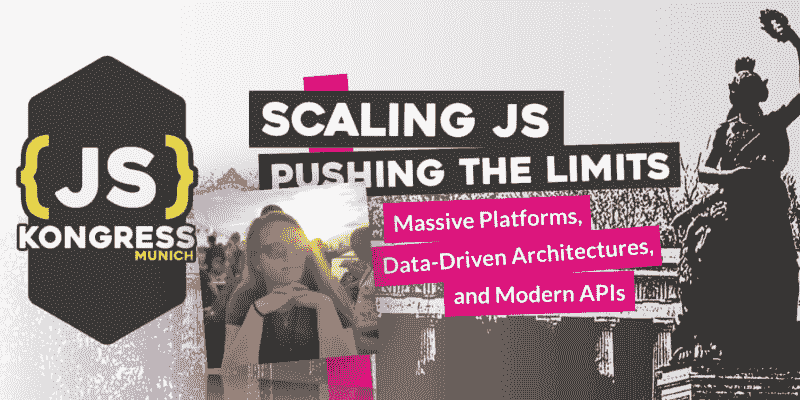

# 请为玛德琳·诺依曼举手🙌

> 原文：<https://dev.to/jskongress/hands-up-for-madeleine-neumann-no9>

<figure> 

<figcaption>[玛德琳·诺伊曼](https://medium.com/u/dc12db360dc4)是一名网站开发人员，也在波鸿的 9elements Agency 从事开发者关系领域的工作。对于 9elements，她组织了 JavaScript Conference RuhrJS、Meetup PottJS，并且喜欢结识新朋友。在空闲时间，她喜欢画画、跳舞和做运动。她反复提出的建议是:多唱卡拉 ok！  </figcaption>

</figure>

有请 JS Kongress 2020 计划委员会的首批成员之一 Madeleine。从 10 月 16 日开始征集论文截止，委员会将开始审查所有提交的论文，并选出最符合主题的论文。首先，我们问了她几个问题:

**你为什么期待#jskongress？**

从第一次参加 JSKongress 开始，我每年都很享受。这是一次精心组织、关怀备至的会议，有很多精彩的演讲 

你如何看待或联想到 2020 年的格言“扩展 JS——挑战极限:大规模平台、数据驱动架构和现代 API”？

JavaScript 社区是一个发展非常迅速的社区。感觉每天都有新的框架诞生，我们不得不适应新的范式或者回到旧的范式。我们开发的每个应用都面临着同样的问题:“它能扩展吗？”看看其他开发人员如何突破可伸缩性的极限将会很有趣。

你对这个项目的愿景是什么？

我希望 JSKongress 将从不同的角度收到各种各样的主题，这符合座右铭。希望我们会看到一些第一次发言的人 

你还记得你第一次接触 JS 的时候吗？原因是什么，或者是谁？

我想第一次是在 myspace 上，当时我不知道自己在做什么。这是一个访客柜台(或类似的东西)，有很多闪闪发光的东西(你知道过去的 myspace 在哪里)。后来我接触了多特蒙德 OpenTechSchool 的乡亲，接触了 JavaScript。从那以后我就被卡在了 

你对所有演讲者和所有想提交演讲想法的人有什么激励吗？

只管去做吧。没有人会咬你，没有人会责怪你  人们会参加你的演讲，因为他们认为这是一个有趣的话题，他们愿意听你讲。

* * *

#jskongress 2020 的论文征集截止到 10 月 15 日——我们期待在[https://sessionize.com/js-kongress-2020](https://sessionize.com/js-kongress-2020)上读到你的想法

《邮报》举起手来支持马德琳·诺依曼🙌最早出现在 [JS KONGRESS 2020:扩展 JS——挑战极限:大规模平台、数据驱动架构和现代 API。](https://js-kongress.com)。