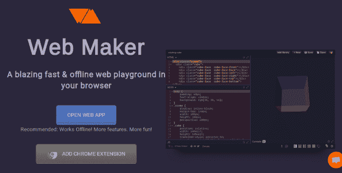
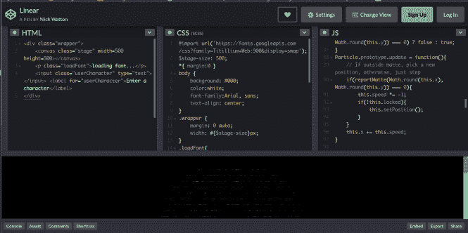
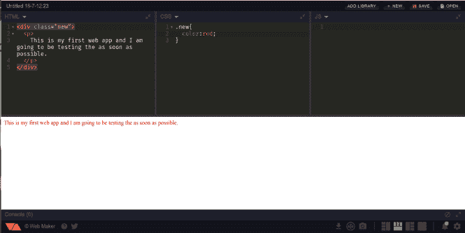
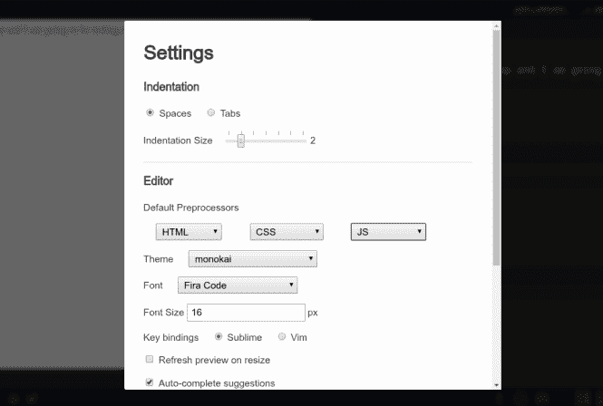
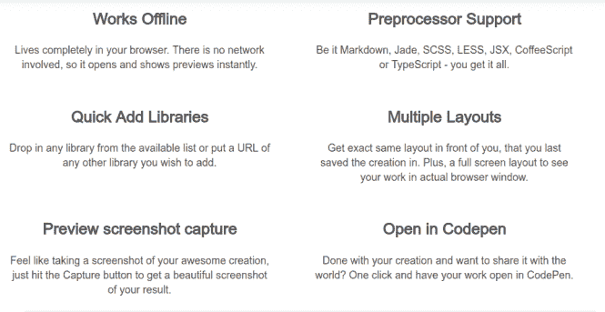

# WebMaker 应用程序:离线 Web 开发游乐场

> 原文：<https://dev.to/xeroxism/webmaker-app-offline-web-development-play-ground-4agc>

用于离线 web 开发的 CODEPEN 的真正开源替代方案。

<figure> 

<figcaption>WEBMAKER:主页。</figcaption>

</figure>

WebMaker app (WMA)是一款免费且[开源的](https://fossnaija.com/open-source-really-matter-control-not-code/)前端 web 开发应用。一个很好的描述方式是作为 [codepen](https://codepen.io/) 的离线版本。

Codepen 是一款软件，它在我的[前端开发者](https://dev.to/xeroxism/how-to-install-atom-editor-in-ubuntu-linux-29h)旅程中扮演了非常重要的角色。它基本上是一个 HTML-CSS-JAVASCRIPT 的游乐场。

<figure> 

<figcaption>密码本</figcaption>

</figure>

Codepen 被开发人员用来展示技巧，并最终向全世界分享他们的可视化前端 web 创作。我一见钟情。你会喜欢的 Codepen 的主要特性是当你在 HTLM-CSS-JS code [编辑器中输入代码时，能够立即看到代码的效果(预览)。](https://dev.to/xeroxism/7-open-source-alternatives-to-dreamweaver-38gc-temp-slug-7750868)

但是没有互联网的时候呢？

### web maker 来了！

<figure> 

<figcaption>自动预览</figcaption>

</figure>

注意:在这篇文章中，我指的是 Codepen 的公开或免费版本。

任何让任何人想使用 Codepen 的理由都应该刺激 WMA 的使用——还有一点额外的好处，离线。事实上，WMA 与 Codepen 是兼容的。你可以简单地通过一个按钮将你在 WMA 上的作品上传到 Codepen 如果你愿意，可以创建一个在线副本——只需要很少或不需要对代码库进行额外的配置或更改。

同样熟悉的界面和所有的细节。因为它是离线的，所以相对来说比 Codepen 快——这是意料之中的。

## **其他一些特征**

*   默认的预处理程序是 HTML、CSS 和 JAVASCRIPT，还有 SCSS、SASS、CoffeeScript、Markdown 等选项。可以添加外部 CSS 和 JS 库(例如 Bootstrap、JQUERY 等)并链接到您的代码。
*   可以截图预览一下。
*   它有代码自动完成/建议。
*   它有三个视图(左、右、下)和一个全屏视图。

<figure> 

<figcaption>特色</figcaption>

</figure>

你可以以两种不同的形式使用 WMA 为你设计的网络项目；

*   一个 webbrowser 扩展( [chrome](https://chrome.google.com/webstore/detail/web-maker/lkfkkhfhhdkiemehlpkgjeojomhpccnh) ):因为它是一个 chrome 扩展，所以不需要太多配置就能轻松安装。
*   一个 [webapp](https://webmaker.app/app/) :可以在浏览器中运行。

要了解更多关于如何定制不同设置的信息，你可以点击这里查看令人敬畏的 WMA 文档。

WMA 是开源的；如果可能，可以自由使用和修改。它本身建立在许多开源技术的基础上。关于它是如何建造的详细叙述，你可以在这里阅读作者的帖子[。](https://medium.freecodecamp.org/web-maker-how-i-built-a-fast-offline-front-end-playground-9fe3629bc86f)

<figure>

<figcaption>GITHUB 上的 web maker APP</figcaption>

</figure>

谢谢你的精彩创作。

HappyLinux 'NG！

帖子 [WebMaker APP:离线 Web 开发游乐场](https://fossnaija.com/install-webmaker-app/)首先出现在 [Foss Naija](https://fossnaija.com) 上。