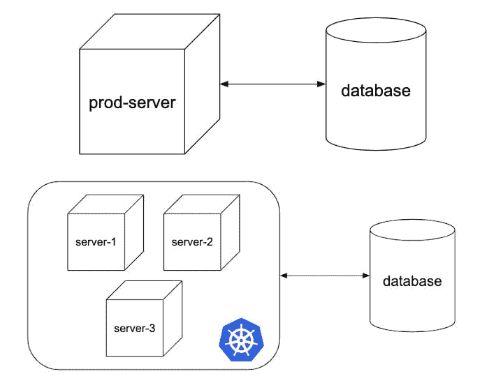
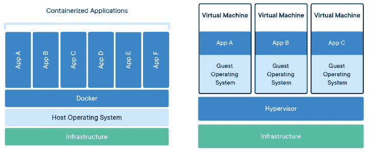
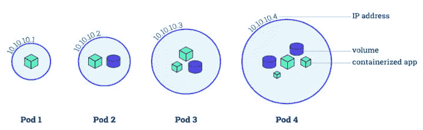

# 从宠物服务器到 Kubernetes 集群

> 原文：<https://dev.to/codegram/from-a-pet-server-to-a-kubernetes-cluster-1n90>

*最初发表于 [Codegram 的博客](https://www.codegram.com/blog/from-a-pet-server-to-a-kubernetes-cluster/)T3】*

## 简介

今天，我要向大家讲述一个关于我们如何迁移基础设施和部署策略的故事:从一直担心到满怀信心地推出新版本。

在 **Codegram** 的时候，我们开发了一个叫做 **Empresaula** 的产品。这是一个面向学生的商业模拟平台(你可以在这里了解更多信息)，我们无法承受停机时间，因为这让老师和学生都很难跟上课程进度。

在下面的方案中，您可以看到我们简化的基础架构的前/后情况:

[](https://res.cloudinary.com/practicaldev/image/fetch/s--bbqBzhtW--/c_limit%2Cf_auto%2Cfl_progressive%2Cq_auto%2Cw_880/https://www.codegram.com/blog/from-a-pet-server-to-a-kubernetes-cluster/before_after_infrastructure.jpg)

我们从一台名为`production-server`的服务器开始。人们通常使用其他很酷的名字，如`john-snow`或`minas-tirith`，但我们保持简单。我们的数据库在另一台有自动备份功能的服务器上，所以我们觉得很安全，直到我们心爱的服务器无法访问，我们需要快速行动。那天我们的办公室是这样的:

[](https://res.cloudinary.com/practicaldev/image/fetch/s--u6Hojbp9--/c_limit%2Cf_auto%2Cfl_progressive%2Cq_66%2Cw_880/https://media3.giphy.com/media/nrXif9YExO9EI/giphy.gif%3Fcid%3D790b76115d2735d1554a347749568969%26rid%3Dgiphy.gif)

现在用 **Kubernetes** ，有了真正的安全感。Kubernetes 的想法是避免对任何服务器产生依恋感(你不要说出它的名字)，而是描述你想要的系统。Kubernetes 将监控您的系统，如果在任何时候出现问题，它将尝试恢复它。Kubernetes 为我们处理一切，因此，如果一切都不顺利，我们可以像这样放松:

[](https://res.cloudinary.com/practicaldev/image/fetch/s--90hVe9sW--/c_limit%2Cf_auto%2Cfl_progressive%2Cq_66%2Cw_880/https://media3.giphy.com/media/Ala8Pjo4RN9kY/giphy.gif%3Fcid%3D790b76115d27366e444e624155d09790%26rid%3Dgiphy.gif)

在解释 Kubernetes 如何工作之前，我们需要先说一下底层技术:**容器**。

## 码头工人:到处都是集装箱

容器只是一个**可移植的应用**。使用最多的容器化技术是 **Docker** ，在你使用 Kubernetes 的时候是默认的。容器通常与虚拟机相比较，但它们非常不同:

[](https://res.cloudinary.com/practicaldev/image/fetch/s--KocqXgcR--/c_limit%2Cf_auto%2Cfl_progressive%2Cq_auto%2Cw_880/https://www.codegram.com/blog/from-a-pet-server-to-a-kubernetes-cluster/containers_vs_virtual_machines.jpg)

一个**管理程序**管理虚拟机，它需要模拟每一个虚拟机的一切:操作系统、内存、CPU 等。容器需要容器运行时(即 Docker ),并在主机操作系统中执行。当您将应用程序容器化后，您可以在任何安装了 Docker 引擎的服务器上运行它。

要在 Docker 中运行您的应用程序，您需要编写一个`Dockerfile`。在下面的代码片段中，您可以看到一个为 Rust 应用程序创建容器的示例:

```
# Use the rust base image
FROM rust:latest as cargo-build

# Install dependencies
RUN apt-get update && apt-get install musl-tools -y

# Add another Rust compilation target
RUN rustup target add x86_64-unknown-linux-musl

# Install cargo dependencies
WORKDIR /usr/src/backend
COPY Cargo.toml Cargo.toml
RUN mkdir src/
RUN echo "fn main() {println!(\"if you see this, the build broke\")}" > src/main.rs
RUN RUSTFLAGS=-Clinker=musl-gcc cargo build --release --target=x86_64-unknown-linux-musl
RUN rm -f target/x86_64-unknown-linux-musl/release/deps/backend*

# Compile the Rust application
COPY . .
RUN RUSTFLAGS=-Clinker=musl-gcc cargo build --release --target=x86_64-unknown-linux-musl

# Use the alpine base image
FROM alpine:latest

# Copy the generated binary
COPY --from=cargo-build /usr/src/backend/target/x86_64-unknown-linux-musl/release/backend /usr/local/bin/backend

# Run the application
CMD ["backend"] 
```

`Dockerfile`就像是一个如何构建和执行应用程序的处方。您可以使用该配方创建一个 Docker 映像，以便在任何需要的地方运行容器。

手动管理容器可能很麻烦，所以我们需要一些东西来**编排**它们:让我们看看 Kubernetes 如何帮助我们。

## Kubernetes 简介

Kubernetes 在他们的[网站](https://kubernetes.io)中定义得非常好:

> Kubernetes 是一个用于自动化部署、扩展和管理容器化应用程序的开源系统

换句话说，Kubernetes 是一个容器编排器，它给出了所需的状态，将调度所需的任务以达到该状态。

为了理解 Kubernetes 是如何工作的，我们需要知道最小的调度单元:pod 。在下面的模式中，您可以看到不同种类的窗格:

[](https://res.cloudinary.com/practicaldev/image/fetch/s--sL1m0a5c--/c_limit%2Cf_auto%2Cfl_progressive%2Cq_auto%2Cw_880/https://www.codegram.com/blog/from-a-pet-server-to-a-kubernetes-cluster/kind_of_pods.jpg)

最简单的 pod 类型是容器的一对一映射。在某些情况下，如果您有两个绑定连接的容器，您可以考虑将它们放在同一个 pod 中(例如，后端应用程序和消息日志记录系统)。您还可以在 pod 中包含 Docker 卷，但是要注意 pod 可能会随时被移动到 Kubernetes 集群中的另一台服务器上。

Kubernetes 对像`Deployment`这样的 pod 有很多抽象。一个`Deployment`描述了你想要在你的系统中有多少相同 pod 的副本，当你改变任何东西时，它会自动推出一个新版本。在下面的代码片段中，您可以看到一个`Deployment`对象:
的清单文件(即`my-backend.deployment.yaml`

```
apiVersion: 'apps/v1'
kind: 'Deployment'
metadata:
  name: 'k8s-demo-backend'
spec:
  replicas: 2
  selector:
    matchLabels:
      app: 'backend'
  template:
    metadata:
      labels:
        app: 'backend'
    spec:
      containers:
        - name: 'backend'
          image: 'k8s-demo-backend'
          imagePullPolicy: 'Never'
          ports:
            - containerPort: 8000 
```

在这里，我指定我的系统应该有两个运行`k8s-demo-backend` Docker 映像的`replicas`。如果我想推出一个新版本，我需要更改以前的文件(即，将 docker 图像更改为`k8s-demo-backend:v2`)。

如果在某个时候，我们集群中的一个服务器出现故障，Kubernetes 检测到我们没有运行这两个`replicas`,它将安排一个新的 pod 部署(如果需要，甚至部署一个新的服务器来分配 pod)。

默认情况下，我们无法从外部访问 pod，因为它们连接到集群内部的专用网络。如果您需要从外部访问，您需要添加一个`Service`。`Service`是描述如何从外部连接到一个 pod(或一组 pod)的另一个抽象概念。在下面的代码片段(即`my-backend.service.yaml`)中，你可以看到一个`Service` :
的例子

```
apiVersion: 'v1'
kind: 'Service'
metadata:
  name: 'k8s-demo-backend-service'
spec:
  type: 'LoadBalancer'
  selector:
    app: 'backend'
  ports:
    - port: 8000
      targetPort: 8000 
```

这个`Service`描述了一个`LoadBalancer`，它将从外部访问与`selector`T3 相匹配的一组吊舱。任何使用端口`8000`访问集群的用户都将被重定向到前面`Deployment`中描述的 pod 中的相同端口。`Service`代表一种抽象，它将根据我们的集群表现不同(即，如果集群运行在 [Google Kubernetes 引擎](https://cloud.google.com/kubernetes-engine/)中，它将为我们集群中的服务器池创建一个[第 4 层负载平衡器](https://cloud.google.com/load-balancing/))。

## 演示时间！

我创建了一个[存储库](https://github.com/beagleknight/from-pet-server-to-kubernetes-cluster-demo)，其中有一个可以部署在 **Kubernetes** 集群中的系统的小例子。您可以使用 [minikube](https://kubernetes.io/docs/setup/learning-environment/minikube/) 运行本地集群，或者如果您正在使用`Docker for mac`您可以在设置中启用它来运行本地集群。

假设您已经创建了集群并克隆了存储库，那么您需要首先构建 **Docker** 映像:

```
$ docker build -t k8s-demo-frontend frontend
$ docker build -t k8s-demo-frontend backend 
```

然后，您可以打开一个新的终端并运行以下命令，每秒运行一次 **Kubernetes** CLI 命令，以列出我们集群中的**pod**、`Services`和`Deployments`。

```
$ watch -n 1 kubectl get pod,svc,deploy 
```

在存储库中有几个清单文件，可以用下面的命令应用到集群:

```
$ kubectl apply -f . 
```

在另一个终端中，您应该能够看到由 **Kubernetes** 创建的资源列表。既然我们已经创建了一个`LoadBalancer`，我们应该在服务列表中有一个`EXTERNAL-IP`来访问我们的应用程序。如果您在本地机器上运行集群，您可以访问`http://localhost:8080`中的应用程序。如果一切正常，您应该可以看到一个小的`Vue`应用程序，它可以向`Rust`服务器提交一个表单并提示一条消息。

如果您想继续玩演示，请尝试更改`replicas`的编号，并再次应用清单文件。

## 期末笔记

从宠物服务器到 Kubernetes 的过渡并不像这篇文章中描述的那样顺利，但这是值得的。我们在这个过程中学到了很多，现在我们再也不怕推出新版本的应用程序了。我们不再担心我们的基础设施，而且 **Kubernetes** 在很多层面上简化了我们的生活，因此我们可以专注于为最终用户提供价值。我们也可以像这只猫一样放松:

[](https://res.cloudinary.com/practicaldev/image/fetch/s--cS9BCENL--/c_limit%2Cf_auto%2Cfl_progressive%2Cq_66%2Cw_880/https://media2.giphy.com/media/atHI7U3aP3kl2/giphy.gif%3Fcid%3D790b76115d273b4d7138514651b713be%26rid%3Dgiphy.gif)

如果您想更深入地了解这个主题，您可以在这里看到有用资源的列表:

*   [https://kubrintes . io/](https://kubernetes.io/)
*   [https://github . com/ramitsurana/awesome-kubricks](https://github.com/ramitsurana/awesome-kubernetes)
*   [https://labs.play-with-k8s.com/](https://labs.play-with-k8s.com/)
*   [https://www . kata coda . com/courses/kubricks](https://www.katacoda.com/courses/kubernetes)
*   [https://cloud.google.com/kubernetes-engine/](https://cloud.google.com/kubernetes-engine/)

## 不要脸的塞

这篇文章的灵感很大程度上来自我在 meetup group[Full Stack vallès](https://www.fullstackvalles.dev/)上发表的一次闪电演讲。

> 您是否也想要一个坚如磐石的基础架构，并且不担心扩展您的服务器？请在 hello@codegram.com 的 [给我们打个电话，我们会很乐意帮助你的！](mailto:hello@codegram.com)