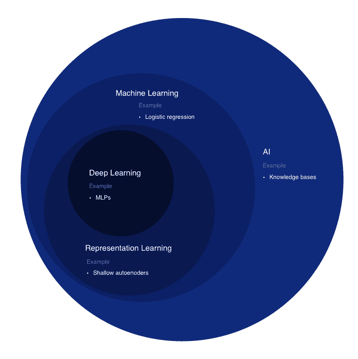
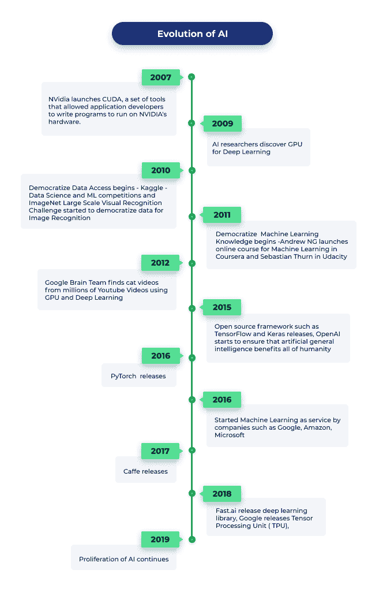
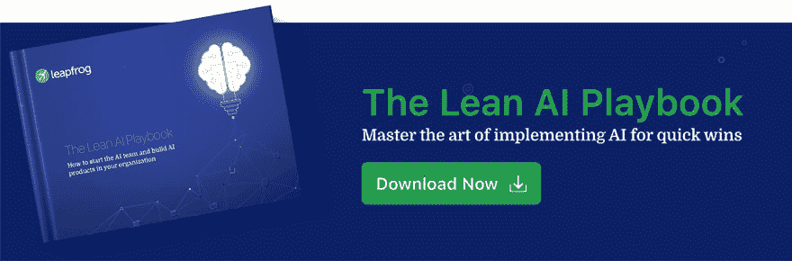

# 人工智能的进化

> 原文：<https://dev.to/leapfrogtechnology/evolution-of-ai-191j>

在过去的几年里，人工智能发展成为一个强大的工具，使机器能够像人类一样思考和行动。此外，它已经获得了世界各地科技公司的关注，被认为是继移动和云平台发展之后的下一次重大技术变革。有人甚至称之为第四次工业革命。《福布斯》指出，“到 2020 年，使用人工智能和机器学习和深度学习等相关技术来发现新商业见解的企业每年将从没有采用这些技术的竞争对手那里获得 1.2 万亿美元。”

这篇文章概述了人工智能的发展，并为引领人工智能发展的重要里程碑奠定了基础。

## 人工智能

根据韦氏词典，“人工智能是计算机科学的一个分支，处理计算机中智能行为的模拟。”当一台机器可以做出智能决策时，它可以被称为是智能的-人工的。我们大多看到人们将机器学习、深度学习和人工智能作为同义词使用。但是，深度学习是机器学习的子集，机器学习是 AI 的子集。

维恩图显示了深度学习是一种表示学习，而表示学习又是一种机器学习，用于许多但不是所有的人工智能方法。维恩图的每一部分都包括一个人工智能的例子。

 
*维恩图显示了深度学习是一种表示学习，而表示学习又是一种机器学习，用于许多但不是所有的 AI 方法。维恩图的每一部分都包括一个人工智能的例子。*

## AI 暴涨是什么时候开始的？

回到 19 世纪，人工智能仅限于神话、小说和猜测。古典哲学家设想将机器融入人类。然而，他们只是被描绘在小说作品中，比如玛丽·雪莱的《弗兰肯斯坦》。人工智能真正开始于 1956 年。引领人工智能未来的种子是达斯莫德学院的一个研讨会，与会者被称为未来几十年的人工智能领导者。

人工智能的激增始于如下六个主要设计目标:

1.  教机器根据执行复杂的脑力任务进行推理，如下棋、证明数学定理等。
2.  让机器像人类一样与真实世界进行交互的知识表示—机器需要能够识别物体、人和语言。编程语言 Lisp 就是为此而开发的。
3.  教机器在我们生活的世界中规划和导航。有了这个，机器就可以通过导航来自主移动。
4.  使机器能够处理自然语言，以便它们能够理解语言、对话和言语的上下文。
5.  训练机器感知人类的方式——触觉、感觉、视觉、听觉和味觉。
6.  一般智力包括情绪智力、直觉和创造力。

所有这些目标为制造具有人类能力的机器奠定了基础。数百万美元的投资使他们的愿景成为现实。然而，很快，美国政府意识到缺乏实现 AI 所需的强大计算技术。资金被撤回，旅程在 80 年代末第一次停止。

对大量数据和巨大计算能力的需求破坏了 80 年代的进步。然而，21 世纪让这个概念迅速复活，证明了摩尔定律。微型硅今天拥有的强大处理能力使人工智能在当前背景下变得可行，也使构建改进的算法成为可能。

在人工智能的重生和革命中有四个连续的催化剂:

1.  人工智能知识的民主化始于世界一流的研究内容向大众开放——从斯坦福大学的 MOOCs 和 Andrew NG 以及 Udacity 的 Sebastian Thurn 和 Katie Malone 的 Intro to [ML 开始。](https://www.udacity.com/course/intro-to-machine-learning--ud120)
2.  数据和计算能力(云和 GPU)使人工智能能够为大众所用，而无需大量的前期投资或成为一家大型公司。
3.  即使可以访问数据和计算能力，你也必须是人工智能专家才能利用它。然而，在 2015 年，新的工具和框架大量涌现，使得探索和实施生产级人工智能对大众来说是可行的。你现在可以在谷歌(Google)和脸书(PyTorch)等巨头的基础上进行构建。随着人工智能的民主化，许多组织应运而生，如 [FastAI](https://www.fast.ai/) 和 [OpenAI](https://openai.com/) 。
4.  在过去的两年里，人工智能即服务(AI as a service)更进一步，实现了更简单的原型开发、探索，甚至在产品中构建复杂和智能的特定用例人工智能。有像 [Azure AI](https://azure.microsoft.com/en-us/overview/ai-platform/) 、 [AWS AI](https://aws.amazon.com/ai/) 、 [Google Cloud AI](https://cloud.google.com/products/ai/) 、 [IBM Cloud AI](https://www.ibm.com/cloud/ai) 这样的平台，以及更多提供 AI 即服务的平台。

人类已经见证了人工智能识别猫视频到自动驾驶汽车的发明。更多的公司正在尝试应用人工智能来解决问题，并在组织中建立人工智能战略。从六个目标开始的 AI 之旅，今天正在逐步实现。随着科技的进一步发展，人类和机器共同生活的未来似乎是可能的。现在，我们要么选择观察趋势，要么开始规划我们的人工智能战略，以便在一个由技术驱动的世界中创造影响。

> #### Thanks for reading!

#### 如果您想了解更多关于在您的产品中实施人工智能的信息

#### [T4】](https://landing.lftechnology.com/ai/?utm_source=devto&utm_medium=blog&utm_campaign=initial_distribution)