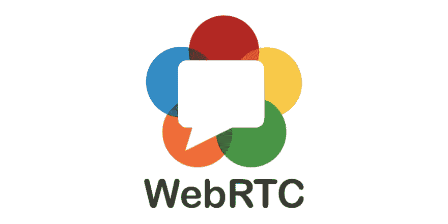

# 使用 WebRTC

> 原文：<https://dev.to/sadmansamee/working-with-webrtc-on-android-ios-465c>

任何与 [WebRTC](https://webrtc.org/) 一起工作过的人都会同意，学习资源严重缺乏，除此之外， [WebRTC](https://webrtc.org/) 标准每隔几年就会发生变化，而且变化有时会很大，这使得以前的资源过时，产生了更多的差距。

> WebRTC 是一个免费的开放项目，它通过简单的 API 为浏览器和移动应用程序提供实时通信(RTC)功能。WebRTC 组件已经过优化，可以最好地满足这一目的。

我发现大部分资源要么不清晰，与当前的 [WebRTC](https://webrtc.org/) 库不兼容，要么非常不完整。在我寻找资源的过程中，我发现了一些不错的资源。

## 网页

*   [与 WebRTC 的实时通信](https://codelabs.developers.google.com/codelabs/webrtc-web)
*   [WebRTC 网络演示和示例](https://github.com/webrtc/samples)
*   [正式文件](https://webrtc.org/start/)

## 安卓

*   [WebRTC Android Codelab](https://github.com/Sadmansamee/webrtc-android-codelab)
*   【Android 版 WebRTC 入门—轻松开发视频通话应用！

## iOS

*   [使用 swift 的简单本地 WebRTC 演示 iOS 应用](https://github.com/stasel/WebRTC-iOS)
*   [一个 WebRTC 和 CallKit 演示应用程序](https://github.com/kurzdigital/Whale)

## 飘起

*   [Flutter 移动/桌面 WebRTC 插件](https://github.com/cloudwebrtc/flutter-webrtc)
*   [颤振演示-webrtc](https://github.com/cloudwebrtc/flutter-webrtc-demo)
*   [一个简单的用于 flutter 的 WebRTC 信令服务器——WebRTC 和 html5。](https://github.com/cloudwebrtc/flutter-webrtc-server)
*   [适用于 iOS/Android 的 Flutter WebRTC 插件](https://flutterawesome.com/flutter-webrtc-plugin-for-ios-android)

这些都是非常高级的例子，我计划很快就这个主题写一个完整的教程。