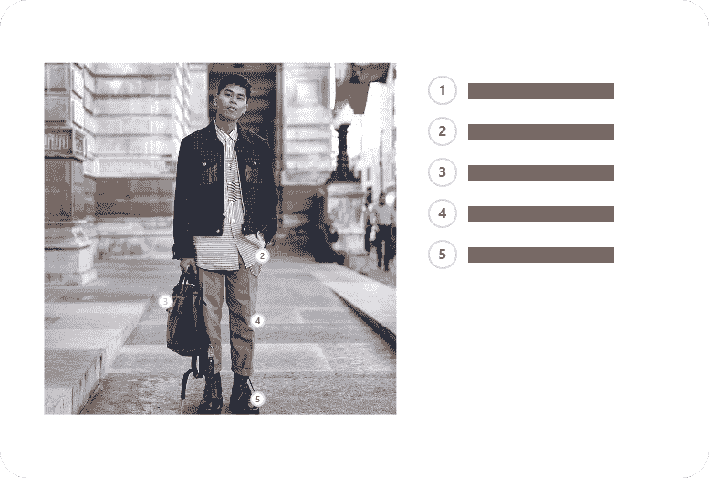
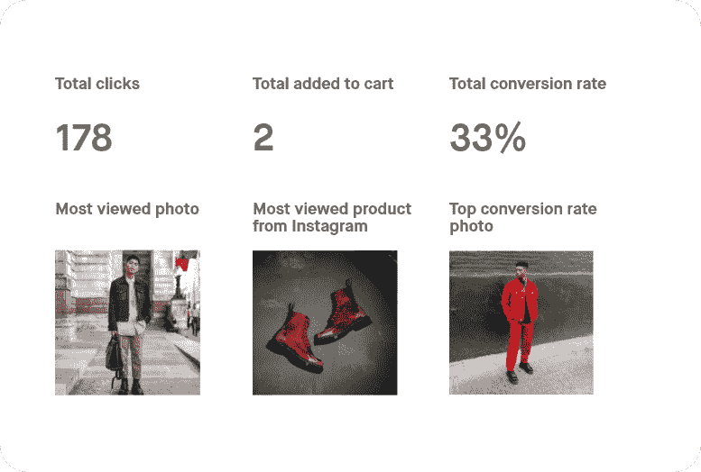
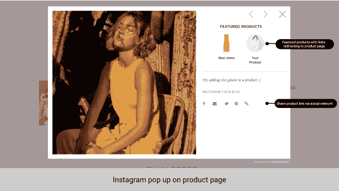
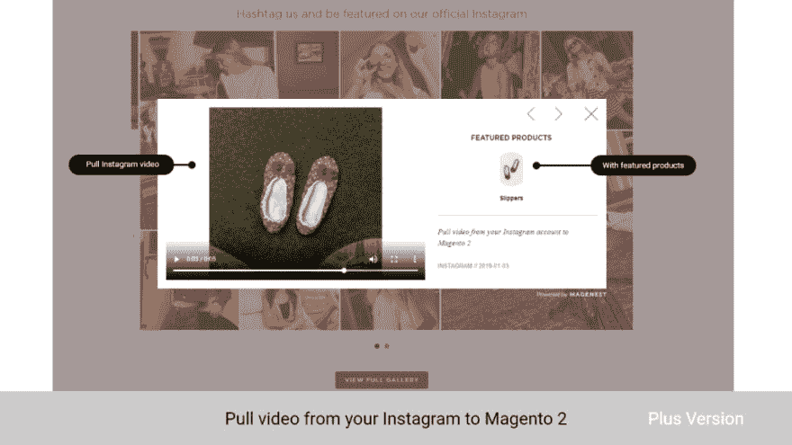

# Magento 2 Instagram Feed 快速概览

> 原文：<https://dev.to/magenestjsc/a-quick-overview-of-magento-2-instagram-feed-1pf5>

自 2010 年以来，Instagram 稳步发展，成为有史以来最大的社交网络之一。据统计，它现在比 Twitter 和 LinkedIn 等社交媒体巨头更受欢迎。

如今，80%的用户在社交网络上关注一家企业，这一数字还在快速增长，因此许多商店利用这一点在该平台上开设商店。

对于 Magento 2 的店主来说，将你的电子商务网站与 Instagram 商店整合在一起是绝对有益的。在这篇博客中，我们将对 [Magento 2 Instagram Feed](https://store.magenest.com/magento-2/instagram-integration.html) 及其主要功能进行概述，以便商家可以考虑这一扩展可以为您的销售带来什么。

## **Magento 2 insta gram Feed 一览**

今天的顾客变得越来越挑剔，他们总是希望收到引人注目和有价值的内容。许多商家利用 Instagram 等社交网络作为平台，吸引受众，推广产品，增加销售收入。

通过使用我们的 Magento 2 Instagram 商店订阅源，商店经理将能够在 Instagram 中推广他们现有的产品，并开发新产品。顾客将能够看到更多的产品图像，尤其是现实生活中的产品图像。

最重要的是，Magenest 提供免费的安装支持，以确保店主能够立即安装和设置扩展。

这个 Instagram 店铺扩展有两个版本:标准版& [加版](https://store.magenest.com/blog/instagram-shop-plus-an-overview/)。

**阅读更多**|[insta gram 上可购物的帖子——insta gram 上企业的游戏规则改变者？](https://store.magenest.com/blog/instagram-shoppable-posts/)

## **特性**

### **将产品发布到您的 Instagram 帖子上**

在 Magento 2 后端，商家可以使用“热点”在他们的 Instagram 照片上定位产品。如果您在一张照片中有多个产品，这是一个非常有用的功能，可以轻松指出哪个产品是哪个产品，从而为客户提供更好的体验。

<figure> 

<figcaption>利用热点将商品钉到你的 Instagram 照片上</figcaption>

</figure>

### **以最佳方式展示您的 Instagram 照片**

商家可以在其网站的任何地方创建和设置一个展示 Instagram 照片的滑块，使其在视觉上更具吸引力，从而留住顾客。在你的网站上展示你的社交内容也是一个有效的来源，可以让更多的人访问你的 Instagram，让你的品牌更持久，因为人们可能会在社交媒体上花更多的时间。此外，客户还可以在整页画廊中看到您的所有照片。

<figure> 

<figcaption>滑块和图库的多个布局选项</figcaption>

</figure>

### **追踪照片的表现**

为了帮助数据分析和决策，Instagram 集成在 Magento 2 后端为商家提供了一份报告。商家可以观察客户如何与他们的 Instagram 帖子互动，看看哪些照片的浏览量、点击量和转化率最高。这有助于商家就社交媒体内容和网站的视觉方向做出更好的决策。

<figure> 

<figcaption>商家现在可以看到访客如何互动的详细报告</figcaption>

</figure>

**高亮显示**

*   使用原生 Instagram API 连接您的 Instagram 帐户以提高安全性
*   响应式移动设计——布局美观，在任何屏幕尺寸和设备上都能正常工作。
*   高度可定制的照片滑块——宽度、高度、列数和行数
*   在您网站的任意位置显示多个照片滑块
*   照片从您的 Instagram 账户中取出，并按时间顺序显示
*   在 Magento 2 后端管理同步的 Instagram 照片——隐藏/显示/删除
*   将产品缩略图添加到 Instagram 照片中，这些照片链接到相应的页面
*   展示您所有 Instagram 照片收藏的图库页面
*   查看 Instagram 照片在详细报告中的表现

## **截图** s

**简单地说，**

企业应该利用这一扩展的各种功能来促进他们的销售。好在 **Magento 2 Instagram 店铺扩展**by**Magenest**可以帮你轻松的将你的 Instagram 整合到你的店铺中。

如果您需要特定扩展的帮助，最好的方法是联系开发人员。 [联系我们](https://magenest.com/en/contact-us/) ！