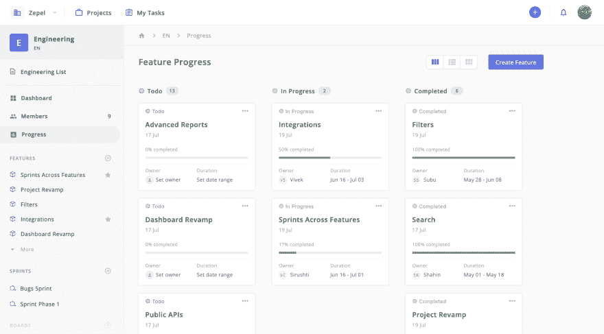
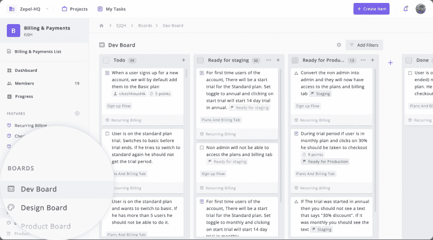

# 跨职能协作:什么是它，它的好处，以及如何改善

> 原文：<https://dev.to/svikashk/cross-functional-collaboration-what-is-it-its-benefits-and-how-to-improve-3cne>

现在是 2019 年，我们大多数人都在谈论团队协作，而我们应该更多地谈论跨职能协作。

想一分钟…每次你和你的团队坐下来构建一个新特性，来自不同职能部门的成员会聚在一起，对吗？

产品经理分享一组按优先顺序排列的[用户故事](https://blog.zepel.io/write-user-stories/?utm_source=devto&utm_medium=text&utm_campaign=crossfunctionalcollaboration)，设计师准备模型并将其传递给你的前端开发人员，而后端开发人员奠定基础。我们甚至还没有考虑到 QA！

如果没有跨功能的协作，您的前端开发人员将永远不会知道设计是否完成，开发团队将不会知道 QA 团队报告的错误，并且您的功能将永远不会按时部署。

当客户期待高质量、无缺陷的功能，并且毫不犹豫地在社交媒体上哀叹时，我们给予跨职能协作应有的重视，这比以往任何时候都更重要。

本指南的内容

1.  什么是跨职能协作？
2.  跨职能协作面临的挑战
3.  如何改善跨职能协作？
4.  跨职能协作的好处是什么？

## 复习基础知识:什么是跨职能协作？

当不同职能部门的人——开发、设计、QA 等。-走到一起朝着一个共同的目标努力，这就是所谓的跨职能协作。

这有点像建立自己的复仇者团队，每个成员都带来自己的超能力来击败反派。

## 跨职能协作的挑战

让团队合作很难。让他们跨职能合作就更难了。

成长中的公司将改变流程，雇佣顾问来指导他们，甚至重新组织他们的组织结构，让他们的队友跨职能协作。

据报道，75%的[跨职能团队工作效率低下](https://hbr.org/2015/06/75-of-cross-functional-teams-are-dysfunctional)。今天的工具本应结束生产力的循环。但这并没有发生。

为什么这么难？

如果你曾经试图让你的团队跨职能部门协作，你会因为担心以下问题而遇到阻力:

1.  **失去身份** -团队认为自己是什么，他们的目的是什么。
2.  **被视为不合法**——团队的存在被别人如何感知，他们带来了什么价值。
3.  **失去控制**——能够自主行动，决定自己的工作期限。

当团队失去了这三个方面，一些基本的问题，比如我负责什么，我能得到多少资源，我的工作将如何被评价，就开始出现了。

这导致团队对某件事情应该如何工作有一套相互竞争的信念和假设，并导致不一致，对同一信息的不同解释，以及混合的结果。

今天，每个团队都有自己的工作流程，通常经过一系列的修正，这样团队中的每个人都可以协作并尽最大努力工作。

> 当你从团队中移除成员，并要求他们与其他团队合作时，他们都有自己的工作方式，人们不再非常确定。

研究人员 Lisa B. Kwan [建议](https://hbr.org/2019/03/the-collaboration-blind-spot)当你要求团队成员跨职能合作时，你基本上是在期望他们放弃自主权、责任和权力，这使他们变得保守，容易自我封闭。他们此时最关心的是保卫自己的领地，将威胁降到最低。

改善跨职能部门协作的解决方案归结为提出一个关键问题:对于跨职能部门的成员，每个人都有自己的工作流程、优先事项和职责，我如何强化身份，给他们一种目的感和自主权？

## 如何提高跨职能协作？

### 1。设定并传达一个明确的目标

我们中的大多数人都认为我们为我们正在构建的特性应该实现的目标设定了清晰的目标，并与我们的团队分享。但是当事情变化很快时，保持专注几乎是不可能的。

罗纳德·科斯(Ronald Coase)在他题为“[公司的性质](http://www.colorado.edu/ibs/eb/alston/econ4504/readings/The%20Nature%20of%20the%20Firm%20by%20Coase.pdf)”的论文中说，如果一个工作场所的每个人都一直沉迷于自己工作的确切参数，而不愿意投入工作并解决问题，那么这个工作场所将是一个功能失调的工作场所。

如果团队成员甚至不知道目标是什么，他们如何解决问题？

在 3197 名受访者中，当被问及他们是否不知道一些他们认为应该了解的公司信息时， [55%的受访者回答是](https://knowyourteam.com/blog/2019/02/28/the-9-leadership-mistakes-you-dont-know-youre-making-as-a-new-manager/)。

### 2。设定统一的目标

很多时候，来自其他职能部门的成员已经在做其他事情，并且有计划和其他优先事项。当这些新计划与其他职能部门的计划不匹配时，就会产生冲突。

> 如果你有完美的人，而他们完全错位，结果就是零进步。
> 
> ~ Hubspot 的创始人 Dharmesh Shah

[麦肯锡的 2106 个案例研究](https://www.mckinsey.com/business-functions/organization/our-insights/making-collaboration-across-functions-a-reality)表明，教育团队成员积极参与跨职能协作的好处是帮助团队取得成功的关键。

如果你正在使用 Zepel，你可以通过使用 Progress 让每个人都在按时发布特性的目标上保持一致。Progress 提取了您的团队成员跨功能所做的所有更新，并为您提供了关于您离发布新功能还有多远的有意义的信息。

因为当你团队中的每个人都专注于一个目标——按时发布你的功能——就不会看起来你团队中的每个成员都在用不同的语言交谈。

### 3。使不同

在建立跨职能团队时，团队最终会犯的最大错误之一就是简单地拉拢不同职能部门的成员。当然，你需要那个。但是如果你真的想最大化你的产出，你也应该引入具有不同技能和经验的成员。

确保您的团队多元化，基于:

a.经验

b.技能

c.能力

d.性别

e.长辈

### 4。给每个职能部门自主权

协作的弧线很长，并且朝着职能工作流的方向弯曲。当来自不同职能部门的不同成员走到一起时，工作流中总会有不匹配的地方，这会导致团队不一致，并最终延迟特性的发布。

生产力的最大敌人是不得不适应不是为你量身定做的工作流程。这让你不得不走到你的队友的办公桌前，让他们知道他们可以接任务，这是移交工作的唯一可靠方法。

为你的专题中涉及的每个学科创建一个委员会，给每个团队自主权和自由，让他们按照自己想要的方式工作。这样，每个人都可以高效地完成任务，只需改变状态。

## 跨职能协作有什么好处？

跨职能协作和团队协作之间的区别似乎有点模糊。当您的团队成员跨职能部门协作时，其核心有三个普遍的好处:

### 1。始终关注客户体验

大多数初创公司和小企业最终通过简单地走到团队成员的办公桌前传递信息来实现合作。但是当组织发展壮大，更多的团队成员加入时，事情就变糟了，陷入混乱。

如今，几乎在每次部署时都构建一个全功能或无 bug 的特性不再是组织的选择。提供既实用又能提供良好用户体验的卓越功能正稳步成为新的现状。

当你让来自不同领域的成员进行协作时，你可以将不同的观点和想法汇集到你的特性中，从而构建出高质量的特性。

### 2。更快的迭代

按时发布一个特性和无 bug 特性之间的区别并不小。在扩大规模的同时保持质量和标准，这是一个巨大的壮举。对小型企业有意义的流程和工具在大规模应用时不再有意义。

跨职能团队比孤立的团队迭代得更快。快速迭代导致在早期测试产品，接收快速反馈，并交付价值。

拥有拥有必要技能的合适团队成员来快速构建原型并交付功能的最小可行版本的好处是帮助跨职能团队快速行动，从而保持创新。

### 3。结盟团队

随着组织的扩展，很少有企业能够让他们的团队与他们的业务目标和客户完全一致。但这并不是说这是不可实现的。

小公司之所以能在大公司的游戏中打败大公司，原因之一是它们在实现目标上的一致性。当成员被告知其他团队的优先事项和问题的更广泛的背景时，所作出的决定是包容性的，并帮助他们保持一致。

## 最后的想法

跨职能协作不仅仅是将不同学科的成员聚集在一起并向他们分配任务。或者开会同步。

它是关于无缝移交工作，使每个人都能以他们想要的方式工作，同时保持生产力，并让每个人都在更大的范围内保持一致。

如果做得好，跨职能协作可能是快速扩展您的组织与不得不在感觉效率低下的情况下运行多个会议之间的差异。

