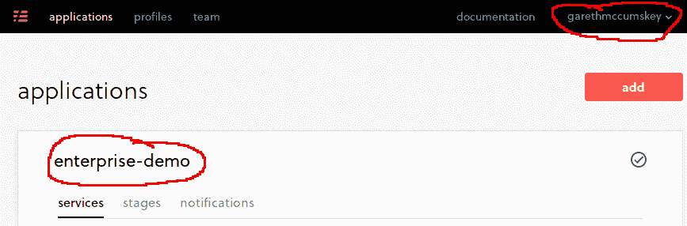
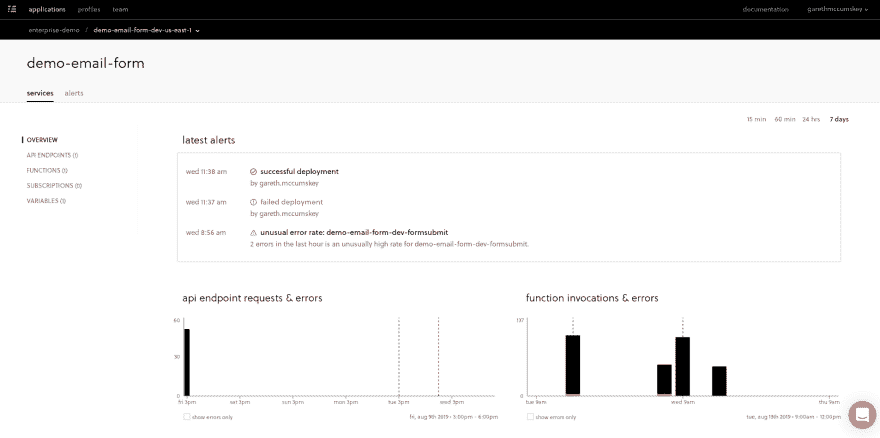
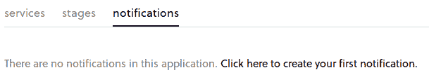
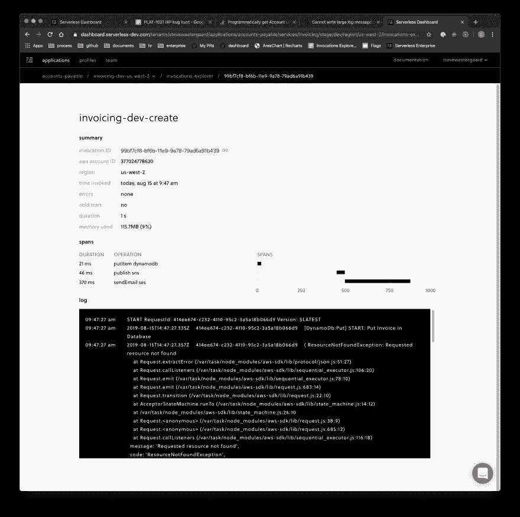

# 监视 AWS Lambda 函数的困难(以及如何解决)

> 原文：<https://dev.to/garethmcc/the-difficulty-with-monitoring-aws-lambda-functions-and-how-to-solve-it-381d>

如果您花时间构建了一个微服务应用程序，您可能很快就遇到了监控服务的问题，无论它们是配置在基于容器的基础设施上还是无服务器基础设施上。拥有所有这些独立的活动部分使得整理和分析日志文件变得更加困难。

这个问题的解决方案相当广泛。进入纯微服务领域的一个更通用的模式是服务网格的概念，通常作为每个服务的边车模块运行。这种模式提供了一种一致的方法，每个服务在发布日志数据时都需要遵循这种方法。然后，可以在一个来源中收集和整理这些日志，并提取有用的指标。

然而，在无服务器的世界中，服务网格是不够的，因为我们正在使用大量的托管服务，我们没有办法为这些服务配置额外的日志记录工具。

那我们现在怎么办？就这么放弃，假设每次出现问题，我们都将被迫手动分析我们的 CloudWatch 日志？

还好，没有。最近我开始使用无服务器框架团队提供的工具来监控我的 Lambda 函数等等。对我来说，这一点如此引人注目的原因不仅是因为我恰好是团队的一员(但这很有帮助)，还因为实现是如此的顺畅。作为该框架的开发人员有所帮助，因为您可以将这种非常基础的监控功能集成到现有的无服务器服务中。不需要在函数中包含任何额外的库来检测它们。无需手动添加额外的 IAM 权限(除非您选择这样做来利用软件的其他功能)。它只需要很少的设置就可以工作。

因此，如果你有兴趣了解更多关于无服务器框架仪表板的信息，以及除了监控之外它还能提供什么，无服务器公司的首席执行官和创始人奥斯丁·柯林斯在[https://www.youtube.com/watch?v=-Nf0ui3qP2E](https://www.youtube.com/watch?v=-Nf0ui3qP2E)制作了一个很棒的 3 分钟视频，将所有内容捆绑在一起，但我们主要关注的是监控方面。

我们如何进行监控设置？

嗯，第一步是我们需要一个无服务器框架仪表板帐户。去 https://dashboard.serverless.com 的[进行设置。一旦完成，您将得到一个`org`和一个`app`，如您在此图中所见:](https://dashboard.serverless.com)

[](https://res.cloudinary.com/practicaldev/image/fetch/s--7xZR_h9_--/c_limit%2Cf_auto%2Cfl_progressive%2Cq_auto%2Cw_880/https://thepracticaldev.s3.amazonaws.com/i/xxp0yd74eev2a7knejr5.png)

现在在你最喜欢的文本编辑器中打开你的无服务器服务的 serverless.yml，并添加`app`和`org`属性。我一般在`service`属性:
上面做这个

```
app: enterprise-demo
org: garethmccumskey
service: demo-email-form
provider:
... 
```

<svg width="20px" height="20px" viewBox="0 0 24 24" class="highlight-action crayons-icon highlight-action--fullscreen-on"><title>Enter fullscreen mode</title></svg> <svg width="20px" height="20px" viewBox="0 0 24 24" class="highlight-action crayons-icon highlight-action--fullscreen-off"><title>Exit fullscreen mode</title></svg>

这样，我们就快成功了。当我们部署时，我们需要我们的本地机器能够认证到我们的无服务器仪表板帐户。为此，只需运行`sls login`。它会在您的默认浏览器上打开一个窗口进行身份验证。一旦你看到消息

```
Serverless: You sucessfully logged in to Serverless 
```

<svg width="20px" height="20px" viewBox="0 0 24 24" class="highlight-action crayons-icon highlight-action--fullscreen-on"><title>Enter fullscreen mode</title></svg> <svg width="20px" height="20px" viewBox="0 0 24 24" class="highlight-action crayons-icon highlight-action--fullscreen-off"><title>Exit fullscreen mode</title></svg>

在 CLI 上，我们现在可以部署。

像平常一样跑。这是必要的，因为在这个阶段，无服务器框架现在可以自动检测您的功能，并在您的帐户中订阅 CloudWatch 日志以获取您的服务中的功能。

现在，只需要指出一些注意事项:

*   如果您尝试了其他任何*也*订阅您的 CloudWatch 日志的监控工具，您可能会得到一个关于达到 CloudWatch 限制的错误。解决方案是要么删除该订阅，要么通过控制台中的支持工具向 AWS 发送一条措辞优美的消息，并询问他们是否愿意提高您的 CloudWatch 订阅限额。我们听说他们对这个要求很通融。
*   如果你通常通过一个无头的 CI/CD 系统进行部署，因此不能使用`sls login`，那么你可以取而代之获取一些访问密钥，并根据[文档](https://serverless.com/framework/docs/dashboard/pipelines#create-an-access-key-in-the-serverless-framework-dashboard)进行设置。不客气:)
*   嗯，是的，我想就是这样。前进！

在仪表板中打开服务的监视，方法是单击其名称，然后单击由部署到的阶段和区域定义的堆栈实例。您应该会看到类似这样的内容:

[](https://res.cloudinary.com/practicaldev/image/fetch/s--YNqn-9pq--/c_limit%2Cf_auto%2Cfl_progressive%2Cq_auto%2Cw_880/https://thepracticaldev.s3.amazonaws.com/i/lyk2lgdi7d960hfalqgp.png)

如果您有任何流量通过该服务，您应该会看到实时响应调用和错误的图形，因为它们是实时发生的！！

[](https://res.cloudinary.com/practicaldev/image/fetch/s--wbcgXTPA--/c_limit%2Cf_auto%2Cfl_progressive%2Cq_auto%2Cw_880/https://thepracticaldev.s3.amazonaws.com/i/z9yzmvf1a26f2skvf5mw.jpg)

去吧！左右点击！看看这个新的远景所能提供的一切。但是请特别注意您在屏幕上看到警报部分。

一旦你从所有的兴奋中稍微冷静下来，还有一个惊喜在等待着你:通知。谁愿意整天坐着盯着图表？你有事情要做！因此，请返回到原来的视图，在那里您可以看到所有的服务并选择 notifications 选项卡。您应该会看到类似这样的内容:

[](https://res.cloudinary.com/practicaldev/image/fetch/s--PRJatpnp--/c_limit%2Cf_auto%2Cfl_progressive%2Cq_auto%2Cw_880/https://thepracticaldev.s3.amazonaws.com/i/iuc91nfntgb1ptdjwgv3.png)

你还在等什么？单击该链接。它在请求你！你应该发现的是，你可以通过电子邮件、Slack、SNS 甚至是 Webhook(如果你愿意的话),向自己(或你的团队)发送关于我提到的你应该注意的任何警报的通知。

现在，当有人问你 lambda 函数的当前平均持续时间是否高于正常水平时，你没有借口了。如果你没有收到警报，那么事情就很好。错误呢？然后打开`new error type identified`警报通知。想让整个团队从生产中得到消息，但是只有开发人员从开发阶段得到消息吗？你也可以这样做。只需创建一个局限于生产阶段的通知，另一个局限于开发阶段。

[](https://res.cloudinary.com/practicaldev/image/fetch/s--KCBgv8lp--/c_limit%2Cf_auto%2Cfl_progressive%2Cq_auto%2Cw_880/https://thepracticaldev.s3.amazonaws.com/i/pceutgxtybvft78ojubj.jpg)

我们开始吧。通过这一点点努力，我们测试了一个完整的无服务器服务，并能够获得关于当前调用率、持续时间、错误、内存使用等方面的运营指标。我忘了说，作为免费层的一部分，你每个月可以免费调用 1 000 000 次，所以你可以广泛地使用轮胎。

就我个人而言，我在我所有的个人项目中使用无服务器框架仪表板。它已经到了这样一个地步，如果不默认打开它，我就无法构建无服务器项目，因为它使我在开发服务时更容易获得我需要的关于我的服务的警告和数据。

在我离开你之前，还有最后一件事要提。一个很快就会发布的功能让我非常兴奋。我就放在这里截图吧:)

[](https://res.cloudinary.com/practicaldev/image/fetch/s--80Kh4Vl5--/c_limit%2Cf_auto%2Cfl_progressive%2Cq_auto%2Cw_880/https://thepracticaldev.s3.amazonaws.com/i/tn9ewsa9advx5il539dh.png)