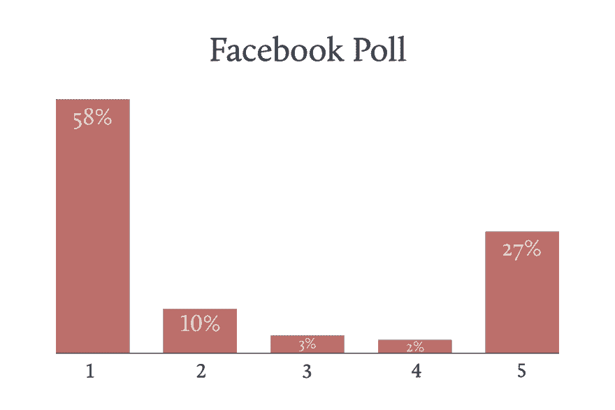
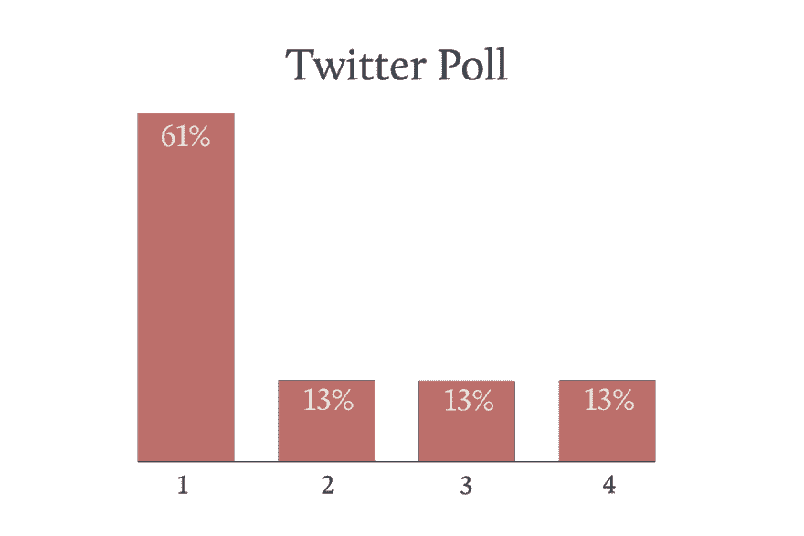

# 电子邮件不是合同

> 原文：<https://dev.to/websmyth/an-email-is-not-a-contract-13m8>

做自由职业者的第一条规则是:永远使用合同。至少每个自由职业者指南都是这么告诉你的。

我想知道自由职业者是否以及如何使用它们:他们是让客户签合同，还是相反？为了找到答案，我在推特上发起了一项投票，并在 T2 自由英雄脸书小组发起了一项相同的投票。

1:客户签署我的合同(58%)
2:我签署我的客户的合同(10%)
3:我将我的条款包括在我的客户的合同中(3%)
4:我和我的客户签署彼此的合同(2%)
5:我不使用合同(27%)
总受访者:182

1:客户签署我的合同(61%)
2:我签署我的客户的合同(13%)
3:我和我的客户签署对方的合同(13%)
4:我不使用合同(13%)
受访者总数:119
两项民意调查中的大多数受访者都使用合同，这是个好消息，但仍有相当一部分人不使用。

## 我为什么在乎？

该问题要求不使用合同的受访者说出原因。我想了解关于合同使用的担忧是什么，是什么阻碍了自由职业者使用它们。

我做自由职业已经有一段时间了。读到自由职业者被不择手段的客户剥削的消息，我很难过。幸运的是，属于这个标签的客户数量很少，但是他们确实存在！

我读过的大多数自由职业者的恐怖故事，如果有一份可靠的合同，都可以避免，或者更容易解决。本着帮助自由职业者群体的精神，我认为总结一下自由职业者说他们不使用合同的一些原因并解释合同如何帮助他们可能是有用的。

### 这些都写在邮件里了

如果你必须在使用电子邮件线索和口头协议之间做出选择，你会选择前者，但它不能代替合同。

除了规定工作范围之外，合同最重要的方面是:

1.  概述参与项目的每个人的职责
2.  解释程序以及如果出现问题会发生什么

如果你的电子邮件记录中包含了一份涵盖上述所有内容的协议，这与合同没有什么不同。然而，如果你的电子邮件不包含这些条款，你就错过了合同将提供的一些关键保护。

### 不值得花时间去准备一个

对于小工作，可能不值得花时间准备合同，但这取决于你愿意承担多大的风险。

在大多数情况下，我准备合同的时间不会超过一个小时，如果我不需要修改条款的话，可能只有 15-30 分钟。

你要问自己的问题是:你愿意损失多少时间和工作？对于一个需要一两个小时的工作，一份合同可能不值得。但是半天或者更久呢？

### 我不想让潜在客户离开

我从来没有客户拒绝签署我的合同。如果他们反对，这表明他们对这个项目不认真，我会离开。

从客户的角度考虑一下。当你签署合同的时候，客户已经在投入大量时间后选择了与你合作。如果你的合同合理，他们没有理由不签。

值得记住的是，合同也应该为客户提供保护和保证。使用合同还能让你的产品更专业，显示你对自己的工作很认真。

如果你觉得客户可能会受到威胁，确保你使用的合同是用简单的英语写的。安迪·克拉克的开源软件合同杀手就是一个很好的例子。

### 我信任和我一起工作的人/我是如此专业，从来不会出错！

这些原因从根本上误解了合同的含义。不——没有人会在签订合同时预期事情会出错，但这种情况偶尔会发生。

在这一点上，信任不会帮助你，但合同会。

### 我以前在这家公司工作过

这个原因与上面的信任问题有关，但还有另一个潜在的因素:人们会跳槽。

您希望避免的情况是:

1.  你在公司认识的人让你做一些工作
2.  在某个时候，在你开始工作后，你的联系人换了工作
3.  你提交发票，发现他们已经不在那里工作了。他们的替代者或经理不会遵守最初的协议

通过声明签字人有权代表他们所代表的公司同意，合同可以防止这种情况发生。

### 我担心漏掉什么东西

我没有马上开始使用合同，因为我担心遗漏了一个关键因素。

最好有一些不涵盖所有场景的东西，而不是什么都没有。你的合同会随着你获得更多的经验而发展，所以只要把一些东西放在一起并开始使用它。

如果你不确定从哪里开始，要么寻找模板，要么要求查看其他自由职业者的合同。像[独立工作](https://independent.work)这样的团体和像 [IPSE](https://www.ipse.co.uk/joinme/088765/) 或 [FSB](https://www.fsb.org.uk/) 这样的专业团体是很好的入门资源。

## 想让你的专业赔偿保险公司帮忙？

希望你不需要用你的合同来解决冲突。如果事情出了问题，你需要涉及你的专业赔偿保险公司的任何原因，合同可以是有益的。

专业英国自由保险公司[和杰克](https://websmyth.co/withjack)的创始人阿什利·巴克斯特完美地总结了这一点:

> 假设一个客户对你提出指控。也许他们对你完成的工作质量不满意，或者他们指责你没有按照商定的范围或时间表交付商定的工作。
> 
> 你需要做的第一件事是让你的保险公司参与进来，这样他们可以提供法律建议，防止事态升级(别担心，法律专家的费用包含在你的保单中)。如果你能向保险公司提供你和你的客户之间的合同，他们就能更好地帮助你。
> 
> 这份合同将清楚地概述你和你的客户双方的职责。当这些职责受到质疑时，这将加强你的理由。有一份合同不会阻止客户对你提出索赔，但是如果你已经有了一份合同，你会有更好的机会得到一个积极的结果。"

## 国际客户

对于那些与世界各地的客户一起工作的自由职业者来说，合同是一个显而易见的事情。

除了你通常的条款，合同必须说明它是在你的国家管辖下的法律文件。如果你需要的话，这会让你更容易开始法律诉讼。

## 为您的客户带来清晰

除了使用合同的明显优势之外，另一个好处是它为您的客户提供了各种潜在痛点的清晰性。除了支付条款和滞纳金，它还可以涵盖一些关于你的工作过程，这意味着你的客户会知道会发生什么。

你的合同提供了设定客户期望的绝佳机会。如果没有事先明确说明，在项目中期重新设定期望可能会很尴尬，所以使用你的合同来减少你需要进行的困难对话的数量。

## 总结归纳

合同不会阻止糟糕的客户行为，但一旦出现问题，它将有助于保护你。

我为我接手的每个项目都使用一个，因为我的合同谈到了我的流程和法律事务，它们已经成为我工作流程中不可或缺的一部分。

*原载于[工作笔记](https://worknotes.co.uk/contracts/an-email-is-not-a-contract/)。*