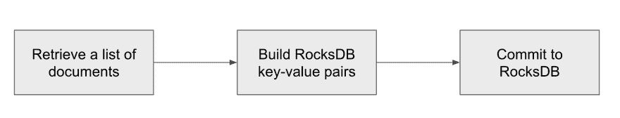
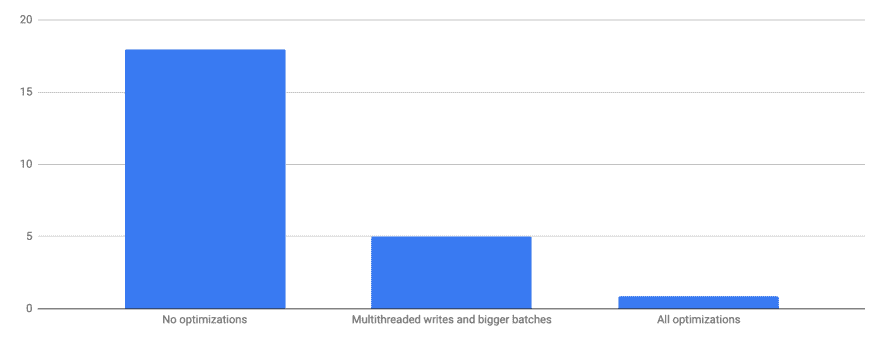

# 优化 RocksDB 中的大容量装载

> 原文：<https://dev.to/rocksetcloud/optimizing-bulk-load-in-rocksdb-3nk2>

*作者[伊戈尔·坎纳迪](https://www.linkedin.com/in/igorcanadi/)T3】*

最快什么时候可以把数据加载到 RocksDB？我们面临这一挑战，因为我们希望让我们的客户能够在他们的大数据集上快速试用 Rockset。尽管 LSM 树中的大容量数据加载是一个重要的主题，但是关于它的文章并不多。在本帖中，我们将描述将 RocksDB 的大容量装载性能提高了 20 倍的优化。虽然我们还必须解决有趣的分布式挑战，但在本文中，我们将重点关注单节点优化。我们假设您对 RocksDB 和 LSM 树数据结构有所了解。

Rockset 的写入过程包含几个步骤:

1.  第一步，我们从分布式日志存储中检索文档。一个文档代表一个以二进制格式编码 JSON 文档。
2.  对于每个文档，我们需要在 RocksDB 中插入许多键值对。下一步将文档列表转换成 RocksDB 键值对列表。至关重要的是，在这一步中，我们还需要从 RocksDB 中读取数据，以确定文档是否已经存在于存储中。如果是的话，我们需要更新二级索引条目。
3.  最后，我们将键值对列表提交给 RocksDB。

我们针对具有许多 CPU 内核的机器优化了这一过程，其中数据集的合理块(但不是全部)适合于主内存。不同的方法可能在内核数量较少或整个数据集适合主内存的情况下效果更好。

**用延迟换取吞吐量**

Rockset 是为实时写入而设计的。一旦客户将文档写入 Rockset，我们就必须将它应用到 RocksDB 中的索引。我们没有时间建立一大批文档。这是一个遗憾，因为增加批处理的大小最小化了每批操作的大量开销。但是，在大容量装载中，不需要优化单个写入延迟。在大容量加载期间，我们将写批处理的大小增加到数百 MB，这自然会导致更高的写吞吐量。

**并行写入**

在常规操作中，我们只使用一个线程来执行写入过程。这就足够了，因为 RocksDB 通过压缩将大部分写处理委托给了后台线程。对于查询工作负载，还需要几个内核。在初始大容量装载期间，查询工作量并不重要。所有内核都应该忙于写入。因此，我们并行化了写过程——一旦我们构建了一批文档，我们就将该批文档分发给工作线程，其中每个线程独立地将数据插入 RocksDB。这里重要的设计考虑是最小化对共享数据结构的独占访问，否则，写线程将等待，而不是写。

**避免记忆表**

RocksDB 提供了一个特性，您可以自己构建 SST 文件并将它们添加到 RocksDB，而不需要通过 memtable，这个特性称为 [IngestExternalFile()](https://rocksdb.org/blog/2017/02/17/bulkoad-ingest-sst-file.html) 。这个特性非常适合大容量装载，因为写线程不必将它们的写操作同步到 memtable。写线程都是独立排序自己的键值对，构建 SST 文件，添加到 RocksDB。将文件添加到 RocksDB 是一种廉价的操作，因为它只涉及元数据更新。

在当前版本中，每个写线程构建一个 SST 文件。但是，对于许多小文件，我们的压缩速度要慢于较小数量的大文件。我们正在探索一种方法，在这种方法中，我们将并行排序来自所有写线程的键值对，并为每个写批处理生成一个大的 SST 文件。

**关闭压缩时的挑战**

将数据大容量装载到 RocksDB 中最常见的建议是关闭压缩，最后执行一次大压缩。官方 [RocksDB 性能基准](https://github.com/facebook/rocksdb/wiki/Performance-Benchmarks#test-1-bulk-load-of-keys-in-random-order)中也提到了这种设置。毕竟，RocksDB 执行压缩的唯一原因是以写开销为代价优化读操作。然而，这个建议有两个非常重要的警告。

在 Rockset 中，我们必须对每个文档写入执行一次读取——我们需要进行一次主键查找，以检查新文档是否已经存在于数据库中。随着压缩的关闭，我们很快就拥有了成千上万的 SST 文件，主键查找成为了最大的瓶颈。为了避免这种情况，我们在数据库中的所有主键上构建了一个 bloom 过滤器。因为在批量装载中我们通常没有重复的文档，所以 bloom filter 使我们能够避免昂贵的主键查找。细心的读者会注意到，RocksDB 也构建了 bloom 过滤器，但它是针对每个文件的。检查数以千计的布鲁姆过滤器仍然很昂贵。

第二个问题是，默认情况下，最终压缩是单线程的。RocksDB 中有一个特性，可以通过选项 [max_subcompactions](https://github.com/facebook/rocksdb/blob/d61d4507c0980b544e87fd0aa5ed2990a45dad5e/include/rocksdb/options.h#L563-L567) 实现多线程压缩。然而，为我们的最终压缩增加子压缩的数量没有任何作用。当所有文件都在 0 级时，压缩算法无法为每个子压缩找到好的边界，因此决定使用单线程。我们通过首先执行启动压缩来解决这个问题——我们首先用 [CompactFiles()](https://github.com/facebook/rocksdb/wiki/Manual-Compaction#compactfiles) 压缩少量文件。既然 RocksDB 有一些非 0 级别的文件，这些文件是按范围划分的，它可以确定良好的子压缩边界，多线程压缩在所有内核都很忙的情况下非常有效。

我们的 0 级文件没有压缩——我们不想降低写线程的速度，压缩它们的好处有限。最终压缩会压缩输出文件。

**结论**

通过这些优化，我们可以在使用 18 个内核的情况下，在 52 分钟内(70 MB/s)加载 200GB 未压缩物理字节的数据集(LZ4 压缩时为 80GB)。初始荷载需要 35 分钟，随后是 17 分钟的最终压实。没有任何优化，加载需要 18 个小时。通过仅增加批处理大小和并行化写线程，而不改变 RocksDB，加载需要 5 个小时。注意，所有这些数字都是在单个节点 RocksDB 实例上测量的。Rockset 在多个节点上并行写入，可以实现更高的写入吞吐量。

将数据大容量加载到 RocksDB 可以建模为大型并行排序，其中数据集不适合内存，还有一个额外的约束，即我们还需要在排序时读取部分数据。在并行排序方面有很多有趣的工作，我们希望调查一些技术，并尝试在我们的环境中应用它们。我们还邀请其他 RocksDB 用户分享他们的大容量装载策略。

我非常感谢所有帮助过这个项目的人——我们出色的实习生 Jacob Klegar 和 Aditi SrinivasanDhruba Borthakur、Ari Ekmekji 和 Kshitij Wadhwa。