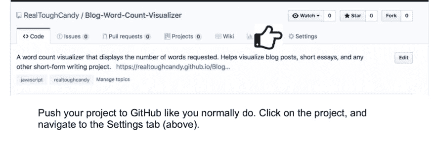
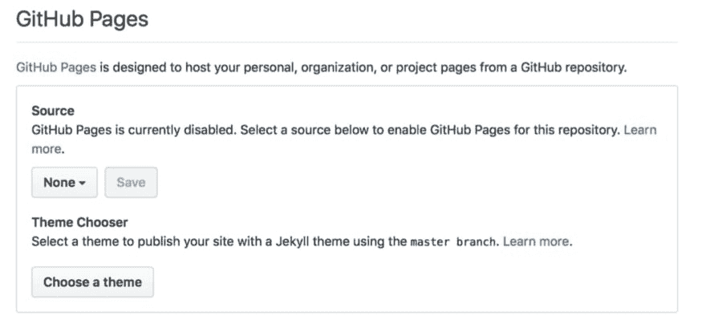
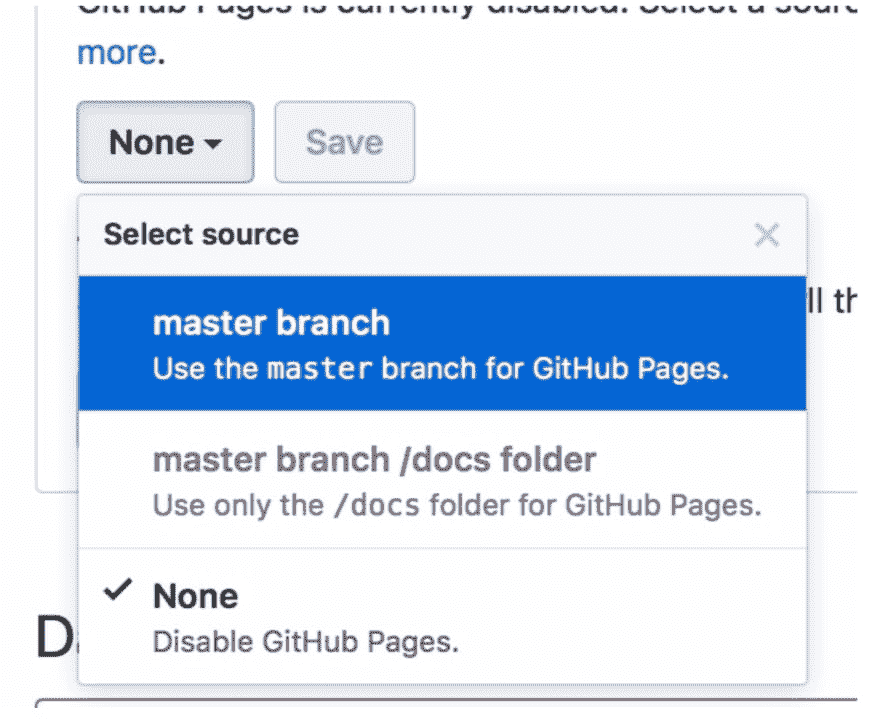
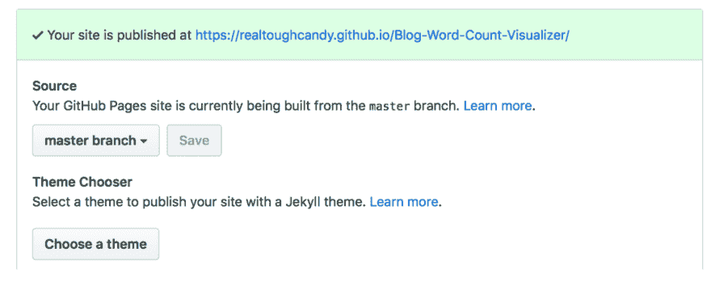
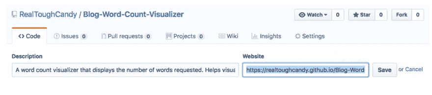
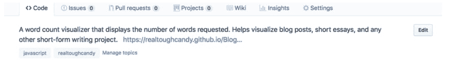
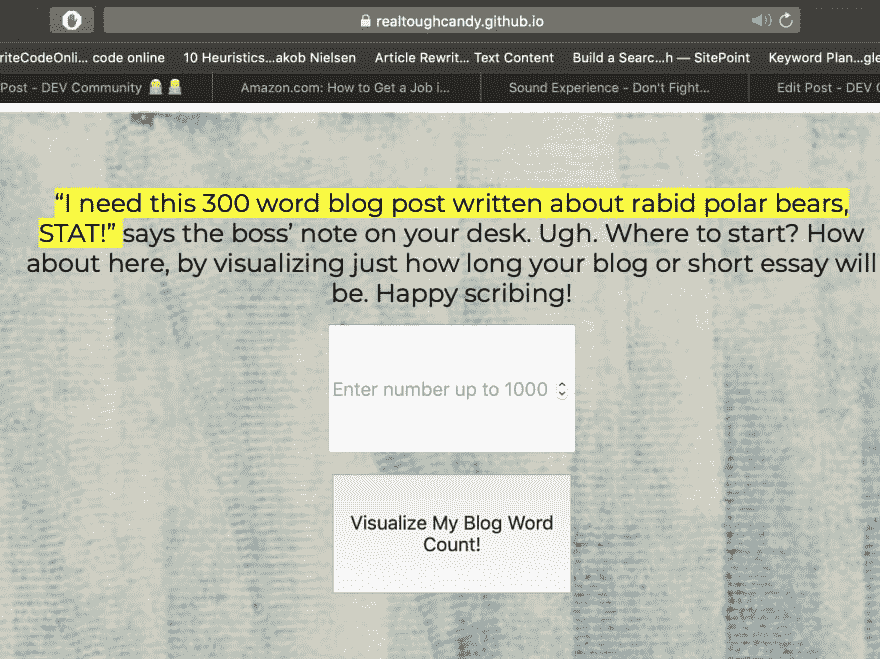

# GitHub 页面和工作演示:求职者的秘密武器

> 原文：<https://dev.to/realtoughcandy/github-pages-working-demos-a-job-seeker-s-secret-weapon-anp>

#### 以下是我的书*如何在网络开发领域找到一份工作*的摘录，可以在[亚马逊](https://amzn.to/2Z6Os5q)上买到，有平装本和 Kindle 版本。也是一门 [Udemy 课程！](https://www.udemy.com/course/how-to-get-a-job-in-web-development/?couponCode=YOUTUBER)

## 经常被忽视的一个主要 GitHub 特性是 GitHub 页面。

如果你是一名正在找工作的网络开发人员，这可能是你申请材料中的一个杀手。这个特性让你可以直接在 GitHub 上免费将你的代码转换成工作演示。有什么比在 GitHub 上向雇主展示你的能力更好的方法呢？

### GitHub pages 的额外好处是设置和部署非常快。

虽然您不能演示任何全栈或后端项目(除非您使用 Firebase 之类的东西)，但您的前端项目可以成为焦点。

例如，假设您开发了一个字数统计可视化应用程序。这是 GitHub 页面的一个很好的候选，因为它不需要访问数据库。

#### 下面是你的设置方法。

向下滚动到 GitHub 页面块。

在*源*下，默认为*无*，这样你就可以选择你想要的分支(本例中为*主*)。单击保存。

现在，您将看到为您的项目新创建的 URL:

几分钟后(有时更长)，该页面将被激活。几乎完成:我们仍然需要雇主和其他重要的人来看到这个项目实际上有一个工作演示。

复制项目 GitHub 页面的 URL。导航到代码选项卡。在右边你会看到编辑按钮。粘贴到网站标签。

访问者现在可以在回购中点击您的演示。

## Taadaaaaaaa:

作为求职者，如果你有全栈或后端项目，你仍然希望有一个工作演示。无论您决定在哪里托管它，请按照上面的步骤粘贴演示的 URL。

### 记住:这是你的展柜！

使用 GitHub 页面，用您的功能性、快速性、创造性和美观的项目让这些雇主眼花缭乱。

附言:在 YouTube 上关注我，我在那里谈论了很多很酷的网络开发的东西:

