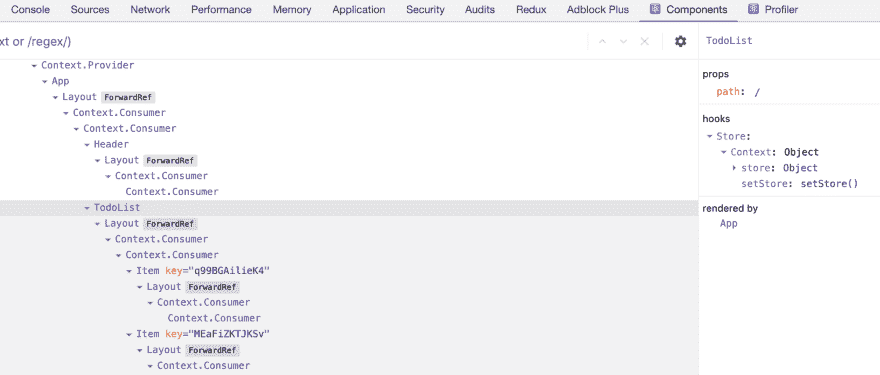

# const [store，setStore] = useStore():一次性反应状态管理🍸

> 原文：<https://dev.to/malloc007/const-store-setstore-usestore-one-shot-react-state-management-f6l>

这篇文章介绍了我的库和我对反应状态管理的看法。点击下面的链接，你很快就可以看到并尝试 muriatic 了。正在检查集线器！😄[https://github.com/ryota-murakami/muriatic](https://github.com/ryota-murakami/muriatic)

### 我挑了 UI 库叫 React。但是我不确定为什么我现在在国家管理中挣扎🤯

当然[我也有过，](https://github.com/ryota-murakami/trueblue/tree/master/app/Resources/js)当我开始 React 时，我读了一篇非常高级的 Redux 项目指南/文章，度过了一段艰难的时光。我记得我不能在头两天内将商店数据更新为消防调度行动。

我认为这种不愉快的趋势会很快改善，或者已经完成。

那时，我们有了新的上下文 API 和挂钩，比如 useState()、useContext()。此外，我还阅读了肯特·c·多兹的《React 是一个国家管理库》，并对此表示赞同。

我认为 2019 年 React 开发商与 2013 年至 2016 年相比有两个重要事实。

### **1。React 用户上下文正式发布，并发布挂钩**

关于数据管理，有许多方法或选项来自上述特性。根据 Dan Abramov 的推文，他推荐了 useReducer()和 useContext()钩子。

关键点是 React 内置的数据管理功能是“道具”，只有“状态”。上下文是一个内部隐藏特性，一般开发人员是不允许的。

要制作状态管理库，几乎所有情况都需要上下文。状态管理库是由对无文档、不稳定、无保证的[遗留](https://reactjs.org/docs/context.html#legacy-api) API 有深入了解的人创建的。

但是在那个时候，上下文对每个人都是开放的，我们有简单的方法来实现一个叫做钩子的东西。

### **2。React 开发工具的发展**

日前，[新的 React 开发工具](https://reactjs.org/blog/2019/08/15/new-react-devtools.html)发布。
这非常有用，你可以看到特定组件的状态值、上下文值、使用什么类型的钩子等等..

[](https://res.cloudinary.com/practicaldev/image/fetch/s--Vh_Pk4aR--/c_limit%2Cf_auto%2Cfl_progressive%2Cq_auto%2Cw_880/https://thepracticaldev.s3.amazonaws.com/i/wuwccecukxuiejgqe8zy.png)

因此，我们不必依赖 redux-devtools 来即时调试数据值。

### **结论**

而几年来，(2013~2016) React 的发展受到了与复杂的状态管理库紧密耦合的影响和展开。
结果，新的 React 用户压倒性地学习专家的高级抽象，[在有机会做出决定之前“我需要这个库吗？”。](https://dev.to/devteam/you-might-not-need-redux-1n2n-temp-slug-6127410)

即使在过去 2010 年的运行中，我们得到了上述直接的数据管理方法。

我的库也只是从我的结合上下文和钩子的便利值存储模式中提取的东西，没有多余的东西。
[muriatic](https://github.com/ryota-murakami/muriatic) 用法是包装你的 App

```
<Provider store={{foo: 100}}>  
 <App/>  
</Provider> 
```

然后把这个调用成一个组件函数，就这样。

**const [store，setStore] = useStore()**

如果你有这样的情况，比如立即获得方便的数据存储，我很高兴你使用它来减少家务时间。
[https://github.com/ryota-murakami/muriatic](https://github.com/ryota-murakami/muriatic)

以下短语写在 React [自述](https://github.com/facebook/react)的顶部。

> React 是一个用于构建用户界面的 JavaScript 库。

从[一次性获得数据存储后，我们可能会更好地专注于 UI 开发🍸。](https://github.com/ryota-murakami/muriatic#example)