# 将 webMethods Integration Server 与 Apache Qpid 2.9 一起使用

> 原文：<https://dev.to/techcommunity/using-webmethods-integration-server-with-apache-qpid-2-9-480b>

*Sury nagara Jan，产品管理，软件公司*

#### 目录 [[-]](https://dev.tojavascript:;)

*   Zero point one
*   0.2 摘要
*   0.3 适用性
*   0.4 配置
*   0.5 接收消息
*   0.6 发送消息

### 摘要

集成服务器(IS)支持使用最广泛使用的 JMS 提供者发送和接收消息。本文描述了如何配置到 Apache Qpid 服务器的 JMS 连接，这在标准文档中没有描述。

### 适用性

产品:集成服务器

版本:7.1.x、8.0、8.2

| 重要说明:Software AG 尚未正式测试，并且明确不支持这种类型的 Apache Qpid 连接。此处描述的配置已被发现在现场有效，任何使用此配置的人都要自担风险。 |
| --- |

### 配置

1.  如果您的 IS 是 8.x，请跳过以下步骤。is 8.x 预捆绑了所有需要的 jar。
2.  将 qpid-client-0.12.jar 和 qpid-common-0.12.jar 添加到 <integrationserver>/lib/jars 中</integrationserver>
3.  重新启动集成服务器
4.  导航到集成服务器管理器中的设置>消息传递> JNDI 设置，创建 JNDI 提供商别名

| [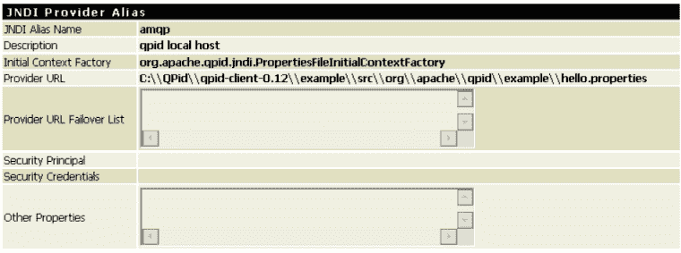 ](https://res.cloudinary.com/practicaldev/image/fetch/s--xlhKoQMM--/c_limit%2Cf_auto%2Cfl_progressive%2Cq_auto%2Cw_880/http://techcommunity.softwareag.com/c/wiki/get_page_attachment%3Fp_l_id%3D10160%26nodeId%3D11809%26title%3D%26fileName%3DUsing%2BwebMethods%2BIntegration%2BServer%2Bwith%2BApache%2BQpid%252F11.png) |

Hello.properties 文件可以位于 IS 主机上的任何位置，并且应该包含以下内容:

| [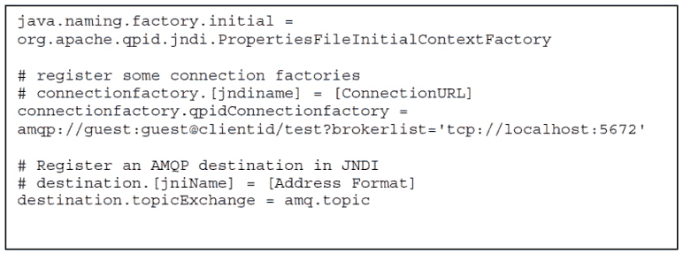 ](https://res.cloudinary.com/practicaldev/image/fetch/s--g7ouZK0J--/c_limit%2Cf_auto%2Cfl_progressive%2Cq_auto%2Cw_880/http://techcommunity.softwareag.com/c/wiki/get_page_attachment%3Fp_l_id%3D10160%26nodeId%3D11809%26title%3D%26fileName%3DUsing%2BwebMethods%2BIntegration%2BServer%2Bwith%2BApache%2BQpid%252F21.png) |

1.  使用“测试查找”特性，您应该能够在 Apache Qpid 上看到连接工厂和目的地

| [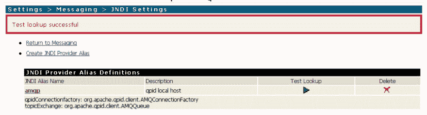 ](https://res.cloudinary.com/practicaldev/image/fetch/s--yG57th9c--/c_limit%2Cf_auto%2Cfl_progressive%2Cq_auto%2Cw_880/http://techcommunity.softwareag.com/c/wiki/get_page_attachment%3Fp_l_id%3D10160%26nodeId%3D11809%26title%3D%26fileName%3DUsing%2BwebMethods%2BIntegration%2BServer%2Bwith%2BApache%2BQpid%252F3.png) |

1.  使用上面创建的 JNDI 提供者别名创建 JMS 连接别名

| [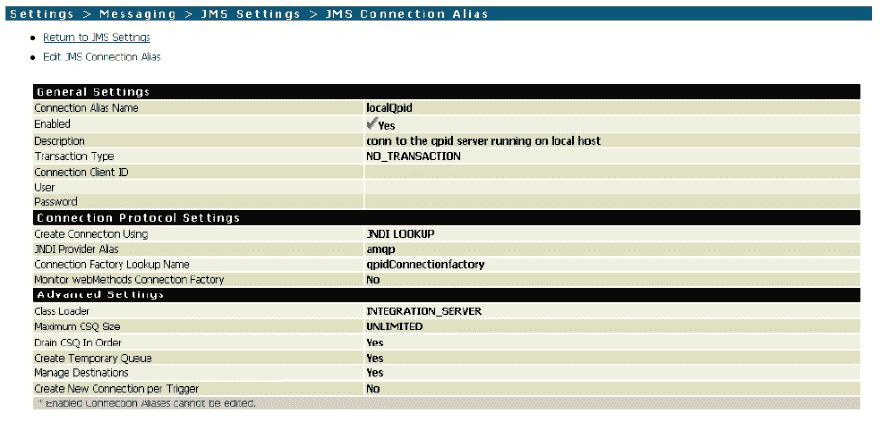 ](https://res.cloudinary.com/practicaldev/image/fetch/s--L9KZJ6Ju--/c_limit%2Cf_auto%2Cfl_progressive%2Cq_auto%2Cw_880/http://techcommunity.softwareag.com/c/wiki/get_page_attachment%3Fp_l_id%3D10160%26nodeId%3D11809%26title%3D%26fileName%3DUsing%2BwebMethods%2BIntegration%2BServer%2Bwith%2BApache%2BQpid%252Farticle-qpid-1.png) |

1.  启用 JMS 连接-应该会正确启用

| [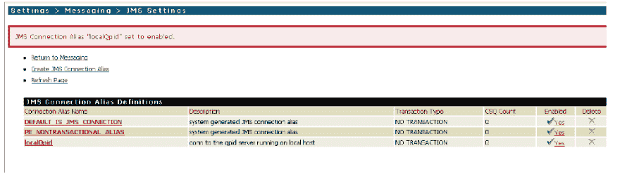 ](https://res.cloudinary.com/practicaldev/image/fetch/s--IH_lKdQu--/c_limit%2Cf_auto%2Cfl_progressive%2Cq_auto%2Cw_880/http://techcommunity.softwareag.com/c/wiki/get_page_attachment%3Fp_l_id%3D10160%26nodeId%3D11809%26title%3D%26fileName%3DUsing%2BwebMethods%2BIntegration%2BServer%2Bwith%2BApache%2BQpid%252F5.png) |

* * *

### 接收消息

1.  Apache AMQP.2 上已存在名为“topicExchange”的主题。请创建触发器。请确保将目标名称指定为 topicExchange。

| [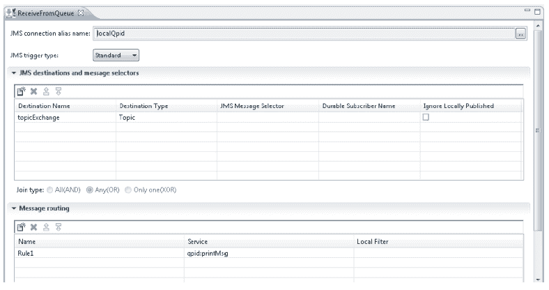 ](https://res.cloudinary.com/practicaldev/image/fetch/s--c_Grni4A--/c_limit%2Cf_auto%2Cfl_progressive%2Cq_auto%2Cw_880/http://techcommunity.softwareag.com/c/wiki/get_page_attachment%3Fp_l_id%3D10160%26nodeId%3D11809%26title%3D%26fileName%3DUsing%2BwebMethods%2BIntegration%2BServer%2Bwith%2BApache%2BQpid%252F6.png) |

1.  使用打印出消息的触发器服务

| [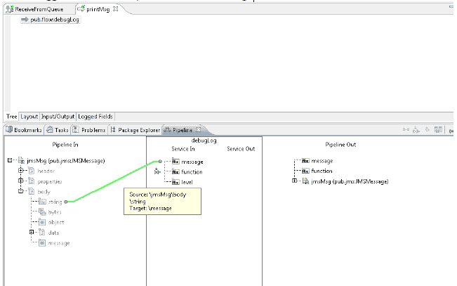 ](https://res.cloudinary.com/practicaldev/image/fetch/s--W6pi-c1H--/c_limit%2Cf_auto%2Cfl_progressive%2Cq_auto%2Cw_880/http://techcommunity.softwareag.com/c/wiki/get_page_attachment%3Fp_l_id%3D10160%26nodeId%3D11809%26title%3D%26fileName%3DUsing%2BwebMethods%2BIntegration%2BServer%2Bwith%2BApache%2BQpid%252F7.png) |

1.  使用 pub.jms.send 服务向“topicExchange”发送消息。

| [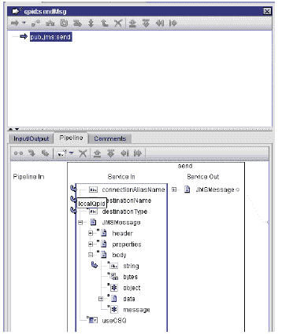 ](https://res.cloudinary.com/practicaldev/image/fetch/s--Y899qlq_--/c_limit%2Cf_auto%2Cfl_progressive%2Cq_auto%2Cw_880/http://techcommunity.softwareag.com/c/wiki/get_page_attachment%3Fp_l_id%3D10160%26nodeId%3D11809%26title%3D%26fileName%3DUsing%2BwebMethods%2BIntegration%2BServer%2Bwith%2BApache%2BQpid%252F8.png) |

1.  在正文中输入一条消息，然后按“发送”

| [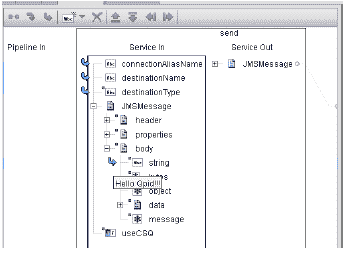 ](https://res.cloudinary.com/practicaldev/image/fetch/s--3MZjz9e0--/c_limit%2Cf_auto%2Cfl_progressive%2Cq_auto%2Cw_880/http://techcommunity.softwareag.com/c/wiki/get_page_attachment%3Fp_l_id%3D10160%26nodeId%3D11809%26title%3D%26fileName%3DUsing%2BwebMethods%2BIntegration%2BServer%2Bwith%2BApache%2BQpid%252F9.png) |

1.  您应该会在 IS 服务器日志中看到一条消息，表明来自 IS 的订阅成功

|  |

* * *

### 发送消息

1.  创建一个流服务，该服务使用内置服务 pub:jms:send 向 Apache Qpid 主题发送消息

2.  指定连接别名、目标名称和类型

|  |

| [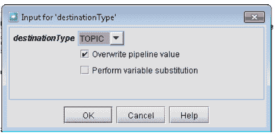 ](https://res.cloudinary.com/practicaldev/image/fetch/s--T3mN7t_k--/c_limit%2Cf_auto%2Cfl_progressive%2Cq_auto%2Cw_880/http://techcommunity.softwareag.com/c/wiki/get_page_attachment%3Fp_l_id%3D10160%26nodeId%3D11809%26title%3D%26fileName%3DUsing%2BwebMethods%2BIntegration%2BServer%2Bwith%2BApache%2BQpid%252F12.png) |

1.  添加测试消息并运行服务

| [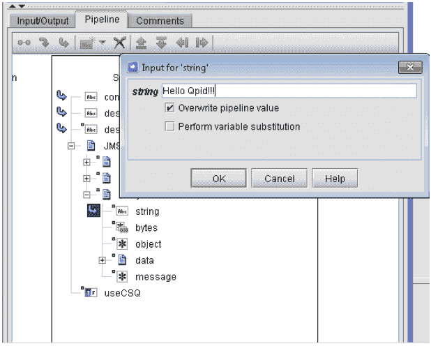 ](https://res.cloudinary.com/practicaldev/image/fetch/s--3zYufvQX--/c_limit%2Cf_auto%2Cfl_progressive%2Cq_auto%2Cw_880/http://techcommunity.softwareag.com/c/wiki/get_page_attachment%3Fp_l_id%3D10160%26nodeId%3D11809%26title%3D%26fileName%3DUsing%2BwebMethods%2BIntegration%2BServer%2Bwith%2BApache%2BQpid%252F13.png) |

1.  先前创建的触发器会收到这条消息，您应该能够通过服务器日志来验证这一点。

|  |

| 本文档中的信息按原样提供，不含任何担保。软件公司不对任何不准确的结果负责。 |
| --- |

* * *