# 安装 MacOS

> 原文：<https://dev.to/th3n00bc0d3r/installing-macos-3kb4>

我见过许多人拥有 macbooks，是的，你喜欢 mac，但我一直在想，控制一个你高度依赖的环境是一件合乎逻辑的事情。我见过有人连重装一个 windows 的基本功都没有，但是说到重装一个 MAC，该死！，其技术性。

```
I think.. "Technical is a term, invented to make people believe that they should not do something that the inventor wants to hide 
```

<svg width="20px" height="20px" viewBox="0 0 24 24" class="highlight-action crayons-icon highlight-action--fullscreen-on"><title>Enter fullscreen mode</title></svg> <svg width="20px" height="20px" viewBox="0 0 24 24" class="highlight-action crayons-icon highlight-action--fullscreen-off"><title>Exit fullscreen mode</title></svg>

**让我们揭开 MAC 安装的神秘面纱**

插入我们刚刚制作的 USB Mac 安装程序，重启电脑，按住 _ _ command(⌘)–r _ _

[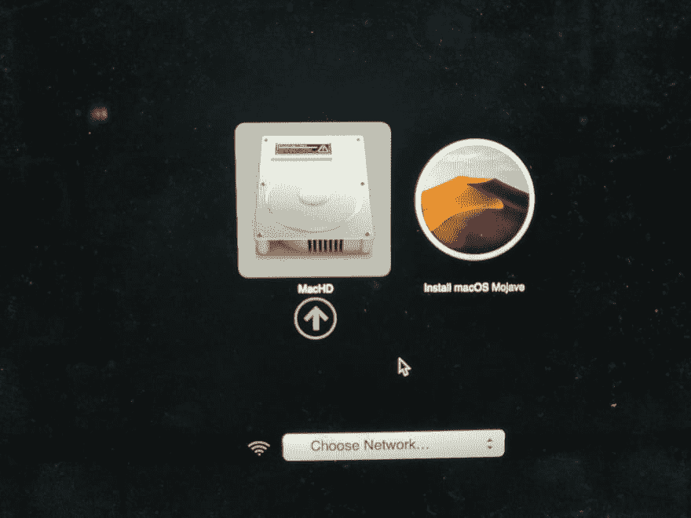](https://res.cloudinary.com/practicaldev/image/fetch/s--bt5pZClr--/c_limit%2Cf_auto%2Cfl_progressive%2Cq_auto%2Cw_880/https://i.ibb.co/nwnKCK1/IMG-20190812-193137.jpg)

现在，第一个苹果电脑所在的硬盘上的圆圈图标是 USB。使用键盘选择圆形图标，然后按回车键。

[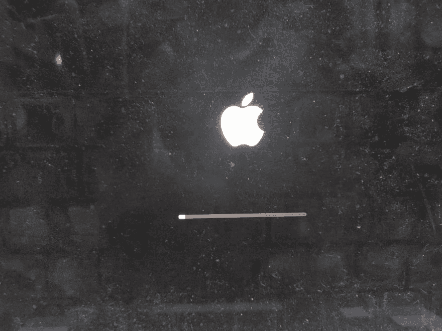](https://res.cloudinary.com/practicaldev/image/fetch/s--iSJ6lWnQ--/c_limit%2Cf_auto%2Cfl_progressive%2Cq_auto%2Cw_880/https://i.ibb.co/DM69y2q/IMG-20190812-193205.jpg)

你应该有加载程序，然后欢迎一个 MacOS 实用程序屏幕

[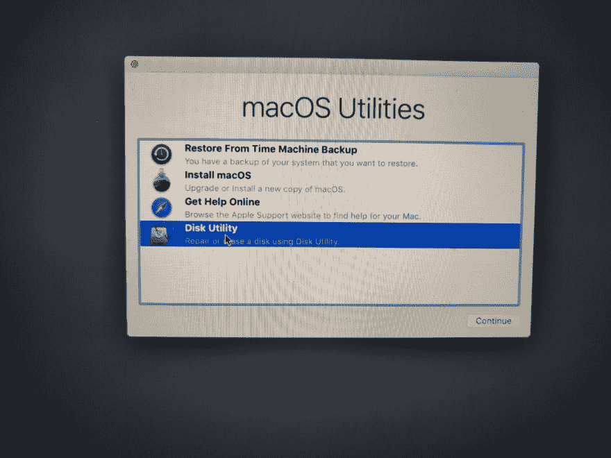](https://res.cloudinary.com/practicaldev/image/fetch/s--SYW8aI1T--/c_limit%2Cf_auto%2Cfl_progressive%2Cq_auto%2Cw_880/https://i.ibb.co/5GNSJZ2/IMG-20190812-193627.jpg)

双击磁盘实用程序部分，因为我们将全新安装 MacOS。

[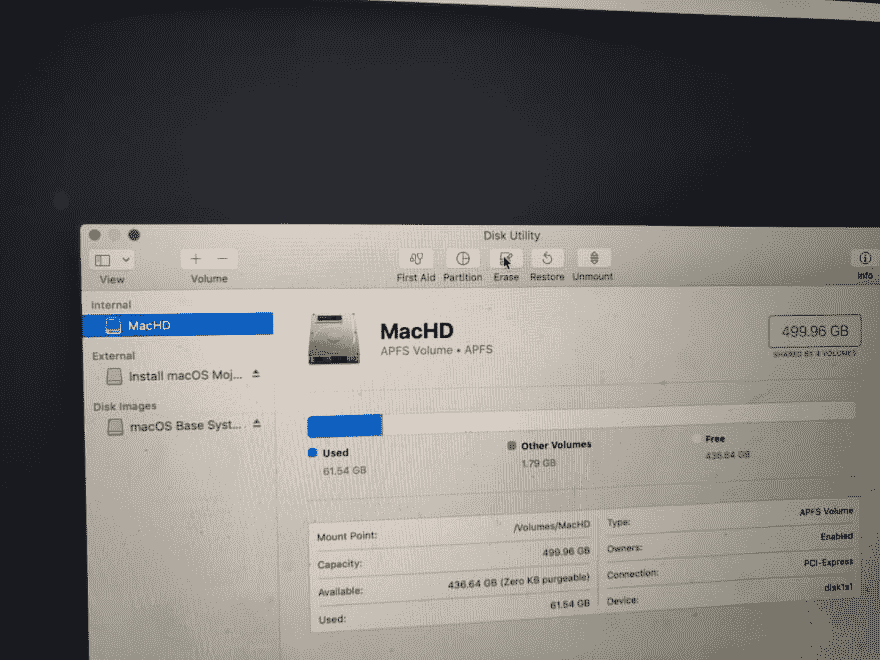](https://res.cloudinary.com/practicaldev/image/fetch/s--7DVpgk_8--/c_limit%2Cf_auto%2Cfl_progressive%2Cq_auto%2Cw_880/https://i.ibb.co/yk4R929/IMG-20190812-193643.jpg)

选择出现在内部的名称，这将是你的硬盘驱动器

[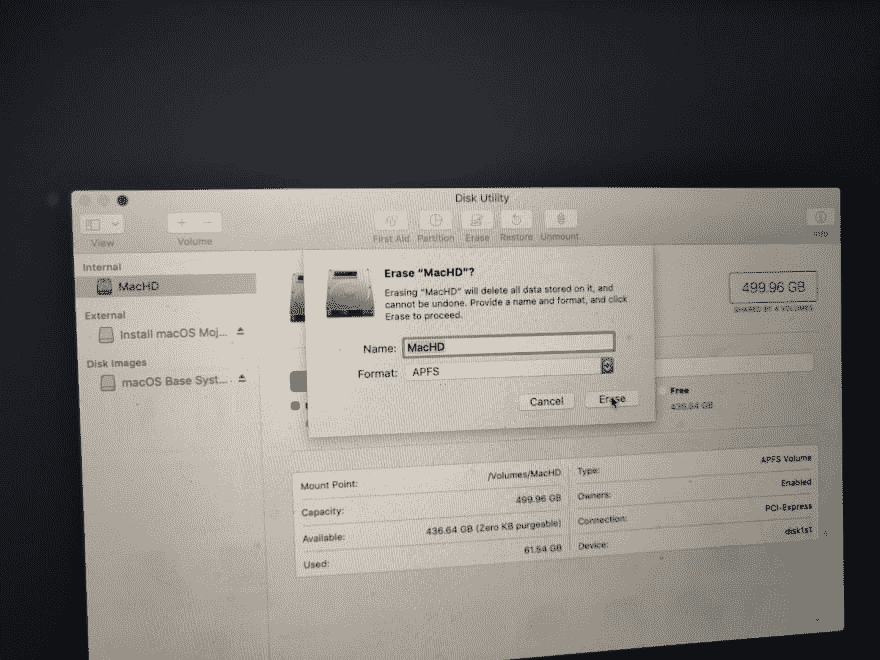](https://res.cloudinary.com/practicaldev/image/fetch/s--lI5Fgntk--/c_limit%2Cf_auto%2Cfl_progressive%2Cq_auto%2Cw_880/https://i.ibb.co/g7W9W1v/IMG-20190812-193653.jpg)

现在点击擦除并输入一个标签。Mac 已经从 HFS 转移到 APFS(苹果文件系统)，现在点击抹掉

**PS:在此之前做好你的事情，我不会也永远不会对你的数据负责**

[](https://res.cloudinary.com/practicaldev/image/fetch/s--bE8wg24y--/c_limit%2Cf_auto%2Cfl_progressive%2Cq_auto%2Cw_880/https://i.ibb.co/qJHbdJY/IMG-20190812-193658.jpg)

太好了，我们已经格式化了苹果硬盘，可以开始了。

[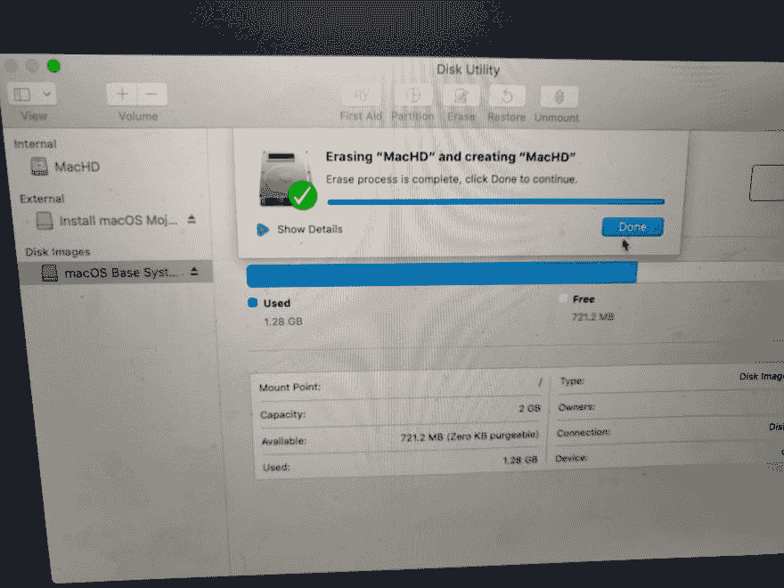](https://res.cloudinary.com/practicaldev/image/fetch/s--Hbt0H34N--/c_limit%2Cf_auto%2Cfl_progressive%2Cq_auto%2Cw_880/https://i.ibb.co/7nyRkMP/IMG-20190812-194126.jpg)

现在点击窗口左上角的红色按钮。

[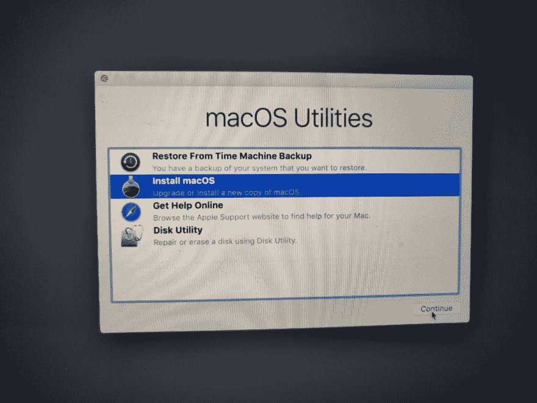](https://res.cloudinary.com/practicaldev/image/fetch/s--XZSHoLQ4--/c_limit%2Cf_auto%2Cfl_progressive%2Cq_auto%2Cw_880/https://i.ibb.co/7Jwq4tB/IMG-20190812-194140.jpg)

点击安装 Mac OS

[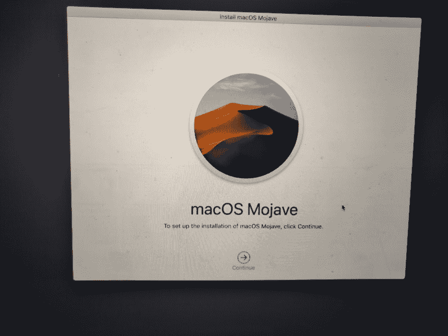](https://res.cloudinary.com/practicaldev/image/fetch/s--Nt5R9IpC--/c_limit%2Cf_auto%2Cfl_progressive%2Cq_auto%2Cw_880/https://i.ibb.co/rQLD1ry/IMG-20190812-194148.jpg)

单击继续

[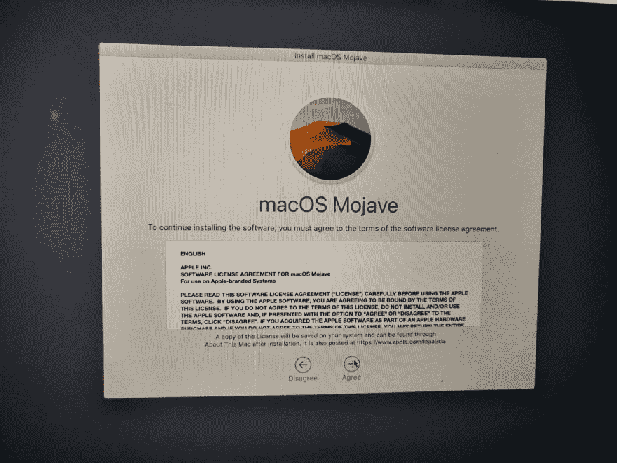](https://res.cloudinary.com/practicaldev/image/fetch/s--YroczXo2--/c_limit%2Cf_auto%2Cfl_progressive%2Cq_auto%2Cw_880/https://i.ibb.co/v4rZTkr/IMG-20190812-194154.jpg)

我说阅读协议，否则点击同意，这里没有其他选项。

[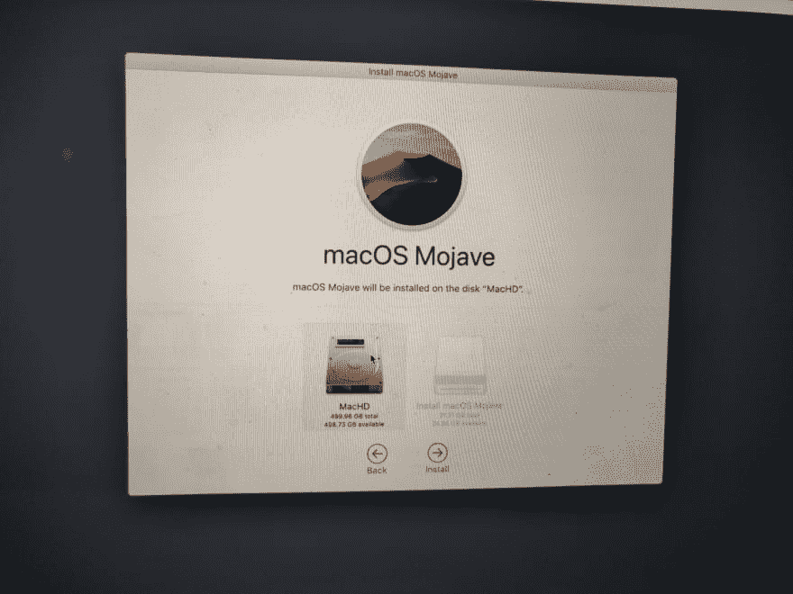](https://res.cloudinary.com/practicaldev/image/fetch/s--chmXUpk0--/c_limit%2Cf_auto%2Cfl_progressive%2Cq_auto%2Cw_880/https://i.ibb.co/TgkKKmP/IMG-20190812-194201.jpg)

选择新格式化的硬盘。单击安装

[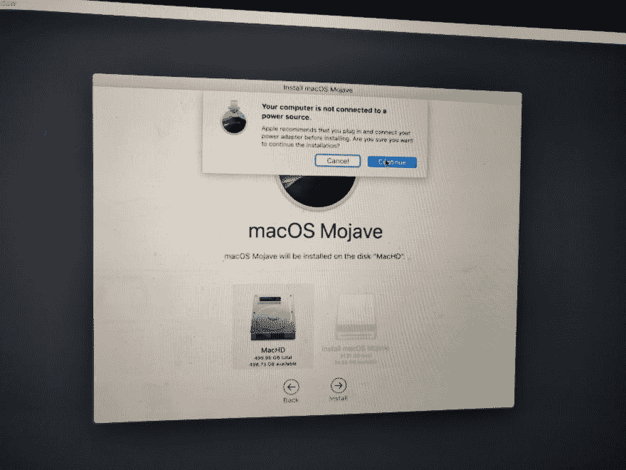](https://res.cloudinary.com/practicaldev/image/fetch/s--qe7LYf7I--/c_limit%2Cf_auto%2Cfl_progressive%2Cq_auto%2Cw_880/https://i.ibb.co/VJvR34J/IMG-20190812-194205.jpg)

现在点击继续。

[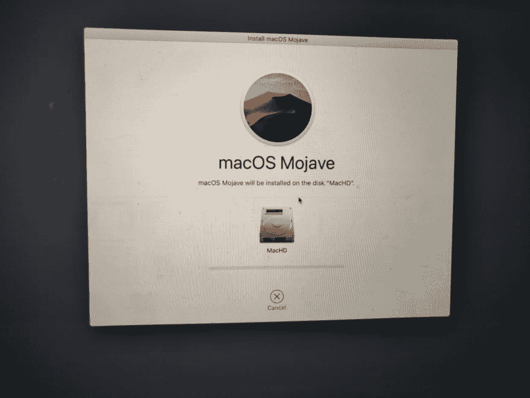](https://res.cloudinary.com/practicaldev/image/fetch/s--QRMlB-Qf--/c_limit%2Cf_auto%2Cfl_progressive%2Cq_auto%2Cw_880/https://i.ibb.co/G2nm9fz/IMG-20190812-194210.jpg)

现在，它将安装和重新启动，你会受到一个选择位置屏幕的欢迎。

[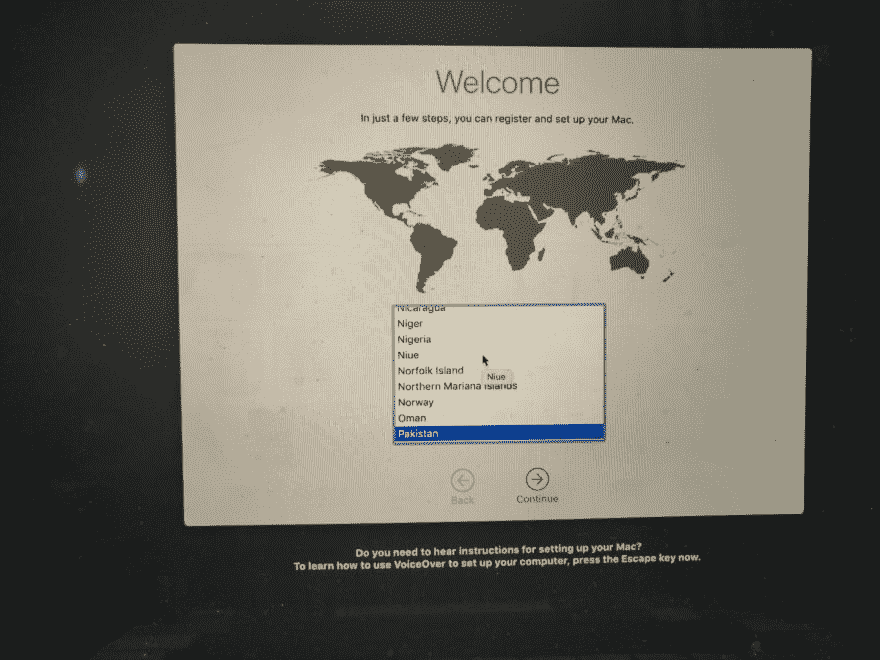](https://res.cloudinary.com/practicaldev/image/fetch/s--CGh2YL_b--/c_limit%2Cf_auto%2Cfl_progressive%2Cq_auto%2Cw_880/https://i.ibb.co/Jm9FYN4/IMG-20190812-200037.jpg)

选择位置

[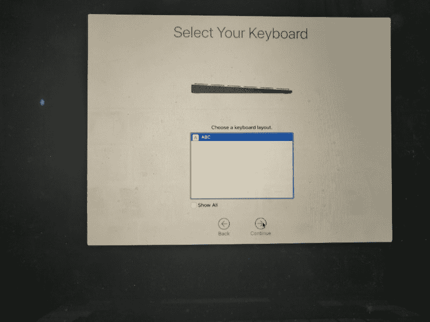](https://res.cloudinary.com/practicaldev/image/fetch/s--ij_7TYx_--/c_limit%2Cf_auto%2Cfl_progressive%2Cq_auto%2Cw_880/https://i.ibb.co/6vr8VmS/IMG-20190812-200043.jpg)

选择键盘，只需点击继续

[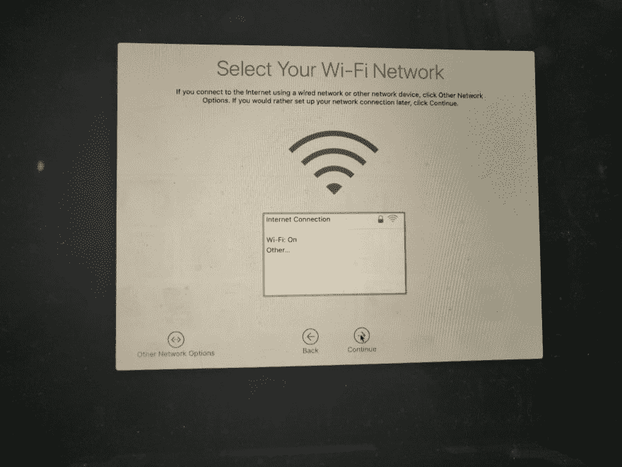](https://res.cloudinary.com/practicaldev/image/fetch/s--9Knxv7dB--/c_limit%2Cf_auto%2Cfl_progressive%2Cq_auto%2Cw_880/https://i.ibb.co/ngSKXm4/IMG-20190812-200052.jpg)

连接您的 wifi，然后点按“继续”

[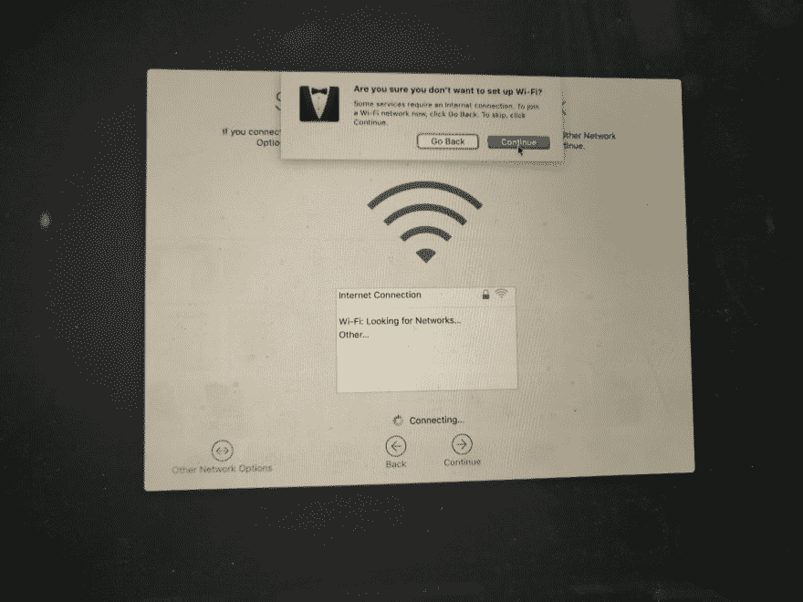](https://res.cloudinary.com/practicaldev/image/fetch/s--9D8UnX6w--/c_limit%2Cf_auto%2Cfl_progressive%2Cq_auto%2Cw_880/https://i.ibb.co/ygxv0Qs/IMG-20190812-200056.jpg)

[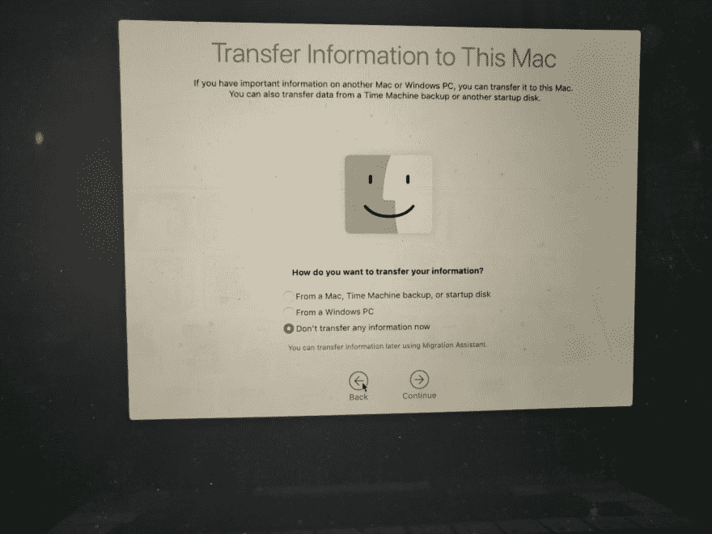](https://res.cloudinary.com/practicaldev/image/fetch/s--w-D-22B5--/c_limit%2Cf_auto%2Cfl_progressive%2Cq_auto%2Cw_880/https://i.ibb.co/4PN3tXn/IMG-20190812-200344-1.jpg)

我真的点击一个干净的香草安装，所以不要转移任何信息，然后继续。

[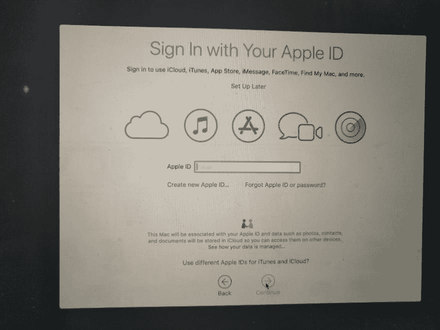](https://res.cloudinary.com/practicaldev/image/fetch/s--u7wJtYqX--/c_limit%2Cf_auto%2Cfl_progressive%2Cq_auto%2Cw_880/https://i.ibb.co/Rywn85Z/IMG-20190812-200514.jpg)

使用您的 apple ID 登录，或者创建一个。

[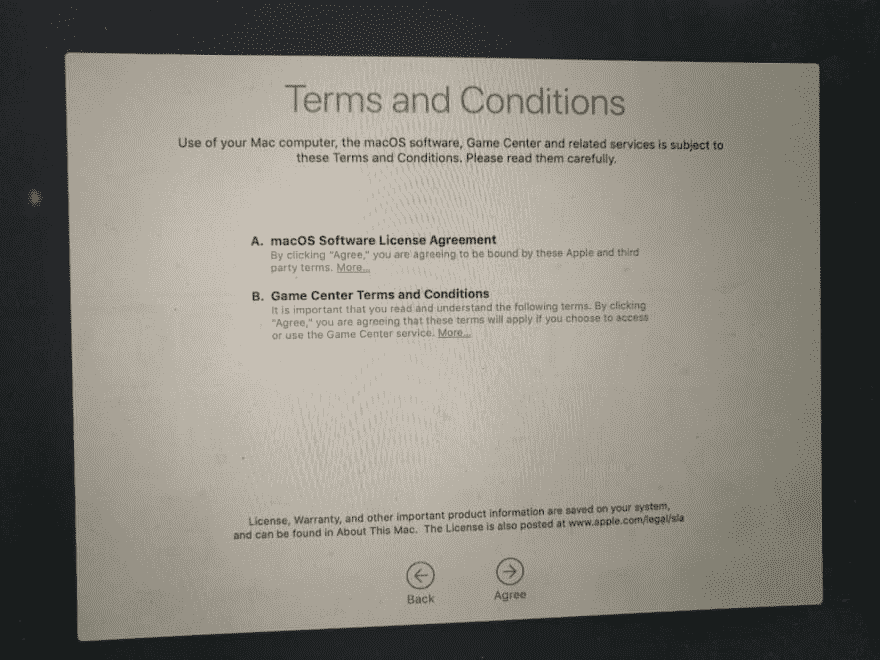](https://res.cloudinary.com/practicaldev/image/fetch/s--7kk4z2mr--/c_limit%2Cf_auto%2Cfl_progressive%2Cq_auto%2Cw_880/https://i.ibb.co/mbTxhZs/IMG-20190812-200631.jpg)

[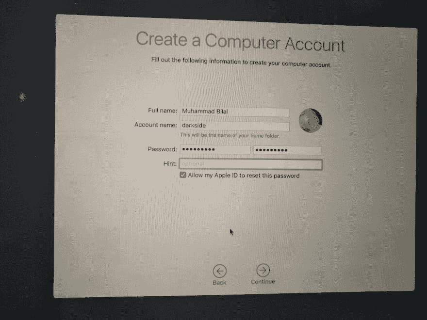](https://res.cloudinary.com/practicaldev/image/fetch/s--zhy9JyiO--/c_limit%2Cf_auto%2Cfl_progressive%2Cq_auto%2Cw_880/https://i.ibb.co/xzqRND6/IMG-20190812-200658.jpg)

填写您的信息，并给它一个密码。我们在候机厅需要它。

[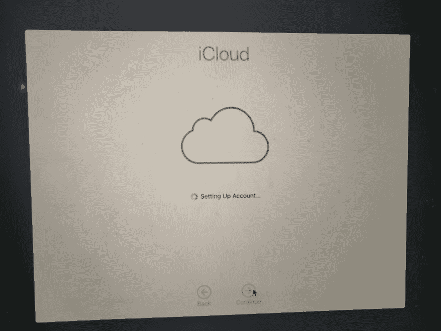](https://res.cloudinary.com/practicaldev/image/fetch/s--4bCW7ig8--/c_limit%2Cf_auto%2Cfl_progressive%2Cq_auto%2Cw_880/https://i.ibb.co/9pBD068/IMG-20190812-200740.jpg)

[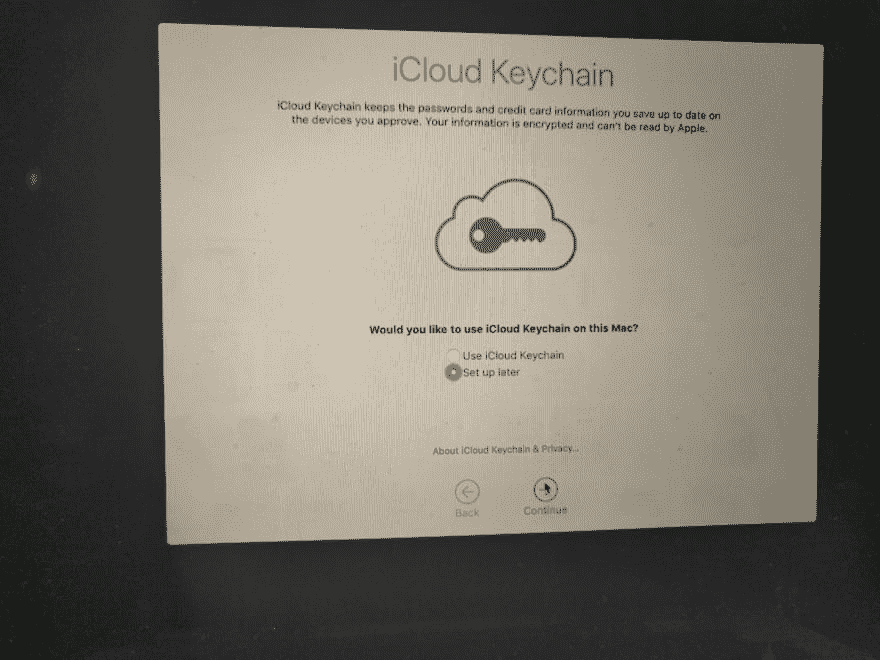](https://res.cloudinary.com/practicaldev/image/fetch/s--d98y6e0v--/c_limit%2Cf_auto%2Cfl_progressive%2Cq_auto%2Cw_880/https://i.ibb.co/4PKKnqP/IMG-20190812-200839.jpg)

我没有设置钥匙串，所以只需选择它并点按“继续”。

[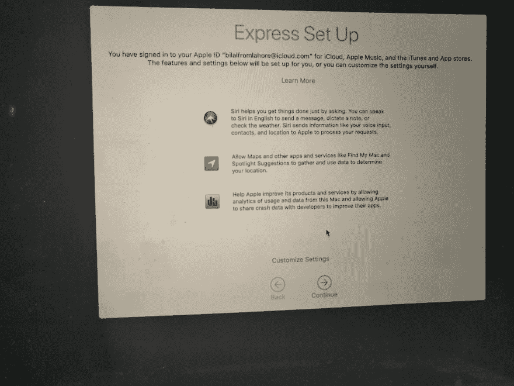](https://res.cloudinary.com/practicaldev/image/fetch/s--lk_ccGbt--/c_limit%2Cf_auto%2Cfl_progressive%2Cq_auto%2Cw_880/https://i.ibb.co/Ryp2qvz/IMG-20190812-200852.jpg)

相信一个快速安装程序，所以点击快速设置，然后点击继续。

[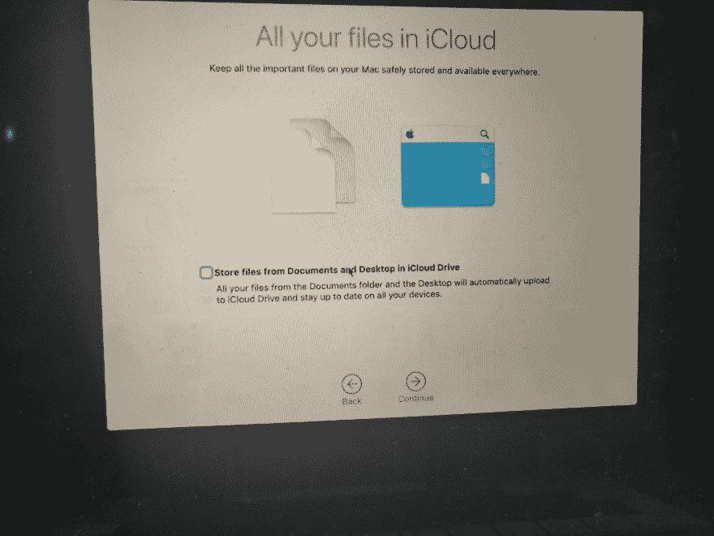](https://res.cloudinary.com/practicaldev/image/fetch/s--pzEYvEA6--/c_limit%2Cf_auto%2Cfl_progressive%2Cq_auto%2Cw_880/https://i.ibb.co/qkbTwWz/IMG-20190812-200905.jpg)

我不太喜欢一开始就在 icloud 上存储文件，所以我只是取消选中它，然后点击继续。

[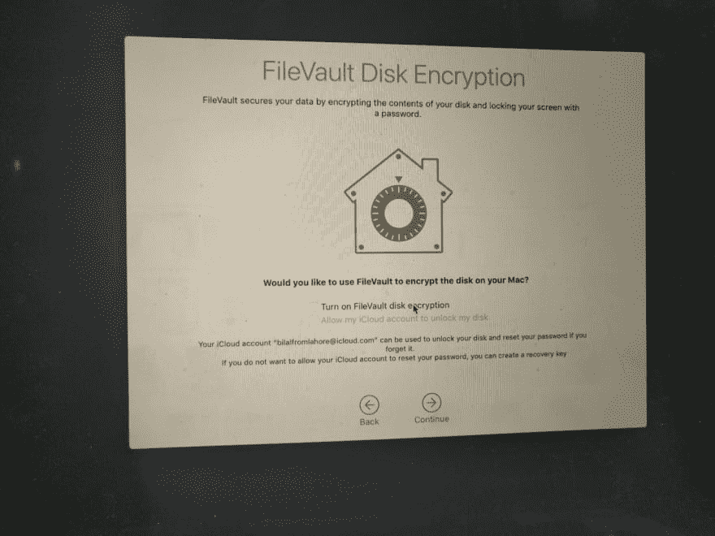](https://res.cloudinary.com/practicaldev/image/fetch/s--Ajhq45Oj--/c_limit%2Cf_auto%2Cfl_progressive%2Cq_auto%2Cw_880/https://i.ibb.co/drKM4Wv/IMG-20190812-200915.jpg)

没有加密，如果你想你可以，我认为这只是降低了性能一点点。取消选中继续。

[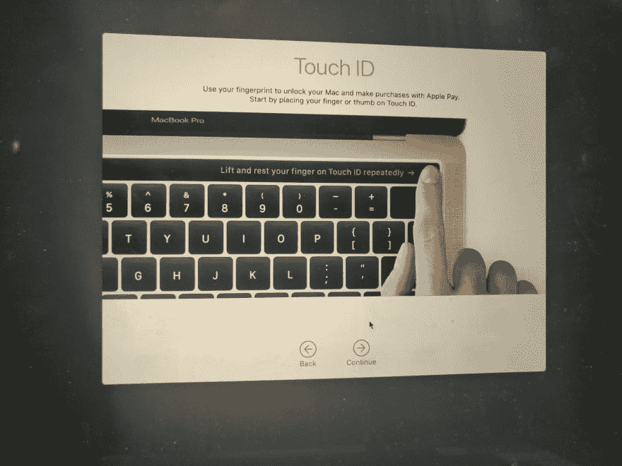](https://res.cloudinary.com/practicaldev/image/fetch/s--YN91siaO--/c_limit%2Cf_auto%2Cfl_progressive%2Cq_auto%2Cw_880/https://i.ibb.co/16gRXLG/IMG-20190812-200920.jpg)

设置您的触控 ID

[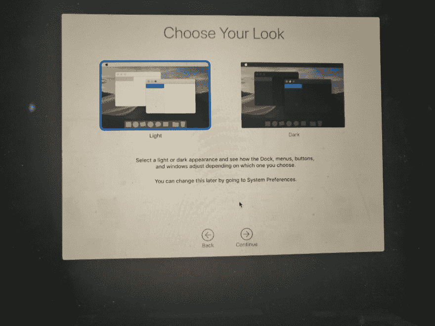](https://res.cloudinary.com/practicaldev/image/fetch/s--LdSv6ar9--/c_limit%2Cf_auto%2Cfl_progressive%2Cq_auto%2Cw_880/https://i.ibb.co/yPW5hY2/IMG-20190812-200940.jpg)

选择了你的主题，我喜欢白色。

[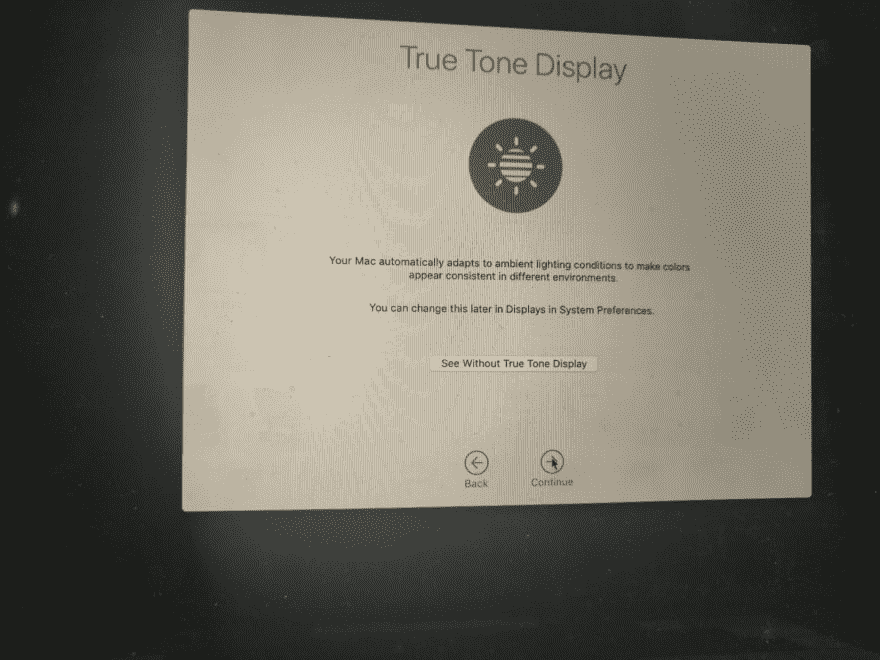](https://res.cloudinary.com/practicaldev/image/fetch/s--H7a_Dnr6--/c_limit%2Cf_auto%2Cfl_progressive%2Cq_auto%2Cw_880/https://i.ibb.co/svmB695/IMG-20190812-200951.jpg)

[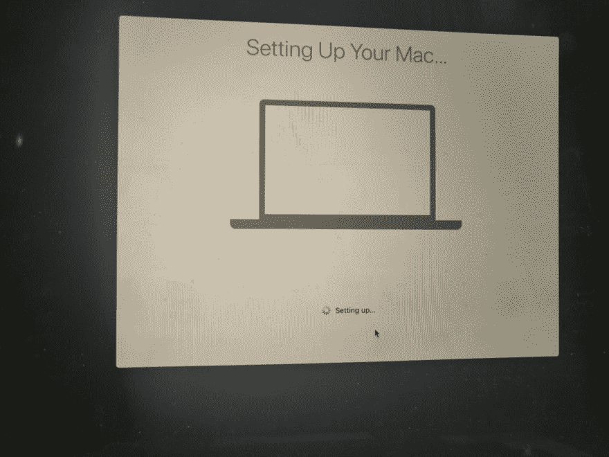](https://res.cloudinary.com/practicaldev/image/fetch/s--8IhzlRuw--/c_limit%2Cf_auto%2Cfl_progressive%2Cq_auto%2Cw_880/https://i.ibb.co/K56CSvc/IMG-20190812-200955.jpg)

我们都准备好了，可以走了。