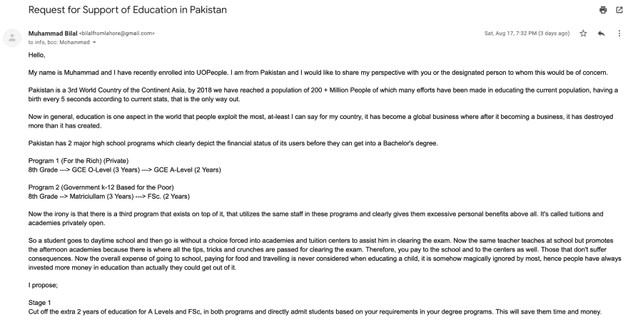
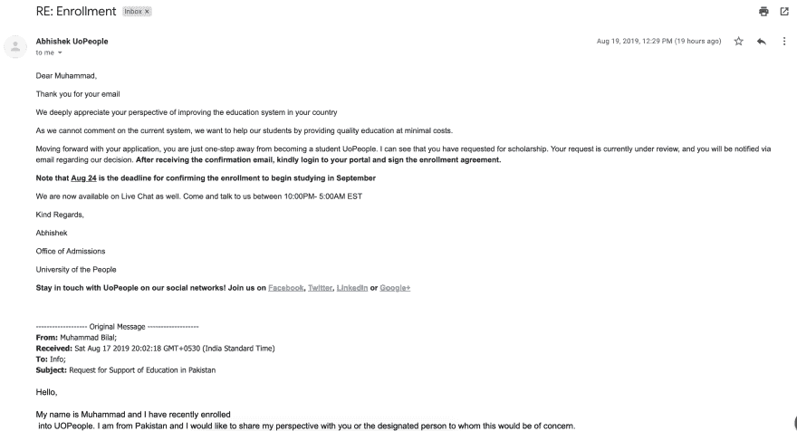
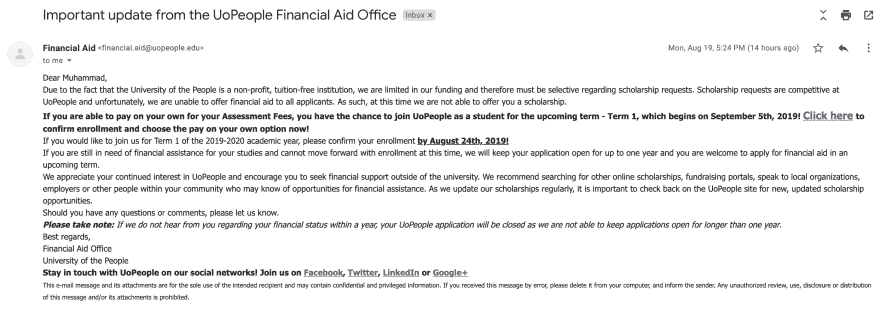

# 人大学？

> 原文：<https://dev.to/th3n00bc0d3r/university-of-people-51if>

免费教育，这是一个多么美妙的想法，当你浏览广告，看到他们的评论时，你会有一种天堂般的社会在成长并给予教育的感觉，尽管每个人都想成为其中的一部分。

我想获得一个美国认可的学位，还有什么比在网上获得更好的方式，既省钱又省时。我申请了所有我有的东西，并被录取了，在这个过程中，我意识到了一些我希望在我那个时代发生的事情，不超过 10-15 年。现在，我获得了计算机科学学士学位，我被要求支付或申请奖学金。与此同时，我给 info@uopeople.edu 发了一封电子邮件

邮件的预览

现在是完整的电子邮件。

* * *

你好，

我叫穆罕默德，我最近加入了 UOPeople。我来自巴基斯坦，我想和你或你指定的人分享我的观点。

巴基斯坦是亚洲大陆的第三世界国家，到 2018 年，我们已经达到了 2 亿多人口，在教育现有人口方面已经做出了很多努力，根据目前的统计，每 5 秒钟就有一个婴儿出生，这是唯一的出路。

现在总的来说，教育是世界上人们利用最多的一个方面，至少我可以说对我的国家来说，它已经成为一个全球性的行业，在它成为一个行业后，它摧毁的比它创造的多。

巴基斯坦有两个主要的高中项目，清楚地描述了用户在获得学士学位之前的财务状况。

计划 1(针对富人)(私人)

八年级->普通教育证书 O 级(3 年)->普通教育证书 A 级(2 年)

方案 2(政府从幼儿园到 12 年级为穷人服务)

八年级->预科(3 年)- > FSc。(2 年)

现在具有讽刺意味的是，在它之上还有第三个项目，在这些项目中使用相同的员工，显然首先给他们过多的个人利益。它叫做私立大学和学院。

因此，一个学生去了日间学校，然后别无选择，被迫进入学院和补习中心，以帮助他通过考试。现在，同一位老师在学校教书，但推广下午学院，因为那里是通过考试的所有提示、技巧和练习的地方。因此，你要向学校和中心付费。那些不承担后果的人。现在，在教育孩子时，上学、支付食物和旅行的总费用从来没有被考虑过，不知何故，它被大多数人神奇地忽略了，因此人们总是在教育上投入比他们实际上能得到的更多的钱。

我提议；

第一阶段

在这两个项目中，取消额外的 2 年 A Levels 和 FSc 教育，根据你的学位项目要求直接录取学生。这将为他们节省时间和金钱。

第二阶段

在你的要求和帮助下，为高中创建第三个学院，帮助人们接受在线学位课程的培训。这将为他们节省时间和金钱。

第 3 阶段

重写从幼儿园到八年级的整个教育系统，引导人们进入第二阶段，最终进入你的教育系统。这将节省时间和金钱。

可选添加剂

随着技术和世界的变化，帮助被录取者获得认证，为公司创造更多的机会雇佣他们并从中受益，同时他们也从公司中受益。

现在，在我的生活中，我已经被这样的破坏纪念碑破坏了很多次，误入歧途，被忽视，被扯掉，只是意识到如果我能回到过去，重新指引自己走上这条道路，事情会更好，但我想这种经历对于一些人来说是必要的，以意识到并改变历史的进程。我已经自学了很多，而且学得更好了，但是现在我确实感觉到在像今天这样的世界里，认证对人们听你的很重要，所以时间并没有让我崩溃，而是让我变得更强大。

焦急地等待答复。

## 问候

第一次回复

* * *

## 最后的闭嘴呼叫

**结论到目前为止**
我个人认为会有更刺激的经历，但不知何故，我只是觉得事情并不像展示的那样，也许也不像讲述的那样。我想，我应该分享我的经历。

**担忧**
教育不应该被用作剥夺大众成长和自我维持能力的媒介，它应该是提高贫困而不是制造更多贫困的手段。