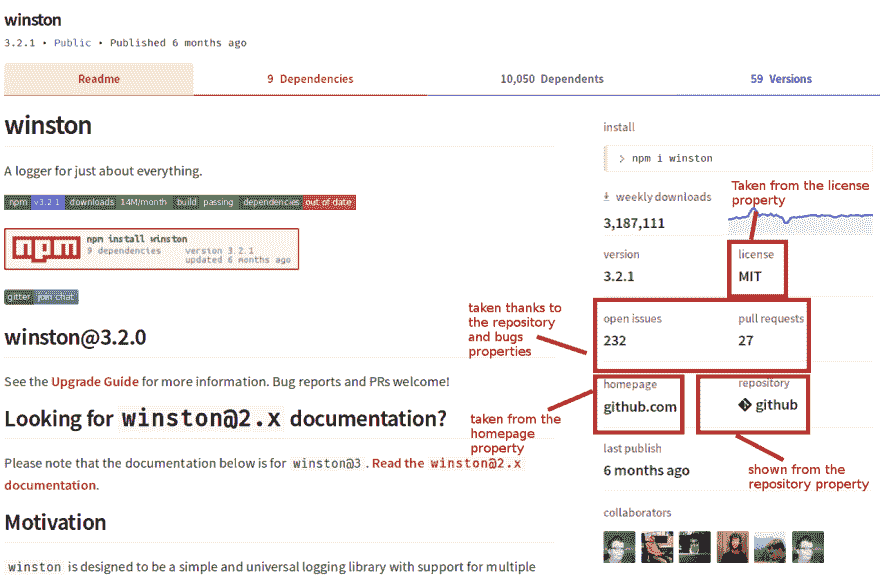

# NPM 入门指南

> 原文：<https://dev.to/deleteman123/a-beginner-s-guide-to-npm-4p74>

## NPM 命令和概念指南

[](https://res.cloudinary.com/practicaldev/image/fetch/s--MTAFd1Q4--/c_limit%2Cf_auto%2Cfl_progressive%2Cq_auto%2Cw_880/https://cdn-images-1.medium.com/max/3840/1%2AaKNjlCxZmbFfZR9Z6rV16A.png)

*原贴于此:[https://blog . bitsrc . io/a-初学者-入门指南-NPM-5c 021d 519 c4c](https://blog.bitsrc.io/a-beginners-guide-to-npm-5c021d519c4c)T3】*

考虑到 Node.js 的模块生态系统，有人可能会说 NPM 实际上是任何 Node 项目的面包和黄油。事实上，我们甚至可以说 NPM 是 Node.js 开发人员最重要的工具之一。毕竟，他们每天都用它来管理他们的项目所使用的包。

话虽如此，人们也可以说，除了它确实可以安装包之外，开发人员对 NPM 的了解是如此之少，这是非常可悲的。

因此，在本文中，我将尝试介绍这个工具的基础知识，让您很好地了解使用它最终可以实现什么，而不是您很可能已经在使用它进行的基本包管理。

## 套餐管理

我们都知道你可以用 NPM 安装包，但是这到底是什么意思呢？一个包基本上是一个包含你需要的代码的文件夹，你可以在本地或者全局安装它。

### 本地安装

本地安装意味着您将文件下载到项目的文件夹中。在其中，您会发现一个不是您创建的目录，名为“node_modules”。由于这个简单的机制，这个本地文件夹可能会变得很大。

这个迷因的诞生有一个很好的理由:

[ ](https://res.cloudinary.com/practicaldev/image/fetch/s--OAo6mf3v--/c_limit%2Cf_auto%2Cfl_progressive%2Cq_auto%2Cw_880/https://cdn-images-1.medium.com/max/2000/1%2ANhZ8Ts1Xe0SlreW2Ljzo6g.png) *难怪这个模因被创造出来了！*

也就是说，通常您可以忽略该文件夹，让 Node.js 为您处理它。

要执行本地安装，您只需:

```
$ npm install [package-name] 
```

<svg width="20px" height="20px" viewBox="0 0 24 24" class="highlight-action crayons-icon highlight-action--fullscreen-on"><title>Enter fullscreen mode</title></svg> <svg width="20px" height="20px" viewBox="0 0 24 24" class="highlight-action crayons-icon highlight-action--fullscreen-off"><title>Exit fullscreen mode</title></svg>

您甚至可以添加- save 标志，以便将包名和版本保存到 package.json 文件中。这一点很重要(**至关重要甚至**)，因为当作为团队的一部分工作时，您不分发也不将 node_modules 文件夹添加到版本控制系统中(无论是 GIT、SVN 还是您正在使用的任何系统)，而是简单地共享 package.json 文件，让您的团队成员自己运行$npm install。这比共享整个文件夹要快得多，也更容易维护，因为整个文件夹可能会增长到包含千兆字节的数据。

下面是一个简单的 package.json 文件的样子:

```
{
  "name": "Project name",
  "version": "1.0.0",
  "description": "This is a basic description",
  "main": "index.js",
  "scripts": {
    "test": "echo \"Error: no test specified\" && exit 1"
  },
  "author": "Fernando Doglio",
  "license": "ISC",
  "dependencies": {
    "config": "^3.1.0",
    "express": "^4.17.1",
    "socket.io": "^2.2.0",
    "winston": "^3.2.1"
  }
} 
```

<svg width="20px" height="20px" viewBox="0 0 24 24" class="highlight-action crayons-icon highlight-action--fullscreen-on"><title>Enter fullscreen mode</title></svg> <svg width="20px" height="20px" viewBox="0 0 24 24" class="highlight-action crayons-icon highlight-action--fullscreen-off"><title>Exit fullscreen mode</title></svg>

你的可能会有一点变化，这取决于你安装了哪些包，或者你需要文件的哪些字段(在上面的例子中有很多其他的字段我没有用到)。

### 全局安装

您还可以全局安装软件包，这意味着 Node.js 将能够从您可能需要它们的任何项目中访问它们。问题？全局包没有添加到 package.json 文件中，这是有意义的。那么你为什么要安装全局包呢？

使用 Node.js 和 NPM 可以做的许多伟大的事情之一是构建人们通常所说的“二进制文件”，这是可以在全球范围内安装的简单脚本，因此可以从您的机器上的任何地方访问。这意味着您可以创建命令行工具，并使用 NPM 安装它们！

无需赘述，像[express js](https://expressjs.com/)(node . js 最流行的 Web 框架之一)或 [mocha](https://mochajs.org/) (一个非常流行的测试库)这样的包也附带了可以使用的可执行二进制文件。例如，mocha 要求您在全局和本地安装它，以便有一个名为“mocha”的 CLI 工具可用，并且能够在本地项目上运行测试。

全局包在一个常规路径中创建一个符号链接(或快捷方式),您需要将它添加到 path 环境变量中。

## 与 NPM 的经典命令

install 命令只是 NPM 可以使用的众多命令之一。事实上，抛开将近 60 个不同的命令(是的，你没看错！)我马上会简要介绍一下，NPM 还允许你创建自己的定制命令，以防内置命令对你来说不够用。

以下是最常用命令的列表，摘自官方文档:

*   **访问:**设置已发布包的访问级别，限制或允许除作者之外的其他人访问。示例:$ npm 访问公共

*   **adduser:** 将用户帐户添加到注册表中(默认情况下，注册表是 npm 的注册表，但您可以指定自定义的注册表)。示例:$ npm addUser 和用户凭据(用户名和密码)以及他们的电子邮件将在系统提示时输入。

*   **audit:** 对您已安装的依赖项进行安全审计，确保没有已知的漏洞影响它们(以及您的项目)。您甚至可以使用 flag fix 来自动修复在审计过程中发现的任何问题。

*   显示当前项目的 NPM 的 bin 文件夹。

*   **bug:**在新的浏览器窗口中打开 bug 列表。关于这个命令有趣的一点是，它试图猜测包的当前错误跟踪器，一旦找到它，它将启动一个新的浏览器窗口。

*   **缓存:**虽然开发人员通常不使用这个命令，但是这个命令允许他们清除、验证或者添加一些东西到 NPM 的缓存中。在高速缓存中，存储了 HTTP 请求信息和额外包数据。通常这是由 NPM 直接处理的，对开发者来说是透明的，但是如果你看到一些奇怪的行为，特别是在不同的包和不同版本的包之间切换时，尝试清除缓存可能是个好主意(只是为了安全起见)。

*   ci: 与 npm install 非常相似，但是旨在用于自动化环境中(例如持续集成过程)。这个命令比 install 更严格，并确保安装总是干净的(如果 node_modules 文件夹存在，它会自动删除它)。

*   **完成:**启用 npm 及其子命令的 Tab 完成。阅读[完整文档](https://docs.npmjs.com/cli/completion.html)了解更多详情。

*   **配置:**允许您设置、获取和编辑 NPM 的配置选项。

*   **重复数据删除:* *通过遍历依赖关系树并将重复的条目尽可能向上移动，尝试减少依赖关系的重复。* *当您的应用程序开始增长并包含越来越多的模块时，这尤其有用。**使用这个命令绝对是可选的，但是如果您有很多依赖项，它将大大减少安装时间(在 CI/CD 环境中最有用)。

*   **deprecate:** 在库的注册表上为特定版本(或版本范围)添加一个不推荐警告。

*   * * dist-tag:* *帮助管理特定包裹的标签。标签可以充当版本别名，帮助识别版本，而不必记住版本号。例如，默认情况下，* * latest * *标记用于所有库的最新版本，您只需运行 npm install library-name@latest，npm 就会知道要下载哪个版本的库。

*   **docs:* *就像**bugs** 这个命令试图猜测软件包的官方文档在哪里，并在本地浏览器中打开那个 URL。

*   * * doctor:* *执行一组预定义的检查，以确保执行 NPM 的系统满足最低要求:node 和 git 命令可访问和可执行，node_modules 文件夹(本地和全局)可由 NPM 写入，注册表或其任何自定义版本可访问，最后，NPM 缓存存在并正常工作。

*   **帮助-搜索/帮助:** **帮助**将显示给定术语的文档页面，如果没有找到结果，**帮助-搜索**将对 NPM 的 markdown 帮助文件进行全文搜索，并显示相关结果的列表。

*   * *挂钩:* *允许您配置新的 [NPM 挂钩](https://blog.npmjs.org/post/145260155635/introducing-hooks-get-notifications-of-npm)，当对感兴趣的包进行更改时，它将依次通知自定义 URL。例如，当新版本的 ExpressJS 发布时，您可以通过输入$ NPM hook add express【http://your-url.com/new-express-version-endpoint[T3】得到通知，然后您可以对该信息做任何您想做的事情(比如自动更新您的依赖项)。](http://your-url.com/new-express-version-endpoint)

*   init: 通过询问一系列问题，如名称、版本、作者等等，帮助初始化一个项目。最后，用这些信息创建了一个全新的 package.json 文件。您还能够提供一个定制的初始化器来为您的特定堆栈定制已处理的。

*   **安装:**安装新的软件包。您可以指定软件包的位置及其格式(例如，您可以只提供一个名称，这样它就会在主注册表中查找它，或者提供您已经下载了要安装的软件包的 tarball 文件的路径)。如果不希望每次运行该命令时都安装最新的版本，也可以指定要安装的版本(这对自动化环境，如 CI/CD 特别有用)。

*   * * ls:* *列出当前项目的所有已安装软件包。您可以让它列出全局软件包或本地安装的软件包。在这两种情况下，它不仅会列出 package.json 文件中可见的名称和版本，还会列出它们的依赖项和版本。

*   **过期:**检查项目中的过期包。它将为您提供已安装软件包的报告、它们的当前版本、package.json 文件期望的版本以及在主注册表中发布的最新版本。

*   * *所有者:* *允许您管理软件包所有者。如果您是库的所有者或维护者，这一点很重要，但如果您只是局限于使用包，这一点就不重要了。

*   **ping:**ping 当前配置的主 npm 注册表，并测试身份验证。这只有在你下载或安装任何软件包时有用。它只会帮助您解决部分问题，但重要的是要记住它。

*   **prefix:** 显示当前前缀，或者说，显示包含 package.json 文件的最近文件夹的路径。您可以使用-g 标志，您将获得全局包的实际安装位置。

*   **publish:** 通过使用组和组织，开发者可以公开或私下与他人共享他们的模块。

这些是您可以使用的最常用或最有用的 NPM 命令，但是仍然有 10 多个额外的命令需要您查看，所以我建议您将它们的文档加入书签[，并记下来回去仔细检查一下！](https://docs.npmjs.com/cli-documentation/cli)

## 发布我自己的包

我想告诉你的最后一点 NPM 知识是，与他人分享你的作品是多么容易。在前面的列表中，最后一个命令是 **publish** 命令，它基本上允许您这样做，但是在这里我想给你更多的细节。

### 准备项目的元数据

NPM 的注册表本质上是一个巨大的软件包搜索引擎，两者兼而有之，托管一切，所以你不必，同时，索引每一点元数据，它可以得到你的工作，以帮助其他人尽快找到你的模块。

换句话说，确保 package.json 设置正确。这些是你(和其他人)的主要兴趣点！)开始考虑与他们共享软件包。

*   **Name** :这是列表中最明显、最常见的一个，也是您在创建 package.json 文件时可能已经设置好的一个，用来跟踪您的依赖项。只要留意它，并把它加到你还没有的地方。

*   **描述**:再来一个快速易懂的。这里所说的就是你想要做的:描述你的软件包，这样其他人就可以在安装时很快理解他们得到了什么。并确保你在描述中添加尽可能多的重要关键词，这样搜索引擎也知道如何快速找到你。这是开发者试图找到你的包的需求和引擎试图首先正确地索引它之间的平衡。

*   标签:简单来说，这是一个逗号分隔的关键字列表。也就是说，一旦你开始发布包，这些标签是非常重要的，因为在 NPM 的主网站上，它们作为你可以轻松浏览的类别。因此，忽略将该属性添加到 package.json 会阻止开发人员通过导航找到您的工作。

*   **Private** :除非你只是为你自己发布内容，否则你应该尽快将这个属性设置为 false，否则没有人能够通过关键字搜索找到你的模块。

*   **bug**:这可以确保如果你把你的内容放在某个地方，比如 [Github](http://github.com) ，那里有公共问题跟踪，你把这个属性设置到正确的 URL。这将有助于 NPM 显示一个链接，并在软件包的页面上显示当前打开的问题的数量。

*   存储库(Repository):另一个不是严格要求的属性，但是如果你添加了它，NPM 将能够显示额外的信息，比如它的链接、活动、合作者列表等等。

*   首页:和上一个一样，如果有链接的话，它会帮助 NPM 显示这个链接。当您的代码在一个 URL(比如 Github repo)中，而您的模块的特定网站在另一个 URL 中时，这一点尤其重要。

*   **License** :用于显示您在项目上设置的实际许可证。如果将它作为 package.json 文件的一部分添加，它会以一种不同的、更突出的方式出现。你也可以在你的 readme.md 上提到它，但是把它加在这里会给 NPM 提供关于你的项目的额外知识。

通过提供我上面提到的元数据，NPM 能够展示这些数据并突出显示给开发者看。以下面的例子为例，Winston 的包页面，这是一个很棒的日志库:

[](https://res.cloudinary.com/practicaldev/image/fetch/s--Vr-q15Qe--/c_limit%2Cf_auto%2Cfl_progressive%2Cq_auto%2Cw_880/https://cdn-images-1.medium.com/max/2546/1%2AamTpB7aFVQBQE7j7TIoBZw.png)

请注意，由于其团队添加的元数据，已经添加了多少链接和额外的位和细节。

### 写一份漂亮的文档

这一步不应该，但它是完全可选的。我说不应该，当然，因为如果你试图发布一个模块，这意味着被其他开发者使用，你* *需要* *提供良好的文档。

你不能指望你的工具“简单易用”，或者“易于理解和理解”。NPM 注册的目的是为其他人提供预制的工具，帮助他们解决他们不想也没有时间自己解决的问题。因此，避免提供一套简单的说明和解释会阻止他们真正想要尝试和使用你的工具。

也就是说，NPM 的主站点从 Github 那里得到了启示，他们也在你的项目目录的根目录下寻找一个名为 readme.md 的文件。如果有的话，他们会把你的 markdown 文档变成一个漂亮的主页，就像你在上面的截图中看到的那样。

因此，在编写其他人需要的基本文档时，真的没有任何借口，所以只需在 readme.md 中这样做，您就可以在两个地方同时获得它。

### 实际发布您的包

在编码、在 package.json 中设置正确的数据量并编写有用的 readme.md 文件之后，就可以发布了。

为此，您必须做两件事:

1.  使用实际的 npm CLI 登录您的 NPM 帐户(假设您已经使用他们的网站创建了一个帐户)。

2.  发布您的代码。

就这样，两步，你就完成了。要登录，只需输入:

```
$ npm login 
```

<svg width="20px" height="20px" viewBox="0 0 24 24" class="highlight-action crayons-icon highlight-action--fullscreen-on"><title>Enter fullscreen mode</title></svg> <svg width="20px" height="20px" viewBox="0 0 24 24" class="highlight-action crayons-icon highlight-action--fullscreen-off"><title>Exit fullscreen mode</title></svg>

这将提示您输入凭据，一旦您成功登录，您可以键入:

```
$ npm publish 
```

<svg width="20px" height="20px" viewBox="0 0 24 24" class="highlight-action crayons-icon highlight-action--fullscreen-on"><title>Enter fullscreen mode</title></svg> <svg width="20px" height="20px" viewBox="0 0 24 24" class="highlight-action crayons-icon highlight-action--fullscreen-off"><title>Exit fullscreen mode</title></svg>

记得在你的项目文件夹中这样做，否则第二个命令会失败。

另外，请记住，您的包的名称将由 package.json 文件中的* * name * *属性给出，而不是由文件夹的名称给出(这两个名称通常是相同的，但没有任何意义)。因此，如果你有一个重复的名称错误(这可能发生在 NPM 提供的软件包数量)，这就是你必须做出改变的地方。

## 结论

感谢你的阅读，我希望现在你已经理解了 NPM 的复杂和美丽。它不仅仅是一个简单的安装包的工具，但是如果你花时间查看他们的文档，你可以用它做更多的事情。

如果你知道我刚才提到的所有事情，如果我错过了你目前使用 NPM 的其他事情，请在评论中告诉我，我很想知道！

否则，*下一场见！*