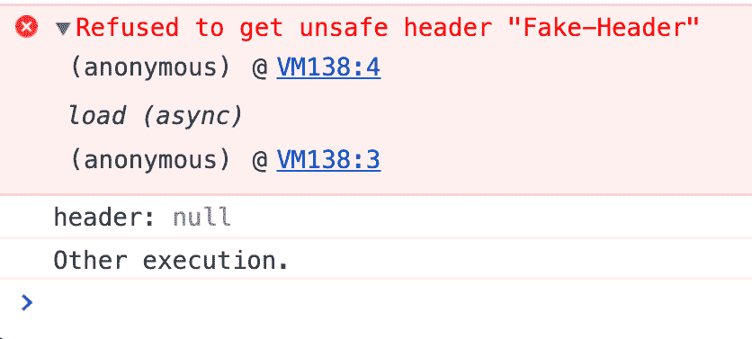

# 调试:Chrome 中的“拒绝获取不安全标题”

> 原文：<https://dev.to/trackjs/debugging-refused-to-get-unsafe-header-in-chrome-1lc6>

最近，我们在 Chrome 控制台中遇到了一个看起来很吓人的错误消息`Refused to get unsafe header "TrackJS-Correlation-Id"`。我们的代码确实试图从一个请求中读取这个头，所以我们马上研究了这个问题。有趣的是，除了 Chrome 中的错误信息之外，一切都很好。

当这个错误引起我们的注意时，我们正在测试浏览器错误监控代理的原型。它在 Chrome 控制台中突出显示为红色，但没有其他浏览器报告它。我们代码的执行没有受到影响。

更奇怪的是，我们所有的监控都没有发现这个错误。它只出现在 Chrome DevTools 控制台中。深入研究更改后的代码，我们可以用示例代码重现错误:

```
var xhr = new XMLHttpRequest();
xhr.open("GET", "https://cdn.trackjs.com/agent/v3/latest/t.js");
xhr.addEventListener("load", function(data) {
  console.log("header:", xhr.getResponseHeader("Fake-Header"));
  console.log("Other execution.");
});
xhr.send(); 
```

<svg width="20px" height="20px" viewBox="0 0 24 24" class="highlight-action crayons-icon highlight-action--fullscreen-on"><title>Enter fullscreen mode</title></svg> <svg width="20px" height="20px" viewBox="0 0 24 24" class="highlight-action crayons-icon highlight-action--fullscreen-off"><title>Exit fullscreen mode</title></svg>

这个简单的例子从 TrackJS CDN 获取一个文件，并试图从请求中读取`Fake-Header`头，这显然是不存在的。我们可以在我们的控制台中看到这个错误，它是从对 [`xhr.getResponseHeader`](https://developer.mozilla.org/en-US/docs/Web/API/XMLHttpRequest/getResponseHeader) 的调用以及堆栈跟踪中打印出来的。但是我们也可以看到，我们从调用中收到了一个空值，并且函数继续执行！

[](///asseimg/blog/2019-08-refused-unsafe-header/console.png)

<cite>[代码片段控制台输出](/asseimg/blog/2019-08-refused-unsafe-header/console.png)</cite>

## 根本原因

这是[Chromium 源代码](https://github.com/chromium/chromium/blob/0dbf925f22bc075c6f520d58ed2db89e146ffc07/third_party/blink/renderer/core/xmlhttprequest/xml_http_request.cc#L1527)中**不规范**的行为。它在控制台中输出一条“无错误”消息，但这是浏览器级别的错误，而不是 JavaScript 错误。它不能被记录，并且没有执行被停止。

为什么 Chromium 团队决定每当一个可空值返回 null 时就打印这条可怕的消息还不清楚。

## 工作区

尽管这条消息是“非错误”的，但是您可能仍然希望在您的控制台中避免它，以便在以后为自己节省一些压力和问题。除非您**知道**报头存在并且可读，否则`xhr.getResponseHeader`调用是不安全的，我们可以用 [`xhr.getAllResponseHeaders`](https://developer.mozilla.org/en-US/docs/Web/API/XMLHttpRequest/getAllResponseHeaders) 来检查。

```
var xhr = new XMLHttpRequest();
xhr.open("GET", "https://cdn.trackjs.com/agent/v3/latest/t.js");
xhr.addEventListener("load", function(data) {
  if (xhr.getAllResponseHeaders().indexOf("Fake-Header") >= 0) {
    console.log("header:", xhr.getResponseHeader("Fake-Header"));
  }
  console.log("Other execution.");
});
xhr.send(); 
```

<svg width="20px" height="20px" viewBox="0 0 24 24" class="highlight-action crayons-icon highlight-action--fullscreen-on"><title>Enter fullscreen mode</title></svg> <svg width="20px" height="20px" viewBox="0 0 24 24" class="highlight-action crayons-icon highlight-action--fullscreen-off"><title>Exit fullscreen mode</title></svg>

在这个例子中，我们在请求之前检查完整的头字符串，看看我们的头是否存在。因此，我们避免了可怕的 Chrome“无错误”。

网络上有各种各样的错误，许多会导致问题，并阻止你的网站正常工作。TrackJS 可以帮助你知道错误何时发生以及如何修复。试试我们完全免费的试用版，让我们帮助您建立一个更好的网站。