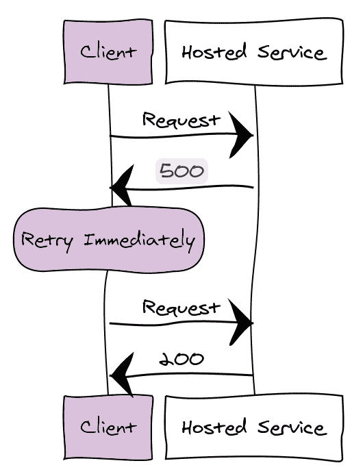
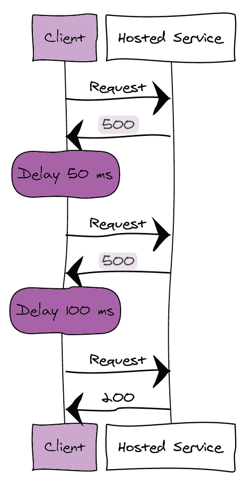
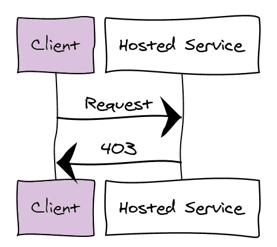
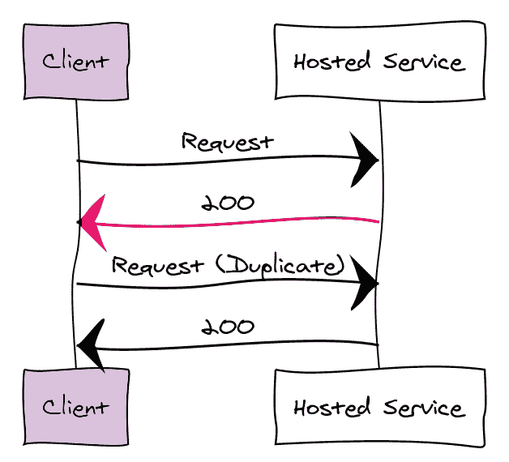

# 5 分钟后了解重试模式

> 原文：<https://dev.to/azure/learn-about-the-retry-pattern-in-5-minutes-fjo>

上周我们检查了断路器。本周，我们将研究重试模式。重试模式的基础是处理服务或网络资源的暂时故障。请求暂时失败的原因有很多。这些失败的例子包括网络连接错误，站点在部署后重新加载，或者数据没有传播到所有实例。

在下面的例子中，我将把失败建立在这个有意简化的客户/服务请求模型的基础上。成功的请求:

重试模式不仅包含了重试的概念，还包含了对问题进行分类和做出重试选择的不同方式。

如果问题是罕见的错误，请立即重试请求:

如果问题是更常见的错误，请在一定的延迟后重试请求:

如果问题表明失败不是暂时的，例如，无效凭据不太可能在后续请求中成功，请取消请求:

有时客户端可能认为有错误，但操作已经成功完成。如果请求不是等幂运算，那么如果状态发生变化并且请求是重复的，这可能会导致问题:

不管问题的类型如何，都应该进行一些跟踪，以确保不会发生无休止的重试。在这种情况下实施[断路器](https://dev.to/azure/learn-about-the-circuit-breaker-pattern-in-5-minutes-1l45)有助于限制重试风暴对失败或恢复服务的影响。

在操作服务时，跟踪重试次数的指标很重要。指标可以告诉你很多关于你的客户对你的服务的体验。这可能是一种服务需要向外扩展或向上扩展的情况。此外，即使问题出在客户端，如果他们反复经历降级的服务，问题也会反映在您的服务上。

我曾经管理过一个使用 Apache Traffic Server 的服务。Apache Traffic server 没有按照 HTTP/1.1 规范的规定处理 *Expect:* 请求头。来自用 cURL 库构建的应用程序的 1KB 和更大的请求有 1 秒的延迟，除非客户明确关闭了 *Expect:* 头。使问题更加复杂的是，由于在预期的 50 毫秒响应时间内没有收到响应而导致的重试导致了重试风暴。当我在日志中看到这种模式时，我写下了文档并设置了工具来捕捉这个问题，以便我可以主动联系客户。

当使用第三方服务或外部工具时，请确保您没有将重试逻辑分层。不同级别的分层重试或级联重试可能会导致延迟增加，而快速故障可能是首选操作。

许多 SDK 都包含重试配置。通常，存在最大重试次数和延迟因子，延迟因子可以是延迟后续重试的时间量的指数、增量或随机间隔。

将日志中的暂时问题分离出来，使它们成为警告而不是错误。虽然应该对它们进行监控，但对一些可以自行解决的事情进行寻呼会导致注意力的进一步丧失，尤其是在人们下班时。没有什么比因为能自我修复的事情而失眠更令人沮丧的了。