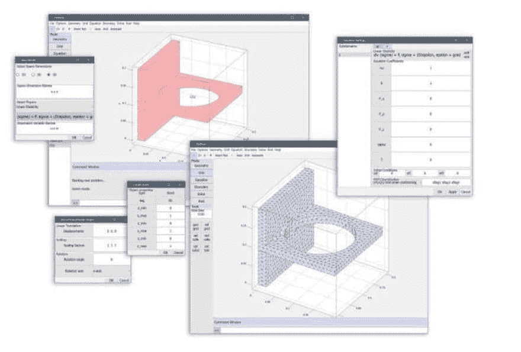

# CLI 和 GUI 性能的 MATLAB 性能基准测试

> 原文：<https://dev.to/featool/matlab-performance-benchmarking-for-cli-and-gui-performance-3jj2>

尽管 MATLAB 核心基本上保持不变，但 MATLAB 语言和运行时在每个版本中都被扩展了更多的功能，并对解释器和实时编译引擎进行了重大的 T2 改进。作为
MATLAB 的
[FEATool Multiphysics](https://www.featool.com) 仿真工具箱的开发者，该工具箱具有 10 年的图形用户界面(GUI)
和命令行界面(CLI)向后兼容性(回溯到
R2009b)，能够告诉用户出于性能和/或其他
原因推荐使用哪个
MATLAB 版本将非常有用。

考虑到这一点，并且由于没有官方或全面的
MATLAB 版本基准可用，GUI 和 CLI 脚本性能在下面针对 MATLAB 版本 R2011b(主观上
*最快速*、响应最快并且是当前首选版本
开发者的观点)和 R2019a(编写
时的最新版本)进行了
比较。计时和测试是使用 FEATool
Multiphysics 工具箱在一台装有微软 Windows 10
操作系统和英特尔 CPU 的典型笔记本电脑上进行的。FEATool 软件用于
基准测试，因为工具箱具有大量预定义和
内置的验证测试案例和全自动(GUI)教程
，用于自动和一致地测量性能。

## MATLAB GUI 性能

在第一步中，GUI 模型测试套件用于计时
运行。该测试套件运行大约 40 个预定义的多物理
仿真模型(该测试套件可以通过使用
命令`featool testt`启动 FEATool 来运行)。这些例子是完全自动化的，所以
所有的 GUI 回调都是自动一致运行的，就像
用户手动操作一样。五次运行的时间平均值可以在下表中看到
。

| MATLAB GUI 教程测试 |  |
| --- | --- |
| *R2019a* | *R2011b* |
| 3142 s | 2486 s |

从结果中可以清楚地看出，MATLAB R2011b 的运行速度比最新版本 R2019a 明显快了
(大约 25%)，即使像后续 MATLAB 版本一样使用了
改进的 JIT 优化。注意
FEATool 使用的 UI 布局工具包是专门
开发和编写的，以使用过程代码尽可能快地运行。
Mathworks GUI 布局工具箱在开发中进行了测试，在
时，由于面向对象的设计
而显示出巨大的开销和成本，并且对于中等复杂的
GUI(如 FEATool 使用的 GUI)来说，性能不够。(注意，由于向后的
兼容性，FEATool GUI 工具包只使用 get(h，...)和 set(h，
...)调用，而不是用句柄
图形 *hg2* 引入的结构调用选项。此外，这些结果不适用于未经测试的较新的 web
图形后端。)

## MATLAB CLI 性能

由于这些测试包括从运行 GUI 到 CAD 几何图形
和模型预处理、网格生成、线性方程求解、
绘图和可视化的所有内容，因此我们无法从上述
测试中得出结论，在较新版本的 MATLAB 中，什么更慢。由于
FEATool 也是完全脚本化的(一个 GUI 动作映射到一个等价的
MATLAB 函数)，我们也可以在没有 GUI 的情况下运行测试进行
比较，5 次运行的相应平均结果如下图所示
(用`featool testm`启动 FEATool 运行
[FEATool 示例](https://www.featool.com/doc/tutorials.html#ex_other)
目录中所有可用的
脚本模型)。

| MATLAB CLI 示例测试 |  |
| --- | --- |
| *R2019a* | *R2011b* |
| 812 s | 976 s |

在不使用任何 GUI 功能的情况下，现在结果正好相反，因为
MATLAB R2019a 稍微快了一些。由于 FEATool 代码库是高度矢量化和优化的

，并且有限元分析(FEA)模拟大量使用预编译的数值库和稀疏线性解算器
，如 BLAS、LAPACK、Umfpack 等
。这并没有真正受到 JIT 改进的影响，一个相当适度的 10%的加速也许是人们可以从任何 JIT 改进中期待的(而不是速度的大幅度提高)。

总而言之，通过这些简单的测试，我们确实可以看到，当前的
MATLAB JIT 优化已经导致了平均
速度的适度提高，然而，旧版本的 MATLAB 在使用 GUI 功能时明显更加
灵敏。因此，FEATool 用户可以
建议在使用 GUI 时使用版本 2011b，并且由于
FEATool 支持将模型保存和导出到标准 MATLAB
m-script 文件，后续的大规模仿真可以在新版 MATLAB 的
命令行上运行，以利用任何
速度提升。