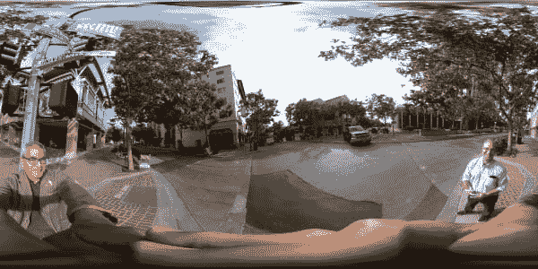
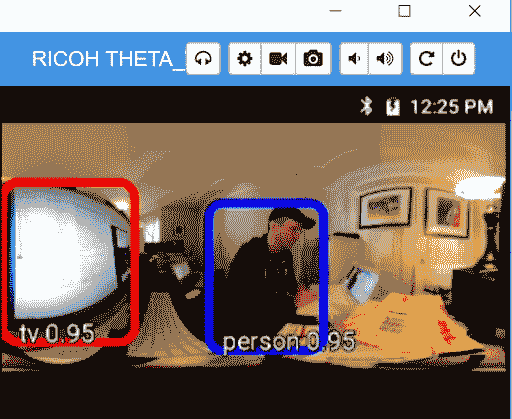
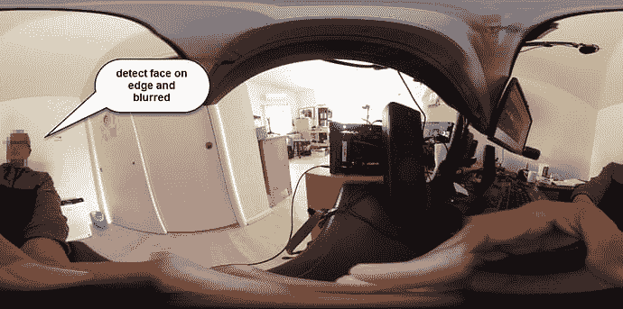

# 用于人脸对象检测的 360°图像数据库

> 原文：<https://dev.to/codetricity/360-image-database-for-face-object-detection-4mgm>

TensorFlow 是一个很好的学习模型实验平台。大约一年前，我使用理光 THETA 360 相机内部的 TensorFlow 样本做了一些实验。如果您有理光 THETA V 或 Z1，您可以使用 GitHub repo 的[样本](https://github.com/codetricity/tensorflow-theta)进行实验。你也可以在 Android 手机或 AVD 上运行标准演示。

使用 TensorFlow 演示和 360°摄像机的主要问题是检测等矩形图像中的对象。在下面的示例中，您可以看到以等矩形格式查看的 360°图像扭曲了面。

这使得访问像 YOLO 这样的图像网络具有挑战性(你只看一次)。

最近，开发人员 Amine Amri 推出了一个[项目](https://community.theta360.guide/t/theta-auto-trigger-plug-in-by-amine-amri/4665?u=codetricity)，向我介绍了 FDDB-360，这是一个从人脸检测数据集和基准 [FDDB](http://viswww.cs.umass.edu/fddb/) 导出的数据集。

FDDB-360 包含 17，052 张鱼眼图像和总共 26，640 张带注释的人脸。

该数据集可从获得(J. Fu、S. R. Alvar、I. V. Baji 和 R. G. Vaughan，“FDDB-360:360 度鱼眼图像中的人脸检测”，Proc .美国电气和电子工程师协会 2019 年 MIPR 年会，加利福尼亚州圣何塞，2019 年 3 月)。

## 不带 360°图像 DB 工作

如果人脸位于图像垂直高度的中间，TensorFlow 演示在没有修改的情况下对 360°图像的效果令人惊讶。

只要面部位于垂直高度的中心，您甚至可以检测和模糊靠近缝合线的面部。

## 何时使用 360 的人脸图像

当面部在垂直高度的中心之上或之下被捕捉时，您的识别度将会降低。它越高或越低，你将经历越多的失真。为了更好地检测人脸，你应该使用 360 度图像数据库。

## 下一步

如果您想加入关于使用 TensorFlow 处理理光 THETA 和 360°图像的讨论，请查看 [Tensorflow apk，了解 THETA V - Speech、对象检测、风格化滤镜](https://community.theta360.guide/t/tensorflow-apk-for-theta-v-speech-object-detection-stylized-filters/3812?u=codetricity)。