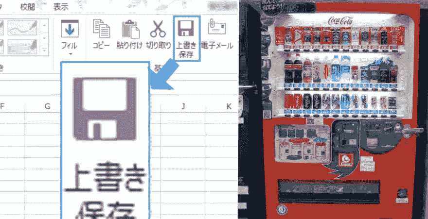

# 那个图标到底是什么意思？

> 原文：<https://dev.to/dvddpl/what-the-heck-does-that-icon-mean-5a38>

不到两周前是我父亲去世四周年纪念日，今天我无意中发现了这篇文章:[不再有意义的图标](https://attivissimo.blogspot.com/2019/08/icone-che-non-hanno-piu-senso.html)(这是著名的 [Scott Hanselman](https://www.hanselman.com/blog/TheFloppyDiskMeansSaveAnd14OtherOldPeopleIconsThatDontMakeSenseAnymore.aspx) 的一篇旧帖子的更新，我不禁怀旧地想起了他去世前几个月发生的一些有趣的事情。

在文章中，作者提到了许多**图标，这些图标指的是不再存在、不再在日常生活中使用或者现在看起来非常不同的项目** -因此对于新一代人来说，它们真的没有意义，并且它们没有提供任何帮助来识别图标的用途。

我想类似的事情也发生在语言上，我敢打赌有很多习惯表达不再有意义，但这个过程可能会更慢，而且在说话的时候，我们可能有更多的机会找到意思(因为父母或祖父母解释老话或一直重复它们，我们已经习惯了)。大概是我们关注的比较少，我们只是习惯了它们，不加质疑的点开了。

> 直到一个日本青少年问为什么保存按钮像一个随时可以拿的自动售货机，或者一个 80 岁的老人努力在 skype 中找到麦克风图标。

我已经从意大利搬到了德国，因此，我和父亲的大部分联系都是通过 Skype 进行的。
**每次 Skype 通话都有点挣扎**，对他来说，不得不应付技术，对我来说，不得不应付他。

一天晚上，连接很好，我们可以很容易地看到对方，但我听不到他。当我告诉他检查麦克风是否开着的时候，他告诉我他对手势很恼火。；-) )那个**他找不到任何麦克风。**
我下决心打电话指导他，然后用相当恼怒的语气告诉他:

> “来吧！麦克风图标是左起第二个:就在摄像头图标和加号之间！!"

几秒钟的沉默...然后他只是说:

> 那应该是个麦克风吧？在我看来更像一个倒置的购物车轮子！

那一刻，我沉默了几秒钟。试图弄清楚到底发生了什么，他在哪里看到了一个倒置的购物车轮子，以及为什么他会突然想到这样的事情(文章中的其他人说麦克风看起来像玻璃里的一颗巨大的药丸)...但是*一个倒置的购物车轮子*！！！)

然后我看到了，我笑出声来。从那一刻起，我再也看不到它了。每次我打开 Skype，我都会想到我的父亲并微笑，然后我会有点难过，然后我又会笑着想起他。
我真的希望那个图标不要被改动，不要重新设计来破坏那个可爱的*倒置的购物车轮子*。

再见爸爸。

* * *

格雷格·拉科齐在 Unsplash 上的照片