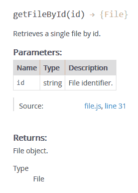
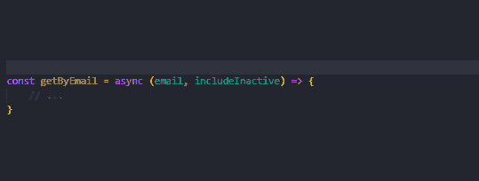
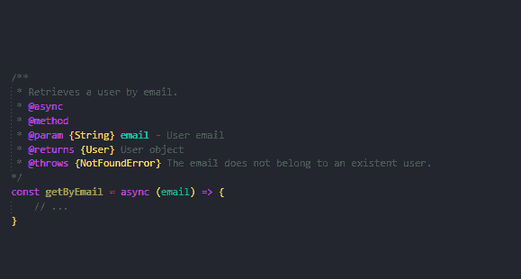
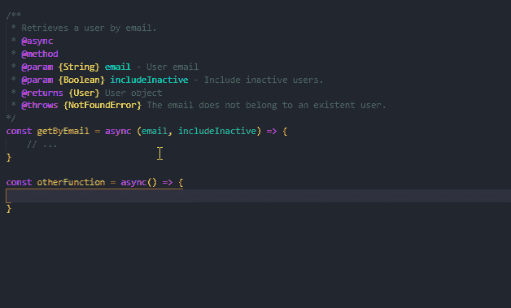

# JSDoc 用 JSDoc 记录你的 Javascript 代码

> 原文：<https://dev.to/paulasantamaria/document-your-javascript-code-with-jsdoc-2fbf>

# 简介

在这篇文章中，我将尝试涵盖 JSDoc 入门所需要知道的一切。我还会和你分享一些我学到的很酷的东西，你可能会觉得有用。

## 目录

*   [安装](#installation)
*   [用途](#usage)
    *   [文件](#document)
    *   [导出](#export)
    *   [导出文件或文件夹](#export-files-or-folders)
    *   [递归导出所有文件](#export-all-files-recursively)
    *   [使用配置文件](#use-a-configuration-file)
*   [关于 JSDoc 的其他酷事](#other-cool-stuff-about-jsdoc)
    *   [vs code 中的内置支持](#built-in-support-in-vscode)
    *   [使用自定义布局](#use-a-custom-layout)
    *   [JSDoc 和 Swagger](#jsdoc-and-swagger)
    *   还知道其他有趣的 JSDoc 特性吗？

* * *

JSDoc 是一个开源的 Javascript API 文档生成器。它允许开发人员通过注释记录他们的代码。这里有一个例子:

```
/**
 *  Retrieves a single file by id.
 *  @param {string} id File identifier.
 *  @returns {File} File object.
 */
const getFileById = (id) => {
    // ...
} 
```

<svg width="20px" height="20px" viewBox="0 0 24 24" class="highlight-action crayons-icon highlight-action--fullscreen-on"><title>Enter fullscreen mode</title></svg> <svg width="20px" height="20px" viewBox="0 0 24 24" class="highlight-action crayons-icon highlight-action--fullscreen-off"><title>Exit fullscreen mode</title></svg>

一旦您的代码被完整地记录下来，您就可以通过运行一个简单的命令轻松地生成一个包含所有 API 文档的网站。多酷啊。

下面是前面的代码在生成的网站中的样子:

[](https://res.cloudinary.com/practicaldev/image/fetch/s--21dnoAHa--/c_limit%2Cf_auto%2Cfl_progressive%2Cq_auto%2Cw_880/https://i.imgur.com/cdcDW66.png)

# 安装

使用以下命令通过 [npm](https://www.npmjs.com/) 全局安装 JSDoc】

```
npm install -g jsdoc 
```

<svg width="20px" height="20px" viewBox="0 0 24 24" class="highlight-action crayons-icon highlight-action--fullscreen-on"><title>Enter fullscreen mode</title></svg> <svg width="20px" height="20px" viewBox="0 0 24 24" class="highlight-action crayons-icon highlight-action--fullscreen-off"><title>Exit fullscreen mode</title></svg>

或者使用以下命令为单个项目安装:

```
npm install --save-dev jsdoc 
```

<svg width="20px" height="20px" viewBox="0 0 24 24" class="highlight-action crayons-icon highlight-action--fullscreen-on"><title>Enter fullscreen mode</title></svg> <svg width="20px" height="20px" viewBox="0 0 24 24" class="highlight-action crayons-icon highlight-action--fullscreen-off"><title>Exit fullscreen mode</title></svg>

关于安装的更多信息[在这里](https://github.com/jsdoc/jsdoc#installation-and-usage)

现在，说实话，尽管我已经使用 JSDoc 注释来记录我的代码很长时间了，但我直到几周前才安装这个包，因为我实际上不需要生成网站。相反，我只是在 VSCode 中使用它，但我会在这篇文章的后面谈到这个[。](#vscode--jsdoc)

# 用法

## 文档

要开始记录你的代码，你所要做的就是在你想要记录的每个代码块上添加一个以`/**`开头的注释:模块、方法、类、函数等等。

您可以简单地添加一个描述:

```
/**
 * Retrieves a user by email.
 */
const getByEmail = async (email) => {
    // ...
} 
```

<svg width="20px" height="20px" viewBox="0 0 24 24" class="highlight-action crayons-icon highlight-action--fullscreen-on"><title>Enter fullscreen mode</title></svg> <svg width="20px" height="20px" viewBox="0 0 24 24" class="highlight-action crayons-icon highlight-action--fullscreen-off"><title>Exit fullscreen mode</title></svg>

或者你可以使用标签来充分利用 JSDoc】

```
/**
 * Retrieves a user by email.
 * @async
 * @method
 * @param {String} email - User email
 * @returns {User} User object
 * @throws {NotFoundError} When the user is not found.
 */
const getByEmail = async (email) => {
    // ...
} 
```

<svg width="20px" height="20px" viewBox="0 0 24 24" class="highlight-action crayons-icon highlight-action--fullscreen-on"><title>Enter fullscreen mode</title></svg> <svg width="20px" height="20px" viewBox="0 0 24 24" class="highlight-action crayons-icon highlight-action--fullscreen-off"><title>Exit fullscreen mode</title></svg>

有一个巨大的标签列表[供你选择，尽可能彻底地记录你的代码。](https://jsdoc.app/#block-tags)

记住，你添加到注释中的信息越多，你的 API 文档就越详细。而且，**找到你觉得合适的细节数量**。最好用几个标签记录所有代码，而不是用所有标签记录所有方法，因为太多了，你跟不上。

## 导出

添加评论后，剩下要做的就是生成您的文档网站:

### 导出文件或文件夹

只需调用 jsdoc 并添加文件或文件夹的路径。

```
jsdoc path/to/my/file.js 
```

<svg width="20px" height="20px" viewBox="0 0 24 24" class="highlight-action crayons-icon highlight-action--fullscreen-on"><title>Enter fullscreen mode</title></svg> <svg width="20px" height="20px" viewBox="0 0 24 24" class="highlight-action crayons-icon highlight-action--fullscreen-off"><title>Exit fullscreen mode</title></svg>

要包含许多文件或文件夹，请添加它们的所有路径，用一个空格分隔。

### 递归导出所有文件

```
jsdoc -r . 
```

<svg width="20px" height="20px" viewBox="0 0 24 24" class="highlight-action crayons-icon highlight-action--fullscreen-on"><title>Enter fullscreen mode</title></svg> <svg width="20px" height="20px" viewBox="0 0 24 24" class="highlight-action crayons-icon highlight-action--fullscreen-off"><title>Exit fullscreen mode</title></svg>

### 使用一个配置文件

很可能你正在做一个大项目，有很多文件和文件夹需要导出，也有一些需要排除(我在看着你，`node_modules`)。如果是这种情况，您可能希望使用 JSDoc 配置文件。

使用配置文件允许我们定制 JSDoc 行为，比如:

*   哪些文件夹或文件应该包括在内，哪些应该排除在外。
*   当我们使用`--recurse`选项时，JSDoc 会有多深。
*   将自定义应用于模板
*   等等

你需要做的就是创建一个包含你想要的设置的`.json`文件，然后使用`-c`或`--configure`选项告诉 JSDoc 它们在哪里:

```
jsdoc -c /path/to/conf.json 
```

<svg width="20px" height="20px" viewBox="0 0 24 24" class="highlight-action crayons-icon highlight-action--fullscreen-on"><title>Enter fullscreen mode</title></svg> <svg width="20px" height="20px" viewBox="0 0 24 24" class="highlight-action crayons-icon highlight-action--fullscreen-off"><title>Exit fullscreen mode</title></svg>

这里有一个我经常使用的(非常简单的)例子:

```
{
    "source": {
        "includePattern": ".+\\.js(doc|x)?$",   // Only process file ending in .js, .jsdoc or .jsx
        "include": ["."],                       // Check all folders.
        "exclude": ["node_modules"]             // Be gone, node_modules.
    },
    "recurseDepth": 10,                         // Only go 10 levels deep.
    "opts": {
        "destination": "./docs/",               // Where I want my docs to be generated.
        "recurse": true                         // Same as using -r or --recurse
    }
} 
```

<svg width="20px" height="20px" viewBox="0 0 24 24" class="highlight-action crayons-icon highlight-action--fullscreen-on"><title>Enter fullscreen mode</title></svg> <svg width="20px" height="20px" viewBox="0 0 24 24" class="highlight-action crayons-icon highlight-action--fullscreen-off"><title>Exit fullscreen mode</title></svg>

> **Pro 提示:**
> 你可能想把这个命令添加到你的 package.json 脚本中:

```
"scripts":  {  "generate-docs":  "jsdoc -c /path/to/my/conf.js"  } 
```

<svg width="20px" height="20px" viewBox="0 0 24 24" class="highlight-action crayons-icon highlight-action--fullscreen-on"><title>Enter fullscreen mode</title></svg> <svg width="20px" height="20px" viewBox="0 0 24 24" class="highlight-action crayons-icon highlight-action--fullscreen-off"><title>Exit fullscreen mode</title></svg>

然后简单地从命令行使用`npm run generate-docs`。

或者你可以给这个脚本起一些更傻的名字，比如:`docs-pls`、`gimme-docs`或者`ill-have-the-large-docs-with-extra-docs`(好吧，也许不是最后一个😅 ).

关于配置[的更多信息，请点击](https://jsdoc.app/about-configuring-jsdoc.html)

# 关于 JSDoc 的其他酷事

## 在 VSCode 中内置支持

所以，就像我说的，我甚至在安装 JSDoc 之前就喜欢它了，这是因为 VSCode 内置了对 JSDoc 注释的支持，包括:

*   当您在函数声明前键入`/**`(然后按 enter 键)时，它会为您构建 JSDoc 注释结构。
*   丰富的悬停信息
*   关于您正在使用的函数签名的信息

有关 VSCode 中 JSDoc 支持的更多信息，请查看 [VSCode 文档](https://code.visualstudio.com/docs/languages/javascript#_jsdoc-support)。

## 使用自定义布局

通过生成一个定制的`layout.tmpl`文件，并将选项`templates.default.layoutFile`设置为 JSDoc 配置文件中定制布局的路径，可以为 API 文档创建自己的模板。

没有时间生成自己的模板？以下是一些您可以使用的非常简洁的模板项目:

*   [美并](https://github.com/nijikokun/minami)
*   [文件带](https://github.com/docstrap/docstrap)
*   [布伦特里 JSDoc 模板](https://github.com/braintree/jsdoc-template)

## JSDoc 和 Swagger

这个项目集成了 jsdoc 和 swagger，允许你使用标签@swagger 在你的代码块:
上为你的路线编写规范

```
 /**
   * @swagger
   * /:
   *   get:
   *     description: Returns all users.
   *     responses:
   *       200:
   *         description: All users were returned.
   */
  app.get('/users', (req, res) => {
    // ...
  }); 
```

<svg width="20px" height="20px" viewBox="0 0 24 24" class="highlight-action crayons-icon highlight-action--fullscreen-on"><title>Enter fullscreen mode</title></svg> <svg width="20px" height="20px" viewBox="0 0 24 24" class="highlight-action crayons-icon highlight-action--fullscreen-off"><title>Exit fullscreen mode</title></svg>

* * *

## 知道 JSDoc 还有什么有趣的特性吗？

在评论里告诉我！👇