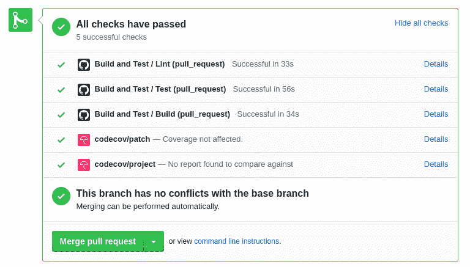
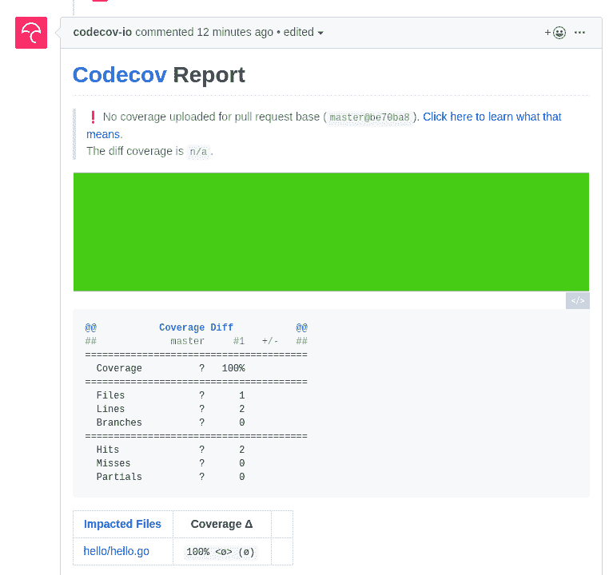
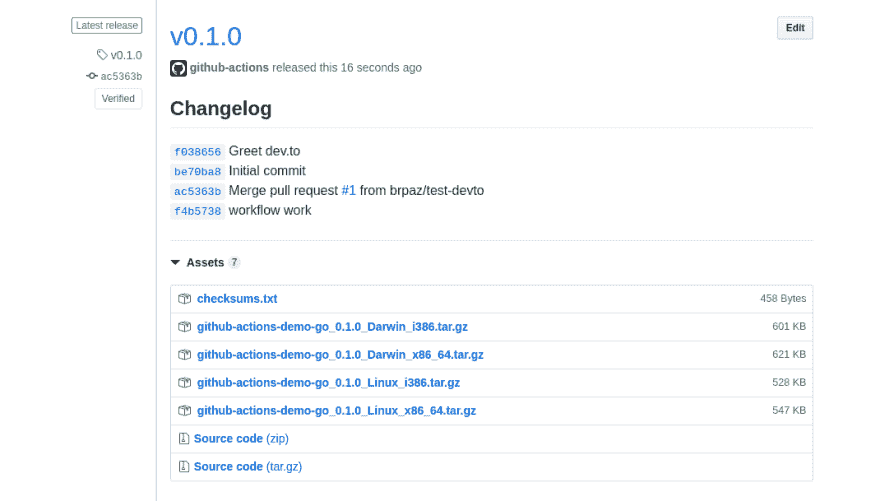

# 使用 GitHub 操作为 Golang 应用程序构建基本的 CI/CD 管道

> 原文：<https://dev.to/brpaz/building-a-basic-ci-cd-pipeline-for-a-golang-application-using-github-actions-icj>

[GitHub](https://github.com) 上周宣布了令人兴奋的 [GitHub Actions](https://github.com/features/actions) 新功能，包括内置对 CI/CD 管道的支持。

你可以在 Youtube 上观看完整的公告。

这对 GitHub 来说是一个巨大的里程碑，也是最令人期待的功能之一，因为像 [GitLab](https://about.gitlab.com/product/continuous-integration/) 和 [Bitbucket](https://bitbucket.org/product/features/pipelines) 这样的平台已经有了很多解决方案。

这是微软和 Nat Friedman 领导下公司巨大发展的又一个好例子。

GitHub Actions 将允许构建一个完整的 CI/CD 管道，与 GitHub 生态系统深度集成，无需使用 Travis CI 或 Circle CI 等第三方服务，跟随“一体化”解决方案的趋势，GitLab 可能是最好的例子。

该功能针对有限的用户群进行测试，预计将于今年 11 月面向所有用户发布。对于开源项目，它将是免费的，对于私有库，每月有 2000 分钟的免费构建时间。(按用户，不是回购)。

您现在可以[请求提前访问](https://github.com/features/actions/signup)。我已经有了，我写这篇文章来展示你能做什么！

## 我们将建造什么

为了展示 GitHub Actions 的新特性，我们将构建一个“Hello world”Golang 应用程序，它有一个非常基本的管道，在每次 Pull 请求或 push 到主分支后，它将 lint 我们的代码，运行单元测试，并使用 [Codecov](https://codecov.io/) 生成代码覆盖报告。

然后，当一个新的“标签”在存储库中创建时，它将使用[gore releaser](https://goreleaser.com/)工具创建一个新的 GitHub 版本。

## 项目代码

示例存储库可以在这里[访问](https://github.com/brpaz/github-actions-demo-go)，您可以随意分叉它或者跟随它。

我不会详细讨论应用程序本身的代码。这是一个标准的“Hello world”应用程序，它将文本“Hello GitHub actions”打印到标准输出中。

下面是 main.go 文件的代码:

```
package main

import (
    "fmt"
    "github.com/brpaz/go-github-actions/hello"
)

func main() {
    fmt.Println(hello.Greet())
} 
```

这里是“问候”功能:

```
package hello

// Greet Greets GitHub Actions
func Greet() string {
    return "Hello GitHub Actions"
} 
```

和各自的单元测试:

```
package hello

import "testing"

func TestGreetsGitHub(t *testing.T) {
    result := Greet()
    if result != "Hello GitHub Actions" {
        t.Errorf("Greet() = %s; want Hello GitHub actions", result)
    }
} 
```

## 管道

GitHub 动作基于工作流的概念。工作流只不过是在满足某些条件或事件时执行的一组作业和步骤。(例如:推送到存储库、拉请求、部署等)。

每个项目可以有多个工作流，每个工作流响应一组不同的事件。

在我们的例子中，我们将有两个工作流。“构建”或“主”工作流将在主分支推送或 PR 创建时触发，而“发布”工作流将在新标签被推送到 GitHub 时运行，这将创建应用程序的新版本。

每个工作流由一个或多个作业组成。我们的“构建”工作流将有 3 个作业(Lint、构建和测试)，我们的“发布”工作流将有一个“发布”作业。

每项工作都是由步骤组成的。例如,“单元测试”工作将包含检查源代码、运行测试和生成代码覆盖报告的步骤。

最棒的是，你不必重新发明轮子，你可以在你的步骤中重用 GitHub 本身或社区构建的现有动作，甚至只是常规的 Docker 图像。

我们将在文章中看到所有这些的例子。

工作流是在位于存储库的`.github/workflows`目录下的 YAML 文件中定义的。

目录中的每个文件代表一个不同的工作流程。

下面是我们构建工作流的样子:

```
name: Build and Test
on:
  push:
    branches:
      - master
  pull_request:

jobs:
  lint:
    name: Lint
    runs-on: ubuntu-latest
    steps:
      - name: Set up Go
        uses: actions/setup-go@v1
        with:
          go-version: 1.12

      - name: Check out code
        uses: actions/checkout@v1

      - name: Lint Go Code
        run: |
          export PATH=$PATH:$(go env GOPATH)/bin # temporary fix. See https://github.com/actions/setup-go/issues/14
          go get -u golang.org/x/lint/golint 
          make lint

  test:
    name: Test
    runs-on: ubuntu-latest
    steps:
      - name: Set up Go
        uses: actions/setup-go@v1
        with:
          go-version: 1.12

      - name: Check out code
        uses: actions/checkout@v1

      - name: Run Unit tests.
        run: make test-coverage

      - name: Upload Coverage report to CodeCov
        uses: codecov/codecov-action@v1.0.0
        with:
          token: ${{secrets.CODECOV_TOKEN}}
          file: ./coverage.txt

  build:
    name: Build
    runs-on: ubuntu-latest 
    needs: [lint, test]
    steps:
      - name: Set up Go
        uses: actions/setup-go@v1
        with:
          go-version: 1.12

      - name: Check out code
        uses: actions/checkout@v1

      - name: Build
        run: make build 
```

我们从定义工作流的名称和运行时间开始。在我们的例子中，我们希望它在有主设备的推送或拉取请求时运行。有很多活动可以听。你可以在这里了解更多信息

该工作流包含 3 个作业，“lint”、“测试”和“构建”。

让我们快速看一下“lint”作业:

```
 lint:
    name: Lint
    runs-on: ubuntu-latest
    steps:
      - name: Set up Go
        uses: actions/setup-go@v1
        with:
          go-version: 1.12

      - name: Check out code
        uses: actions/checkout@v1

      - name: Lint Go Code
        run: |
          export PATH=$PATH:$(go env GOPATH)/bin # temporary fix. See https://github.com/actions/setup-go/issues/14
          go get -u golang.org/x/lint/golint 
          make lint 
```

这里，我们指定希望这个作业在 ubuntu 机器上运行。(“运行”关键字)。

动作支持 Linux、Mac 和 Windows 以及 Docker。在未来，将有可能使用你自己的机器作为跑步者。

然后，我们定义组成我们工作的步骤。

第一件事是安装 Go。GitHub 已经为它提供了一个动作，我们就用它:

```
 - name: Set up Go
   uses: actions/setup-go@v1
   with:
     go-version: 1.12 
```

我认为语法很容易解释。关键字`with`允许我们指定动作所需的参数。在这种情况下,“setup-go”操作允许我们指定要使用的 go 版本。

下一步是检查源代码。我们将再次使用一个内置动作:

```
 - name: Check out code
   uses: actions/checkout@v1 
```

最后，我们将安装并运行`golint`工具:

```
- name: Lint Go Code
  run: |
    export PATH=$PATH:$(go env GOPATH)/bin
    go get -u golang.org/x/lint/golint 
    make lint 
```

就是这样。其余的工作都很相似。让我们来看看“测试”工作。

```
 test:
    name: Test
    runs-on: ubuntu-latest
    steps:
      - name: Set up Go
        uses: actions/setup-go@v1
        with:
          go-version: 1.12

      - name: Check out code
        uses: actions/checkout@v1

      - name: Run Unit tests.
        run: make test-coverage

      - name: Upload Coverage report to CodeCov
        uses: codecov/codecov-action@v1.0.0
        with:
          token: ${{secrets.CODECOV_TOKEN}}
          file: ./coverage.txt 
```

这里唯一的新东西是我们使用了第三方的[动作](https://github.com/codecov/codecov-action)，在这个例子中，向 CodeCov 发布测试覆盖报告。

用法与内置操作完全相同。在这里，我们还使用了一个新的 GitHub 功能“secrets”来存储 Codecov 操作所需的“Codecov token”。您可以通过访问项目设置->机密选项卡来配置您的机密。

你可以用任何语言创建自己的动作(只需添加一个 docker 文件)，或者如果你喜欢 Typescript，你可以使用他们的[动作工具包](https://github.com/actions/toolkit)。

这样，我们完成了第一个工作流程。)

让我们创建一个新的分支，并进行代码更改，以查看 PR 工作流的运行情况。

```
git checkout -b greet-devto 
```

现在将我们的“问候”功能改为“问候”开发人员用户:

```
func Greet() string {
    return "Hello GitHub Actions. Dev.to is awesome"
} 
```

我们还需要相应地更新各自的单元测试:

```
func TestGreetsGitHub(t *testing.T) {
    result := Greet()
    if result != "ello GitHub Actions. Dev.to is awesome" {
        t.Errorf("Greet() = %s; want ello GitHub Actions. Dev.to is awesome", result)
    }
} 
```

现在推送分支，并创建一个到主分支的拉请求。“构建”工作流将立即开始。

在工作流通过之前，合并将被阻止，您将能够直接在拉取请求中看到状态:

[](https://res.cloudinary.com/practicaldev/image/fetch/s--x7qM_q7L--/c_limit%2Cf_auto%2Cfl_progressive%2Cq_auto%2Cw_880/https://thepracticaldev.s3.amazonaws.com/i/1qlqdjtvq7vwsj8afb45.png)

还记得我们增加了 Codecov 集成吗？通过工作流程中的一行代码，我们将 Codecov 与 PR 状态检查和作为 PR 注释的覆盖报告完全集成:

[](https://res.cloudinary.com/practicaldev/image/fetch/s--nnIrVf4a--/c_limit%2Cf_auto%2Cfl_progressive%2Cq_auto%2Cw_880/https://thepracticaldev.s3.amazonaws.com/i/ispe3mcllj37fzgzkwfl.png)

## 发布工作流程

是时候创建我们的“发布”工作流了。每个工作流都是一个单独的文件，所以我们将用以下内容创建`.github/workflows/release.yml`:

```
name: Release
on:
  create:
    tags:
      - v*

jobs:
  release:
    name: Release on GitHub
    runs-on: ubuntu-latest
    steps:
      - name: Check out code
        uses: actions/checkout@v1

      - name: Validates GO releaser config
        uses: docker://goreleaser/goreleaser:latest
        with:
          args: check

      - name: Create release on GitHub
        uses: docker://goreleaser/goreleaser:latest
        with:
          args: release
        env:
          GITHUB_TOKEN: ${{secrets.GITHUB_TOKEN}} 
```

我们指定只在新创建的标签上触发它，并定义了一个“释放”作业。

**注意:`on`条件似乎有些问题。例如，当我推送一个标签时，它也在运行构建工作流。记住行动仍然是测试版，所以要考虑到这一点。**

该作业将检查代码，并使用 [GoReleaser](https://goreleaser.com/) 官方 docker 映像来完成所有工作。

使用 docker 时，可以定义容器的“参数”和“入口点”。在这种情况下，我们将使用默认的入口点，但是在“Validate”和“Create Release”步骤中定义一个不同的参数。

我们还指定了 Go Releaser 在 GitHub 上创建发布所需的`GITHUB_TOKEN`环境变量。这个变量将被传递给容器。注意`secrets.GITHUB_TOKEN`变量是由 Actions 平台自动注入的，所以不需要我们自己创建。

如果您创建了一个标签并将其推送到存储库:

```
git tag v0.1.0
git push --tags 
```

将在 GitHub 上创建一个新的版本，使用 Go Releaser 工具生成的应用程序工件和 Changelog。

[](https://res.cloudinary.com/practicaldev/image/fetch/s--nFIlePNv--/c_limit%2Cf_auto%2Cfl_progressive%2Cq_auto%2Cw_880/https://thepracticaldev.s3.amazonaws.com/i/bram0f07yr8xi07lwmes.png)

我们用 GitHub actions 建立了第一个管道。；)

非常基本的例子，但我认为足以给你一个关于它如何工作的好主意。

* * *

## 结论

我对 GitHub 目前的工作方式印象深刻，并期待着最终的发布。

我相信 GitLab 对于更高级的用例仍然是更优越的，因为它支持例如手动批准和参数化构建，这是企业的基本功能，但是我们不能忘记 GitHub Actions 仍然处于测试阶段，我想这些功能迟早会出现。

动作也有一些 GitLab 没有的好特性，随着 Matrix 的构建。

Actions 目前拥有的特性，对于 90%的项目来说应该是绰绰有余的，我相信对于开源和个人项目来说将会是巨大的。

随着所有 GitHub 社区建立各种开源行动，我们可以期待惊人的事情。

随着 3 大 Git 托管提供商支持 CI 管道，随着 Jenkins 在企业中仍然非常受欢迎，以及一些新的更专业的工具，如 [Codefresh](https://codefresh.io/) ，我对 Travis 或 Circle CI 等更传统的 CI 专用平台的未来感到好奇。

这一领域肯定会有激动人心的时刻。

感谢您的阅读，如果您有机会试用测试版，请在评论区给出您的反馈。

* * *

## 引用

*   [功能 GitHub 动作](https://github.com/features/actions)
*   [关于 GitHub 动作- GitHub 帮助](https://help.github.com/en/articles/about-github-actions)