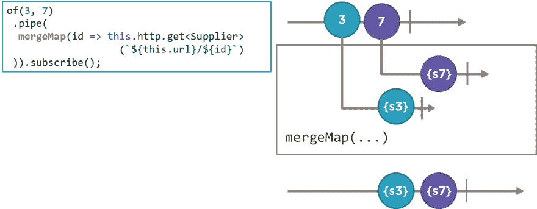

# 什么是高阶可观测值？

> 原文：<https://dev.to/angular/what-is-a-higher-order-observable-4k52>

深入研究 RxJS 或 JavaScript 的反应式扩展的挑战之一是术语。我们可能知道使用 RxJS 的基本知识，但要真正理解它是如何工作的，我们需要牢牢掌握它的词汇。
让我们集中精力回答这些问题:

*   什么*是*高阶可观测？
*   什么是内在和外在的可观察性？
*   而更高阶的映射操作符，比如 mergeMap 或者 switchMap 的目的是什么？

通过掌握这些概念，我们可以更好地利用 RxJS 来构建更具声明性和反应性的角度应用程序。

**点击此处查看全文**:【https://blogs.msmvps.com/deborahk/higher-order-observable/ T2】

要了解 RxJS 的更多信息，请查看我的 Pluralsight 课程:“角度中的 RxJS:反应式开发”。可以在这个网址找到:[https://app . plural sight . com/library/courses/rxjs-angular-reactive-development](https://app.pluralsight.com/library/courses/rxjs-angular-reactive-development)