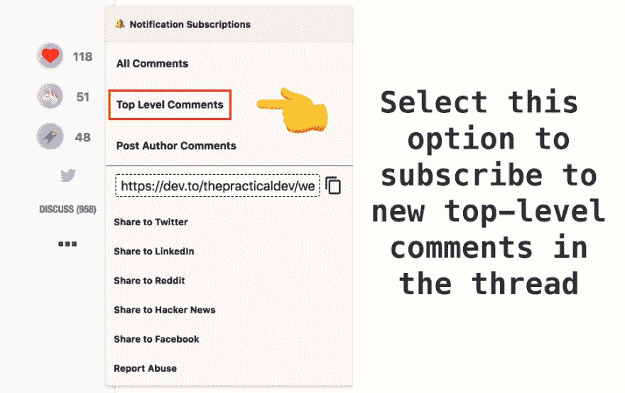

# 开发人员提示:订阅“欢迎线程”

> 原文：<https://dev.to/peter/dev-tip-subscribe-to-the-welcome-thread-1amg>

每周都有成千上万的新人加入 DEV 社区。这些程序员来自世界各地，背景各异，经验丰富。

许多人选择在 [DEV Staff](https://dev.to/thepracticaldev) 账户发布的“欢迎帖”中介绍自己。这是一个打招呼、会见其他社区成员以及确保每个人在 DEV 上都感到受欢迎的好地方。

如果你想在该主题中收到新帖子的通知，可以考虑“订阅”通知。只需点击文章侧边栏中的`...`，选择“顶级评论”通知选项

这样，每当有新人介绍自己时，您都会收到通知。如果在任何时候你想禁用通知，只要回到同一个区域，并选择“取消订阅。”

我希望这篇技巧能鼓励你欢迎新用户，并帮助你了解 dev.to 上的评论订阅功能。

您可以在此处找到最新的欢迎主题:

 [## 欢迎线程- v37

### 开发人员至员工 19 年 8 月 19 日 1 分钟阅读

#welcome](/thepracticaldev/welcome-thread-v37-172)