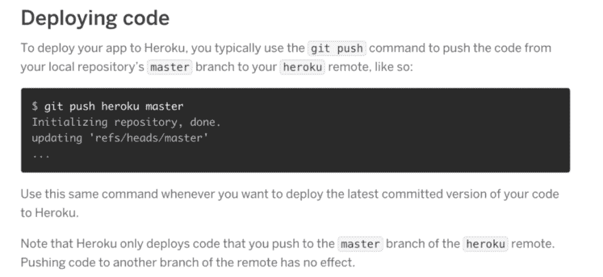
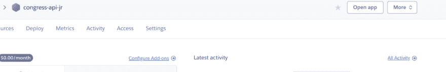
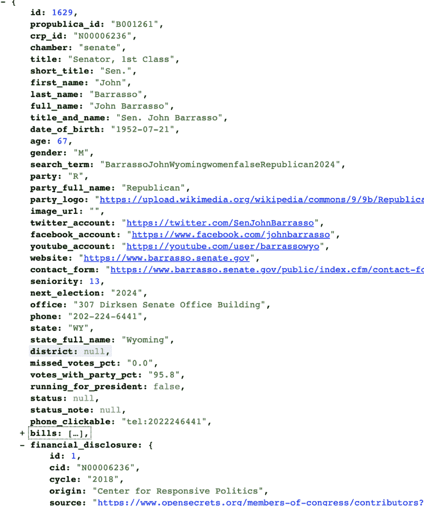
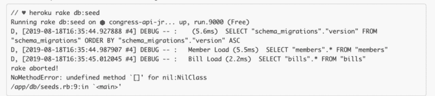
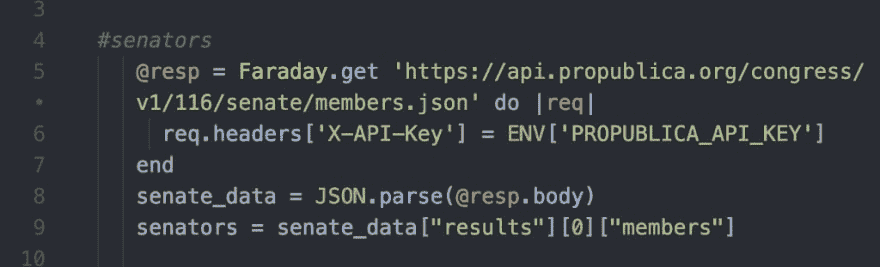
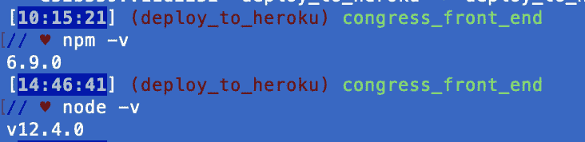
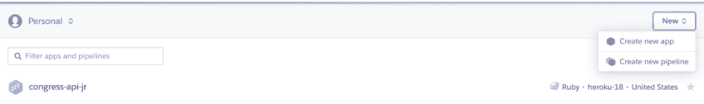

# 我如何将我的 React-on-Rails 应用程序部署到 Heroku

> 原文：<https://dev.to/joanrig/how-i-deployed-my-react-on-rails-app-to-heroku-3758>

太空漫游…

[](https://res.cloudinary.com/practicaldev/image/fetch/s--mt6yDsgo--/c_limit%2Cf_auto%2Cfl_progressive%2Cq_auto%2Cw_880/https://cdn-images-1.medium.com/max/1024/1%2AUInVHxDBimowrdiuJSzmaA.png)

我刚刚从熨斗学校毕业，我对我的最终项目非常满意，这是一个国会名人录应用程序——一个教育游戏。最长的一段时间，卡在我的电脑上。看到它的人想知道如何使用它。他们能下载吗？(是的，如果你想按照这 20 个步骤来创建一个 Git 帐户，并派生和克隆两个 repos，将它们捆绑起来并在正确的服务器上运行…)

我想说的是是的，链接在这里！现在我有了。我的 app 住在这里:[https://congress-front-end.herokuapp.com/](https://congress-front-end.herokuapp.com/)。

如果您在将 React-on-Rails 应用程序部署到 Heroku 时遇到问题，尤其是您的应用程序调用外部 API(应用程序编程接口)时，请继续阅读，并从我的错误中吸取教训！

注意:有一些关于如何做到这一点的博客文章，加上 Heroku 文档本身。两者的某些部分对我都有效，有些则无效。我就是这个步骤的组合，按照这个顺序，对你起作用！

### 假设条件(前提条件！)

[https://medium . com/media/255d 34d 133519651 a 4668449 FEC 9 E1 b 1/href](https://medium.com/media/255d34d133519651a4668449fec9e1b1/href)

这篇博文假设:

1.  您有一个工作正常的 Rails API 后端。
2.  您的 Rails API 后端数据库是 Postgres。
3.  你有一个工作的反应前端。
4.  两者都在独立的 Github 存储库中进行跟踪。
5.  您有一个 Heroku 帐户。(如果没有，请遵循[这里的简单注册说明](https://signup.heroku.com/))
6.  您已经安装了 Heroku CLI(如果没有安装[，请遵循以下步骤](https://devcenter.heroku.com/articles/heroku-cli#getting-started))

### 第一部分:部署您的 Rails API 后端

#### 第一步。为此在 Github 上创建一个单独的分支。

我的后端命名为 congress-api。我创建了一个名为 deploy_to_heroku 的新分支。创建后，github 自动将我转移到我的新分支。

```
// ♥ git co -b deploy\_to\_heroku

[**10:03:55**] (deploy\_to\_heroku) congress\_api

// ♥ 
```

现在，如果一切都出错了，你至少可以回到你之前的分支。

### 第二步。如果这是你的第二次、第五次或第二十次尝试……清理你之前的混乱。

*(如果这是您第一次部署到 Heroku，请跳过这一步)*

[https://medium . com/media/59 b 26 ad 2 E0 DD 7 CB 3096055d 9 f 96d 810d/href](https://medium.com/media/59b26ad2e0dd7cb3096055d9f96d810d/href)

我试了又试，试了很多次才成功！在之前的努力中，我在 Heroku 上创建并重新创建了这个应用程序。那些之前的努力做得不对，让我后来的努力脱轨。如果你在同一条船上，去你的 Heroku 仪表板，并摆脱任何以前试图在 Heroku 上创建这个特定的应用程序。在我的例子中，我在不同的名字下有我的应用程序的多个副本。

而且…如果在这个过程中，你像我一样遵循建议来运行你的项目的“yarn build ”,你将需要从你的文件树的根中删除你的 yarn.lock 文件。Heroku 不使用 yarn.lock。

### 第三步。添加 Procfile

什么是 procfile？它告诉 Heroku 运行哪些命令来启动你的应用程序！

将它命名为不带扩展名的“proc file”*，并将其添加到您的根目录中。*

我不折不扣地遵循了 Heroku 的文档，并使我的看起来和他们的 Rails 样本代码完全一样:

```
web: bundle exec rails server -p $PORT
worker: bundle exec rake jobs:wor 
```

### 第四步。配置 PUMA 服务器

我遵循了 Heroku 文档中的这些步骤，但是我不确定它们是否被启用，因为我没有在我的 Procfile 中调用 Puma(使用这样的一行“web:bundle exec Puma-C config/Puma . Rb ”)

当我有时间尝试删除 Puma.rb 文件时，我会更新这篇文章，看看会发生什么。

### 第六步。创建一个 Heroku 遥控器。

在终端中，导航到应用程序的根目录，然后[按照 Heroku 文档中的说明](https://devcenter.heroku.com/articles/git#creating-a-heroku-remote)进行操作。

### **第七步。将 Heroku Postgres 添加到您的应用程序**

[遵循 Heroku 文档中的这些步骤](https://devcenter.heroku.com/articles/heroku-postgresql#provisioning-heroku-postgres)

然后，在终端运行 Heroku config。这将显示新 Heroku Postgres 附加组件的 url。(很长。下面我只是展示我的第一部分)。

[](https://res.cloudinary.com/practicaldev/image/fetch/s--ePTSRTGA--/c_limit%2Cf_auto%2Cfl_progressive%2Cq_auto%2Cw_880/https://cdn-images-1.medium.com/max/694/1%2AcJi8a4YBCACFtwUQJpq_4g.png)

*重要！*

获取数据库 url ("postgres:// etc ")，并在 database.yml 文件中设置 DATABASE_URL =

### 第六步。部署！

来自 Heroku 文档:

[](https://res.cloudinary.com/practicaldev/image/fetch/s--X1QIE2Hv--/c_limit%2Cf_auto%2Cfl_progressive%2Cq_auto%2Cw_880/https://cdn-images-1.medium.com/max/1024/1%2AndLgejXpSQRjliTU01bt3g.png)

然后导航到新应用的 url。(如果找不到，请转到 Heroku 仪表盘，点击新应用的名称，然后点击右侧的“打开应用”。)

[](https://res.cloudinary.com/practicaldev/image/fetch/s--7Cgg92QK--/c_limit%2Cf_auto%2Cfl_progressive%2Cq_auto%2Cw_880/https://cdn-images-1.medium.com/max/1024/1%2AxR50fymEeG_zWO2O8pLC7A.png)

获取该 url，您将在第二部分中用到它！

### 第七步。看…..什么都没有？

[https://medium . com/media/2704 ed 6a 06 c 6106 b 65 EB 5a 0353 D5 B4 c 8/href](https://medium.com/media/2704ed6a06c6106b65eb5a0353d5b4c8/href)

除非你找到并按照步骤[原样导入你的 Postgres 数据库](https://devcenter.heroku.com/articles/heroku-postgres-import-export)，否则你就像我一样用空数据库部署了你的应用。因此，在我“成功”部署之后，我期望看到与开发期间在我的后端页面上看到的一样的东西:大量的 JSON 数据。像这样:

[](https://res.cloudinary.com/practicaldev/image/fetch/s--cXBqju-Z--/c_limit%2Cf_auto%2Cfl_progressive%2Cq_auto%2Cw_880/https://cdn-images-1.medium.com/max/1024/1%2Ay5jnKJq5blAgiWFyMUHp6A.png)

但相反，我看到了:

[]

为什么？因为我用空数据库部署了一个 app。

如果您没有调用外部数据库，可以通过运行以下命令来解决这个问题:

 ``heroku rake db:create
heroku rake db:migrate
heroku rake db:seed`` 

 ``(Heroku 不支持 heroku rake:db reset。)[参见文档。](https://devcenter.heroku.com/articles/rake)

但是，如果您的应用程序调用外部 API，这将不起作用！为什么不呢？请继续阅读…

### 第八步。如果你的应用程序调用外部 API，你必须…

*…使用 Heroku 配置环境变量。*

好了，这一步差点要了我的命。在做了大量的谷歌搜索和阅读了大量的文档和栈溢出帖子后，我设法到达了我所要做的就是播种我的数据库的地步。但是当我运行 Heroku rake db:seed 时，我失败了。

[](https://res.cloudinary.com/practicaldev/image/fetch/s--GLChW-us--/c_limit%2Cf_auto%2Cfl_progressive%2Cq_auto%2Cw_880/https://cdn-images-1.medium.com/max/1024/1%2Ay5iWDd4-BozORbGih-lztg.png)

所以最大的提示是，检查/app/db/seeds.rb:9

那里有什么？我的 API 调用的结果，顺便说一下，在开发中运行得非常好。

[](https://res.cloudinary.com/practicaldev/image/fetch/s--sq6Nvv2x--/c_limit%2Cf_auto%2Cfl_progressive%2Cq_auto%2Cw_880/https://cdn-images-1.medium.com/max/1024/1%2AOaCES2_AMDdzEXLaZIHnmQ.png) 

<figcaption>在开发部工作过，为什么不在 Heroku？</figcaption>

我试图刺探我的产品代码，但没有成功。然后，在谷歌搜索了很久之后，我发现 Heroku 不识别 ENV 变量，至少在 API 调用中不识别。如果您想在部署到 Heroku 的应用程序中使用 API 密钥，您必须在 Heroku CLI 中配置这些变量。

我的朋友们，这些是神奇的步骤。

对我来说，它们看起来像这样:

[](https://res.cloudinary.com/practicaldev/image/fetch/s--J-5N3SaH--/c_limit%2Cf_auto%2Cfl_progressive%2Cq_auto%2Cw_880/https://cdn-images-1.medium.com/max/836/1%2AVEBloW6mPs0cZC0hN6IX6Q.png)

等等。

在我弄清楚之后，我运行了 heroku rake db:seed

看到我的数据库真正加载时，我激动不已。

如果你正在跟随，休息一下，跳一会儿舞，鼓起勇气！你刚刚完成了最难的部分。第二部分简单多了，我保证。

[https://medium . com/media/d 594902 b 7 f 42 e 974 ad 45508 f 599 e 87 c 5/href](https://medium.com/media/d594902b7f42e974ad45508f599e87c5/href)

### 第二部分:部署 React 前端

(比第一部分简单多了！)

*我跟着* [*这些方向从沙科尔史密斯*](https://dev.to/smithmanny/deploy-your-react-app-to-heroku-2b6f) *(thx 沙科尔！).以下是他的指导加上一些我自己的观察和截图的精华。*

这些说明假设您使用 create-react-app 创建了 React 前端。在继续之前，进入终端并导航到 React 前端的根目录。

### **第一步。设置您的前端为您的后端调用新的 url。**

在开发过程中，我在 http://localhost/3000 上运行了我的 rails 后端。所以我所有的后端获取都使用 [http://localhost/3000](http://localhost/3000) 作为基本 URL。但是随着我的后端实际上在 Rails 上运行，我不得不更新那些 URL——嗯，全部 10 个。

当我设置这些获取调用时，我像这样键入 URL:

fetch([http://localhost/3000/search/senates](http://localhost/3000/search/senators))

对于一次或两次获取来说，这还不错，但我有超过 10 次的获取。所以为了准备我的 Heroku 部署，我首先做了我应该做的。我将基本 url 抽象成它自己的常量:

``
const API _ BASE _ URL = "[http://localhost/3000](http://localhost/3000)`

 `...

fetch(API _ BASE _ URL+'/search/senaters ')
`

 `我在两个文件中做了 16 次提取。(命令 D 派上用场了！—选择一个字符串的第一个实例，重复按命令 D 来选择后续实例，然后键入替换字符串，瞧！)

### 第二步。弄清楚您运行的是哪个版本的 node 和 npm。

运行 npm -v

和节点 v

[](https://res.cloudinary.com/practicaldev/image/fetch/s--eu5D_i8M--/c_limit%2Cf_auto%2Cfl_progressive%2Cq_auto%2Cw_880/https://cdn-images-1.medium.com/max/732/1%2AqxID1JWBpk9Tv28TWjgqlw.png) 

<figcaption>我运行的是 npm 版本 6.9.0 和 node 版本 12.4.0</figcaption>

### 第三步。向 package.json 添加一个引擎对象

[](https://res.cloudinary.com/practicaldev/image/fetch/s--pHDHS4yo--/c_limit%2Cf_auto%2Cfl_progressive%2Cq_auto%2Cw_880/https://cdn-images-1.medium.com/max/486/1%2AnsLvlE5blfralsAm1jkWPA.png)

在 Shakhor 的带领下，我把我的放在了依赖之上(我不知道顺序是否重要，如果你知道重要，请告诉我！)

[](https://res.cloudinary.com/practicaldev/image/fetch/s--9aL8UPK5--/c_limit%2Cf_auto%2Cfl_progressive%2Cq_auto%2Cw_880/https://cdn-images-1.medium.com/max/830/1%2A86NQRMTvAbWcR2WQTtKtgg.png)

### 第四步。用最简单的方法创建一个远程 Heroku 库。

在浏览器中打开 Heroku 仪表板。点击“新建”并选择“创建新应用”

[](https://res.cloudinary.com/practicaldev/image/fetch/s--oZbS74ny--/c_limit%2Cf_auto%2Cfl_progressive%2Cq_auto%2Cw_880/https://cdn-images-1.medium.com/max/1024/1%2AYYTQofKRZuknfLO1Mq3tfA.png)

您将看到刚刚创建的应用程序的仪表板。转到 deploy 选项卡，按照指示将您的应用程序连接到 Github，启用自动部署，并选择您正在部署的分支(在我的例子中是 deploy_to_github)。完成后，不要忘记单击 deploy 分支！

如果你得到失败的消息，部署标签，加上一个错误的日志。这些信息非常清楚，包括如何解决问题的明确说明。

由于 yarn.lock 和 package.json 文件冲突，我的部署失败；错误信息明确告诉我删除 yarn.lock .然后你要保存那个修改，重新运行 git push heroku master 把那个修改推送到 heroku。

修复两个这样的错误后，成功！我终于让我的 React 和 Rails 应用在 Heroku 上运行了！！！

希望这可以将您的部署时间减少到一个小时以内！！！````