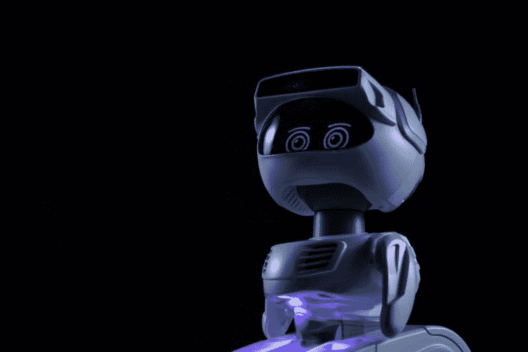
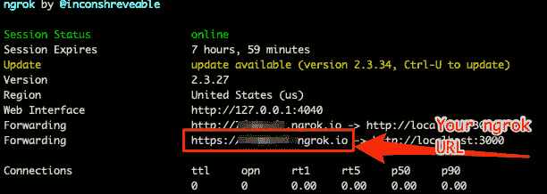
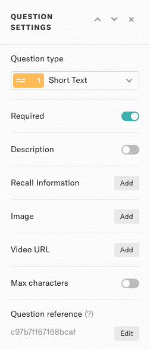

# 教程:在尊重机器人基本法则的情况下入侵机器人

> 原文：<https://dev.to/typeform/tutorial-hacking-a-robot-and-respecting-fundamental-laws-of-robotics-54c4>

上周，作为他们冠军项目的一部分，我受邀参加了在旧金山举行的 Twilio Signal 会议。

在我们的峰会上，我有机会见到了其他令人敬畏的冠军。你们都应该追随他们，他们都在世界各地的社区里做着令人惊叹的事情。点击这里了解更多关于 Twilio 冠军计划[的信息。](https://www.twilio.com/champions)

会议本身充满了关于 Twilio 生态系统的重大公告。我最感兴趣的是[对话](https://www.twilio.com/conversations)，这是一种将使用不同系统(短信、WhatsApp、聊天)的许多人联系起来的方式...)进入同一个对话。新的 [Twilio CLI](https://github.com/twilio/twilio-cli) 可以直接在终端中围绕 Twilio 做任何事情，看起来也很棒。

Signal 的另一个重大宣布是桌面版的第三版 TwilioQuest。如果你不熟悉 TwilioQuest，想象一个视频游戏，你通过解决编码挑战获得 XP 点数。
这是一种了解 Twilio 世界和一般编程的有趣方式。

<figure>

[](https://res.cloudinary.com/practicaldev/image/fetch/s--znxpY4Hk--/c_limit%2Cf_auto%2Cfl_progressive%2Cq_auto%2Cw_880/https://www.twilio.com/quest/next/img/screenshots/explore.png)

<figcaption>Screenshot of TwilioQuest</figcaption>

</figure>

你在 TwilioQuest 中互动的主角名为 *Cedric* ，是一个友好的机器人，引导你完成对抗*遗留系统*的任务。

我没有意识到的是:塞德里克是真实的！他和他的朋友也参加了 Signal。他们中的很多人在世博会的地板和展位上闲逛。

如果你花一些时间和迷雾机器人公司(迷雾机器人的母公司，塞德里克的机器人家族)的团队在一起，TwilioQuest 上甚至有一个特殊的信号任务来赚取 XP。

这正是我所做的！我去见了 Misty 机器人团队，以了解更多关于这些友好机器人的信息🤖

该团队正在组织开发者测试会议，并邀请人们尝试他们的 *Hello World* 教程来“黑”机器人。

Misty 是一个令人难以置信的机器人，在许多事情中，她有多个传感器在你的房子周围移动而不会撞到任何东西，有一个扬声器来表达自己，有一个屏幕来显示一些情绪，还有一个具有面部识别功能的摄像头。所有这些都可以通过 SDK 破解！🎉

<figure>

[](https://res.cloudinary.com/practicaldev/image/fetch/s--Sk6xgmov--/c_limit%2Cf_auto%2Cfl_progressive%2Cq_auto%2Cw_880/https://thepracticaldev.s3.amazonaws.com/i/pxgaixc6e8stohh53h3o.jpg)

<figcaption>Isn't she lovely?</figcaption>

</figure>

我从这个教程中获得了很多乐趣。我让米丝蒂动了起来，让她眨了眨眼，甚至教她认出了我。会议结束时，团队分发调查问卷以收集反馈。你可能已经猜到这是一种字体！🤩

那我别无选择...我必须把米丝蒂和字体连接起来。

我想让米丝蒂在每次有人填写调查表时有所反应。

以下是我如何将两者联系起来的。

# 总体原则📖

我们依靠 Typeform webhooks 功能在有人回答后立即做出反应。

webhook 由一个可以调用 Misty API 并使机器人做出反应的应用程序接收。

但是为了能够与 Misty 机器人通信，你的应用程序需要在同一个 WIFI 网络上，所以最有可能的是，你将在笔记本电脑上本地运行它。

我们将使用 [ngrok](http://ngrok.io) 向世界展示本地主机🌍。

# 让小霞动动胳膊

我们在一个名为`app.js`的文件中创建了一个只有一个端点的小型 express 应用程序。这个端点将接收 webhook 通知，然后调用 Misty API。

看起来是这样的:

```
const express = require('express')
const app = express()
const port = 3000

const axios = require('axios')
const bodyParser = require('body-parser')

// parse application/x-www-form-urlencoded
app.use(bodyParser.urlencoded({ extended: false }))

// parse application/json
app.use(bodyParser.json())

const ROBOT_IP = '10.41.129.96' //change to your own
app.post('/', (req, res) => {
  res.sendStatus(200)

  axios({
    method: 'POST',
    url: `http://${ROBOT_IP}/api/arms`,
    data:{
        Arm: "left",
        Position: -90,
        Velocity: 100,
        Units: "degrees"
      }
  }).catch(function(err){
    console.log(err)
  })
})

app.listen(port, () => console.log(`Example app listening on port ${port}!`)) 
```

<svg width="20px" height="20px" viewBox="0 0 24 24" class="highlight-action crayons-icon highlight-action--fullscreen-on"><title>Enter fullscreen mode</title></svg> <svg width="20px" height="20px" viewBox="0 0 24 24" class="highlight-action crayons-icon highlight-action--fullscreen-off"><title>Exit fullscreen mode</title></svg>

您可以使用命令`node app.js`运行应用程序

为了让她的手臂抬起来，在您的终端中运行下面的命令`curl -X POST https://localhost:300`。

如果一切正常，你应该看到米丝蒂的左臂抬起来了🎉

# 将其连接到字体🔗

所有这些在本地都工作得很好，但是把它连接到其他服务不是很酷吗？

要做到这一点，我们需要一个名为 [ngrok](https://ngrok.com/) 的强大工具的帮助。ngrok 将暴露您的本地主机，并通过给它一个 URL 使它对互联网的其余部分可用。这个 URL 对你和每次你启动 ngrok 都是唯一的。请务必阅读其[入门指南](https://dashboard.ngrok.com/get-started)。

一旦你安装了 ngrok，你就可以运行命令`ngrok http 300`。
这会给你一个 URL。我们将使用它从外部调用我们的应用程序。

<figure>

[](https://res.cloudinary.com/practicaldev/image/fetch/s--clIOpbEX--/c_limit%2Cf_auto%2Cfl_progressive%2Cq_auto%2Cw_880/https://www.evernote.com/l/ACUtnS6C0VFJKLTaOVZKDdJGkKcPch-HAy4B/image.png)

<figcaption>Screenshot of ngrok</figcaption>

</figure>

在您的 Typeform 仪表板上，我们现在可以选择我们想要连接到 Misty 的表单，并在 *Connect > Webhooks* 下添加一个带有该 URL 的新 webhook。

瞧🎉现在你有了一个机器人，每当有人填写你的表格时，它就会举起手臂。

这将工作，直到你杀死 ngrok 或节点应用程序。Ngrok 会在你每次启动它的时候给你一个新的 URL，所以在你开发的时候只要保持它打开就可以了。

# 超越🚀

在第一次看到 Misty 举起她的手臂后，我无法抑制自己，我在会场上大喊了一声“呜-呼”😊。

但是我现在不能停下来，因为我就要造出更酷的东西了。

我的最终目标是建立一个应用程序，让 Misty 说话并对发布在表单上的内容做出反应。

## 使她的手臂动态移动👋

所以我做了一个简单的字体表，人们可以留下他们的名字，决定米丝蒂应该举起哪只手。

为了更容易地从 typeform webhook 有效负载中提取数据，我必须更新我的问题的`ref`。在你的文字表单上选择问题，查看侧边栏的底部，然后点击`Edit`。在那里你可以随心所欲地改变它。我把我的叫做`username`和`arm_choice`。

<figure>

[](https://res.cloudinary.com/practicaldev/image/fetch/s--FozdObdn--/c_limit%2Cf_auto%2Cfl_progressive%2Cq_auto%2Cw_880/https://d1nt04ao0vck22.cloudfront.net/uploads/2015/07/09121737/question-settings-2.png)

<figcaption>Edit Ref on typeform question</figcaption>

</figure>

现在让我们看看如何从 webhook 有效负载中提取这些值👇

```
 const { form_response } = req.body
  const {answers} = form_response

  let arm_field = answers.find((a) => a.field.ref === 'arm_choice')
  let selected_arm = arm_field.choice.label

  let username_field = answers.find((a) => a.field.ref === 'username')
  let username = username_field.text 
```

<svg width="20px" height="20px" viewBox="0 0 24 24" class="highlight-action crayons-icon highlight-action--fullscreen-on"><title>Enter fullscreen mode</title></svg> <svg width="20px" height="20px" viewBox="0 0 24 24" class="highlight-action crayons-icon highlight-action--fullscreen-off"><title>Exit fullscreen mode</title></svg>

然后可以将`select_arm`值传递给 Misty API，抬起相应的 arm。

```
axios({
    method: 'POST',
    url: `http://${ROBOT_IP}/api/arms`,
    data:{
        Arm: selected_arm,
        Position: -90,
        Velocity: 100,
        Units: "degrees"
      }
  }).catch(function(err){
    console.log(err)
  }) 
```

<svg width="20px" height="20px" viewBox="0 0 24 24" class="highlight-action crayons-icon highlight-action--fullscreen-on"><title>Enter fullscreen mode</title></svg> <svg width="20px" height="20px" viewBox="0 0 24 24" class="highlight-action crayons-icon highlight-action--fullscreen-off"><title>Exit fullscreen mode</title></svg>

## 制造者自己说话🤖🗣️

Misty REST API 允许你使用`SaveAudio`端点( [doc](https://docs.mistyrobotics.com/misty-ii/reference/rest/#saveaudio-data-string-) )发送 WAV 音频文件，但是...它们必须用 base64 编码😤

所以我不得不找一个黑客来生成一个`.wav`文件，并将其转换为 base64。

我试了几次才找到完美的库来做这件事，但是 [say.js](https://github.com/Marak/say.js/) 救了我一命！

```
const say = require('say')
say.export(`Hello ${username}`, 'Alex', 0.75, `hello_${username}.wav`, (err) => {
  if (err) {
    return console.error(err)
  }
}) 
```

<svg width="20px" height="20px" viewBox="0 0 24 24" class="highlight-action crayons-icon highlight-action--fullscreen-on"><title>Enter fullscreen mode</title></svg> <svg width="20px" height="20px" viewBox="0 0 24 24" class="highlight-action crayons-icon highlight-action--fullscreen-off"><title>Exit fullscreen mode</title></svg>

使用这几行代码，它创建了一个名为`hello_${username}.wave`的`.wav`文件，并带有一个声音，比如说`Hello nicolas`。
不幸的是，我在 mac 上找不到女声的名字，所以我们现在只能用 Alex🤷‍♂️

```
cont fs = require('fs');
let wav = new WaveFile(fs.readFileSync(`hello_${username}.wav`));
let wav64 = wav.toBase64()

  axios({
    method: 'POST',
    url: `http://${ROBOT_IP}/api/audio`,
    data:{
      FileName: `hello_${username}.wav`,
      Data: wav64,
      ImmediatelyApply: true, //make Misty play it right away
      OverwriteExisting: true
    }
  }).catch(function(err){
    console.log(err)
  }) 
```

<svg width="20px" height="20px" viewBox="0 0 24 24" class="highlight-action crayons-icon highlight-action--fullscreen-on"><title>Enter fullscreen mode</title></svg> <svg width="20px" height="20px" viewBox="0 0 24 24" class="highlight-action crayons-icon highlight-action--fullscreen-off"><title>Exit fullscreen mode</title></svg>

还有这个🔝就是我如何读取文件，转换成 base64，调用 Misty API 让它在机器人上播放。

这就是它最终的样子🤩
液体错误:内部

整个应用程序的代码可以在这里找到👇