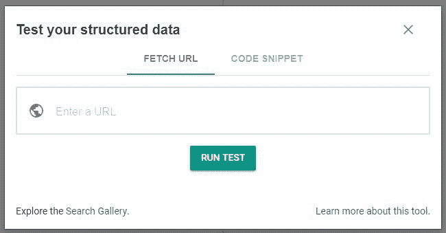
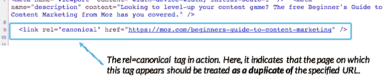
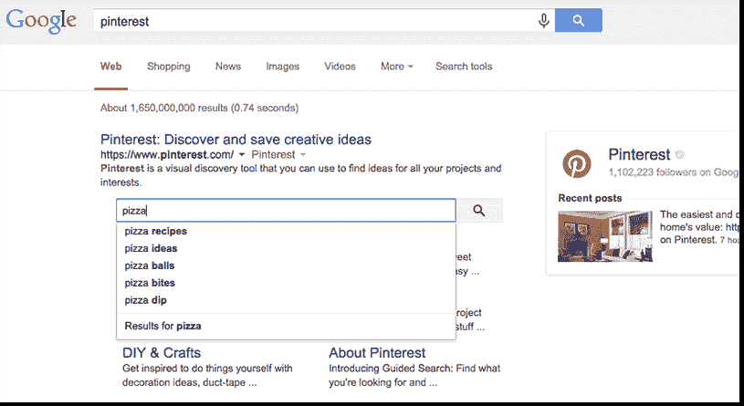
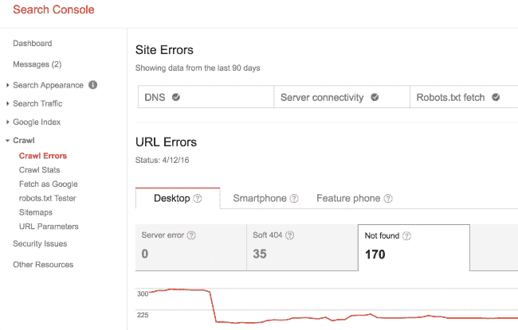
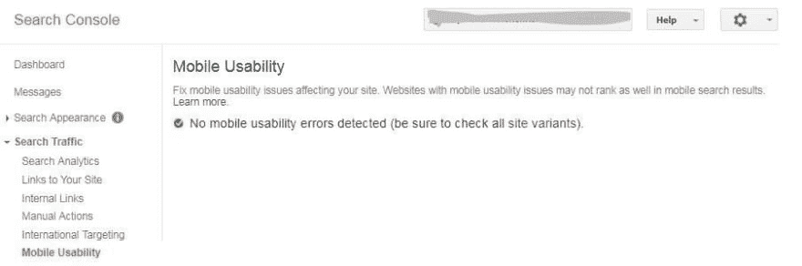

# 开发者搜索引擎优化备忘单

> 原文：<https://dev.to/pagely/seo-cheat-sheet-for-devs-5h1g>

根据净市场份额，谷歌仍然是搜索引擎的领导者，75%的搜索来自 Google.com。记住这一点，遵循他们的最佳搜索引擎优化实践是一个很好的策略，也是所有企业都应该有的。这包括优化一些因素，如移动友好页面和快速页面加载时间，以及使用有用的 SEO 插件来建立一个成功的 WordPress 站点。

数字空间中的每个人都可以在 SEO 中发挥作用，包括网站管理员。在本帖中，我们将介绍新网站或迁移发布前和发布后您需要了解的内容。我们的 *2019 站长 SEO 清单*告诉你怎么一步一步做。

### **准备启动或迁移**

1.  将您的域名设置为自动续订。是的，这听起来是显而易见的，但是当人们错过了续费日期时，他们就失去了他们的域名。
2.  安装[谷歌分析](https://pagely.com/blog/google-analytics-wordpress-guide/)。它是免费的，也有助于你的内容营销人员在搜索引擎优化中发挥作用。
3.  安装一个[插件](https://pagely.com/blog/yoast-seo-alternatives/)来帮助你的技术 SEO，包括标题标签、元描述、结构化数据和网站地图。遵循[标签的最佳实践。](https://moz.com/blog/seo-meta-tags)
4.  设置搜索控制台。
5.  [用结构化数据](https://developers.google.com/search/docs/guides/intro-structured-data?visit_id=1-636507697624367960-3670912478&rd=1)帮助谷歌理解页面内容，用[结构化数据工具](https://search.google.com/structured-data/testing-tool/u/0/)测试你的页面。

6.  使用一个站点审计工具，比如[尖叫青蛙](https://www.screamingfrog.co.uk/seo-spider/)来审计你站点的 SEO。
7.  检查移动友好性。如果移动网站加载时间超过三秒，53%的访问会被放弃。
8.  回顾一下网站管理员在为移动设备设计时经常犯的错误。
9.  告诉搜索引擎使用哪个 URL。Moz 将此(规范化)描述为一种 [*的方式，以防止相同或“重复”的内容出现在多个 URL 上所导致的问题。*T3】](https://moz.com/learn/seo/canonicalization)

10.  使用 https: [早在 2015 年，谷歌的 Gary Illyes 就说过，当页面在其他方面相等时，搜索引擎会偏向 https，这表示一个安全域](https://www.bruceclay.com/blog/gary-illyes-interview/)。除了 SEO 的好处，它还能保证你的网站安全，并且是 [AMP](https://pagely.com/blog/accelerated-mobile-pages-for-wordpress/) 所需要的。
11.  用 ALT 标签识别图像。搜索引擎看不到没有相应描述文字的图像。
12.  创建友好的 URL。你不认为 https://pagely.com/blog/yoast-seo-alternatives/比 T2 友好得多吗？
13.  在你的网站上安装一个有效的搜索引擎，设置一个搜索框，它将显示在谷歌搜索结果页面上，如下图所示。

14.  对于网站迁移，花时间提前规划页面，以减少 404 页的数量。
15.  对可用性有一个批判的眼光。团队成员希望视频在网站上自动播放吗？如果是这样，为不这样做提供一个理由。如果它阻止人们浏览网页，直到视频完成。
16.  使用联系表格，而不是在网站上包含你的明文电子邮件地址，以减少潜在的垃圾邮件。

### **现场启动后**

1.  通过在搜索框中输入 **site:yourwebsite.com** 来查看谷歌索引了多少页面。
2.  随着网站的变化，比如有了新的内容，[让谷歌重新抓取你的网址](https://support.google.com/webmasters/answer/6065812?hl=en)。
3.  在您的搜索控制台中查看爬网错误。

4.  更新你的站点地图，在重新提交前删除不规范的 URL 和 400 级页面。如果站点导航改变了，也要提交你的站点地图。
5.  [使用标记](https://support.google.com/webmasters/answer/99170) [改善搜索结果](https://support.google.com/webmasters/answer/99170)。
6.  留意你的[页面速度](https://developers.google.com/speed/)。它在发布时可能很棒，但如果随着时间的推移，网站增加了太多内容，比如大图片，它可能会影响速度和整体 SEO。
7.  使用诸如尖叫青蛙这样的工具检查断开的链接，并将断开的链接重定向到现有页面。
8.  检查 404 错误是否在尖叫青蛙或搜索控制台。
9.  再次检查手机友好度！是的，我们早些时候说过你的网站前发布，但这只是一个更大的交易，随着[谷歌的移动优先索引](https://searchengineland.com/googles-mobile-first-index-rolled-site-will-roll-slowly-285590)向前发展，并在搜索引擎优化中发挥作用。

10.  检查良好的反向链接没有随着网站迁移或新设计而丢失。Ahrefs 是一个帮助你发现丢失的反向链接的工具。
11.  使用工具监控谷歌算法的变化，例如 [Signals](https://cognitiveseo.com/signals/) 、 [Mozcast、](http://mozcast.com/)或 [Barracuda](https://barracuda.digital/panguin-seo-tool/) ，对可能影响你网站的变化保持警惕。
12.  要做好准备，因为恐慌的团队成员可能会询问网站流量下降的问题。糟糕的内容或低质量的反向链接会影响 SEO，掌握算法可以帮助你理解下降的原因。
13.  使用监控工具监控站点性能和正常运行时间。您可以在谷歌分析中创建[自定义提醒，以便在*流量= 0* 时得到通知。除非你的网站是非常新的，零网站访客在开始是可能的，一个*流量= 0* 警报表明你的网站可能会关闭。](https://support.google.com/analytics/answer/1033021?hl=en)

### 包裹

网站设计是 SEO 的一个重要部分，使用这个清单将有助于您的网站启动或迁移顺利进行。[适当的配置帮助一个 Pagely 客户一夜之间 SEO 流量翻倍](https://pagely.com/case-studies/bmc/)。发布后，将这个清单放在手边，这样你就可以快速发现潜在的 SEO 问题，确保你的网站得到很好的优化。谷歌最近更新的 [SEO 入门指南](https://support.google.com/webmasters/answer/7451184)对你的整个团队来说也是一个很好的参考。我们遗漏了什么吗？在你的 SEO 清单上有“必做之事”吗？请在下面的评论中告诉我。