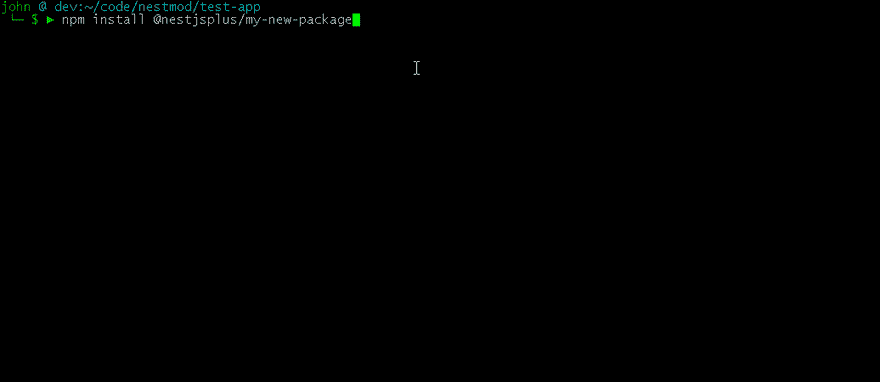
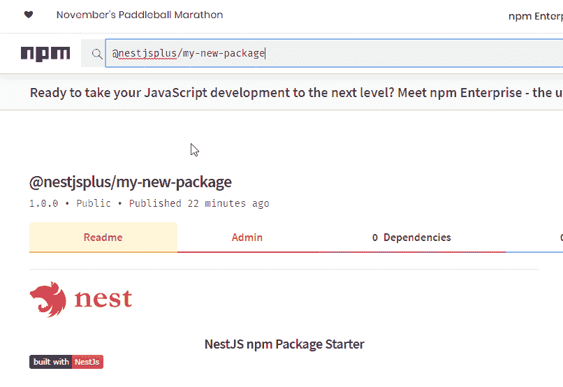

# 使用 npm 发布 NestJS 包

> 原文：<https://dev.to/nestjs/publishing-nestjs-packages-with-npm-21fm>

John 是 NestJS 核心团队的成员，主要参与文档编制。

这是为 NestJS 构建可重用 npm 包的系列文章的第一部分。本文主要关注该过程的机制:

*   构建简单的 npm 包
*   在 NestJS 应用程序中本地使用和测试它
*   出版给 NPM

本文为本系列中深入研究更复杂的 NestJS 包的后续文章奠定了基础。

### [T1】简介](#intro)

我们每天都与国家预防机制登记处互动。通常注册表本身，以及它是如何工作的，都被方便地放到后台——当我们运行`npm install`时，我们不必考虑细节。但是有时我们需要更直接地使用注册中心——也许我们正在发布一个核心基础设施/实用程序包供组织内的团队私人使用，或者也许我们正在发布一个开放源码包供公众使用。

第一次发布一个包，然后看着它用`npm install`安装是非常有趣的。

[](https://res.cloudinary.com/practicaldev/image/fetch/s--phpBBNQC--/c_limit%2Cf_auto%2Cfl_progressive%2Cq_66%2Cw_880/https://thepracticaldev.s3.amazonaws.com/i/6t7bci79p15a0wej84kw.gif)

而且出乎意料的简单。虽然有很多通用的 npm 教程，但我已经创建了这个教程，以及一个[包启动库](https://github.com/nestjsplus/nestjs-package-starter)，你可以快速克隆它，以标准的方式进行设置，并跳过一些小障碍。虽然这真的没有什么特定于 Nest 的东西，但 TypeScript 可能会引入一两个其他 npm 教程中没有涉及的问题。与 NestJS 环境相结合，如果您遵循一些基本步骤，您可以享受富有成效的迭代开发/部署工作流。这就是我将在这里介绍的内容。跟着做，您应该能够在大约 15 分钟内发布一个基本的 NestJS 包。

至于为什么要这么做，我能想到的至少有两个很大的原因:
1)学习如何发布一个包去神秘化了一件我们往往认为理所当然的事情。它可能应该出现在任何有自尊的全栈开发人员的简历上。😃
2)无论您发布到 npmjs.com 注册中心还是私有注册中心，发布 npm 包都是创建和共享可重用包的标准方式。

同样，虽然我们将在本教程中构建的示例包很简单，但本文为更多的文章奠定了基础，这些文章将详细介绍更复杂的模块。敬请期待！

### 先决条件

如果你计划遵循本文中的步骤，确保你在[www.npmjs.com](https://www.npmjs.com)有一个账户(你可以使用一个免费账户来做这个练习，事实上，除非你想发布*私人*包，你可以坚持使用免费账户)。您也可以发布到私有的 npm 注册中心，比如 [verdaccio](https://github.com/verdaccio/verdaccio) ，但是设置这个注册中心超出了本文的范围。

### 为开发而设置

如果您在阅读本文的同时正在进行现场编码，我有一些简短的建议。

首先，请注意，我们实际上将处理两个*独立的*但相关的代码。一个用于 npm 包，另一个用于使用和运行该包的配套 NestJS 应用程序。

我建议坚持使用下面使用的名称，以保持适当的同步。如果你正在用自己唯一的名字构建自己的**真实**包，只要确保你选择的名字在它出现的不同地方(文件夹、package.json、npmjs、git 等)同步。).

接下来，我建议您打开两个命令行窗口(以及两个编辑会话)来同时处理这两部分代码。这将帮助您获得一种有用的开发模式的感觉，以便以迭代的方式构建一个包。本教程的其余部分将涉及这两个命令行窗口。如果你喜欢在一个命令行窗口中工作，只要在执行每一步的时候注意你所在的文件夹就可以了！

#### 设置文件夹

在终端窗口 1 中，创建一个新文件夹。这将是项目两部分的*父*文件夹:我们正在构建的包，以及我们的小伙伴 NestJS 应用程序。

```
mkdir nestmod && cd nestmod 
```

#### 克隆模块启动器 repo

在终端窗口 1 中，首先克隆[nestjs-package-starter repo](https://github.com/nestjsplus/nestjs-package-starter)。这是一个入门 repo，它为您的 NestJS 相关的 npm 包设置了许多默认细节。这些细节可能有点繁琐。

```
git clone https://github.com/nestjsplus/nestjs-package-starter.git 
```

一旦完成，这个步骤应该会在`nestjs-package-starter`子文件夹中产生一个全新的包模板。

现在安装它的依赖项。仍在终端窗口 1:

```
cd nestjs-package-starter
npm install 
```

#### 创建测试 app

在你的第二个终端窗口中，确保你从你创建的顶层文件夹开始(我在上面创建了`nestmod`,所以我会使用它；使用您创建的任何文件夹来跟随教程)。搭建我们将用来测试我们的包的小 NestJS 应用程序。

```
nest new test-app 
```

选择您喜欢的软件包管理器(`npm`或`yarn`)，然后等待一会儿，让 Nest CLI 构建您的初学者应用程序。

你的文件夹结构应该看起来像这样:

```
nestmod
└─── nestjs-package-starter
│   └───node_modules
│   └───src
│   ...
└─── test-app
│   └───node_modules
│   └───src
│   ... 
```

### 构建包

花点时间浏览一下`nestjs-package-starter`文件夹。以下是一些需要注意的事项:

1)`src`文件夹有两个文件:

*   `test.ts`是我们软件包的全部功能；它导出一个简单的测试函数，我们将把它导入到我们的 Nest test-app 中，向我们自己证明我们实际上已经安装并正在使用这个包。
*   `index.ts`从文件夹中导出`test.ts`函数(是一个[桶文件](https://basarat.gitbooks.io/typescript/content/docs/tips/barrel.html))。

2)`package.json`文件有许多有趣的部分。我们将在整个教程中深入研究其中的几个。现在需要注意的是不同类型的包依赖关系:

*   常规的`dependencies`是运行我们的代码所需要的；这些应该是除*之外的任何东西，但不包括* NestJS 本身。例如，如果我们在代码中使用了`dotenv`包，这不是 NestJS 本身提供的，所以它属于`dependencies`。
*   `peerDependencies`:由于这是一个基于 NestJS 的包，我们使用这个部分来声明它与 Nest 版本 6(最低版本为 6.0.0)兼容*。这意味着我们假设使用这个包的人有一个我们可以依赖的兼容的 NestJS 环境。仅仅提到`@nestjs/common`包就足够了。指定一个版本的`^6.0.0`给了我们与用户可能已经安装的任何小版本 NestJS 的广泛兼容性。*
**   `devDependencies`:这些是我们开发只需要*的包；因为我们期望构建一个基于嵌套的包，所以我们在开发环境中需要嵌套，以及测试工具、类型脚本等。这些开发依赖项应该与你在构建一个普通的 Nest 应用时所拥有的常规`devDependencies`非常相似。例如，将这些条目与`test-app`中的`devDependencies`条目进行比较，它们应该是相同的。**

 **在终端窗口 1 中，确保您仍然在克隆 nestjs-package-starter 的文件夹中，并使用:
构建包

```
npm run build 
```

npm `build`脚本非常简单:它只是在我们的`tsconfig.json`文件中配置为`rootDir`的文件夹中运行 TypeScript 编译器。说到这里，让我们快速看一下`tsconfig.json`，哪一种与`package.json`一起“组队”来控制我们的包是如何构建的。

`tsconfig.json`文件中最值得注意的是:

*   确保生成我们的类型文件，这有助于包的消费者从 TypeScript 类型检查和编辑器功能(如 intellisense)中受益。
*   两个`Decorators`标志确保 TypeScript 装饰器正常工作。
*   控制我们编译的代码在哪里发布。
*   `rootdir`，连同顶级的`include`和`exclude`条目，控制编译哪个源代码。

再次快速查看`package.json`，注意`"main": "dist/test.js"`条目。这是“包装拼图”的最后一块。`build`脚本在`dist`文件夹中把我们的类型脚本编译成 JavaScript 桶文件(`index.ts`)确保我们的函数被导出并公开可见；在我们的`package.json`中的`"main"`条目告诉模块加载器在导入的时候在哪里发现从我们的包中导出的符号。

因此，我们现在已经编译了 TypeScript，并准备在包中进行部署。

### 将包安装到测试 app 中

现在你有了一个完整的 npm 包，尽管它只在本地可用。你可以通过一个熟悉的命令`npm`来**使用`test-app`中的**包。

在终端窗口 2 中，切换到由`nest new test-app`命令创建的文件夹，我们的测试应用程序就在那里。

```
cd nestmod/test-app 
```

使用`npm`将我们刚刚构建的包安装到我们的测试应用中。

```
npm install ../nestjs-package-starter 
```

我相信你已经注意到了，它与普通的`npm install`的主要区别是，你引用的是一个路径(T1 部分)和一个名称(T2 部分)的组合，而不是典型的用法(当从 npmjs.com 注册表中提取时)，它只使用一个包名。这展示了 npm 开发包的简单过程:本地包的`npm install`工作方式*与从 npmjs.com 下载的远程包的*完全相同。你可以清楚地看到这一点，注意到在`testapp/package.json`中，有这样一个条目:
`"@nestjsplus/nestjs-package-starter": "file:../nestjs-package-starter"`

### 使用测试 app 中的包

模板包导出一个简单的测试函数。检查`nestjs-package-starter/src/test.ts`以查看:

```
// nestjs-package-starter/src/test.ts
export function getHello(): string {
  return 'Hello from the new package!';
} 
```

既然您已经在`test-app`中安装了新的包，它就像任何 npm 包一样可用，并且您可以以正常的方式使用它。打开`test-app/src/app.controller.ts`，导入功能；确保文件看起来像这样:

```
// test-app/src/app.controller.ts
import { Controller, Get } from '@nestjs/common';
import { getHello } from '@nestjsplus/nestjs-package-starter';

@Controller()
export class AppController {
  @Get()
  getHello(): string {
    return getHello();
  }
} 
```

在终端窗口 2 中，启动`test-app`(这里建议使用`start:dev`，这样我们可以进行迭代修改):

```
npm run start:dev 
```

在浏览器中，打开 [http://localhost:3000](http://localhost:3000) ，查看来自导入的包函数的消息。

如果到目前为止您已经了解了，那么让我们再做一件事情来展示继续迭代是多么容易。对包导出的`getHello()`函数做一个简单的修改(我喜欢改成返回`'Buon Giorno!'`😄).

现在，确保测试应用程序仍然在终端窗口 2 中以开发模式(例如，`npm run start:dev`)运行，然后，在终端窗口 1 中，使用:
重新构建包

```
npm run build 
```

请注意，在终端窗口 2 中，由于我们链接到了本地包，dev 服务器将在包重建时自动重启(在过程完成时，它可能会显示几秒钟的错误)。这强调了要记住的一个关键点:无论何时对包进行本地更改，都必须在包的消费者看到之前重新构建它**。显然这意味着你必须在发布**之前重建**。**

为了确保最后一点发生，再看一下`package.json`文件。`prepare`脚本是由`npm publish`命令识别的特殊脚本。无论何时发布(我们马上就要做)，这个`prepare`脚本都会在发布前运行。请注意，还有其他几个这样的 npm“钩子”可以让您做一些事情，比如运行`lint`，将源代码签入/标记到您的 git repo，等等。[详见此处](https://docs.npmjs.com/misc/scripts)。

当你在`localhost:3000`刷新你的页面时，你应该会看到你的意大利式问候！

### 发布包

我们现在准备将我们的新生儿包裹推出巢外，放到‘网’上(ugghh，抱歉这个糟糕的双关语)。要完成这一步，你需要在[www.npmjs.com](https://www.npmjs.com)拥有一个免费账户。如果你还没有，去[注册页面](https://www.npmjs.com/signup)申请一个。

#### 给软件包一个唯一的 npm 作用域名称

##### 关于 npm 的几点注记

*   npm 名称
    所有的 npm 包都有一个名称。如果名称以`@`开头，那么它是一个*作用域的*名称。作用域名称对于为包创建唯一的命名空间很有用。如果你和我都发布`nestjs-package-starter`到 npmjs.org，就会有冲突。谁先发表*谁就拥有*这个名字。但是如果我发布一个*范围的*包名，比如`@johnbiundo/nestjs-package-starter`，你可以在`@yournpmjsname/nestjs-package-starter`发布你自己的副本，两者愉快地共存。想要我的人会做`npm install @johnbiundo/nestjs-package-starter`，想要你的人会做`npm install @yournpmjsname/nestjs-package-starter`。点击阅读[更多关于示波器的信息。](https://docs.npmjs.com/misc/scope)

*   npm 公共软件包
    npm 让你免费发布软件包，只要它们是公共的。如果你想发布私有包(比如只在公司内部共享)，你需要一个私有账户。或者，你可以用注册服务器建立一个内部私有注册中心，比如 [verdaccio](https://github.com/verdaccio/verdaccio) 。

*   npm orgs
    除了发布以你的名字命名的包，你还可以创建一个免费的 npm *org* 来给你的包起一个更自定义的名字(scope)。例如，我在 org `@nestjsplus`下发布了几个包。点击阅读[更多关于 npm 组织的信息。](https://docs.npmjs.com/orgs/)

准备就绪后，打开包的`package.json`文件，更改以下条目:

*   *name* :你的作用域包名，类似于`@mynpmjsname/my-new-package`。
*   *版本*:选择一个起始版本号；我在下面对此做了更多的评论，但是现在类似于`1.0.0`的东西会工作得很好。
*   *作者*:你的名字和电子邮件，格式类似`John Biundo <john@email.com>`。

稍后，您会想要定制其他东西，如描述、许可证、关键字、存储库链接等。这些都不是非常特定于 TypeScript 或 NestJS 的，所以我们不会在这里讨论它们，但是稍微搜索一下就会找到许多好文章和对它们的帮助。

#### 一旦准备好，发布包

**注意:**每次重新发布包时，您都必须更改`package.json`中的`version`字段(否则发布步骤将失败)。对 npm 包使用[语义版本控制(“SEM ver”)](https://semver.org/)是最佳实践。

在终端窗口 1 中，运行:

```
npm publish 
```

这一步的输出显示了哪些文件被打包并发送到 npmjs.org 来创建您的包，以及版本号和其他一些元数据。

#### 在 www.npmjs.com[搜索您的包裹](http://www.npmjs.com)

前往[https://www.npmjs.org](https://www.npmjs.org)，寻找你的包裹。

* * *

[](https://res.cloudinary.com/practicaldev/image/fetch/s--FKuKb_ML--/c_limit%2Cf_auto%2Cfl_progressive%2Cq_auto%2Cw_880/https://thepracticaldev.s3.amazonaws.com/i/lf35il3cylwrewxskvm0.png)

* * *

### 在您的测试应用中安装发布的 npm 包

现在这个包已经在 npm 上运行了，您可以像安装任何包一样安装它。

在终端窗口 2 中，首先，卸载我们大约 10 分钟前创建并安装的本地窗口。

```
npm uninstall @nestjsplus/nestjs-package-starter 
```

现在，从网上安装你闪亮的新 npm 包。在下面适当地更改名称:

```
npm install @yournpmjsname/your-package 
```

最后，编辑您的测试应用程序，以反映新的 npm 包名称(如果您以这种方式发布，请注意使用正确的“范围”名称)。例如:

```
// src/app.controller.ts
import { Controller, Get } from '@nestjs/common';
import { getHello } from '@yournpmjsname/your-new-package';

@Controller()
export class AppController {
  @Get()
  getHello(): string {
    return getHello();
  }
} 
```

启动应用程序，您将使用您的新软件包！

既然您已经知道发布一个 npm 包有多容易，请继续关注本系列的下一篇文章，我们将在其中讨论构建更有趣的 NestJS 模块。

请随意提问，发表意见或建议，或者在下面的评论中说声你好。请参加我们的 [Discord](https://discord.gg/G7Qnnhy) 节目，享受更多关于 NestJS 的快乐讨论。我在那里发布的名字是 *Y 前景*。**