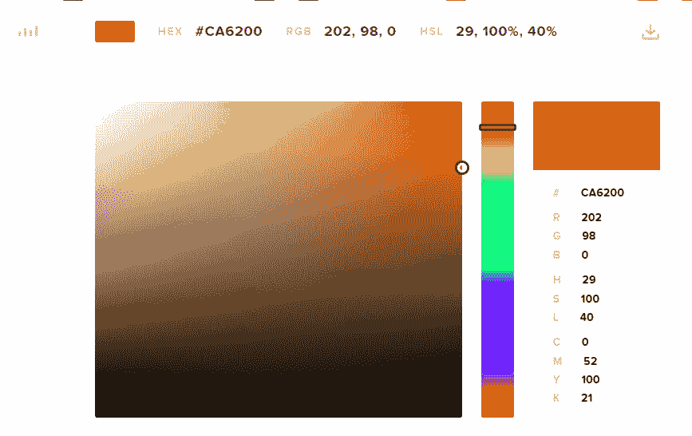
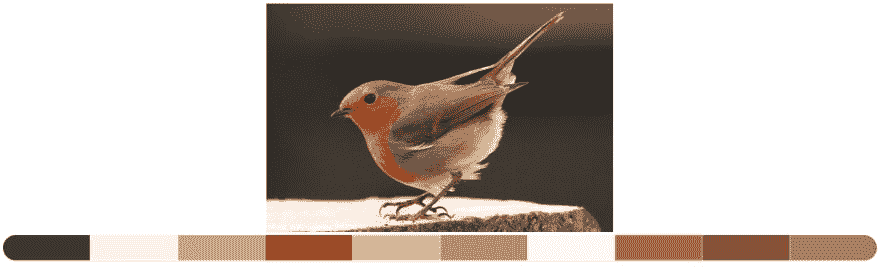
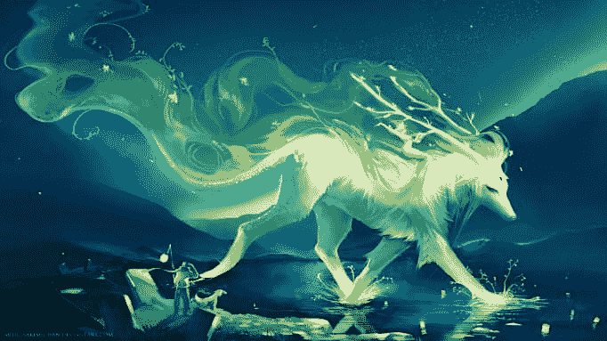
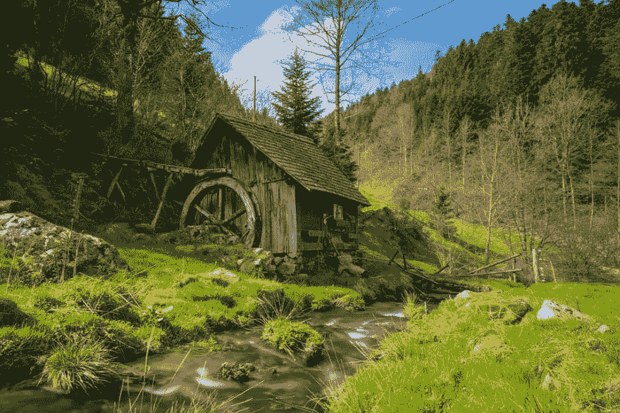
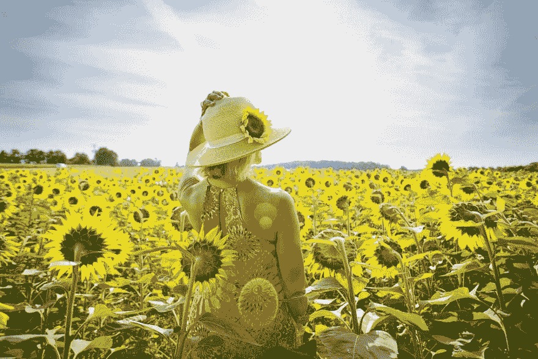
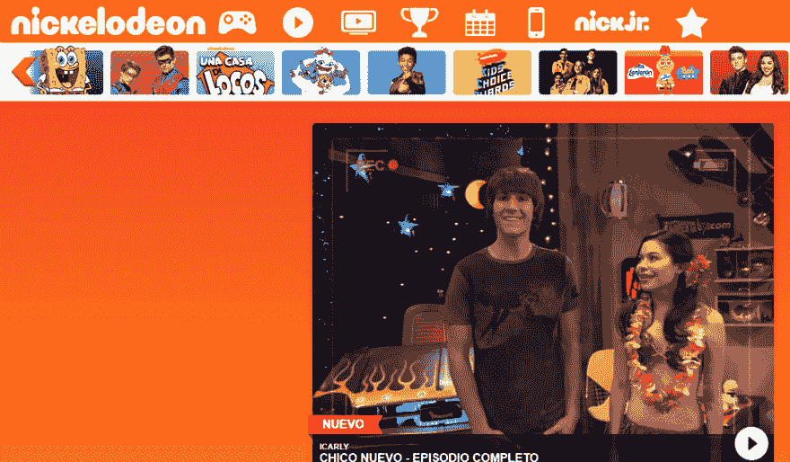
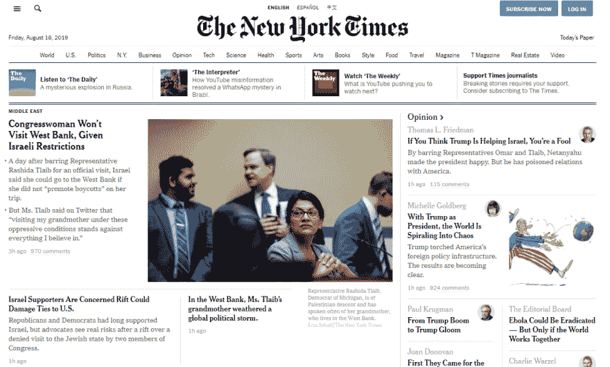
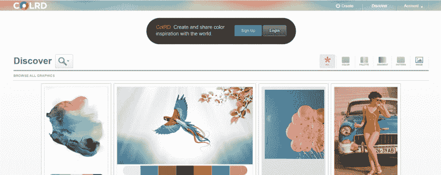
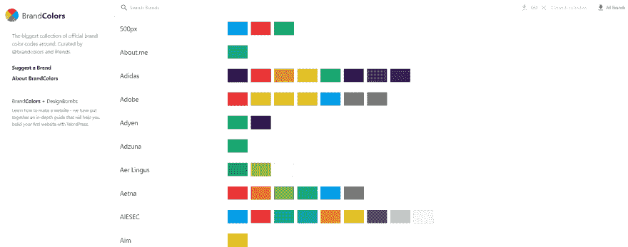
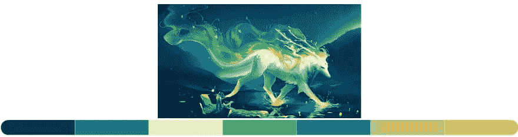

# 多彩的网页设计师

> 原文：<https://dev.to/jucora/a-colorful-web-designer-1g83>

如果我问你:你最喜欢什么颜色？你肯定会有一个答案，这个答案有一个特殊的原因。我们喜欢某种颜色是有原因的，因为它产生了什么，因为它在我们身上产生了感觉。

小时候，我们在学校学习颜色。我们从很小的时候就学会了通过语言来区分颜色，这也是我们需要知道的主要事情之一。但是，颜色本身是有生命的，不仅仅是一个词或我们看到的东西，颜色也是我们可以感觉到的东西，它反映了思想，情感，甚至帮助我们感知我们的现实。

色彩涉及哲学、艺术、数学、心理学。无论如何，我们可以说颜色无处不在。

通过颜色，一个公司可以反映它的身份。没有颜色，就很难给品牌添加身份或形象。没有颜色，用视觉的方式表达一个想法将是一个不可能的任务。

当我们学习像 HTML 和 CSS 这样的语言时，在某些时候我们意识到仅仅知道构成每种语言的所有理论方面是不够的，还需要了解我们的设计方案，我们在设计时的意图。设计网站时，颜色是一个需要考虑的基本元素。网页设计师是色彩管理的专家，他们知道如何识别最能代表一个想法、一个概念的颜色，他们是通过视觉产生感觉的专家。

本文旨在展示在开发网站时颜色的重要性。为此，接下来我们将做一个练习。

在这幅图像中你能辨认出多少种颜色？。数一数:

现在，我邀请你点击链接:[https://htmlcolorcodes.com/](https://htmlcolorcodes.com/)，试着分别找到每种颜色并保存其十六进制代码，如下例所示:

嗯，在下面，你可以看到与图像相关的颜色:

你想再试一次吗？

现在，试着看下一张图片，你能识别多少种颜色？

去[https://htmlcolorcodes.com/](https://htmlcolorcodes.com/)试着找到所有你能找到的与图像相关的颜色。

你看到多少种颜色？我会在文章最后给你看和图像相关的颜色。

嗯，我做了这个练习，因为它有助于学习更好地观察和分析我们周围的事物。这个练习有助于我们在设计和建议 web 项目的颜色时获得更好的准确性。

现在，我想和你分享一些关于颜色的有趣事实:

很多时候，我们认为绿色是平静祥和的颜色，它代表着希望、健康和和平。当我们被大自然包围时，我们感到平静。我们觉得在和平宁静的环境中我们的健康状况会更好。绿色也代表着对环境和地球之心的关注:

黄色是一种明亮而温暖的颜色，反映了乐观、清晰和光明等品质:

橙色充满活力，光彩照人，给人一种友好的感觉:

紫色是一种反映创造力、想象力和智慧的颜色:

灰色设定了白色和黑色之间的平衡，给人一种庄重、中立和平静的感觉。黑色和白色经常一起使用，像灰色一样传递严肃感:

我向你强烈推荐一个网站，它肯定会成为你的灵感源泉，这个网站就是[http://colrd.com/](http://colrd.com/)。

这是一个非常好的网站，你会发现很多图片。在每张图片下面，你会看到它的调色板。

另外，我想向你推荐 http://brandcolors.net/网站，在那里你可以找到世界上最成功的公司和品牌使用的颜色。密切关注构成每个品牌的不同颜色:

从现在开始，我希望你回答以下问题:

在你的下一个网络项目中，你会使用什么颜色？

如果你被雇用来创建一个网站，你会用什么颜色来反映一个想法或概念？

我认为这些问题非常重要，代表了作为一名 web 开发人员的一个与众不同的因素。

你还记得练习 2 的图像吗？

这里你有了答案:

再试一次。前往[https://htmlcolorcodes.com/](https://htmlcolorcodes.com/)，尽可能多地找到与下一张图片相关的颜色:

你能识别多少种颜色？

最后，我希望你记住这些话:

颜色是一种语言。颜色是情感。
色彩就是生命。

学习使用颜色可以让我们更进一步成为更好的网页开发者。