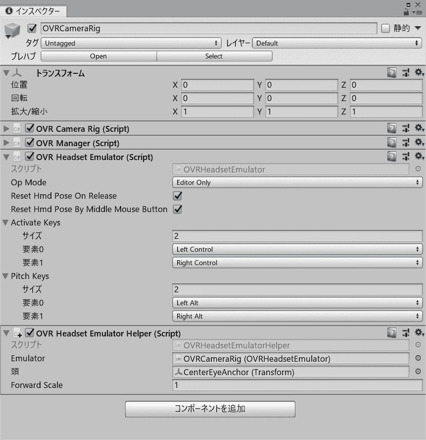
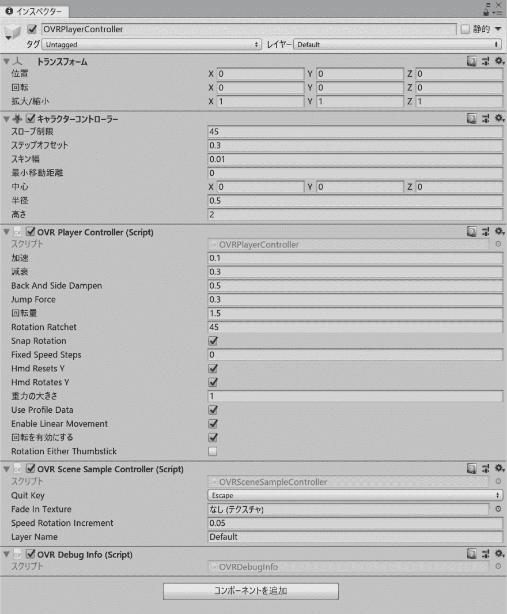

# 在 Unity 中将前移添加到 OVRHeadsetEmulator

> 原文：<https://dev.to/shiena/unity-ovrheadsetemulator-5421>

# 前言

[在 Unity 中修复面向 Oculus 的环境中损坏的 ovrheadsetemulator](https://qiita.com/shiena/items/ed96bb1ec14d45ae38c4)中`OVRHeadsetEmulator`开始起作用，可以旋转和上下移动。 因为想在 Oculus Quest 上移动 6DoF，所以试着追加了前进移动。

# 不确定性设定模拟器辅助器

只需保存以下脚本并将`OVRHeadsetEmulator`添加到附加的组件中即可。
[https://gist.github.com/shiena/8e 1908194144792 a 2495177389 ea 053 e](https://gist.github.com/shiena/8e1908194144792a2495177389ea053e)中也提供了相同的源。

按住`OVRHeadsetEmulator`的 Activate Keys，按住鼠标右键，就会前进。
虽然也讨论过前进是`w`，后退是`s`，但是如果和 Ctrl 组合的话会和保存的快捷方式套在一起，所以为了解决苦肉计，使用了鼠标右键。
想变更为其他键时，请改写`MoveForward`方法。

```
/************************************************************************************
Copyright (c) 2019 KOGA Mitsuhiro

This software is released under the MIT License.
http://opensource.org/licenses/mit-license.php
************************************************************************************/

using System.Collections.Generic;
using UnityEngine;

[RequireComponent(typeof(OVRHeadsetEmulator))]
public class OVRHeadsetEmulatorHelper : MonoBehaviour
{
    [SerializeField] private OVRHeadsetEmulator emulator;
    [SerializeField] private Transform head;
    [SerializeField] private float forwardScale = 1f;

    private OVRManager _manager;
    private bool _emulatorHasInitialized = false;

    private void Reset()
    {
        emulator = GetComponent<OVRHeadsetEmulator>();
        head = FindMainCamera().transform;
    }

    private bool MoveForward()
    {
        return Input.GetMouseButton(1);
    }

    private void Update()
    {
        if (!_emulatorHasInitialized)
        {
            if (OVRManager.OVRManagerinitialized)
            {
                _manager = OVRManager.instance;
                _emulatorHasInitialized = true;
            }
            else
            {
                return;
            }
        }

        bool emulationActivated = IsEmulationActivated();
        if (emulationActivated)
        {
            if (emulator.resetHmdPoseByMiddleMouseButton && Input.GetMouseButton(2))
            {
                return;
            }

            Vector3 emulatedTranslation = _manager.headPoseRelativeOffsetTranslation;
            Vector3 forward = head.forward.normalized * (Time.deltaTime * forwardScale);
            forward.y = 0;

            if (MoveForward())
            {
                // move forward
                emulatedTranslation -= forward;
                _manager.headPoseRelativeOffsetTranslation = emulatedTranslation;
            }
        }
    }

    private bool IsEmulationActivated()
    {
        if (emulator.opMode == OVRHeadsetEmulator.OpMode.Off)
        {
            return false;
        }

        if (emulator.opMode == OVRHeadsetEmulator.OpMode.EditorOnly && !Application.isEditor)
        {
            return false;
        }

        foreach (KeyCode key in emulator.activateKeys)
        {
            if (Input.GetKey(key))
                return true;
        }

        return false;
        }

    private Camera FindMainCamera()
    {
        GameObject[] objects = GameObject.FindGameObjectsWithTag("MainCamera");
        List<Camera> cameras = new List<Camera>(4);
        foreach (GameObject obj in objects)
        {
            Camera camera = obj.GetComponent<Camera>();
            if (camera != null && camera.enabled)
            {
                OVRCameraRig cameraRig = camera.GetComponentInParent<OVRCameraRig>();
                if (cameraRig != null && cameraRig.trackingSpace != null)
                {
                    cameras.Add(camera);
                }
            }
        }

        if (cameras.Count == 0)
        {
            return Camera.main; // pick one of the cameras which tagged as "MainCamera"
        }
        else if (cameras.Count == 1)
        {
            return cameras[0];
        }
        else
        {
            // return the camera with least depth
            cameras.Sort((Camera c0, Camera c1) =>
            {
                return c0.depth < c1.depth ? -1 : (c0.depth > c1.depth ? 1 : 0);
            });
            return cameras[0];
        }
    }
} 
```

[](https://res.cloudinary.com/practicaldev/image/fetch/s--Jn1nLzkV--/c_limit%2Cf_auto%2Cfl_progressive%2Cq_auto%2Cw_880/https://dev-to-uploads.s3.amazonaws.com/i/cjpxxku6zdk6y8dsb87b.png)

# ovrplayercontroller.prefabも悪くない

`Assets/Oculus/VR/Prefabs/OVRPlayerController.prefab`内置了`Character Controller`和`OVRPlayerController`，所以可以通过 WASD、十字键、Oculus Touch 控制器的模拟摇杆前后移动。

[](https://res.cloudinary.com/practicaldev/image/fetch/s--Z289kac5--/c_limit%2Cf_auto%2Cfl_progressive%2Cq_auto%2Cw_880/https://dev-to-uploads.s3.amazonaws.com/i/zzuo31cle971thb45k3q.png)