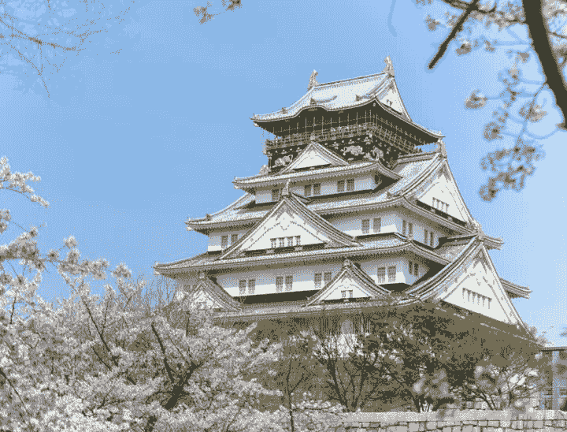
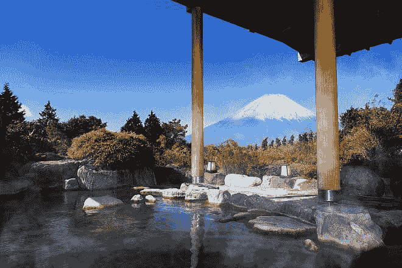
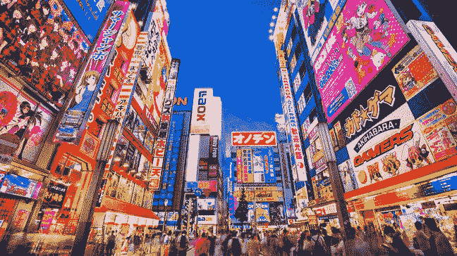
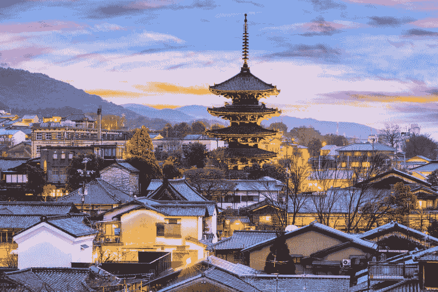
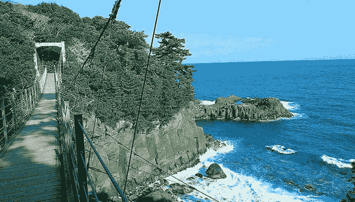

# 日本最值得去的 5 个地方

> 原文：<https://dev.to/tobi_adeniji/ghana-56mh>

动漫。这是普通人第一次&也是大多数时候唯一可能知道的关于日本的事情。

日本有超过 1.2 亿人口。它是东亚的一个岛国。它是世界第四大岛国。

排名不分先后，以下是日本一些好玩的城市。

**大阪**

大阪不是普通的港口城市，它为游客提供了一系列有趣的事情。大阪有日本环球影城、大阪水族馆、大阪城堡公园。城市的中心，道顿堀，是一个充满了浮华的广告牌，美味的餐饮选择，从高级餐厅到步行推车，还有商店的地方。家庭应该去儿童广场，在那里孩子们可以尽情发挥他们的想象力，有化妆区、动手科学实验和足够大的活动空间。

<figure>

<figcaption>Osaka</figcaption>

</figure>

**箱根町**

箱根町是一个宁静的山村，有以富士山为背景的温泉。在公共澡堂或客栈洗一次传统的温泉澡，享受这个国家这个地区独有的放松体验。游客还可以在 Ashinoko 湖(一个令人惊叹的火山口湖)尽头的箱根神社找到宁静。

在富士山-箱根町-伊豆国家公园长途跋涉后，温泉会派上用场，那里有几条维护良好的徒步旅行路线，箱根町是理想的基地。当地最受欢迎的是从大涌谷到芦之湖的徒步旅行，因为可以看到富士山

<figure>

<figcaption>Hakone</figcaption>

</figure>

**东京**
繁忙、充满活力，经常是旅行者的第一个接触点，东京是日本热闹的首都。游客可以轻松地花几天时间品尝新鲜的海鲜，逛逛众多的博物馆，仰望摩天大楼，享受富裕和文化的生活方式。为了让人们感受到这座拥有 1，300 万人口的城市有多繁忙，涉谷十字路口被称为“争夺战”。

这座城市到处都有纯粹的日本习俗。在原宿，你可以观看日本时尚人士把主要街道作为跑道，自己购买衣服，观看动漫收藏，享受过量的色彩。想要新鲜的海鲜，去筑地市场吧，这里每天都有成千上万吨的海鲜交易。这座城市还拥有数十座神殿、寺庙和宫殿，如果人群拥挤不堪，它们是寻找安宁的绝佳场所。

<figure>

<figcaption>Tokyo</figcaption>

</figure>

京都
京都是一座神圣的城市，拥有标志性的寺庙、神社、宫殿、花园和竹林，因此它经常位居人们最喜爱的城市之首。在京都，传统文化丰富多彩，融入了市民的日常生活。

<figure>

虽然参观京都的每个景点需要几个月的时间，但在金阁寺、清水寺、银阁寺和岚山的竹林中，你会感到很放松。
[T3】](https://res.cloudinary.com/practicaldev/image/fetch/s--4iy_I9AC--/c_limit%2Cf_auto%2Cfl_progressive%2Cq_auto%2Cw_880/https://thepracticaldev.s3.amazonaws.com/i/1imn7mjgjk7otejmic1o.jpg)

<figcaption>Kyoto</figcaption>

</figure>

**伊豆汉坦托**

适合游客，伊豆汉唐有太多的放松和冒险活动可供选择，这些活动与大城市的观光截然不同。该岛有许多温泉、豪华度假村、平静的海滩和崎岖的海岸线，非常适合探险。这座城市举办充满活力的卡瓦兹樱花节，游客可以用各种感官欣赏这个国家最具代表性的樱花。

<figure>

<figcaption>Izu Hanto</figcaption>

</figure>