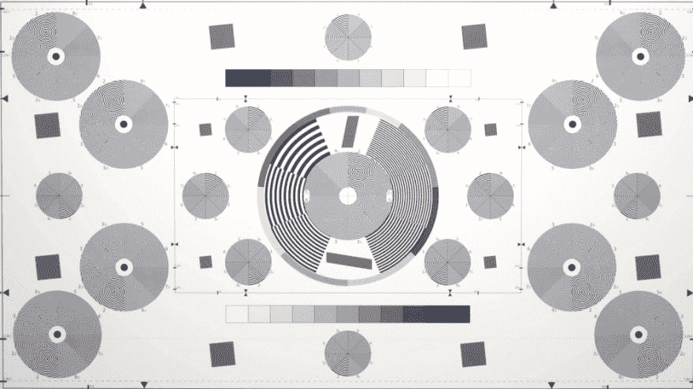
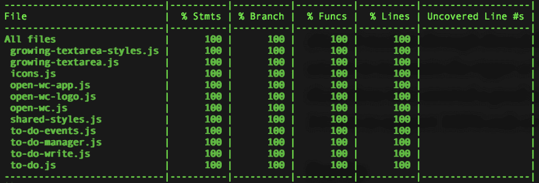
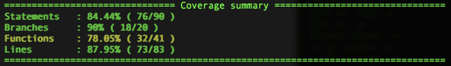
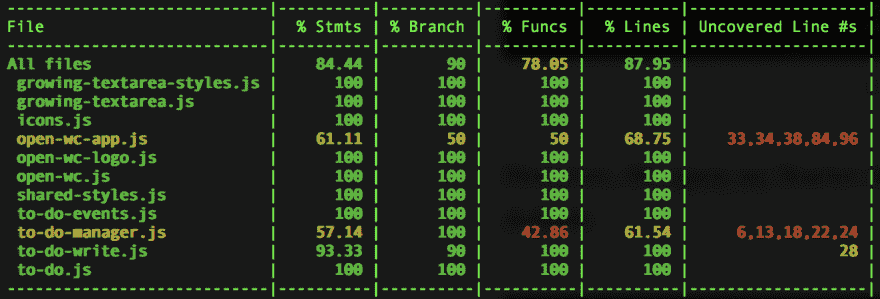

# 不是另一个待办事项应用程序:第 3 部分

> 原文：<https://dev.to/westbrook/not-another-to-do-app-2m9a>

#### 用 Open Web 组件推荐弄脏你的手和脚...算是吧。

> *这是 2019 年 2 月 26 日来自 [Medium](https://medium.com/@westbrook/not-another-to-do-app-f038fc658d76) 的一篇文章的交叉帖子，利用了我最近决定在我的写作中使用语法的优势(因此，在这里和那里做了一些小编辑)，如果你在那里看到它，感谢再次查看🙇🏽‍♂️:如果这是你第一次阅读，欢迎！*

*欢迎来到“不要再做一个应用程序”，这是一篇冗长的综述，讲述了每个开发人员在某个时候都会编写的最小的应用程序之一。如果你是来学习编写应用程序的特定技术的，或者是从以前的安装中走出来的，那么你可能来对地方了，应该继续读下去！如果没有，你可能想[从头开始](https://dev.to/westbrook/not-another-to-do-app-2kj9)，这样你也可以知道[我们所有角色的背景故事...](https://github.com/Westbrook/to-do-app)*

如果你已经做到了这一步，为什么现在就放弃呢？

* * *

# 早考，常考

<figure>

[](https://res.cloudinary.com/practicaldev/image/fetch/s--cYvfvcwZ--/c_limit%2Cf_auto%2Cfl_progressive%2Cq_auto%2Cw_880/https://thepracticaldev.s3.amazonaws.com/i/1krqpwdvmted8u143q6s.jpeg)

<figcaption>Photo by [ShareGrid](https://unsplash.com/@sharegrid?utm_source=medium&utm_medium=referral) on [Unsplash](https://unsplash.com/)</figcaption>

</figure>

对我来说，在我的应用程序中从一开始就有一个像 Karma 这样的工具最棒的部分是，我可以假装我知道如何做 [TDD](https://en.wikipedia.org/wiki/Test-driven_development) (测试驱动开发)。不要误解我，我并不是不知道这意味着什么，或者如何去做，我的问题更多的是一个信念。当进入配对编码会话时，我喜欢一轮[乒乓配对](http://wiki.c2.com/?PairProgrammingPingPongPattern)。这是一个很好的安排时间的方法，它可以很快让你们两个开始的关于项目/功能的重要对话变得清晰起来。在我回到自己的办公桌后，事情开始变得不可收拾。编写一个测试，添加一个特性，编写第二个测试，编写第二个特性...就在那里，一切都分崩离析了。在这种风气下，我启动了我的待办事项应用程序，如下所示:

```
it('has a title', async () => {
    const el = await fixture(html`<open-wc-app></open-wc-app>`);
    const title = el.shadowRoot.querySelector('h1').textContent;
    expect(title).to.equal('open-wc');
}); 
```

<svg width="20px" height="20px" viewBox="0 0 24 24" class="highlight-action crayons-icon highlight-action--fullscreen-on"><title>Enter fullscreen mode</title></svg> <svg width="20px" height="20px" viewBox="0 0 24 24" class="highlight-action crayons-icon highlight-action--fullscreen-off"><title>Exit fullscreen mode</title></svg>

好吧，好吧，你说对了，我不是那样开始的。这是我们在公开赛上的朋友免费送的。在我键入一个键之前测试覆盖率，耶！但是，我还是做了一个测试，它看起来像:

```
const el = await fixture(html`<open-wc-app></open-wc-app>`);
expect(el.todos.length).to.equal(0); 
```

<svg width="20px" height="20px" viewBox="0 0 24 24" class="highlight-action crayons-icon highlight-action--fullscreen-on"><title>Enter fullscreen mode</title></svg> <svg width="20px" height="20px" viewBox="0 0 24 24" class="highlight-action crayons-icon highlight-action--fullscreen-off"><title>Exit fullscreen mode</title></svg>

哪个当然失败(TDD，什么？！).在 true LitElement 表单中，以下内容使测试变回绿色:

```
class OpenWcApp extends LitElement {
    static get properties() {
        return {
            todos: { type: Array }
        };
    }
    constructor() {
        super();
        this.todos = [];
    }
} 
```

<svg width="20px" height="20px" viewBox="0 0 24 24" class="highlight-action crayons-icon highlight-action--fullscreen-on"><title>Enter fullscreen mode</title></svg> <svg width="20px" height="20px" viewBox="0 0 24 24" class="highlight-action crayons-icon highlight-action--fullscreen-off"><title>Exit fullscreen mode</title></svg>

*认识到这只是补充(用前面的一些代码来支持它们)，而不是替换所提供的 [`src/open-wc-app.js`](https://github.com/Westbrook/to-do-app/blob/master/src/open-wc-app.js) 的代码。*

现在我们的初始测试将通过，所以是时候添加另一个:

```
const el = await fixture(html`<open-wc-app></open-wc-app>`);
expect(el.todos.length).to.equal(0);
el.dispatchEvent(new CustomEvent('todo-new', {
    detail: 'New To Do',
    bubbles: true,
    composed: true
}));
expect(el.todos.length).to.equal(1); 
```

<svg width="20px" height="20px" viewBox="0 0 24 24" class="highlight-action crayons-icon highlight-action--fullscreen-on"><title>Enter fullscreen mode</title></svg> <svg width="20px" height="20px" viewBox="0 0 24 24" class="highlight-action crayons-icon highlight-action--fullscreen-off"><title>Exit fullscreen mode</title></svg>

我们之前测试的扩展将带我们超越初始化过程，直接进入基于事件的状态管理。这意味着我的应用程序将通过 [`dispatchEvent()`](https://developer.mozilla.org/en-US/docs/Web/API/EventTarget/dispatchEvent) 触发的 [`new CustomEvent()`](https://developer.mozilla.org/en-US/docs/Web/API/CustomEvent) 来传递数据和动作。由于最近前端工程中的许多工作都是基于虚拟 DOM 的，这通常是浏览器的一个令人惊讶的“新”特性，所以如果你之前没有机会使用这个 API，我强烈建议你[更深入地了解一下](https://developer.mozilla.org/en-US/docs/Web/Guide/Events/Creating_and_triggering_events)。知道这是怎么回事之后，我们现在可以添加代码，再次添加到 [`src/open-wc-app.js`](https://github.com/Westbrook/to-do-app/blob/master/src/open-wc-app.js) ，以便让我们的测试再次通过。

```
constructor() {
    super();
    this.addEventListener('todo-new', (e) => {
        let todo = e.detail;
        if (todo === null) return;
        this.todos = [
            ...this.todos,
            todo,
        ];
    });
} 
```

<svg width="20px" height="20px" viewBox="0 0 24 24" class="highlight-action crayons-icon highlight-action--fullscreen-on"><title>Enter fullscreen mode</title></svg> <svg width="20px" height="20px" viewBox="0 0 24 24" class="highlight-action crayons-icon highlight-action--fullscreen-off"><title>Exit fullscreen mode</title></svg>

当进行 TDD 时，我的目标是编写通过测试的代码，不一定是最漂亮的代码，也不一定是性能最好的代码，所以如果事情没有“如其所愿”be"™️.，我不会太担心让我们同意稍后为其腾出空间，并在此期间看看这里发生了什么。我们正在针对我们的测试正在调度的`todo-new`事件的元素注册一个事件监听器。当听到一个这样的事件时，我们将把我们已经确认的待办事项打包到事件的详细信息(`e.detail`)中，并将其添加到现有的待办事项列表中。此外，您将看到我们使用 spread 操作符来维护我们个人待办事项的身份，同时更新我们的`todos`属性的身份，这将通知`LitElement`启动渲染管道，同时仍然能够比较我们个人待办事项。

随着我们的测试再次通过，是时候回到那里，完成创建一个新任务的往返旅程了。请注意我们是如何通过确认新的待办事项的内容以及之前对整个`todos`数组的更改测试来完成数据处理测试的。还有一个测试，测试这些变化是否反映在实际的渲染结果中。

```
it('adds a to do in response to a `todo-new` event', async () => {
    const newTodo = 'New To Do';
    const el = await fixture(html`<open-wc-app></open-wc-app>`);
    expect(el.shadowRoot.querySelectorAll('to-do').length)
        .to.equal(0);
    el.dispatchEvent(new CustomEvent('todo-new', {
        detail: newTodo,
        bubbles: true,
        composed: true
    }));
    await nextFrame();
    expect(el.todos.length).to.equal(1);
    expect(el.todos[0]).to.equal(newTodo);
    expect(el.shadowRoot.querySelectorAll('to-do').length)
        .to.equal(1);    
    expect(el.shadowRoot.querySelectorAll('to-do')[0].textContent)
        .to.equal(newTodo);
}); 
```

<svg width="20px" height="20px" viewBox="0 0 24 24" class="highlight-action crayons-icon highlight-action--fullscreen-on"><title>Enter fullscreen mode</title></svg> <svg width="20px" height="20px" viewBox="0 0 24 24" class="highlight-action crayons-icon highlight-action--fullscreen-off"><title>Exit fullscreen mode</title></svg>

您将看到，随着对渲染输出的测试的增加，我们将使用许多 open-wc 工具中的第一个，这将有利于构建您的应用程序。`import { nextFrame } from ‘@open-wc/testing';`获得的`nextFrame`是一个帮助器方法，支持与`LitElement`的异步渲染过程一起工作。因为使用`LitElement`的渲染是在微任务计时的情况下发生的，所以您无法同步测试 DOM 的变化，所以`nextFrame`助手会将您的测试延迟到下一帧，这样针对 DOM 的测试将会有新的渲染结果来测试。为了实现所需的更改，需要对`render()`方法进行以下更新:

```
render() {
    return html` ${this.todos.map(todo => html`
            <to-do>${todo}</to-do>
        `)} `;
} 
```

<svg width="20px" height="20px" viewBox="0 0 24 24" class="highlight-action crayons-icon highlight-action--fullscreen-on"><title>Enter fullscreen mode</title></svg> <svg width="20px" height="20px" viewBox="0 0 24 24" class="highlight-action crayons-icon highlight-action--fullscreen-off"><title>Exit fullscreen mode</title></svg>

瞧，您已经完全测试了待办事项添加流程的基于自定义事件的管理。

不，我们还没有创建 UI 或测试可能分派这样一个事件的元素。然而，要查看我们的代码目前在实际浏览器中的工作情况，请访问控制台并运行类似于您在测试中看到的代码，将待办事项发布到页面:

```
$0.dispatchEvent(new CustomEvent('todo-new', {
    detail: 'Fancy Console Created To Do',
    bubbles: true,
    composed: true
})); 
```

<svg width="20px" height="20px" viewBox="0 0 24 24" class="highlight-action crayons-icon highlight-action--fullscreen-on"><title>Enter fullscreen mode</title></svg> <svg width="20px" height="20px" viewBox="0 0 24 24" class="highlight-action crayons-icon highlight-action--fullscreen-off"><title>Exit fullscreen mode</title></svg>

[*$0 是元素面板中当前选中的节点。*T3】](https://willd.me/posts/0-in-chrome-dev-tools)

是的，还有很多东西需要测试和构建，但是正如我之前提到的，这不是一篇“如何制作待办事项应用”的文章。我只是介绍了从第一天开始将测试构建到您的项目中的好处。不管你是通过应用测试驱动开发的租户来利用它，还是一些其他的哲学，我很乐意听到更多...请在评论中给我留言。在您的项目中有了这种能力，我将向世界传递一种良好的氛围，在编码的兴奋战胜您对过程的信念之前，您可以使用您选择的任何方法取得更大的进步。

注意:在变得无法保持 TDD 的严格性之前，我通过了三个完整的测试，上面是其中之一。我非常自豪，特别是这三个测试涵盖了应用程序的大部分主要特性。最终，我花了 20+次测试，这可能是绝对必要的，以支持最终待办事项应用程序的 100%代码覆盖率。

## 亲提示

当我测试我的应用程序时(我保证我会尽可能地做)，最终目标总是这样:

<figure>

[](https://res.cloudinary.com/practicaldev/image/fetch/s--GHVhU-WZ--/c_limit%2Cf_auto%2Cfl_progressive%2Cq_auto%2Cw_880/https://thepracticaldev.s3.amazonaws.com/i/18wpyx2tifusshaxlxcc.png)

<figcaption>All the lines are covered!</figcaption>

</figure>

但是，open-wc Starter 应用程序默认提供以下报告样式:

<figure>

[](https://res.cloudinary.com/practicaldev/image/fetch/s--x4UxMJD2--/c_limit%2Cf_auto%2Cfl_progressive%2Cq_auto%2Cw_880/https://thepracticaldev.s3.amazonaws.com/i/6xtolht42ohru3rji3hx.png)

<figcaption>I wanna be covered, but I don’t know what’s showing...</figcaption>

</figure>

我进入了我的测试结果，我立刻被“我还没有测试什么”的问题所震惊以及“我怎么知道它在哪里？”。我只想看看我裸露的线条。我只想这样:

<figure>

[](https://res.cloudinary.com/practicaldev/image/fetch/s--wBO_Agfy--/c_limit%2Cf_auto%2Cfl_progressive%2Cq_auto%2Cw_880/https://thepracticaldev.s3.amazonaws.com/i/6q9yilovoq5o90y3pvl3.png)

<figcaption>Yay! I know what I’ve got on my to-do list still. (See what I did there?)</figcaption>

</figure>

我太想要它了，所以我直接找到了源头，制造了一个问题。(问题可以是感谢你所依赖的开源项目的一个很好的方式。它不仅建立了他们的知识库，有时也建立了你的知识库，它开始了概述项目可以接受的 PRs 种类所需的对话，以解决你的问题或记录为什么某些事情是真的)。如果你也想看到覆盖率线，在你新的 open-wc Starter 应用上运行一些`yarn test && yarn start`，然后检查`localhost:8080/coverage`，让你大吃一惊，不仅比我以前见过的更完整的覆盖率报告，而且还有你的代码还有哪些部分尚未测试的交互式分解。是的，我接受对我可能已经知道的事情的评论(如下),以及对我的糟糕笑话的评论。

如果您仍然希望在您的终端中报告未覆盖的线路，[尝试以下更改:](https://open-wc.org/testing/testing-karma.html#manual-setup)到 [`karma.config.js`](https://github.com/Westbrook/to-do-app/blob/master/karma.conf.js) :

```
module.exports = config => {
    config.set(
        merge.strategy(
            {
                'coverageIstanbulReporter.reports': 'replace',
            }
        )(defaultSettings(config), {
            files: [
                // allows running single tests with the --grep flag
                config.grep ? config.grep : 'test/**/*.test.js',
            ],
            // your custom config
            coverageIstanbulReporter: {
                reports: ['html', 'lcovonly', 'text']
            }
        })
    );
    return config;
}; 
```

<svg width="20px" height="20px" viewBox="0 0 24 24" class="highlight-action crayons-icon highlight-action--fullscreen-on"><title>Enter fullscreen mode</title></svg> <svg width="20px" height="20px" viewBox="0 0 24 24" class="highlight-action crayons-icon highlight-action--fullscreen-off"><title>Exit fullscreen mode</title></svg>

注意`'coverageIstanbulReporter.reports'`属性中`'replace'`的用法，这允许您覆盖(而不是“合并”，这是代码默认设置要做的)，这样您就不会得到两种类型的报告。当然，除非你对这类事情感兴趣...说到底，多其实就是多。

* * *

# 短游戏

正如许多对此类话题有意见的人所投票的那样，一篇 9000 多字的文章是不行的。

> WestbrookJ@ WestbrookJ所以，我在写博文...我注意到，当我不看的时候，它变得相当长，一次完成可能有 7000 个单词。我想说我会很幸运地把它编辑下来，但是一些技巧我还在提高...我该怎么办？2019 年 2 月 20 日 12 点 22 分[](https://twitter.com/intent/tweet?in_reply_to=1098196160613896192)[](https://twitter.com/intent/retweet?tweet_id=1098196160613896192)[](https://twitter.com/intent/like?tweet_id=1098196160613896192)

所以，怀着对你最深的敬意，我亲爱的读者，我把即将到来的对话分成了微不足道的十个部分。恭喜你，你已经接近第一场比赛的尾声了！如果你到目前为止还很享受，或者是那种会给一部新的情景喜剧加几集就能让它大放异彩的人，这里有一份其他人的名单，你可以把它们放在你的网飞名单上:

*   [不是另一个待办应用](https://dev.to/westbrook/not-another-to-do-app-2kj9)
*   [入门](https://dev.to/westbrook/not-another-to-do-app-3jem)
*   早点测试，经常测试(你在这里)
*   [测量两次，皮棉一次](https://dev.to/westbrook/not-another-to-do-app-part-4-58cd)
*   [使其成为组件](https://dev.to/westbrook/not-another-to-do-app-part-5-5d7o)
*   [使其成为可重复使用的部件](https://dev.to/westbrook/not-another-to-do-app-part-6-an)(为什么这个系列的装置不能重复使用？那真是个好主意！)
*   你的组件真的需要知道这些吗？
*   [尽早、经常、只在需要的时候把东西分开](https://dev.to/westbrook/not-another-to-do-app-part-8-3lic)
*   [有些抽象并不(仅仅)适用于你的应用](https://dev.to/westbrook/not-another-to-do-app-part-9-10j3)
*   [可重用和可扩展的数据管理/最终...](https://dev.to/westbrook/not-another-to-do-app-part-10-mp6)
*   [查看运行中的应用](https://gifted-lamport-70b774.netlify.com/)

* * *

特别感谢 [Open Web Components](https://open-wc.org/) 的团队，他们提供了大量的工具和建议，以支持不断增长的工程师和公司社区，将高质量的 Web 组件带入行业。[在 GitHub](https://github.com/open-wc/open-wc) 上访问他们，并创建一个问题，提交一份 PR，或签署一份回购协议来参与行动！