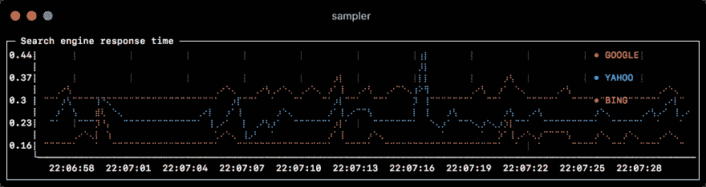
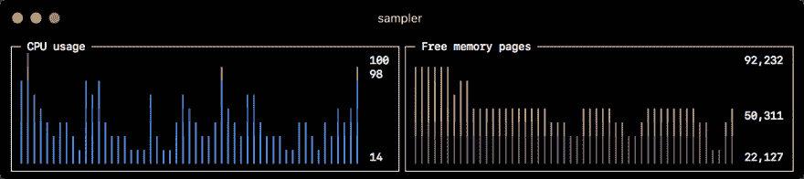
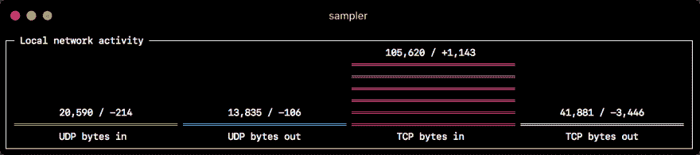
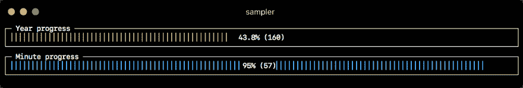
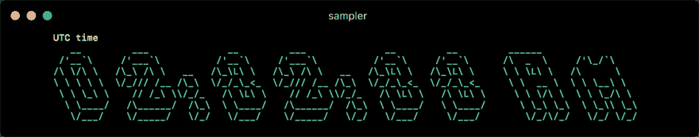

# 采样器。仪表板、监控和警报—直接从您的终端进行

> 原文：<https://dev.to/sqshq/sampler-dashboards-monitoring-and-alerting-right-from-your-terminal-5h5e>

作为后端开发人员，我总是需要监控一些东西。数据库中的状态机、记录计数、消息队列延迟、自定义应用程序指标、系统性能、我的部署脚本的进度。很多东西！

很长一段时间以来，我一直在努力寻找一种可以节省我时间的工具——能够将所有东西放在一个地方，并在需要时通知我。繁重的生产监控系统无法帮助完成开发任务，我需要一把瑞士军刀——可以在一分钟内配置好并立即给我结果的东西。

没有这样的东西，所以我写了我自己的。见见[Sampler](https://github.com/sqshq/sampler)——任何 shell 命令的命令行 UI，用 pure Go 编写。

要安装，请遵循 macOS、Linux 或 Windows 的[说明](https://github.com/sqshq/sampler#installation)

# 它是如何工作的？

这个想法非常简单——几乎所有您想要监控和可视化的指标都可以通过 CLI 获得:

*   基本要素:CPU、内存、磁盘空间、网络
*   通过 SSH 从远程机器进行遥测
*   自定义查询的任何数据库指标和结果
*   卡夫卡，RabbitMQ，ActiveMQ
*   k8s RAM/CPU/事件
*   可通过 http 获得的所有信息，例如 Spring Boot 执行器指标
*   码头工人
*   JMX
*   日志

这意味着我们可以创建仪表盘，而无需复杂的集成、驱动程序和依赖关系。我们可以直接从终端开始。

使用采样器基本上是一个 3 步的过程:

*   在 YAML 文件中定义您的配置
*   运行`sampler -c your-config-file.yml`
*   调整 UI 上组件的大小和位置

# 例子

*可视化及其 YAML 配置*

##### 运行图

[](https://res.cloudinary.com/practicaldev/image/fetch/s--bG9l_-Dm--/c_limit%2Cf_auto%2Cfl_progressive%2Cq_auto%2Cw_880/https://thepracticaldev.s3.amazonaws.com/i/0vbpe1lcxbio8d9aopg6.png)T3】

```
runcharts:
  - title: Search engine response time
    rate-ms: 500        # sampling rate, default = 1000
    scale: 2            # number of digits after sample decimal point, default = 1
    legend:
      enabled: true     # enables item labels, default = true
      details: false    # enables item statistics: cur/min/max/dlt values, default = true
    items:
      - label: GOOGLE
        sample: curl -o /dev/null -s -w '%{time_total}'  https://www.google.com
        color: 178      # 8-bit color number, default one is chosen from a pre-defined palette
      - label: YAHOO
        sample: curl -o /dev/null -s -w '%{time_total}'  https://search.yahoo.com
      - label: BING
        sample: curl -o /dev/null -s -w '%{time_total}'  https://www.bing.com 
```

##### 迷你图

[](https://res.cloudinary.com/practicaldev/image/fetch/s--oDO-goFf--/c_limit%2Cf_auto%2Cfl_progressive%2Cq_auto%2Cw_880/https://thepracticaldev.s3.amazonaws.com/i/jr8uhug26vfko7wh9oum.png)T3】

```
sparklines:
  - title: CPU usage
    rate-ms: 200
    scale: 0
    sample: ps -A -o %cpu | awk '{s+=$1} END {print s}'
  - title: Free memory pages
    rate-ms: 200
    scale: 0
    sample: memory_pressure | grep 'Pages free' | awk '{print $3}' 
```

##### Barcharts

[](https://res.cloudinary.com/practicaldev/image/fetch/s--4Y_9hKP1--/c_limit%2Cf_auto%2Cfl_progressive%2Cq_auto%2Cw_880/https://thepracticaldev.s3.amazonaws.com/i/1x1208djpokcx7eio3gq.png)T3】

```
barcharts:
  - title: Local network activity
    rate-ms: 500        # sampling rate, default = 1000
    scale: 0            # number of digits after sample decimal point, default = 1
    items:
      - label: UDP bytes in
        sample: nettop -J bytes_in -l 1 -m udp | awk '{sum += $4} END {print sum}'
      - label: UDP bytes out
        sample: nettop -J bytes_out -l 1 -m udp | awk '{sum += $4} END {print sum}'
      - label: TCP bytes in
        sample: nettop -J bytes_in -l 1 -m tcp | awk '{sum += $4} END {print sum}'
      - label: TCP bytes out
        sample: nettop -J bytes_out -l 1 -m tcp | awk '{sum += $4} END {print sum}' 
```

##### 仪表

[](https://res.cloudinary.com/practicaldev/image/fetch/s--bFoidE5K--/c_limit%2Cf_auto%2Cfl_progressive%2Cq_auto%2Cw_880/https://thepracticaldev.s3.amazonaws.com/i/6a0chaxep5cr80a4rwqg.png)T3】

```
gauges:
  - title: Minute progress
    rate-ms: 500        # sampling rate, default = 1000
    scale: 2            # number of digits after sample decimal point, default = 1
    percent-only: false # toggle display of the current value, default = false
    color: 178          # 8-bit color number, default one is chosen from a pre-defined palette
    cur:
      sample: date +%S  # sample script for current value
    max:
      sample: echo 60   # sample script for max value
    min:
      sample: echo 0    # sample script for min value
  - title: Year progress
    cur:
      sample: date +%j
    max:
      sample: echo 365
    min:
      sample: echo 0 
```

##### 文本框

[](https://res.cloudinary.com/practicaldev/image/fetch/s--Moic00W6--/c_limit%2Cf_auto%2Cfl_progressive%2Cq_auto%2Cw_880/https://thepracticaldev.s3.amazonaws.com/i/05fs3bqpy8b0yxplt6le.png)T3】

```
textboxes:
  - title: Local weather
    rate-ms: 10000      # sampling rate, default = 1000
    sample: curl wttr.in?0ATQF
    border: false       # border around the item, default = true
    color: 178          # 8-bit color number, default is white
  - title: Docker containers stats
    rate-ms: 500
    sample: docker stats --no-stream --format "table {{.Name}}\t{{.CPUPerc}}\t{{.MemUsage}}\t{{.PIDs}}" 
```

##### ascii box

[](https://res.cloudinary.com/practicaldev/image/fetch/s--kfX--bzU--/c_limit%2Cf_auto%2Cfl_progressive%2Cq_auto%2Cw_880/https://thepracticaldev.s3.amazonaws.com/i/3gpa8yoiuyw54b385ck3.png)T3】

```
asciiboxes:
  - title: UTC time
    rate-ms: 500        # sampling rate, default = 1000
    font: 3d            # font type, default = 2d
    border: false       # border around the item, default = true    
    color: 43           # 8-bit color number, default is white
    sample: env TZ=UTC date +%r 
```

# 还有更！

交互式外壳支持、PTY 模式、触发器、警报和变量。与 MySQL、PostgreSQL、MongoDB、Neo4J、Kafka、SSH 和 JMX 一起工作的真实世界的食谱。你可以在文档中了解高级功能[。](https://github.com/sqshq/sampler)

不要犹豫提出问题，贡献和⭐明星⭐在 Github 上的项目[！](https://github.com/sqshq/sampler)