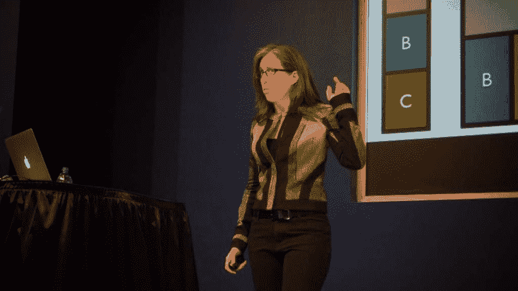

# 我们还应该销售响应式网页设计吗？

> 原文：<https://dev.to/browserlondon/should-we-still-be-selling-responsive-web-design-cg2>

“响应式网页设计”这个术语多年来一直是数字开发领域的主流。参加任何早期的客户会议，你几乎都会被要求“确保它能在手机上运行”。

对此的标准回应通常是，“别担心，我们会构建一个响应性的”，但是这种回应过时了吗？

## 响应式网页设计的局限性

响应式网页设计的主要“工具”是“媒体查询”。这使得我们只有在网站以特定的大小、方向呈现时，或者在满足某些选定的环境标准时(例如，[光照水平](https://developer.mozilla.org/en-US/docs/Web/CSS/@media/light-level))，才可以应用 CSS 的子集。这使得前端开发人员可以轻松地操纵网站、数字产品或应用程序在不同大小的设备上的显示方式，或者窗口大小的变化。

然而，我开始认为，将元素应该如何显示的规则与整个页面或设备的大小捆绑在一起是非常短视的。在当今组件驱动设计的世界中，尤其如此。

### 组件驱动的设计改变一切

今天，在现代 web 设计中，我们通常使用诸如[原子设计](https://www.browserlondon.com/blog/2017/04/25/atomic-design-in-practice-does-it-work/)之类的方法来构建高度可重用的、与环境无关的组件，目的通常是构建一个[模式库](https://www.browserlondon.com/blog/2015/02/02/application-design-are-pattern-libraries-the-new-deliverable/)用于各种应用程序。这种方法节省了时间和金钱，因为它减少了重复工作的需要。然而，这是一个负担，因为每个单独的组件都需要足够坚固，以便在放入不同大小的容器中时能够正常工作。

例如，如果我们构建了一个新闻项目预览组件，在文本摘要上方有一个图像，这可能会显示在一个宽容器中(例如索引页面)，或者显示在侧栏中(例如相关文章)。如果我们编写一个媒体查询，根据视窗的大小改变新闻条目的显示(例如，将图像放在副本旁边，而不是放在副本上面)，当这个条目有用时，我们将限制上下文。这是因为如果*视窗*很宽，那么规则将适用，即使组件在侧边栏中没有足够的空间。

这是我抱怨的症结所在；媒体查询非常手动和明确。我们没有为一个组件定义理想的状态，而是被迫将它放在上下文中，测试它与画布的关系，然后手动调整。如果你和我一样，你会发现自己在进行视觉上的调整，然后明确地编写规则来根据自己的喜好调整显示。如果页面布局发生了变化——因此模块在页面上的位置也发生了变化——您可能需要重新评估这些规则。这造成了巨大的可维护性负担，并使组件很容易在特定的视口尺寸下视觉上“中断”,而做出更改的人并不知道。

到目前为止，响应式 web 设计一直关注画布，但真正需要的是组件驱动的思维模式。

## 内在网页设计

2018 年，Mozilla 设计师倡导者 [Jen Simmons](http://jensimmons.com/) 创造了术语“[内在网页设计](http://www.zeldman.com/2018/05/02/transcript-intrinsic-web-design-with-jen-simmons-the-big-web-show/)”。这种方法对数字设计采取了一种更加内容外化的方法。组件根据自己的“理想”条件自动布局，而不是根据视窗的大小(或设备屏幕的大小)来改变样式。

<figure>[](https://res.cloudinary.com/practicaldev/image/fetch/s--1DT8bJvr--/c_limit%2Cf_auto%2Cfl_progressive%2Cq_auto%2Cw_880/https://assets.browserlondon.com/app/uploads/2019/04/16371956913_eed504859b_o-1024x576.jpg) 

<figcaption id="caption-attachment-9884">杰弗里·泽尔德曼摄影:[https://bit.ly/2PuUYei](https://bit.ly/2PuUYei)</figcaption>

</figure>

例如，我们可以给出更粗略的指导方针，而不是说 768 像素宽，新闻文章图像位于文本上方而不是旁边:“图像应该横跨父级的整个宽度，但理想情况下宽度不超过 250 像素”。然后，当图像达到 250 像素时，它会自动移到文本旁边。

我们可以把响应性/适应性设计描述为一种强制性的方法——你是在描述一种在明确的宽度上发生的明确的行为。同时，内在设计与声明性方法有更多的共同点；我们提供了指南，但是将精确的实现留给了浏览器。

### Flexbox，网格和多栏布局

内在设计在很大程度上是由新的(ish)布局方法实现的，如 CSS Flexbox 和 CSS Grid(使用自动布局)。这些都是互补的技术，不能互相替代——Grid 是二维的，Flexbox 是一维的。

下面是一个我们如何使用 CSS Flexbox 来创建一个自动适应的无媒体查询组件的例子:

```
ul {
    display: flex;
    flex-wrap: wrap;
}

li {
    flex-grow: 1;
    flex-basis: 250px;
} 
```

<svg width="20px" height="20px" viewBox="0 0 24 24" class="highlight-action crayons-icon highlight-action--fullscreen-on"><title>Enter fullscreen mode</title></svg> <svg width="20px" height="20px" viewBox="0 0 24 24" class="highlight-action crayons-icon highlight-action--fullscreen-off"><title>Exit fullscreen mode</title></svg>

这意味着当列表项小于 250 像素时，它们应该换行。250 像素是他们的“理想”大小，但他们可以增长以填充额外的空间。

这里有一个关于 [CSS 网格](https://css-tricks.com/auto-sizing-columns-css-grid-auto-fill-vs-auto-fit/) :
的进一步的例子

```
ul {
  grid-template-columns: repeat( auto-fit, minmax(250px, 1fr) );
} 
```

<svg width="20px" height="20px" viewBox="0 0 24 24" class="highlight-action crayons-icon highlight-action--fullscreen-on"><title>Enter fullscreen mode</title></svg> <svg width="20px" height="20px" viewBox="0 0 24 24" class="highlight-action crayons-icon highlight-action--fullscreen-off"><title>Exit fullscreen mode</title></svg>

也就是说，当列宽小于 250px 时，它们应该占据自己的行。我们不需要明确说明何时切换布局，相反，我们提供了一个内容驱动的规则。它不受视窗大小的限制，而是受内容本身宽度的限制，因此可以在嵌套元素中使用。例如，如果网格在一个小的侧边栏中使用，它将是一个单独的列，而如果它也在侧边栏旁边的内容区域中使用(大于 250px * 2)，那么它将分成几列。

或者，我们可以使用带有`column-width`属性的 CSS 多列布局:

```
ul {
  column-width: 250px;
} 
```

<svg width="20px" height="20px" viewBox="0 0 24 24" class="highlight-action crayons-icon highlight-action--fullscreen-on"><title>Enter fullscreen mode</title></svg> <svg width="20px" height="20px" viewBox="0 0 24 24" class="highlight-action crayons-icon highlight-action--fullscreen-off"><title>Exit fullscreen mode</title></svg>

这三个例子的行为都有细微的不同，包装物品的宽度和包装后的分布都有变化。然而前提是相同的:我们建议元素的理想宽度，并让*浏览器*担心何时以及如何换行。

这些例子是“上下文相关的”,比响应式网页设计更具“响应性”,因为它们对环境做出响应，而不是对视窗做出响应。

### ▲关于集装箱的查询

我期望在未来的某个时候[元素或容器查询](https://webdesign.tutsplus.com/articles/the-current-state-of-element-queries--cms-29690)会被引入，这个帖子会变得没有实际意义。当然，在那之前，很难完全摆脱媒体的询问，尽管我很想这样做。

与此同时，有可能指出为了使组件响应其父组件而不是页面宽度所做的[巧妙工作](https://www.sitepoint.com/responsive-css-patterns-without-media-queries/)。然而，对我来说，很多这些解决方案都是严格的上下文相关的。

## 那么，我们该怎么办呢？

嗯，不，响应式网页设计并没有消亡，但是我们正处在一个进化的阶段，已经超越了大多数人使用这个术语的含义。我们不再只是试图让我们的产品适应不同的屏幕尺寸。

相反，我们现在正在以一种更加灵活的、模块驱动的方式来构建数字产品，我们现在拥有比五年前更好的工具，使得这样的工作变得更加容易。我们是在模块化水平上设计，而不是在屏幕尺寸水平上，我们正在转向一种更加声明性的方法。这仍然是响应式网页设计，我们只是对一个微妙不同的刺激做出反应。

* * *

我们还应该销售响应式网页设计吗？首先出现在[浏览器伦敦](https://www.browserlondon.com)上。